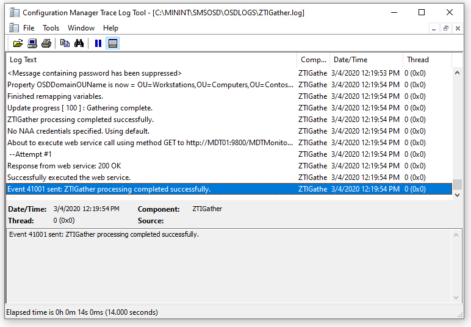

# Simulate a Windows 10 deployment in a test environment

This topic will walk you through the process of creating a simulated environment on which to test your Windows 10 deployment using MDT. When working with advanced settings and rules, especially those like database calls, it is most efficient to be able to test the settings without having to run through a complete deployment. Luckily, MDT enables you to perform a simulated deployment by running the Gather process by itself. The simulation works best when you are using a domain-joined machine (client or server). In the following example, you use the PC0001 Windows 10 client.
For the purposes of this topic, you already will have either downloaded and installed the free Microsoft System Center 2012 R2 Configuration Manager Toolkit, or copied Configuration Manager Trace (CMTrace) if you have access to the System Center 2012 R2 Configuration Manager media. We also assume that you have downloaded the [sample Gather.ps1 script](https://go.microsoft.com/fwlink/p/?LinkId=619361) from the TechNet gallery.

1.  On PC0001, log on as **CONTOSO\\Administrator** using the password **P@ssw0rd**.
2.  Using Computer Management, add the **CONTOSO\\MDT\_BA** user account to the local **Administrators** group.
3.  Log off, and then log on to PC0001 as **CONTOSO\\MDT\_BA**.
4.  Using File Explorer, create a folder named **C:\\MDT**.
5.  Copy the downloaded Gather.ps1 script to the **C:\\MDT** folder.
6.  From the **\\\\MDT01\\MDTProduction$\\Scripts** folder, copy the following files to **C:\\MDT**:
    1.  ZTIDataAccess.vbs
    2.  ZTIGather.wsf
    3.  ZTIGather.xml
    4.  ZTIUtility.vbs
7.  From the **\\\\MDT01\\MDTProduction$\\Control** folder, copy the CustomSettings.ini file to **C:\\MDT**.
8.  In the **C:\\MDT** folder, create a subfolder named **X64**.
9.  From the **\\\\MDT01\\MDTProduction$\\Tools\\X64** folder, copy the Microsoft.BDD.Utility.dll file to **C:\\MDT\\X64**.

    

    Figure 6. The C:\\MDT folder with the files added for the simulation environment.

10. Using an elevated Windows PowerShell prompt (run as Administrator), run the following commands. Press Enter after each command:
    ``` syntax
    Set-Location C:\MDT
    .\Gather.ps1
    ```
11. Review the ZTIGather.log in the **C:\\MININT\\SMSOSD\\OSDLOGS** folder.
**Note**  
Warnings or errors with regard to the Wizard.hta are expected. If the log file looks okay, you are ready to try a real deployment.
 



Figure 7. The ZTIGather.log file from PC0001, displaying some of its hardware capabilities.

## Related topics

[Set up MDT for BitLocker](set-up-mdt-for-bitlocker.md)

[Configure MDT deployment share rules](configure-mdt-deployment-share-rules.md)

[Configure MDT for UserExit scripts](configure-mdt-for-userexit-scripts.md)

[Use the MDT database to stage Windows 10 deployment information](use-the-mdt-database-to-stage-windows-10-deployment-information.md)

[Assign applications using roles in MDT](assign-applications-using-roles-in-mdt.md)

[Use web services in MDT](use-web-services-in-mdt.md)

[Use Orchestrator runbooks with MDT](use-orchestrator-runbooks-with-mdt.md)
