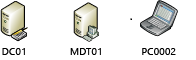
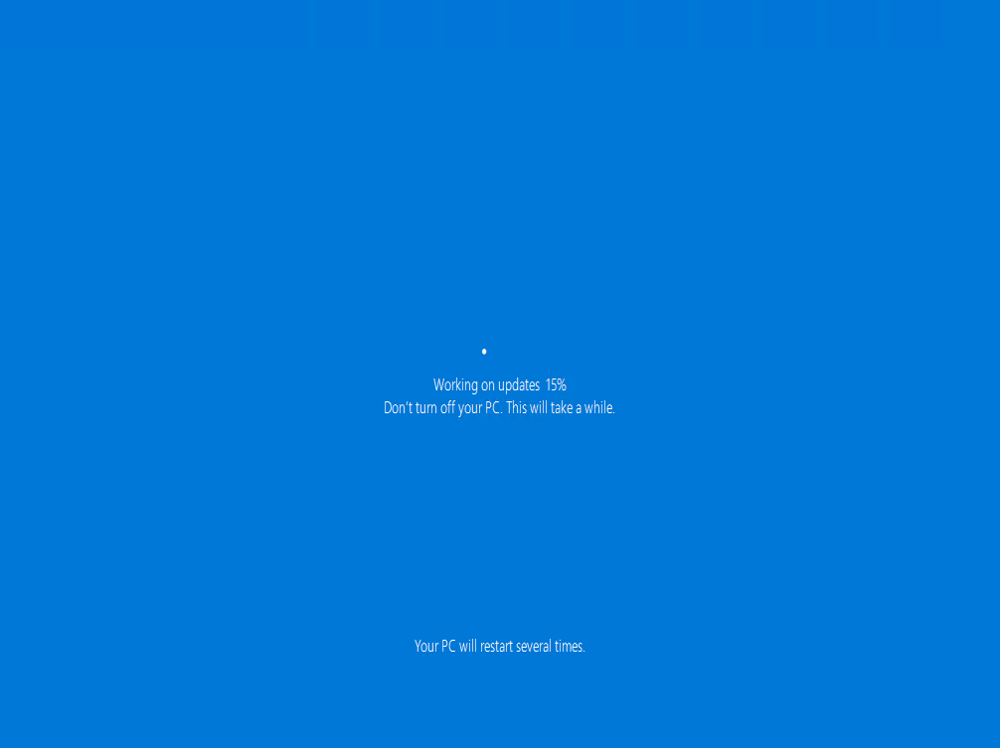
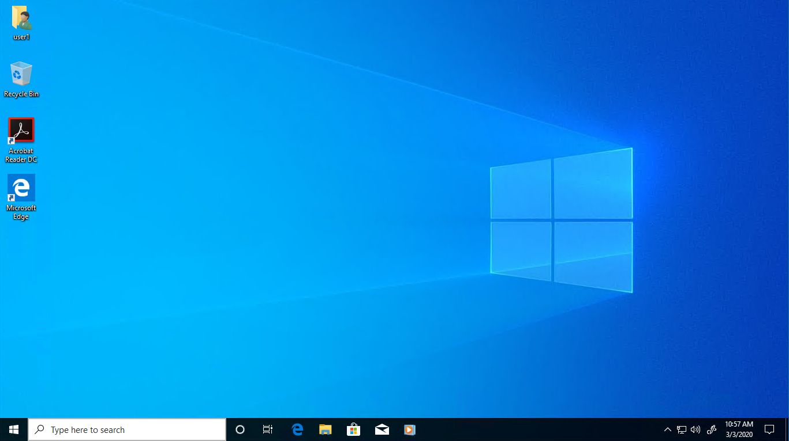

# Perform an in-place upgrade to Windows 10 with MDT

**Applies to**
-   Windows 10

The simplest path to upgrade PCs that are currently running Windows 7, Windows 8, or Windows 8.1 to Windows 10 is through an in-place upgrade. 

>[!TIP]
>In-place upgrade is the preferred method to use when migrating from Windows 10 to a later release of Windows 10, and is also a preferred method for upgrading from Windows 7 or 8.1 if you do not plan to significantly change the device's configuration or applications. MDT includes an in-place upgrade task sequence template that makes the process really simple. 

In-place upgrade differs from [computer refresh](refresh-a-windows-7-computer-with-windows-10.md) in that you cannot use a custom image to perform the in-place upgrade. In this article we will add a default Windows 10 image to the production deployment share specifically to perform an in-place upgrade.

Three computers are used in this topic: DC01, MDT01, and PC0002. 

- DC01 is a domain controller for the contoso.com domain
- MDT01 is a domain member server 
- PC0002 is a domain member computer running Windows 7 SP1, targeted for the Windows 10 upgrade

 

 The computers used in this topic.

>[!NOTE]
>For details about the setup for the procedures in this article, please see [Prepare for deployment with MDT](prepare-for-windows-deployment-with-mdt.md).

>If you have already completed all the steps in [Deploy a Windows 10 image using MDT](deploy-a-windows-10-image-using-mdt.md), then you already have a production deployment share and you can skip to [Add Windows 10 Enterprise x64 (full source)](#add-windows-10-enterprise-x64-full-source).

## Create the MDT production deployment share

On **MDT01**:

1. Ensure you are signed on as: contoso\administrator.
2. In the Deployment Workbench console, right-click **Deployment Shares** and select **New Deployment Share**.
3. On the **Path** page, in the **Deployment share path** text box, type **D:\\MDTProduction** and click **Next**.
4. On the **Share** page, in the **Share name** text box, type **MDTProduction$** and click **Next**.
5. On the **Descriptive Name** page, in the **Deployment share description** text box, type **MDT Production** and click **Next**.
6. On the **Options** page, accept the default settings and click **Next** twice, and then click **Finish**.
7. Using File Explorer, verify that you can access the **\\\\MDT01\\MDTProduction$** share.

## Add Windows 10 Enterprise x64 (full source)

>If you have already have a Windows 10 [reference image](create-a-windows-10-reference-image.md) in the **MDT Build Lab** deployment share, you can use the deployment workbench to copy and paste this image from the MDT Build Lab share to the MDT Production share and skip the steps in this section.

On **MDT01**:

1. Sign in as contoso\\administrator and copy the content of a Windows 10 Enterprise x64 DVD/ISO to the **D:\\Downloads\\Windows 10 Enterprise x64** folder on MDT01, or just insert the DVD or mount an ISO on MDT01.
2. Using the Deployment Workbench, expand the **Deployment Shares** node, and then expand **MDT Production**.
3. Right-click the **Operating Systems** node, and create a new folder named **Windows 10**.
4. Expand the **Operating Systems** node, right-click the **Windows 10** folder, and select **Import Operating System**. Use the following settings for the Import Operating System Wizard:
    - Full set of source files
    - Source directory: (location of your source files)
    - Destination directory name: <b>W10EX64RTM</b>
5. After adding the operating system, in the **Operating Systems / Windows 10** folder, double-click it and change the name to: **Windows 10 Enterprise x64 RTM Default Image**.

## Create a task sequence to upgrade to Windows 10 Enterprise

On **MDT01**:

1.  Using the Deployment Workbench, select **Task Sequences** in the **MDT Production** node, and create a folder named **Windows 10**.
2.  Right-click the new **Windows 10** folder and select **New Task Sequence**. Use the following settings for the New Task Sequence Wizard:
    -   Task sequence ID: W10-X64-UPG
    -   Task sequence name: Windows 10 Enterprise x64 RTM Upgrade
    -   Template: Standard Client Upgrade Task Sequence
    -   Select OS: Windows 10 Enterprise x64 RTM Default Image
    -   Specify Product Key: Do not specify a product key at this time
    -   Organization: Contoso
    -   Admin Password: Do not specify an Administrator password at this time

## Perform the Windows 10 upgrade

To initiate the in-place upgrade, perform the following steps on PC0002 (the device to be upgraded).

On **PC0002**:

1. Start the MDT deployment wizard by running the following command: **\\\\MDT01\\MDTProduction$\\Scripts\\LiteTouch.vbs**
2. Select the **Windows 10 Enterprise x64 RTM Upgrade** task sequence, and then click **Next**. 
3. Select one or more applications to install (will appear if you use custom image): Install - Adobe Reader
4. On the **Ready** tab, click **Begin** to start the task sequence.
   When the task sequence begins, it automatically initiates the in-place upgrade process by invoking the Windows setup program (Setup.exe) with the necessary command-line parameters to perform an automated upgrade, which preserves all data, settings, apps, and drivers.

 

 

After the task sequence completes, the computer will be fully upgraded to Windows 10.

## Related topics

[Windows 10 deployment scenarios](../windows-10-deployment-scenarios.md) 
[Microsoft Deployment Toolkit downloads and resources](/mem/configmgr/mdt/)