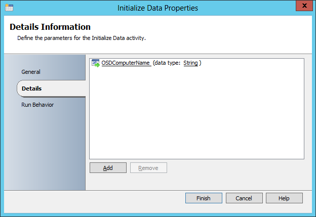

# Use Orchestrator runbooks with MDT

This topic will show you how to integrate Microsoft System Center 2012 R2 Orchestrator with MDT to replace the existing web services that are used in deployment solutions.
MDT can integrate with System Center 2012 R2 Orchestrator, which is a component that ties the Microsoft System Center products together, as well as other products from both Microsoft and third-party vendors. The difference between using Orchestrator and "normal" web services, is that with Orchestrator you have a rich drag-and-drop style interface when building the solution, and little or no coding is required.

**Note**  
If you are licensed to use Orchestrator, we highly recommend that you start using it. To find out more about licensing options for System Center 2012 R2 and Orchestrator, visit the [System Center 2012 R2](https://go.microsoft.com/fwlink/p/?LinkId=619553) website.
 
## <a href="" id="sec01"></a>Orchestrator terminology

Before diving into the core details, here is a quick course in Orchestrator terminology:
-   **Orchestrator Server.** This is a server that executes runbooks.
-   **Runbooks.** A runbook is similar to a task sequence; it is a series of instructions based on conditions. Runbooks consist of workflow activities; an activity could be Copy File, Get User from Active Directory, or even Write to Database.
-   **Orchestrator Designer.** This is where you build the runbooks. In brief, you do that by creating an empty runbook, dragging in the activities you need, and then connecting them in a workflow with conditions and subscriptions.
-   **Subscriptions.** These are variables that come from an earlier activity in the runbook. So if you first execute an activity in which you type in a computer name, you can then subscribe to that value in the next activity. All these variables are accumulated during the execution of the runbook.
-   **Orchestrator Console.** This is the Microsoft Silverlight-based web page you can use interactively to execute runbooks. The console listens to TCP port 81 by default.
-   **Orchestrator web services.** These are the web services you use in the Microsoft Deployment Toolkit to execute runbooks during deployment. The web services listen to TCP port 82 by default.
-   **Integration packs.** These provide additional workflow activities you can import to integrate with other products or solutions, like the rest of Active Directory, other System Center 2012 R2 products, or Microsoft Exchange Server, to name a few.

**Note**  
To find and download additional integration packs, see [Integration Packs for System Center 2012 - Orchestrator](https://go.microsoft.com/fwlink/p/?LinkId=619554).
 
## <a href="" id="sec02"></a>Create a sample runbook

This section assumes you have Orchestrator 2012 R2 installed on a server named OR01. In this section, you create a sample runbook, which is used to log some of the MDT deployment information into a text file on OR01.

1. On OR01, using File Explorer, create the **E:\\Logfile** folder, and grant Users modify permissions (NTFS).
2. In the **E:\\Logfile** folder, create the DeployLog.txt file.
   **Note**  
   Make sure File Explorer is configured to show known file extensions so the file is not named DeployLog.txt.txt.
     
   

   Figure 23. The DeployLog.txt file.

3. Using System Center 2012 R2 Orchestrator Runbook Designer, in the **Runbooks** node, create the **1.0 MDT** folder.

   

   Figure 24. Folder created in the Runbooks node.

4. In the **Runbooks** node, right-click the **1.0 MDT** folder, and select **New / Runbook**.
5. On the ribbon bar, click **Check Out**.
6. Right-click the **New Runbook** label, select **Rename**, and assign the name **MDT Sample**.
7. Add (using a drag-and-drop operation) the following items from the **Activities** list to the middle pane:
   1.  Runbook Control / Initialize Data
   2.  Text File Management / Append Line
8. Connect **Initialize Data** to **Append Line**.

   

   Figure 25. Activities added and connected.

9. Right-click the **Initialize Data** activity, and select **Properties**
10. On **the Initialize Data Properties** page, click **Add**, change **Parameter 1** to **OSDComputerName**, and then click **Finish**.

    

    Figure 26. The Initialize Data Properties window.

11. Right-click the **Append Line** activity, and select **Properties**.
12. On the **Append Line Properties** page, in the **File** text box, type **E:\\Logfile\\DeployLog.txt**.
13. In the **File** encoding drop-down list, select **ASCII**.
14. In the **Append** area, right-click inside the **Text** text box and select **Expand**.

    

    Figure 27. Expanding the Text area.

15. In the blank text box, right-click and select **Subscribe / Published Data**.

    

    Figure 28. Subscribing to data.

16. In the **Published Data** window, select the **OSDComputerName** item, and click **OK**.
17. After the **{OSDComputerName from "Initialize Data"}** text, type in **has been deployed at** and, once again, right-click and select **Subscribe / Published Data**.
18. In the **Published Data** window, select the **Show common Published Data** check box, select the **Activity end time** item, and click **OK**.

    

    Figure 29. The expanded text box after all subscriptions have been added.

19. On the **Append Line Properties** page, click **Finish**.
    ## <a href="" id="sec03"></a>Test the demo MDT runbook
    After the runbook is created, you are ready to test it.
20. On the ribbon bar, click **Runbook Tester**.
21. Click **Run**, and in the **Initialize Data Parameters** dialog box, use the following setting and then click **OK**:
    -   OSDComputerName: PC0010
22. Verify that all activities are green (for additional information, see each target).
23. Close the **Runbook Tester**.
24. On the ribbon bar, click **Check In**.


Figure 30. All tests completed.

## Use the MDT demo runbook from MDT

1.  On MDT01, using the Deployment Workbench, in the MDT Production deployment share, select the **Task Sequences** node, and create a folder named **Orchestrator**.
2.  Right-click the **Orchestrator** node, and select **New Task Sequence**. Use the following settings for the New Task Sequence Wizard:
    1.  Task sequence ID: OR001
    2.  Task sequence name: Orchestrator Sample
    3.  Task sequence comments: &lt;blank&gt;
    4.  Template: Custom Task Sequence
3.  In the **Orchestrator** node, double-click the **Orchestrator Sample** task sequence, and then select the **Task Sequence** tab.
4.  Remove the default **Application Install** action.
5.  Add a **Gather** action and select the **Gather only local data (do not process rules)** option.
6.  After the **Gather** action, add a **Set Task Sequence Variable** action with the following settings:
    1.  Name: Set Task Sequence Variable
    2.  Task Sequence Variable: OSDComputerName
    3.  Value: %hostname%
7.  After the **Set Task Sequence Variable** action, add a new **Execute Orchestrator Runbook** action with the following settings:
    1.  Orchestrator Server: OR01.contoso.com
    2.  Use Browse to select **1.0 MDT / MDT Sample**.
8.  Click **OK**.


Figure 31. The ready-made task sequence.

## Run the orchestrator sample task sequence

Since this task sequence just starts a runbook, you can test this on the PC0001 client that you used for the MDT simulation environment.
**Note**  
Make sure the account you are using has permissions to run runbooks on the Orchestrator server. For more information about runbook permissions, see [Runbook Permissions](https://go.microsoft.com/fwlink/p/?LinkId=619555).
 
1.  On PC0001, log on as **CONTOSO\\MDT\_BA**.
2.  Using an elevated command prompt (run as Administrator), type the following command:

    ``` syntax
    cscript \\MDT01\MDTProduction$\Scripts\Litetouch.vbs
    ```
3.  Complete the Windows Deployment Wizard using the following information:
    1.  Task Sequence: Orchestrator Sample
    2.  Credentials:
        1.  User Name: MDT\_BA
        2.  Password: P@ssw0rd
        3.  Domain: CONTOSO
4.  Wait until the task sequence is completed and then verify that the DeployLog.txt file in the E:\\Logfile folder on OR01 was updated.


Figure 32. The ready-made task sequence.

## Related topics

[Set up MDT for BitLocker](set-up-mdt-for-bitlocker.md)

[Configure MDT deployment share rules](configure-mdt-deployment-share-rules.md)

[Configure MDT for UserExit scripts](configure-mdt-for-userexit-scripts.md)

[Simulate a Windows10 deployment in a test environment](simulate-a-windows-10-deployment-in-a-test-environment.md)

[Use the MDT database to stage Windows 10 deployment information](use-the-mdt-database-to-stage-windows-10-deployment-information.md)

[Assign applications using roles in MDT](assign-applications-using-roles-in-mdt.md)

[Use web services in MDT](use-web-services-in-mdt.md)
