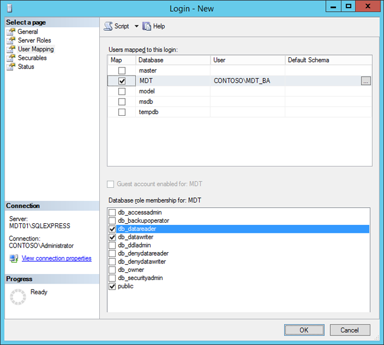

# Use the MDT database to stage Windows 10 deployment information

This topic is designed to teach you how to use the MDT database to pre-stage information on your Windows 10 deployment in a Microsoft SQL Server 2012 SP1 Express database, rather than include the information in a text file (CustomSettings.ini). You can use this process, for example, to add the client machines you want to deploy, specify their computer names and IP addresses, indicate applications to be deployed, and determine many additional settings for the machines.

## Database prerequisites

MDT can use either SQL Server Express or full SQL Server, but since the deployment database isn't big, even in large enterprise environments, we recommend using the free SQL Server 2012 SP1 Express database in your environment.

>[!NOTE]
>Be sure to enable Named Pipes when configuring the SQL Server 2012 SP1 Express database. Although it is a legacy protocol, Named Pipes has proven to work well when connecting from Windows Preinstallation Environment (Windows PE) to the SQL Server database.
 
## Create the deployment database

The MDT database is by default created and managed from the Deployment Workbench. In these steps, we assume you have installed SQL Server 2012 SP1 Express on MDT01.

>[!NOTE]
>Since SQL Server 2012 SP1 Express runs by default on a separate instance (SQLEXPRESS), the SQL Server Browser service must be running, and the firewall configured to allow traffic to it. Port 1433 TCP and port 1434 UDP need to be opened for inbound traffic on MDT01.
 
1.  On MDT01, using Deployment Workbench, expand the MDT Production deployment share, expand **Advanced Configuration**, right-click **Database**, and select **New Database**.
2.  In the New DB Wizard, on the **SQL Server Details** page, enter the following settings and click **Next**:
    1.  SQL Server Name: MDT01
    2.  Instance: SQLEXPRESS
    3.  Port: &lt;blank&gt;
    4.  Network Library: Named Pipes
3.  On the **Database** page, select **Create a new database**; in the **Database** field, type **MDT** and click **Next**.
4.  On the **SQL Share** page, in the **SQL Share** field, type **Logs$** and click **Next**. Click **Next** again and then click **Finish**.

Figure 8. The MDT database added to MDT01.

## Configure database permissions

After creating the database, you need to assign permissions to it. In MDT, the account you used to run the deployment is used to access the database. In this environment, the network access account is MDT\_BA.
1.  On MDT01, start SQL Server Management Studio.
2.  In the **Connect to Server** dialog box, in the **Server name** list, select **MDT01\\SQLEXPRESS** and click **Connect**.
3.  In the **Object Explorer** pane, expand the top-level **Security** node, right-click **Logins**, and select **New Login**.

    

    Figure 9. The top-level Security node.

4.  On the **Login - New** page, next to the **Login** name field, click **Search**, and search for **CONTOSO\\MDT\_BA**. Then in the left pane, select **User Mapping**. Select the **MDT** database, and assign the following roles:
    1.  db\_datareader
    2.  public (default)
5.  Click **OK**, and close SQL Server Management Studio.

Figure 10. Creating the login and settings permissions to the MDT database.

## Create an entry in the database

To start using the database, you add a computer entry and assign a description and computer name. Use the computer's MAC Address as the identifier.
1.  On MDT01, using the Deployment Workbench, in the MDT Production deployment share, expand **Advanced Configuration**, and expand **Database**.
2.  Right-click **Computers**, select **New**, and add a computer entry with the following settings:
    1.  Description: New York Site - PC00075
    2.  MacAddress: &lt;PC00075 MAC Address in the 00:00:00:00:00:00 format&gt;
    3.  Details Tab / OSDComputerName: PC00075

Figure 11. Adding the PC00075 computer to the database.

## Related topics

[Set up MDT for BitLocker](set-up-mdt-for-bitlocker.md)

[Configure MDT deployment share rules](configure-mdt-deployment-share-rules.md)

[Configure MDT for UserExit scripts](configure-mdt-for-userexit-scripts.md)

[Simulate a Windows 10 deployment in a test environment](simulate-a-windows-10-deployment-in-a-test-environment.md)

[Assign applications using roles in MDT](assign-applications-using-roles-in-mdt.md)

[Use web services in MDT](use-web-services-in-mdt.md)

[Use Orchestrator runbooks with MDT](use-orchestrator-runbooks-with-mdt.md)
