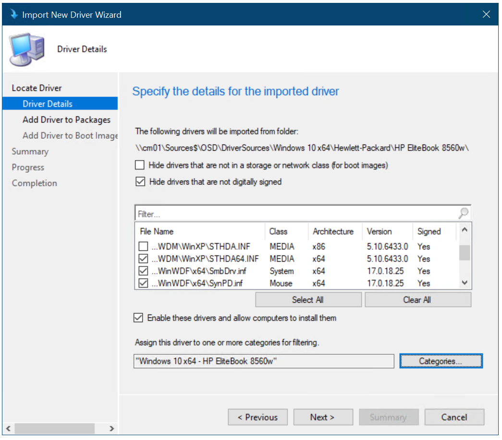

# Add drivers to a Windows 10 deployment with Windows PE using Configuration Manager

**Applies to**

-   Windows 10 versions 1507, 1511

>[!IMPORTANT]
>For instructions to deploy the most recent version of Windows 10 with Configuration Manager, see [Scenarios to deploy enterprise operating systems with System Center Configuration Manager](https://docs.microsoft.com/sccm/osd/deploy-use/scenarios-to-deploy-enterprise-operating-systems). 
>Configuration Manager 2012 and 2012 R2 provide support for Windows 10 versions 1507 and 1511 only. Later versions of Windows 10 require an updated Configuration Manager release. For a list of Configuration Manager versions and the corresponding Windows 10 client versions that are supported, see [Support for Windows 10 for System Center Configuration Manager](https://docs.microsoft.com/sccm/core/plan-design/configs/support-for-windows-10).

In this topic, you will learn how to configure the Windows Preinstallation Environment (Windows PE) to include the network drivers required to connect to the deployment share and the storage drivers required to see the local storage on machines. Even though the Windows PE boot image and the Windows 10 operating system contain many out-of-the-box drivers, it is likely you will have to add new or updated drivers to support all your hardware. In this section, you import drivers for both Windows PE and the full Windows 10 operating system.

For the purposes of this topic, we will use CM01, a machine running Windows Server 2012 R2 Standard that is a member of the domain contoso.com for the fictitious Contoso Corporation. For more details on the setup for this topic, please see [Deploy Windows 10 with the Microsoft Deployment Toolkit](../deploy-windows-mdt/deploy-windows-10-with-the-microsoft-deployment-toolkit.md).

## Add drivers for Windows PE

This section will show you how to import some network and storage drivers for Windows PE. This section assumes you have downloaded some drivers to the E:\\Sources\\OSD\\DriverSources\\WinPE x64 folder on CM01.

1.  On CM01, using the Configuration Manager Console, in the Software Library workspace, right-click the **Drivers** node and select **Import Driver**.

2.  In the Import New Driver Wizard, on the **Specify a location to import driver** page, below the Import all drivers in the following network path (UNC) option, browse to the **\\\\CM01\\Sources$\\OSD\\DriverSources\\WinPE x64** folder and click **Next**.

3.  On the **Specify the details for the imported driver** page, click **Categories**, create a category named **WinPE x64**, and then click **Next**.

4.  On the **Select the packages to add the imported driver** page, click **Next**.

5.  On the **Select drivers to include in the boot image** page, select the **Zero Touch WinPE x64** boot image. Also select the **Update distribution points when finished** check box, and click **Next** twice.

*Figure 21. Add drivers to Windows PE*

>[!NOTE]
>The Updating Boot Image part of the wizard will appear to hang when displaying Done. It will complete in a minute or two.
 

## Add drivers for Windows 10

This section illustrates how to add drivers for Windows 10 through an example in which you want to import Windows 10 drivers for the HP EliteBook 8560w model. For the purposes of this section, we assume that you have downloaded the Windows 10 drivers for the HP EliteBook 8560w model and copied them to the E:\\Sources\\OSD\\DriverSources\\Windows 10 x64\\HP EliteBook 8560w folder on CM01.

1.  On CM01, using the Configuration Manager Console, right-click the **Drivers** folder and select **Import Driver**.

2.  In the Import New Driver Wizard, on the **Specify a location to import driver** page, below the Import all drivers in the following network path (UNC) option, browse to the **\\\\CM01\\Sources$\\OSD\\DriverSources\\Windows 10 x64\\HP EliteBook 8560w** folder and click **Next**.

3.  On the **Specify the details for the imported driver** page, click **Categories**, create a category named Windows 10 x64 - HP EliteBook 8560w, and then click **Next**.

    

    *Figure 22. Create driver categories*

4.  On the **Select the packages to add the imported driver** page, click **New Package**, use the following settings for the package, and then click **Next**:

    * Name: Windows 10 x64 - HP EliteBook 8560w

    * Path: \\\\CM01\\Sources$\\OSD\\DriverPackages\\Windows 10 x64\\HP EliteBook 8560w

    >[!NOTE]
    >The package path does not yet exist, so you have to type it in. The wizard will create the new package in that folder.
     

5.  On the **Select drivers to include in the boot image** page, do not select anything, and click **Next** twice. After the package has been created, click **Close**.

    >[!NOTE]
    >If you want to monitor the driver import process more closely, you can open the SMSProv.log file during driver import.
  
    
  
    *Figure 23. Drivers imported and a new driver package created*

## Related topics

[Integrate Configuration Manager with MDT](../deploy-windows-mdt/integrate-configuration-manager-with-mdt.md)

[Prepare for Zero Touch Installation of Windows 10 with Configuration Manager](prepare-for-zero-touch-installation-of-windows-10-with-configuration-manager.md)

[Create a custom Windows PE boot image with Configuration Manager](create-a-custom-windows-pe-boot-image-with-configuration-manager.md)

[Add a Windows 10 operating system image using Configuration Manager](add-a-windows-10-operating-system-image-using-configuration-manager.md)

[Create an application to deploy with Windows 10 using Configuration Manager](create-an-application-to-deploy-with-windows-10-using-configuration-manager.md)

[Create a task sequence with Configuration Manager and MDT](../deploy-windows-mdt/create-a-task-sequence-with-configuration-manager-and-mdt.md)

[Deploy Windows 10 using PXE and Configuration Manager](deploy-windows-10-using-pxe-and-configuration-manager.md)

[Refresh a Windows 7 SP1 client with Windows 10 using Configuration Manager](refresh-a-windows-7-client-with-windows-10-using-configuration-manager.md)

[Replace a Windows 7 SP1 client with Windows 10 using Configuration Manager](replace-a-windows-7-client-with-windows-10-using-configuration-manager.md)
