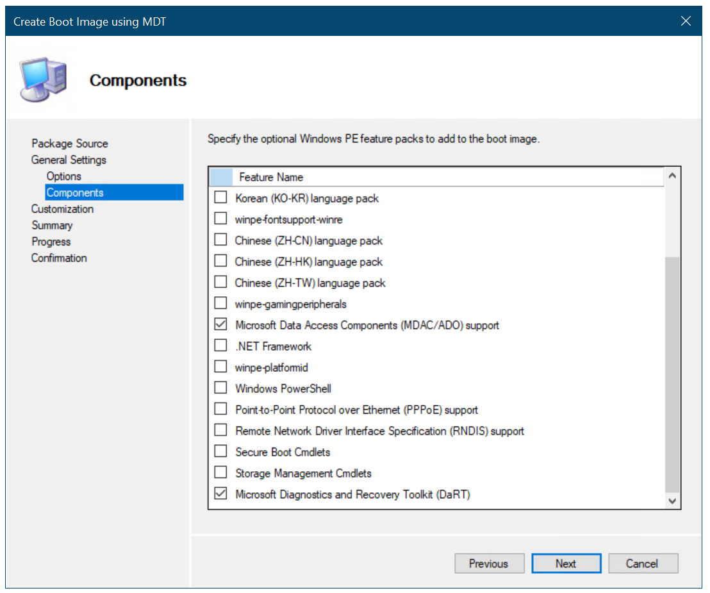
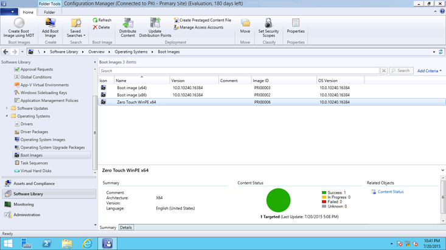

# Create a custom Windows PE boot image with Configuration Manager

**Applies to**

-   Windows 10 versions 1507, 1511

>[!IMPORTANT]
>For instructions to deploy the most recent version of Windows 10 with Configuration Manager, see [Scenarios to deploy enterprise operating systems with System Center Configuration Manager](https://docs.microsoft.com/sccm/osd/deploy-use/scenarios-to-deploy-enterprise-operating-systems). 
>Configuration Manager 2012 and 2012 R2 provide support for Windows 10 versions 1507 and 1511 only. Later versions of Windows 10 require an updated Configuration Manager release. For a list of Configuration Manager versions and the corresponding Windows 10 client versions that are supported, see [Support for Windows 10 for System Center Configuration Manager](https://docs.microsoft.com/sccm/core/plan-design/configs/support-for-windows-10).

In Microsoft System Center 2012 R2 Configuration Manager, you can create custom Windows Preinstallation Environment (Windows PE) boot images that include extra components and features. This topic shows you how to create a custom Windows PE 5.0 boot image with the Microsoft Deployment Toolkit (MDT) wizard. You can also add the Microsoft Diagnostics and Recovery Toolset (DaRT) 10 to the boot image as part of the boot image creation process.

For the purposes of this topic, we will use two machines: DC01 and CM01. DC01 is a domain controller and CM01 is a machine running Windows Server 2012 R2 Standard. Both are members of the domain contoso.com for the fictitious Contoso Corporation. For more details on the setup for this topic, please see [Deploy Windows 10 with the Microsoft Deployment Toolkit](../deploy-windows-mdt/deploy-windows-10-with-the-microsoft-deployment-toolkit.md).

## Add DaRT 10 files and prepare to brand the boot image

The steps below outline the process for adding DaRT 10 installation files to the MDT installation directory. You also copy a custom background image to be used later. We assume you have downloaded Microsoft Desktop Optimization Pack (MDOP) 2015 and copied the x64 version of MSDaRT10.msi to the C:\\Setup\\DaRT 10 folder. We also assume you have created a custom background image and saved it in C:\\Setup\\Branding on CM01. In this section, we use a custom background image named ContosoBackground.bmp.

1.  Install DaRT 10 (C:\\Setup\\DaRT 10\\MSDaRT10.msi) using the default settings.

2.  Using File Explorer, navigate to the **C:\\Program Files\\Microsoft DaRT\\v10** folder.

3.  Copy the Toolsx64.cab file to the **C:\\Program Files\\Microsoft Deployment Toolkit\\Templates\\Distribution\\Tools\\x64** folder.

4.  Copy the Toolsx86.cab file to the **C:\\Program Files\\Microsoft Deployment Toolkit\\Templates\\Distribution\\Tools\\x86** folder.

5.  Using File Explorer, navigate to the **C:\\Setup** folder.

6.  Copy the **Branding** folder to **E:\\Sources\\OSD**.

## Create a boot image for Configuration Manager using the MDT wizard

By using the MDT wizard to create the boot image in Configuration Manager, you gain additional options for adding components and features to the boot image. In this section, you create a boot image for Configuration Manager using the MDT wizard.

1.  Using the Configuration Manager Console, in the Software Library workspace, expand **Operating Systems**, right-click **Boot Images**, and select **Create Boot Image using MDT**.

2.  On the **Package Source** page, in the **Package source folder to be created (UNC Path):** text box, type **\\\\CM01\\Sources$\\OSD\\Boot\\Zero Touch WinPE x64** and click **Next**.

    >[!NOTE]
    >The Zero Touch WinPE x64 folder does not yet exist. The folder will be created later by the wizard.

3.  On the **General Settings** page, assign the name **Zero Touch WinPE x64** and click **Next**.

4.  On the **Options** page, select the **x64** platform, and click **Next**.

5.  On the **Components** page, in addition to the default selected **Microsoft Data Access Components (MDAC/ADO)** support, select the **Microsoft Diagnostics and Recovery Toolkit (DaRT)** check box.

    

    Figure 15. Add the DaRT component to the Configuration Manager boot image.

6.  On the **Customization** page, select the **Use a custom background bitmap file** check box, and in the **UNC path:** text box, browse to **\\\\CM01\\Sources$\\OSD\\Branding\\ ContosoBackground.bmp**. Then click **Next** twice.

    >[!NOTE]
    >It will take a few minutes to generate the boot image.

7.  Distribute the boot image to the CM01 distribution point by selecting the **Boot images** node, right-clicking the **Zero Touch WinPE x64** boot image, and selecting **Distribute Content**.

8.  In the Distribute Content Wizard, add the CM01 distribution point, and complete the wizard.

9.  Using Configuration Manager Trace, review the E:\\Program Files\\Microsoft Configuration Manager\\Logs\\distmgr.log file. Do not continue until you can see that the boot image is distributed. Look for the line that reads STATMSG: ID=2301. You also can view Content Status in the Configuration Manager Console by selecting **the Zero Touch WinPE x86** boot image.

    

    Figure 16. Content status for the Zero Touch WinPE x64 boot image

10. Using the Configuration Manager Console, right-click the **Zero Touch WinPE x64** boot image and select **Properties**.

11. In the **Data Source** tab, select the **Deploy this boot image from the PXE-enabled distribution point** check box, and click **OK**.

12. Using Configuration Manager Trace, review the E:\\Program Files\\Microsoft Configuration Manager\\Logs\\distmgr.log file and look for this text: Expanding PS10000B to E:\\RemoteInstall\\SMSImages.

13. Review the **E:\\RemoteInstall\\SMSImages** folder. You should see three folders containing boot images. Two are from the default boot images, and the third folder (PS10000B) is from your new boot image with DaRT.

## Related topics

[Integrate Configuration Manager with MDT](../deploy-windows-mdt/integrate-configuration-manager-with-mdt.md)

[Prepare for Zero Touch Installation of Windows 10 with Configuration Manager](prepare-for-zero-touch-installation-of-windows-10-with-configuration-manager.md)

[Add a Windows 10 operating system image using Configuration Manager](add-a-windows-10-operating-system-image-using-configuration-manager.md)

[Create an application to deploy with Windows 10 using Configuration Manager](create-an-application-to-deploy-with-windows-10-using-configuration-manager.md)

[Add drivers to a Windows 10 deployment with Windows PE using Configuration Manager](add-drivers-to-a-windows-10-deployment-with-windows-pe-using-configuration-manager.md)

[Create a task sequence with Configuration Manager and MDT](../deploy-windows-mdt/create-a-task-sequence-with-configuration-manager-and-mdt.md)

[Deploy Windows 10 using PXE and Configuration Manager](deploy-windows-10-using-pxe-and-configuration-manager.md)

[Refresh a Windows 7 SP1 client with Windows 10 using Configuration Manager](refresh-a-windows-7-client-with-windows-10-using-configuration-manager.md)

[Replace a Windows 7 SP1 client with Windows 10 using Configuration Manager](replace-a-windows-7-client-with-windows-10-using-configuration-manager.md)

 

 
