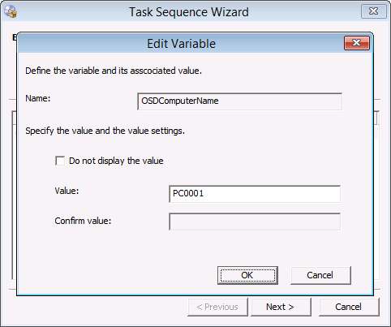

# Deploy Windows 10 using PXE and Configuration Manager

**Applies to**

-   Windows 10 versions 1507, 1511

>[!IMPORTANT]
>For instructions to deploy the most recent version of Windows 10 with Configuration Manager, see [Scenarios to deploy enterprise operating systems with System Center Configuration Manager](https://docs.microsoft.com/sccm/osd/deploy-use/scenarios-to-deploy-enterprise-operating-systems). 
>Configuration Manager 2012 and 2012 R2 provide support for Windows 10 versions 1507 and 1511 only. Later versions of Windows 10 require an updated Configuration Manager release. For a list of Configuration Manager versions and the corresponding Windows 10 client versions that are supported, see [Support for Windows 10 for System Center Configuration Manager](https://docs.microsoft.com/sccm/core/plan-design/configs/support-for-windows-10).

In this topic, you will learn how to deploy Windows 10 using Microsoft System Center 2012 R2 Configuration Manager deployment packages and task sequences. This topic will walk you through the process of deploying the Windows 10 Enterprise image to a Unified Extensible Firmware Interface (UEFI) machine named PC0001.

For the purposes of this topic, we will use two additional machines: DC01 and CM01. DC01 is a domain controller and CM01 is a machine running Windows Server 2012 R2 Standard. DC01, CM01, and PC0001 are all members of the domain contoso.com for the fictitious Contoso Corporation. For more details on the setup for this topic, please see [Deploy Windows 10 with the Microsoft Deployment Toolkit](../deploy-windows-mdt/deploy-windows-10-with-the-microsoft-deployment-toolkit.md).

1.  Start the PC0001 machine. At the Pre-Boot Execution Environment (PXE) boot menu, press **Enter** to allow it to PXE boot.

    

    Figure 31. PXE booting PC0001.

2.  On the **Welcome to the Task Sequence Wizard** page, type in the password **Passw0rd!** and click **Next**.

3.  On the **Select a task sequence to run** page, select **Windows 10 Enterprise x64 RTM** and click **Next**.

4.  On the **Edit Task Sequence Variables** page, double-click the **OSDComputerName** variable, and in the **Value** field, type **PC0001** and click **OK**. Then click **Next**.

Figure 32. Typing in the computer name.

## Related topics

[Integrate Configuration Manager with MDT](../deploy-windows-mdt/integrate-configuration-manager-with-mdt.md)

[Prepare for Zero Touch Installation of Windows 10 with Configuration Manager](prepare-for-zero-touch-installation-of-windows-10-with-configuration-manager.md)

[Create a custom Windows PE boot image with Configuration Manager](create-a-custom-windows-pe-boot-image-with-configuration-manager.md)

[Add a Windows 10 operating system image using Configuration Manager](add-a-windows-10-operating-system-image-using-configuration-manager.md)

[Create an application to deploy with Windows 10 using Configuration Manager](create-an-application-to-deploy-with-windows-10-using-configuration-manager.md)

[Add drivers to a Windows 10 deployment with Windows PE using Configuration Manager](add-drivers-to-a-windows-10-deployment-with-windows-pe-using-configuration-manager.md)

[Create a task sequence with Configuration Manager and MDT](../deploy-windows-mdt/create-a-task-sequence-with-configuration-manager-and-mdt.md)

[Refresh a Windows 7 SP1 client with Windows 10 using Configuration Manager](refresh-a-windows-7-client-with-windows-10-using-configuration-manager.md)

[Replace a Windows 7 SP1 client with Windows 10 using Configuration Manager](replace-a-windows-7-client-with-windows-10-using-configuration-manager.md)

 

 

