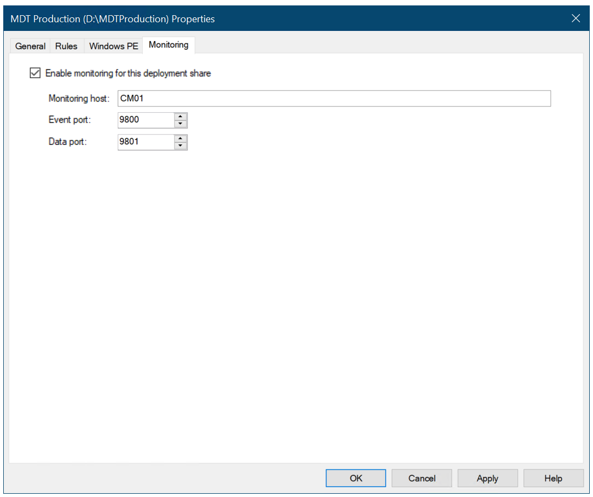
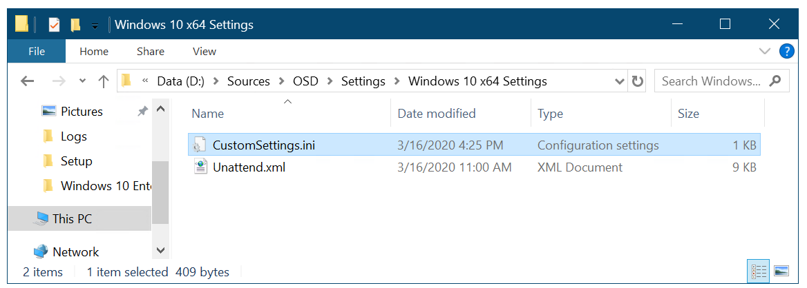
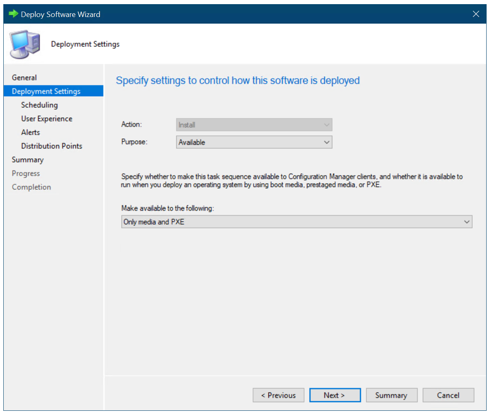
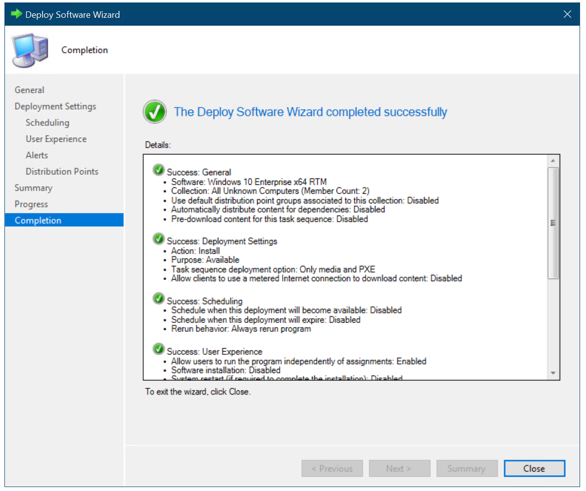

# Finalize the operating system configuration for Windows 10 deployment with Configuration Manager


**Applies to**

-   Windows 10 versions 1507, 1511

>[!IMPORTANT]
>For instructions to deploy the most recent version of Windows 10 with Configuration Manager, see [Scenarios to deploy enterprise operating systems with System Center Configuration Manager](https://docs.microsoft.com/sccm/osd/deploy-use/scenarios-to-deploy-enterprise-operating-systems). 
>Configuration Manager 2012 and 2012 R2 provide support for Windows 10 versions 1507 and 1511 only. Later versions of Windows 10 require an updated Configuration Manager release. For a list of Configuration Manager versions and the corresponding Windows 10 client versions that are supported, see [Support for Windows 10 for System Center Configuration Manager](https://docs.microsoft.com/sccm/core/plan-design/configs/support-for-windows-10).

This topic walks you through the steps to finalize the configuration of your Windows 10 operating deployment, which includes enablement of the optional Microsoft Deployment Toolkit (MDT) monitoring for Microsoft System Center 2012 R2 Configuration Manager, logs folder creation, rules configuration, content distribution, and deployment of the previously created task sequence.

For the purposes of this topic, we will use two machines: DC01 and CM01. DC01 is a domain controller and CM01 is a machine running Windows Server 2012 R2 Standard. Both are members of the domain contoso.com for the fictitious Contoso Corporation. For more details on the setup for this topic, please see [Deploy Windows 10 with the Microsoft Deployment Toolkit](../deploy-windows-mdt/deploy-windows-10-with-the-microsoft-deployment-toolkit.md).

## <a href="" id="sec01"></a>Enable MDT monitoring


This section will walk you through the process of creating the E:\\MDTProduction deployment share using the MDT Deployment Workbench to enable monitoring for Configuration Manager.

1.  On CM01, using the Deployment Workbench, right-click **Deployment Shares** and select **New Deployment Share**. Use the following settings for the New Deployment Share Wizard:

    * Deployment share path: E:\\MDTProduction

    * Share name: MDTProduction$

    * Deployment share description: MDT Production

    * Options: &lt;default settings&gt;

2.  Right-click the **MDT Production** deployment share, and select **Properties**. In the **Monitoring** tab, select the **Enable monitoring for this deployment share** check box, and click **OK**.

    

    *Figure 26. Enable MDT monitoring for Configuration Manager*

## <a href="" id="sec02"></a>Create and share the Logs folder


To support additional server-side logging in Configuration Manager, you create and share the E:\\Logs folder on CM01 using Windows PowerShell. Then in the next step, you enable server-side logging by modifying the CustomSettings.ini file used by the Configuration Manager task sequence.

1.  On CM01, start an elevated Windows PowerShell prompt (run as Administrator).

2.  Type the following commands, pressing **Enter** after each one:

    ``` syntax
    New-Item -Path E:\Logs -ItemType directory
    New-SmbShare -Name Logs$ -Path E:\Logs -ChangeAccess EVERYONE
    icacls E:\Logs /grant '"CM_NAA":(OI)(CI)(M)'
    ```

## <a href="" id="sec03"></a>Configure the rules (Windows 10 x64 Settings package)


This section will show you how to configure the rules (the Windows 10 x64 Settings package) to support the Contoso environment.

1. On CM01, using File Explorer, navigate to the **E:\\Sources\\OSD\\Settings\\Windows 10 x64 Settings** folder.

2. Using Notepad, edit the CustomSetting.ini file with the following settings:

   ``` syntax
   [Settings]
   Priority=Default
   Properties=OSDMigrateConfigFiles,OSDMigrateMode
   [Default]
   DoCapture=NO
   ComputerBackupLocation=NONE
   MachineObjectOU=ou=Workstations,ou=Computers,ou=Contoso,dc=contoso,dc=com
   OSDMigrateMode=Advanced
   OSDMigrateAdditionalCaptureOptions=/ue:*\* /ui:CONTOSO\*
   OSDMigrateConfigFiles=Miguser.xml,Migapp.xml
   SLSHARE=\\CM01\Logs$
   EventService=http://CM01:9800
   ApplyGPOPack=NO
   ```

   

   *Figure 27. The Settings package, holding the rules and the Unattend.xml template used during deployment*

3. Update the distribution point for the **Windows 10 x64 Settings** package by right-clicking the **Windows 10 x64 Settings** package and selecting **Update Distribution Points**.

   >[!NOTE]
   >Although you have not yet added a distribution point, you still need to select Update Distribution Points. That process also updates the Configuration Manager 2012 content library with changes.

 

## <a href="" id="sec04"></a>Distribute content to the CM01 distribution portal


In Configuration Manager, you can distribute all packages needed by a task sequence in a single task. In this section, you distribute packages that have not yet been distributed to the CM01 distribution point.

1.  **On CM01, using the Configuration Manager Console**, select **Task Sequences**, right-click the **Windows 10 Enterprise x64 RTM** task sequence, and select **Distribute Content.**

2.  In the Distribute Content Wizard, add the CM01 distribution point, and complete the wizard.

3.  Using Configuration Manager Trace, verify the distribution to the CM01 distribution point by reviewing the distmgr.log file, or use the Distribution Status / Content Status option in the Monitoring workspace. Do not continue until you see all the new packages being distributed successfully.

## <a href="" id="sec05"></a>Create a deployment for the task sequence


This sections provides steps to help you create a deployment for the task sequence.

1. On CM01, using the Configuration Manager Console, select **Task Sequences**, right-click **Windows 10 Enterprise x64 RTM**, and then select **Deploy**.

2. On the **General** page, select the **All Unknown Computers** collection and click **Next**.

3. On the **Deployment Settings** page, use the following settings and then click **Next**:

   * Purpose: Available

   * Make available to the following: Only media and PXE

   
    
   *Figure 28. Configure the deployment settings*

4. On the **Scheduling** page, accept the default settings and click **Next**.

5. On the **User Experience** page, accept the default settings and click **Next**.

6. On the **Alerts** page, accept the default settings and click **Next**.

7. On the **Distribution Points** page, accept the default settings, click **Next** twice, and then click **Close**.

   

   *Figure 29. The Windows 10 Enterprise x64 RTM task sequence deployed to the All Unknown Computers collections available for media and PXE*

## <a href="" id="sec06"></a>Configure Configuration Manager to prompt for the computer name during deployment (optional)


You can have Configuration Manager prompt you for a computer name or you can use rules to generate a computer name. For more details on how to do this, see [Configure MDT settings](../deploy-windows-mdt/configure-mdt-settings.md).

This section provides steps to help you configure the All Unknown Computers collection to have Configuration Manager prompt for computer names.

1. Using the Configuration Manager Console, in the Asset and Compliance workspace, select **Device Collections**, right-click **All Unknown Computers**, and select **Properties**.

2. In the **Collection Variables** tab, create a new variable with the following settings:

   * Name: OSDComputerName

   * Clear the **Do not display this value in the Configuration Manager console** check box.

3. Click **OK**.

   >[!NOTE]  
   >Configuration Manager can prompt for information in many ways. Using a collection variable with an empty value is just one of them. Another option is the User-Driven Installation (UDI) wizard.
   
   
   
   *Figure 30. Configure a collection variable*

## Related topics


[Integrate Configuration Manager with MDT](../deploy-windows-mdt/integrate-configuration-manager-with-mdt.md)

[Prepare for Zero Touch Installation of Windows 10 with Configuration Manager](prepare-for-zero-touch-installation-of-windows-10-with-configuration-manager.md)

[Create a custom Windows PE boot image with Configuration Manager](create-a-custom-windows-pe-boot-image-with-configuration-manager.md)

[Add a Windows 10 operating system image using Configuration Manager](add-a-windows-10-operating-system-image-using-configuration-manager.md)

[Create an application to deploy with Windows 10 using Configuration Manager](create-an-application-to-deploy-with-windows-10-using-configuration-manager.md)

[Add drivers to a Windows 10 deployment with Windows PE using Configuration Manager](add-drivers-to-a-windows-10-deployment-with-windows-pe-using-configuration-manager.md)

[Create a task sequence with Configuration Manager and MDT](../deploy-windows-mdt/create-a-task-sequence-with-configuration-manager-and-mdt.md)

[Deploy Windows 10 using PXE and Configuration Manager](deploy-windows-10-using-pxe-and-configuration-manager.md)

[Refresh a Windows 7 SP1 client with Windows 10 using Configuration Manager](refresh-a-windows-7-client-with-windows-10-using-configuration-manager.md)

[Replace a Windows 7 SP1 client with Windows 10 using Configuration Manager](replace-a-windows-7-client-with-windows-10-using-configuration-manager.md)

 
