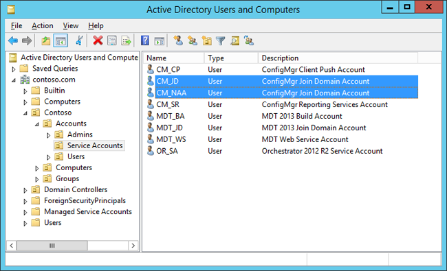
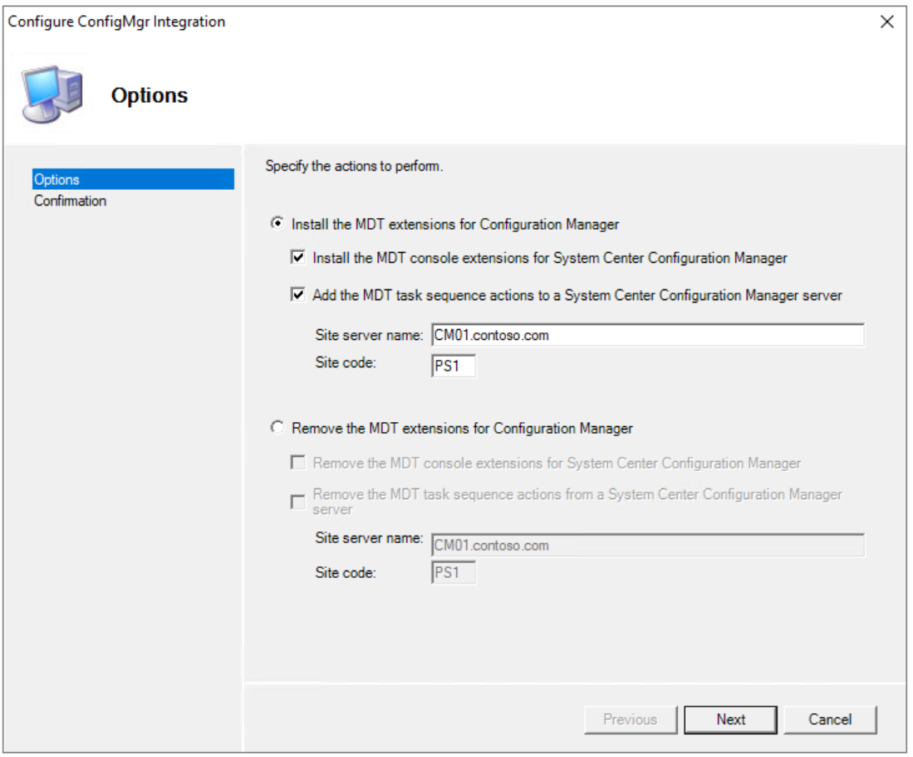
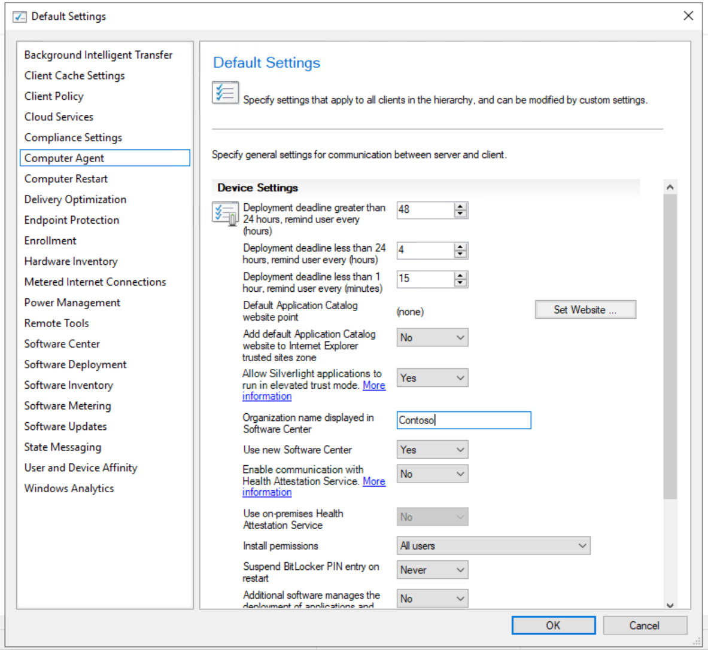
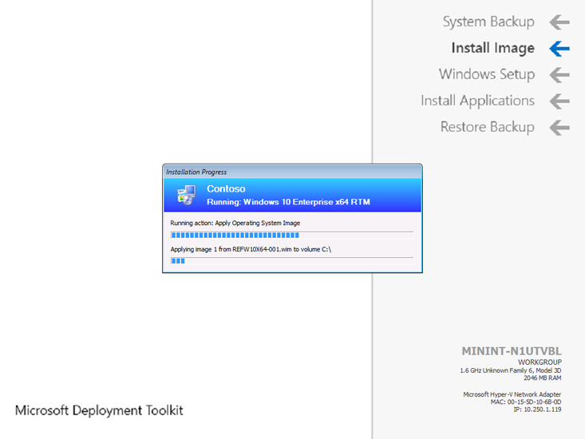
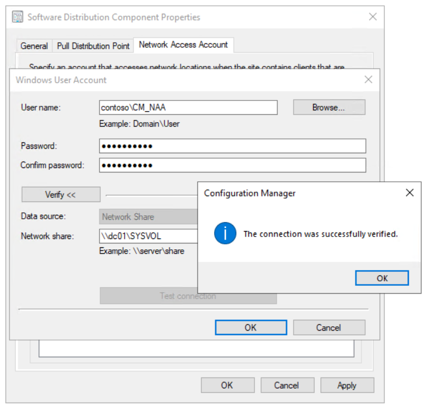
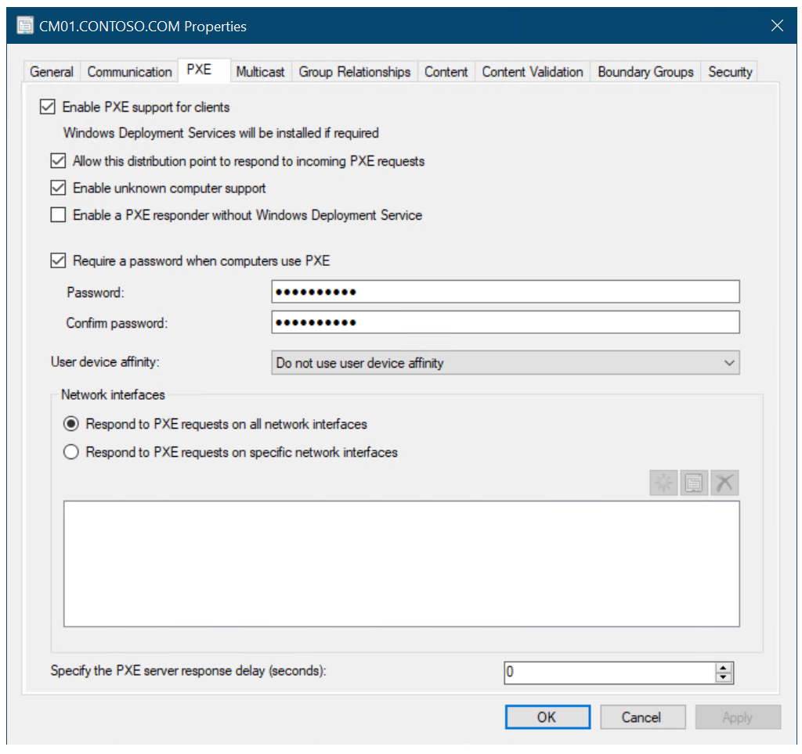
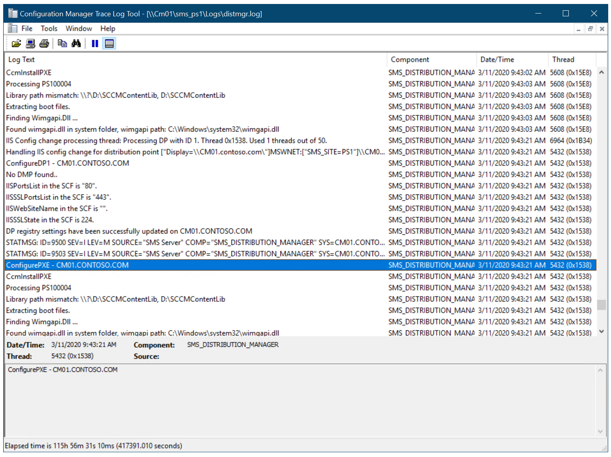
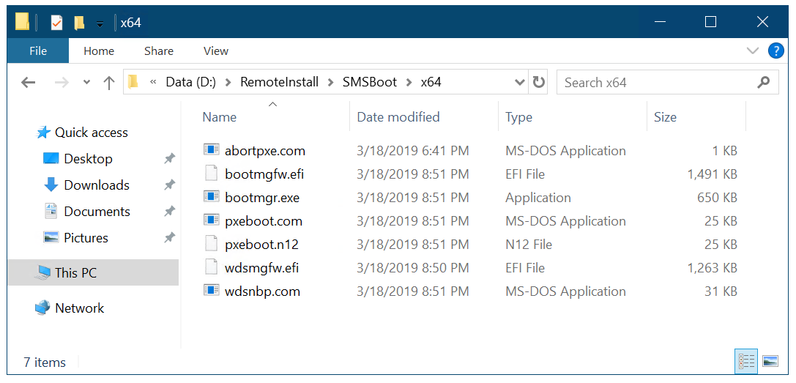

# Prepare for Zero Touch Installation of Windows 10 with Configuration Manager


**Applies to**

-   Windows 10 versions 1507, 1511

>[!IMPORTANT]
>For instructions to deploy the most recent version of Windows 10 with Configuration Manager, see [Scenarios to deploy enterprise operating systems with System Center Configuration Manager](https://docs.microsoft.com/sccm/osd/deploy-use/scenarios-to-deploy-enterprise-operating-systems). 
>Configuration Manager 2012 and 2012 R2 provide support for Windows 10 versions 1507 and 1511 only. Later versions of Windows 10 require an updated Configuration Manager release. For a list of Configuration Manager versions and the corresponding Windows 10 client versions that are supported, see [Support for Windows 10 for System Center Configuration Manager](https://docs.microsoft.com/sccm/core/plan-design/configs/support-for-windows-10).

This topic will walk you through the process of integrating Microsoft System Center 2012 R2 Configuration Manager SP1 with Microsoft Deployment Toolkit (MDT) 2013 Update 2, as well as the other preparations needed to deploying Windows 10 via Zero Touch Installation. Additional preparations include the installation of hotfixes as well as activities that speed up the Pre-Boot Execution Environment (PXE).

## Prerequisites


In this topic, you will use an existing Configuration Manager server structure to prepare for operating system deployment. In addition to the base setup, the following configurations should be made in the Configuration Manager environment:

-   Active Directory Schema has been extended and System Management container created.

-   Active Directory Forest Discovery and Active Directory System Discovery have been enabled.

-   IP range boundaries and a boundary group for content and site assignment have been created.

-   The Configuration Manager reporting services point role has been added and configured

-   A file system folder structure for packages has been created.

-   A Configuration Manager console folder structure for packages has been created.

-   System Center 2012 R2 Configuration Manager SP1 and any additional Windows 10 prerequisites are installed.

For the purposes of this topic, we will use two machines: DC01 and CM01. DC01 is a domain controller and CM01 is a machine running Windows Server 2012 R2 Standard. DC01 and CM01 are both members of the domain contoso.com for the fictitious Contoso Corporation. For more details on the setup for this topic, please see [Deploy Windows 10 with the Microsoft Deployment Toolkit](../deploy-windows-mdt/deploy-windows-10-with-the-microsoft-deployment-toolkit.md).

## <a href="" id="sec01"></a>Create the Configuration Manager service accounts


To configure permissions for the various service accounts needed for operating system deployment in Configuration Manager, you use a role-based model. To create the Configuration Manager Join Domain account as well as the Configuration Manager Network Access account, follow these steps:

1.  On DC01, using Active Directory User and Computers, browse to **contoso.com / Contoso / Service Accounts**.

2.  Select the Service Accounts OU and create the CM\_JD account using the following settings:

    * Name: CM\_JD

    * User logon name: CM\_JD

    * Password: P@ssw0rd

    * User must change password at next logon: Clear

    * User cannot change password: Select

    * Password never expires: Select

3.  Repeat the step, but for the CM\_NAA account.

4.  After creating the accounts, assign the following descriptions:

    * CM\_JD: Configuration Manager Join Domain Account

    * CM\_NAA: Configuration Manager Network Access Account



Figure 6. The Configuration Manager service accounts used for operating system deployment.

## <a href="" id="sec02"></a>Configure Active Directory permissions


In order for the Configuration Manager Join Domain Account (CM\_JD) to join machines into the contoso.com domain you need to configure permissions in Active Directory. These steps assume you have downloaded the sample [Set-OUPermissions.ps1 script](https://go.microsoft.com/fwlink/p/?LinkId=619362) and copied it to C:\\Setup\\Scripts on DC01.

1.  On DC01, log on as Administrator in the CONTOSO domain using the password **P@ssw0rd**.

2.  In an elevated Windows PowerShell prompt (run as Administrator), run the following commands, pressing **Enter** after each command:

    ``` syntax
    Set-ExecutionPolicy -ExecutionPolicy RemoteSigned -Force

    Set-Location C:\Setup\Scripts

    .\Set-OUPermissions.ps1 -Account CM_JD 
    -TargetOU "OU=Workstations,OU=Computers,OU=Contoso"
    ```

3.  The Set-OUPermissions.ps1 script allows the CM\_JD user account permissions to manage computer accounts in the Contoso / Computers / Workstations OU. The following is a list of the permissions being granted:

    * Scope: This object and all descendant objects

    * Create Computer objects

    * Delete Computer objects

    * Scope: Descendant Computer objects

    * Read All Properties

    * Write All Properties

    * Read Permissions

    * Modify Permissions

    * Change Password

    * Reset Password

    * Validated write to DNS host name

    * Validated write to service principal name

## <a href="" id="sec03"></a>Review the Sources folder structure


To support the packages you create in this section, the following folder structure should be created on the Configuration Manager primary site server (CM01):

>[!NOTE]  
>In most production environments, the packages are stored on a Distributed File System (DFS) share or a "normal" server share, but in a lab environment you can store them on the site server.

-   E:\\Sources

-   E:\\Sources\\OSD

-   E:\\Sources\\OSD\\Boot

-   E:\\Sources\\OSD\\DriverPackages

-   E:\\Sources\\OSD\\DriverSources

-   E:\\Sources\\OSD\\MDT

-   E:\\Sources\\OSD\\OS

-   E:\\Sources\\OSD\\Settings

-   E:\\Sources\\Software

-   E:\\Sources\\Software\\Adobe

-   E:\\Sources\\Software\\Microsoft


Figure 7. The E:\\Sources\\OSD folder structure.

## <a href="" id="sec04"></a>Integrate Configuration Manager with MDT


To extend the Configuration Manager console with MDT wizards and templates, you install MDT in the default location and run the integration setup. In these steps, we assume you have downloaded MDT to the C:\\Setup\\MDT2013 folder on CM01.

1.  On CM01, log on as Administrator in the CONTOSO domain using the password **P@ssw0rd**.

2.  Make sure the Configuration Manager Console is closed before continuing.

3.  Using File Explorer, navigate to the **C:\\Setup\\MDT** folder.

4.  Run the MDT setup (MicrosoftDeploymentToolkit2013\_x64.msi), and use the default options in the setup wizard.

5.  From the Start screen, run Configure ConfigManager Integration with the following settings:

    * Site Server Name: CM01.contoso.com

    * Site code: PS1



Figure 8. Set up the MDT integration with Configuration Manager.

## <a href="" id="sec06"></a>Configure the client settings


Most organizations want to display their name during deployment. In this section, you configure the default Configuration Manager client settings with the Contoso organization name.

1.  On CM01, using the Configuration Manager Console, in the Administration workspace, select **Client Settings**.

2.  In the right pane, right-click **Default Client Settings**, and select **Properties**.

3.  In the **Computer Agent** node, in the **Organization name displayed in Software Center** text box, type in **Contoso** and click **OK**.



Figure 9. Configure the organization name in client settings.



Figure 10. The Contoso organization name displayed during deployment.

## <a href="" id="sec07"></a>Configure the Network Access account


Configuration Manager uses the Network Access account during the Windows 10 deployment process to access content on the distribution point(s). In this section, you configure the Network Access account.

1.  Using the Configuration Manager Console, in the Administration workspace, expand **Site Configuration** and select **Sites**.

2.  Right-click **PS1 - Primary Site 1**, select **Configure Site Components**, and then select **Software Distribution**.

3.  In the **Network Access Account** tab, configure the **CONTOSO\\CM\_NAA** user account (select New Account) as the Network Access account. Use the new **Verify** option to verify that the account can connect to the **\\\\DC01\\sysvol** network share.



Figure 11. Test the connection for the Network Access account.

## <a href="" id="sec08"></a>Enable PXE on the CM01 distribution point


Configuration Manager has many options for starting a deployment, but starting via PXE is certainly the most flexible in a large environment. In this section, you enable PXE on the CM01 distribution point.

1.  In the Configuration Manager Console, in the Administration workspace, select **Distribution Points**.

2.  Right-click the **\\\\CM01.CONTOSO.COM distribution point** and select **Properties**.

3.  In the **PXE** tab, select the following settings:

    * Enable PXE support for clients

    * Allow this distribution point to respond to incoming PXE requests

    * Enable unknown computer support

    * Require a password when computers use PXE

    * Password and Confirm password: Passw0rd!

    

    Figure 12. Configure the CM01 distribution point for PXE.

4.  Using the Configuration Manager Trace Log Tool, review the E:\\Program Files\\Microsoft Configuration Manager\\Logs\\distmgr.log file. Look for ConfigurePXE and CcmInstallPXE lines.

    

    Figure 13. The distmgr.log displays a successful configuration of PXE on the distribution point.

5.  Verify that you have seven files in each of the folders **E:\\RemoteInstall\\SMSBoot\\x86** and **E:\\RemoteInstall\\SMSBoot\\x64**.

    

    Figure 14. The contents of the E:\\RemoteInstall\\SMSBoot\\x64 folder after you enable PXE.

## Related topics


[Integrate Configuration Manager with MDT](../deploy-windows-mdt/integrate-configuration-manager-with-mdt.md)

[Create a custom Windows PE boot image with Configuration Manager](create-a-custom-windows-pe-boot-image-with-configuration-manager.md)

[Add a Windows 10 operating system image using Configuration Manager](add-a-windows-10-operating-system-image-using-configuration-manager.md)

[Create an application to deploy with Windows 10 using Configuration Manager](create-an-application-to-deploy-with-windows-10-using-configuration-manager.md)

[Add drivers to a Windows 10 deployment with Windows PE using Configuration Manager](add-drivers-to-a-windows-10-deployment-with-windows-pe-using-configuration-manager.md)

[Create a task sequence with Configuration Manager and MDT](../deploy-windows-mdt/create-a-task-sequence-with-configuration-manager-and-mdt.md)

[Deploy Windows 10 using PXE and Configuration Manager](deploy-windows-10-using-pxe-and-configuration-manager.md)

[Refresh a Windows 7 SP1 client with Windows 10 using Configuration Manager](refresh-a-windows-7-client-with-windows-10-using-configuration-manager.md)

[Replace a Windows 7 SP1 client with Windows 10 using Configuration Manager](replace-a-windows-7-client-with-windows-10-using-configuration-manager.md)

 

 


