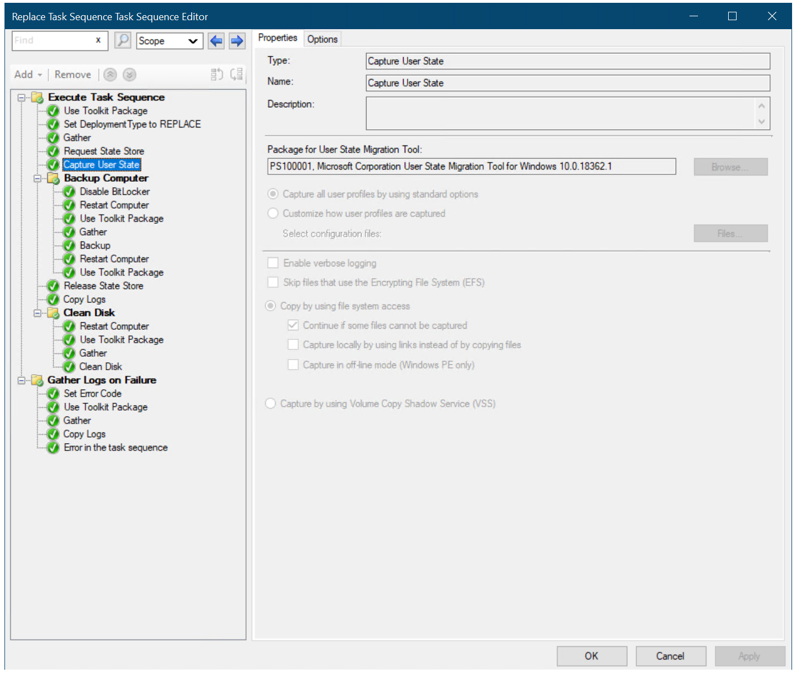
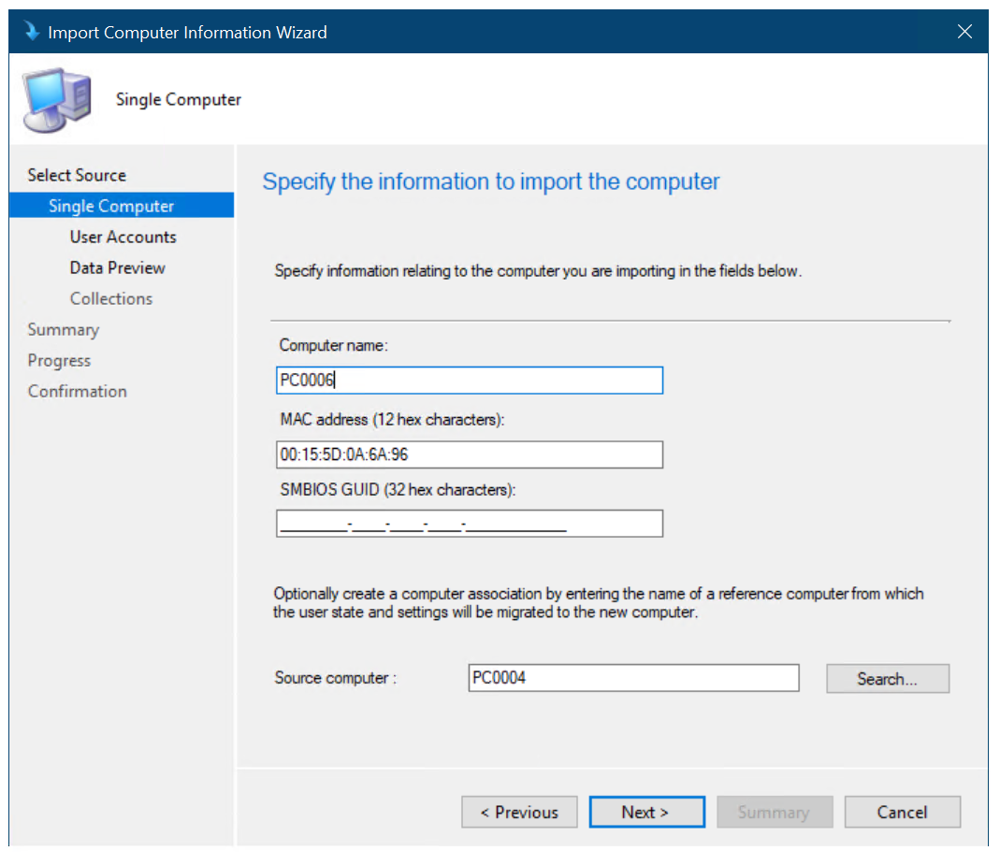

# Replace a Windows 7 SP1 client with Windows 10 using Configuration Manager

**Applies to**

-   Windows 10 versions 1507, 1511

>[!IMPORTANT]
>For instructions to deploy the most recent version of Windows 10 with Configuration Manager, see [Scenarios to deploy enterprise operating systems with System Center Configuration Manager](https://docs.microsoft.com/sccm/osd/deploy-use/scenarios-to-deploy-enterprise-operating-systems). 
>Configuration Manager 2012 and 2012 R2 provide support for Windows 10 versions 1507 and 1511 only. Later versions of Windows 10 require an updated Configuration Manager release. For a list of Configuration Manager versions and the corresponding Windows 10 client versions that are supported, see [Support for Windows 10 for System Center Configuration Manager](https://docs.microsoft.com/sccm/core/plan-design/configs/support-for-windows-10).

In this topic, you will learn how to replace a Windows 7 SP1 computer using Microsoft System Center 2012 R2 Configuration Manager. This process is similar to refreshing a computer, but since you are replacing the machine, you have to run the backup job separately from the deployment of Windows 10.

For the purposes of this topic, we will use three machines: DC01, CM01, and PC0004. DC01 is a domain controller and CM01 is a machine running Windows Server 2012 R2 Standard. PC0004 is a machine with Windows 7 SP1 that will be replaced with a new machine running Windows 10. DC01, CM01, and PC0004 are all members of the domain contoso.com for the fictitious Contoso Corporation. For more details on the setup for this topic, please see [Deploy Windows 10 with the Microsoft Deployment Toolkit](../deploy-windows-mdt/deploy-windows-10-with-the-microsoft-deployment-toolkit.md).

In this topic, you will create a backup-only task sequence that you run on PC0004, the machine you are replacing. For more information, see [Replace a Windows 7 computer with a Windows 10 computer](../deploy-windows-mdt/replace-a-windows-7-computer-with-a-windows-10-computer.md).

## Create a replace task sequence

1. On CM01, using the Configuration Manager Console, in the Software Library workspace, expand **Operating Systems**, right-click **Task Sequences**, and select **Create MDT Task Sequence**.

2. On the **Choose Template** page, select the **Client Replace Task Sequence** template and click **Next**.

3. On the **General** page, assign the following settings and click **Next**:

   * Task sequence name: Replace Task Sequence

   * Task sequence comments: USMT backup only

4. On the **Boot Image** page, browse and select the **Zero Touch WinPE x64** boot image package. Then click **Next**.

5. On the **MDT Package** page, browse and select the **OSD / MDT** package. Then click **Next**.

6. On the **USMT Package** page, browse and select the O**SD / Microsoft Corporation User State Migration Tool for Windows 8 10.0.10240.16384** package. Then click **Next**.

7. On the **Settings Package** page, browse and select the **OSD / Windows 10 x64 Settings** package. Then click **Next**.

8. On the **Summary** page, review the details and then click **Next**.

9. On the **Confirmation** page, click **Finish**.

10. Review the Replace Task Sequence. 
    >[!NOTE]
    >This task sequence has many fewer actions than the normal client task sequence. If it doesn't seem different, make sure you selected the Client Replace Task Sequence template when creating the task sequence.

Figure 34. The backup-only task sequence (named Replace Task Sequence).

## Associate the new machine with the old computer

This section walks you through the process of associating a blank machine, PC0006, with an old machine, PC0004, for the purpose of replacing PC0004 with PC0006. PC0006 can be either a physical or virtual machine.

1.  Make a note of the PC0006 machine's MAC Address. (If PC0006 is a virtual machine, you can see the MAC Address in the virtual machine settings.) In our example, the PC0006 MAC Address is 00:15:5D:0A:6A:96.

2.  Using the Configuration Manager console, in the Asset and Compliance workspace, right-click **Devices**, and then select **Import Computer Information**.

3.  On the **Select Source** page, select **Import single computer** and click **Next**.

4.  On the **Single Computer** page, use the following settings and then click **Next**:

    * Computer Name: PC0006

    * MAC Address: &lt;the mac address from step 1&gt;

    * Source Computer: PC0004

    

    Figure 35. Creating the computer association between PC0004 and PC0006.

5.  On the **User Accounts** page, select **Capture and restore all user accounts** and click **Next**.

6.  On the **Data Preview** page, click **Next**.

7.  On the **Choose Target Collection** page, select the **Install Windows 10 Enterprise x64** collection and click **Next**.

8.  On the **Summary** page, click **Next**, and then click **Close**.

9.  Select the **User State Migration** node and review the computer association in the right pane.

10. Right-click the **PC0004/PC0006** association and select **View Recovery Information**. Note that a recovery key has been assigned already, but a user state store location has not.

11. Review the Install Windows 10 Enterprise x64 collection. Do not continue until you see the PC0006 machine in the collection. You might have to update and refresh the collection again.

## Create a device collection and add the PC0004 computer

1.  On CM01, using the Configuration Manager console, in the Asset and Compliance workspace, right-click **Device Collections**, and then select **Create Device Collection**. Use the following settings.

    * General

    * Name: USMT Backup (Replace)

    * Limited Collection: All Systems

    * Membership rules:

    * Direct rule

    * Resource Class: System Resource

    * Attribute Name: Name

    * Value: PC0004

    * Select **Resources**

    * Select **PC0004**

2.  Review the USMT Backup (Replace) collection. Do not continue until you see the PC0004 machine in the collection.

## Create a new deployment

Using the Configuration Manager console, in the Software Library workspace, select **Task Sequences**, right-click **Replace Task Sequence**, and then select **Deploy**. Use the following settings:

-   General

    -   Collection: USMT Backup (Replace)

-   Deployment Settings

    -   Purpose: Available

    -   Make available to the following: Only Configuration Manager Clients

-   Scheduling

    -   &lt;default&gt;

-   User Experience

    -   &lt;default&gt;

-   Alerts

    -   &lt;default&gt;

-   Distribution Points

    -   &lt;default&gt;

## Verify the backup

This section assumes that you have a machine named PC0004 with the Configuration Manager 2012 client installed.

1.  Start the PC0004 machine, and using the Control Panel, start the Configuration Manager applet.

2.  In the **Actions** tab, select the **Machine Policy Retrieval & Evaluation Cycle**, select **Run Now**, and click **OK**.

    >[!NOTE]
    >You also can use the Client Notification option in the Configuration Manager console, as shown in [Refresh a Windows 7 SP1 client with Windows 10 using Configuration Manager](refresh-a-windows-7-client-with-windows-10-using-configuration-manager.md).

3.  Using the Software Center, select the **Replace Task Sequence** deployment and click **INSTALL**.

4.  In the **Software Center** dialog box, click **INSTALL OPERATING SYSTEM**.

5.  Allow the Replace Task Sequence to complete. It should only take about five minutes.

6.  On CM01, in the **D:\\MigData** folder, verify that a folder was created containing the USMT backup.

7.  Using the Configuration Manager console, in the Asset and Compliance workspace, select the **User State Migration** node, right-click the **PC0004/PC0006** association, and select **View Recovery Information**. Note that the object now also has a user state store location.

    >[!NOTE]
    >It may take a few minutes for the user state store location to be populated.

 

## Deploy the new computer

1.  Start the PC0006 virtual machine, press **F12** to Pre-Boot Execution Environment (PXE) boot when prompted. Allow it to boot Windows Preinstallation Environment (Windows PE), and then complete the deployment wizard using the following settings:

    * Password: P@ssw0rd

    * Select a task sequence to execute on this computer: Windows 10 Enterprise x64 Custom Image

2.  The setup now starts and does the following:

    * Installs the Windows 10 operating system

    * Installs the Configuration Manager client

    * Joins it to the domain

    * Installs the applications

    * Restores the PC0004 backup

When the process is complete, you will have a new Windows 10 machine in your domain with user data and settings restored.

## Related topics

[Integrate Configuration Manager with MDT](../deploy-windows-mdt/integrate-configuration-manager-with-mdt.md)

[Prepare for Zero Touch Installation of Windows 10 with Configuration Manager](prepare-for-zero-touch-installation-of-windows-10-with-configuration-manager.md)

[Create a custom Windows PE boot image with Configuration Manager](create-a-custom-windows-pe-boot-image-with-configuration-manager.md)

[Add a Windows 10 operating system image using Configuration Manager](add-a-windows-10-operating-system-image-using-configuration-manager.md)

[Create an application to deploy with Windows 10 using Configuration Manager](create-an-application-to-deploy-with-windows-10-using-configuration-manager.md)

[Add drivers to a Windows 10 deployment with Windows PE using Configuration Manager](add-drivers-to-a-windows-10-deployment-with-windows-pe-using-configuration-manager.md)

[Create a task sequence with Configuration Manager and MDT](../deploy-windows-mdt/create-a-task-sequence-with-configuration-manager-and-mdt.md)

[Deploy Windows 10 using PXE and Configuration Manager](deploy-windows-10-using-pxe-and-configuration-manager.md)

[Refresh a Windows 7 SP1 client with Windows 10 using Configuration Manager](refresh-a-windows-7-client-with-windows-10-using-configuration-manager.md)

 

 

