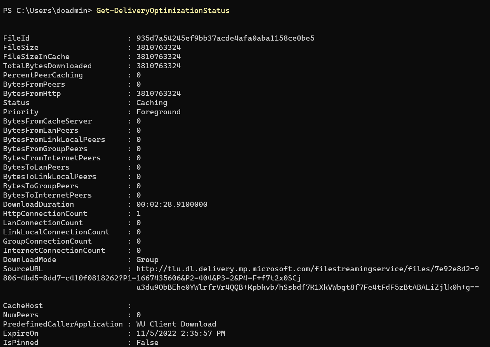
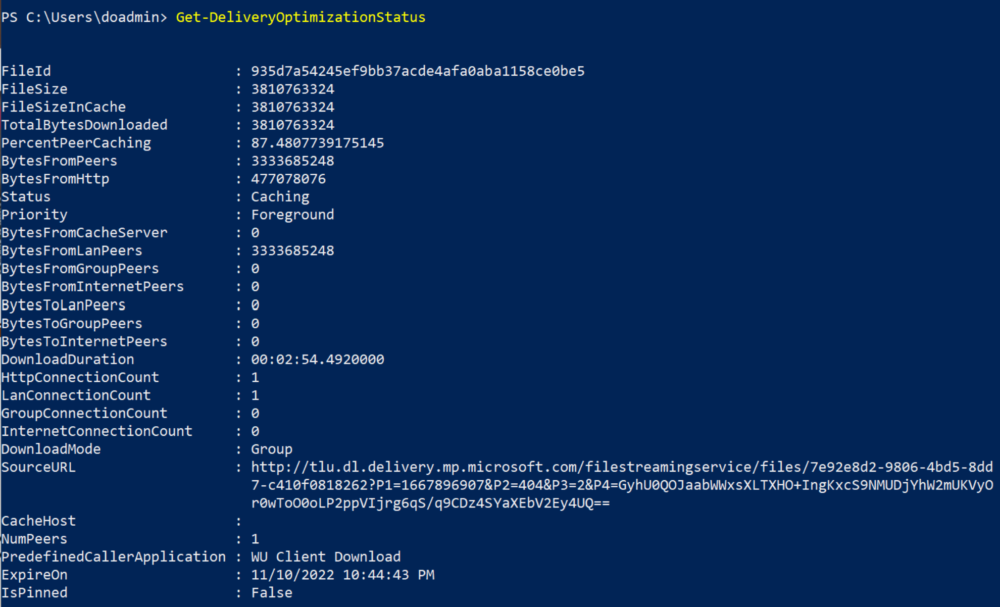

# Testing Delivery Optimization

## Overview

Delivery Optimization is a powerful and useful tool to help enterprises manage bandwidth usage for downloading Microsoft content. It's a solution designed to be used in large-scale environments with large numbers of devices, various content sizes, etc. Delivery Optimization is native to Win10+ and provides default configuration to get the most out of the typical customer environment. It's used to deliver many different types of content, so Microsoft customers enjoy the best possible download experience for their environment. There are three components to Delivery Optimization, 1) HTTP downloader, 2) Peer-to-peer (P2P) cloud technology, and 3) Microsoft Connected Cache. One of the most powerful advantages of using Delivery Optimization is the ability to fine-tune settings that empower users to dial in Microsoft content delivery to meet the needs of specific environments.

## Monitoring Value

Since Delivery Optimization is on by default, you'll be able to monitor the value either through the Windows Settings for ‘Delivery Optimization’, using Delivery Optimization PowerShell cmdlets, and/or via the Update Compliance experience in Azure.

In the case where Delivery Optimization isn't working in your environment, it's important to investigate to get to the root of the problem. We recommend a test environment be created to easily evaluate typical devices to ensure Delivery Optimization is working properly. For starters, ‘Scenario 1: Basic Setup’ should be created to test the use of Delivery Optimization between two machines. This scenario is designed to eliminate any noise in the environment to ensure there's nothing preventing Delivery Optimization from working on the devices. Once you have a baseline, you can expand the test environment for more sophisticated tests.

## Expectations and Goals

The focus of the testing scenarios in this article is primarily centered on demonstrating the Delivery Optimization policies centered around the successful downloading of bytes using P2P. More specifically, the goal will be to show peer to peer is working as expected, using the following criteria:

* Peers can find each other (for example on the same LAN / subnet / Group – matching your Download Mode policy).
* Files are downloading in the expected Download Mode (validates connectivity to DO cloud, HTTP, and local configs).
* At least some downloads happening via P2P (validates connectivity between peers).

Several elements that influence overall peering, using Delivery Optimization. The most common, impactful environment factors should be considered.

* **The number of files in the cache and** **the** **number of devices have a big effect on overall peering.** There's a set number of files available for peering at a time, from each client, so the peering device may not be serving a particular file.
* **File size** **and** **internet connection** **reliability matter.** There's a Delivery Optimization setting to determine the minimum file size to use P2P. In addition, an internet connection must be open and reliable enough to let the Delivery Optimization client make cloud service API calls and download metadata files before starting a file download.
* **Delivery Optimization Policies can play a role.** In general, it's important to familiarize yourself with the Delivery Optimization settings and defaults [Delivery Optimization reference - Windows Deployment | Microsoft Docs](waas-delivery-optimization-reference.md).

### Delivery Optimization is a Hybrid P2P Platform

* Delivery Optimization’s hybrid approach to downloading from multiple sources (HTTP and peer) in parallel is especially critical for large-scale environments, constantly assessing the optimal source from which to deliver the content. In conjunction, the distribution of content cache, across participating devices, contributes to Delivery Optimization’s ability to find bandwidth savings as more peers become available.

* At the point a download is initiated, the DO client starts downloading from the HTTP and discovering peers simultaneously. With a smaller file, there might be nearly 100% bytes from HTTP before connecting to a peer, even though peers are available. With a larger file and quality LAN peers, it might reduce the HTTP request rate to near zero, but only after making those initial requests from HTTP.

* In the next section, you'll see how the two testing scenarios produce differing results in the number of bytes coming from HTTP vs. peers, which shows Delivery Optimization continuously evaluating the optimal location from which to download the content.

## Test Scenarios

### Scenario 1: Basic Setup

#### Goal: Demonstrate how Delivery Optimization peer-to-peer technology works using two machines, in a controlled test environment

### Test Machine Setup

Number of machines used: 2

Hardware:

* Two Virtual Machines or physical devices running Windows 10 (21H2) / Windows 11 (21H2)
* 8-GB RAM / 127-GB Disk
* Network – ensure the test devices are connected to the same network, one that is representative of the corporate network

 Apply Policy settings/Windows configurations on each machine:

* Pause Windows Updates. This controls the test environment so no other content is made available during the test, and potentially altering the outcome of the test. By default, there are four pieces of content available for peering at a given time. The Delivery Optimization client cycles through the available content in the cache. Simply pausing Windows Updates might not be enough in some cases. If there are Microsoft Store Updates, for example, a download can be triggered causing the four caching slots to be filled. If this happens, the second machine may not see peers. Verify there's only one cached content before continuing the test on the second machine.
* Ensure all Store apps are up to date
* Set Delivery Optimization Download mode = '2'
* Set Delivery Optimization GroupID = 'GUID'. A GUID is a required value, which can be generated using PowerShell, ‘[[guid]::NewGuid()](https://blogs.technet.microsoft.com/heyscriptingguy/2013/07/25/powertip-create-a-new-guid-by-using-powershell/)’
* Run '`Enable-DeliveryOptimizationVerboseLogs’ to enable verbose logging
* **If Windows 11 devices** set 'Restrict Peer Selection' policy to '0-NAT'. The default behavior in Windows 11 is set to '2-Local Peer Discovery'. For testing purposes, this needs to be scoped to the NAT.

> [!NOTE]
> Delivery Optimization PowerShell available [cmdlets](waas-delivery-optimization-setup#windows-powershell-cmdlets.md).

### Test Instructions

The following set of instructions will be used for each machine:

1. Clear the DO cache: ‘Delete-DeliveryOptimizationCache’
2. Open MS Store and search for 'Asphalt Legends 9'. Select ‘Get’ to initiate the download of the content (Content size: 3.4 GB).
3. Open PowerShell console as Administrator. Run 'Get-DeliveryOptimizationStatus'

**On machine #1**

* Run ‘Test Instructions’

**Output: Windows 10 21H2**

**Observations**

* No peers were found on the first machine downloading the content.
* 'TotalBytesDownloaded' is equal to the file size.
* Status is set to 'Caching' the content so future peers can use it.
* Download was happening in the foreground.
* DownloadMode is set to 'Group' and no peers were found.

**Output: Windows 11 21H2**

  
**Observations**

* No new observations seen between Window 10 and Windows 11 devices.

*Wait 5 minutes*

**On machine #2**

* Run ‘Test Instructions’

**Output: Windows 10 21H2**

**Observations**

* A peer was found for the content and 87% of total bytes came from the peer.
* One peer was found for the piece of content, which is expected as there are only two devices in the peering group.
* Download mode was set to 'Group', but since group mode includes both LAN and Group devices, Delivery Optimization prioritizes LAN peers, if found. Therefore, 'BytesFromLanPeers' shows bytes where 'BytesFromGroupPeers' doesn't.
* 'DownloadDuration' is roughly the same between machines.

**Output: Windows 11 21H2**

**Observations**

* A peer was found for the content and 90% of total bytes came from the peer.
* All other points are the same as Windows 10 results.

### Scenario 2: Advance Setup

#### Goal: Demonstrate how Delivery Optimization peer-to-peer technology works in a non-controlled environment, expanding to three machines

### Test Machine Setup

Number of machines used: 3

Hardware:

* Three Azure Virtual Machines running Windows 10 (21H2)
* 8-GB RAM / 127-GB Disk
* Network – ensure the test devices are connected to the same network, one that is representative of the corporate network.

Apply Policy settings/Windows configurations on each machine:

* Set Delivery Optimization Download mode = '2'
* Set Delivery Optimization GroupID = 'GUID'. A GUID is required value which can be generated using PowerShell, ‘[[guid]::NewGuid()](https://blogs.technet.microsoft.com/heyscriptingguy/2013/07/25/powertip-create-a-new-guid-by-using-powershell/)’
* Set Delivery Optimization policy 'Delay background download from http' = 60 (secs)
* Set Delivery Optimization policy 'Delay foreground download from http = 60 (secs)
* Run '`Enable-DeliveryOptimizationVerboseLogs’ to enable logging

### Testing Instructions

The following set of instructions will be used for each machine:

1. Clear the DO cache: ‘Delete-DeliveryOptimizationCache’
2. Open MS Store and search for 'Asphalt Legends 9'. Select ‘Get’ to initiate the download of the content (Content size: 3.4 GB).
3. Open PowerShell console as Administrator. Run 'Get-DeliveryOptimizationStatus'

**On machine #1:**

* Run ‘Test Instructions’

**Output: Windows 10 (21H2)**

**Observations**

* The first download in the group of devices shows all bytes coming from HTTP, 'BytesFromHttp'.
* Download is in the ‘Foreground’ because the Store app is doing the download and in the foreground on the device.
* No peers are found.

*Wait 5 minutes*

**On machine #2:**

* Run ‘Test Instructions’

**Output** Windows 10 (21H2)

**Observations**

* 'PercentPeerCaching' is 99.8%
* There are still 'BytesFromHttp' source being used
* One peer was found
* All peering was done from device on the LAN, as shown with 'BytesFromLanPeers'

**On machine #3:**

* Run ‘Test Instructions’

**Output:** Windows 10 (21H2)

**Observations**

* 'PercentPeerCaching' is roughly the same as machine #2, at 99.7%.
* Now, two peers are found.
* Still downloading from HTTP source as seen with 'BytesFromHttp' value.

## Peer sourcing observations for all machines in the test group

As mentioned, the distributed nature of the Delivery Optimization technology is obvious when you rerun the ‘Get-DeliveryOptimizationStatus’ cmdlet on each of the test machines. For each, there's a new value populated for the ‘BytesToLanPeers’ field. This demonstrates that as more peers become available, the requests to download bytes are distributed across the peering group and act as the source for the peering content. Each peer plays a role in servicing the other.
  
**Output:** Machine 1

'BytesToPeers' sourced from Machine 1 are '5704426044'. This represents the total number of bytes, downloaded by the two peers in the group.

**Output:** Machine 2

'BytesToPeers' sourced from Machine 2 are '1899143740'. When there are two peers in the group with bytes available, notice that the distribution of bytes comes from either Machine 1 or Machine 2.

**Output:** Machine 3

'BytesToPeers' sourced from Machine 3 are '0'. This means that no other peers are downloading bytes from this peer, which is expected since it was the last machine in the group.

