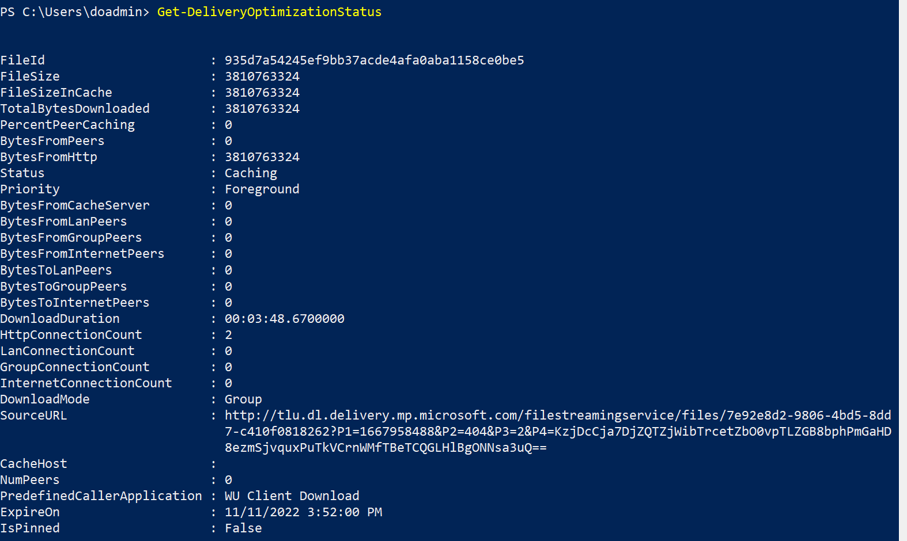

# Testing Delivery Optimization

## Overview

Delivery Optimization is a powerful and useful tool to help enterprises manage bandwidth usage for downloading Microsoft content. It's a solution designed to be used in large-scale environments with large numbers of devices, various content sizes, etc. Delivery Optimization is native to currently supported versions of Windows and provides default configuration to get the most out of the typical customer environment. Delivery Optimization is used to deliver many different types of content, so Microsoft customers enjoy the best possible download experience for their environment. There are three components to Delivery Optimization:

1. HTTP downloader.
1. Peer-to-peer (P2P) cloud technology.
1. Microsoft Connected Cache.

One of the most powerful advantages of using Delivery Optimization is the ability to fine-tune settings that empower users to dial in Microsoft content delivery to meet the needs of specific environments.

## Monitoring the Results

Since Delivery Optimization is on by default, you're able to monitor the value either through the Windows Settings for 'Delivery Optimization' using Delivery Optimization PowerShell [cmdlets.](waas-delivery-optimization-reference.md), and/or via the [Windows Update for Business Report](../update/wufb-reports-workbook.md) experience in Azure.

In the case where Delivery Optimization isn't working in your environment, it's important to investigate to get to the root of the problem. We recommend a test environment be created to easily evaluate typical devices to ensure Delivery Optimization is working properly. For starters, 'Scenario 1: Basic Setup' should be created to test the use of Delivery Optimization between two machines. This scenario is designed to eliminate any noise in the environment to ensure there's nothing preventing Delivery Optimization from working on the devices. Once you have a baseline, you can expand the test environment for more sophisticated tests.

## Expectations and Goals

The focus of the testing scenarios in this article is primarily centered on demonstrating the Delivery Optimization policies centered around the successful downloading of bytes using P2P. More specifically, the goal is to show peer to peer is working as expected, using the following criteria:

* Peers can find each other (for example on the same LAN / subnet / Group - matching your 'Download Mode' policy).
* Files are downloading in the expected 'Download Mode' policy setting (validates connectivity to DO cloud, HTTP, and local configs).
* At least some downloads happening via P2P (validates connectivity between peers).

Several elements that influence overall peering, using Delivery Optimization. The most common, impactful environment factors should be considered.

* **The number of files in the cache and** **the** **number of devices have a big effect on overall peering.** There's a set number of files available for peering at a time, from each client, so the peering device might not be serving a particular file.
* **File size** **and** **internet connection** **reliability matter.** There's a Delivery Optimization setting to determine the minimum file size to use P2P. In addition, an internet connection must be open and reliable enough to let the Delivery Optimization client make cloud service API calls and download metadata files before starting a file download.
* **Delivery Optimization Policies can play a role.** In general, it's important to familiarize yourself with the Delivery Optimization settings and defaults [Delivery Optimization reference - Windows Deployment | Microsoft Docs.](waas-delivery-optimization-reference.md).

### Delivery Optimization is a Hybrid P2P Platform

* Delivery Optimization's hybrid approach to downloading from multiple sources (HTTP and peer) in parallel is especially critical for large-scale environments, constantly assessing the optimal source from which to deliver the content. In conjunction, the distribution of content cache, across participating devices, contributes to Delivery Optimization's ability to find bandwidth savings as more peers become available.

* At the point a download is initiated, the Delivery Optimization client starts downloading from the HTTP source and discovering peers simultaneously. With a smaller file, most of the bytes could be downloaded from an HTTP source before connecting to a peer, even though peers are available. With a larger file and quality LAN peers, it might reduce the HTTP request rate to near zero, but only after making those initial requests from HTTP.

* In the next section, you'll see how the two testing scenarios produce differing results in the number of bytes coming from HTTP vs. peers. These scenarios show Delivery Optimization continuously evaluating the optimal location from which to download the content.

## Test Scenarios

### Scenario 1: Basic Setup

**Goal:**
Demonstrate how Delivery Optimization peer-to-peer technology works using two machines in a controlled test environment.

**Expected Results:**
Machine 1 will download zero bytes from peers and Machine 2 will download 50-99% from peers.

#### Test Machine Setup

|Setup Checklist| Value/Explanation
|--------|-------------------------------|
|Number of machines used| 2 |
|Virtual Machines/physical devices| 2 |
|Windows OS version | Windows 10 (21H2) and Windows 11 (21H2) |
|RAM | 8 GB |
|Disk size | 127 GB |
|Network | Connected to same network, one that is representative of the corporate network. |
|Pause Windows Updates | This controls the test environment so no other content is made available during the test, and potentially altering the outcome of the test. If there are problems and no peering happens, use 'Get-DeliveryOptimizationStatus' on the first machine to return a real-time list of the connected peers. |
|Ensure all Store apps are up to date | This helps prevent any new, unexpected updates to download during testing. |
|Delivery Optimization 'Download Mode' Policy | 2 (Group)(set on each machine) |
|Delivery Optimization 'GroupID' Policy | Set the *same* 'GUID' on each test machine. A GUID is a required value, which can be generated using PowerShell, '[[guid]::NewGuid().](https://devblogs.microsoft.com/scripting/powertip-create-a-new-guid-by-using-powershell/)'. |
|**Required on Windows 11 devices only** set Delivery Optimization 'Restrict Peer Selection' policy | 0-NAT (set on each machine). The default behavior in Windows 11 is set to '2-Local Peer Discovery'. For testing purposes, this needs to be scoped to the NAT. |

#### Test Instructions

The following set of instructions will be used for each machine:

1. Open PowerShell console as 'Administrator'.
   * Clear the DO cache: 'Delete-DeliveryOptimizationCache'.
   * Run 'Get-DeliveryOptimizationStatus'.

2. Open MS Store and search for 'Asphalt Legends 9'. Select *Get* to initiate the download of the content (content size: ~3.4 GB).

**On machine #1**

* Run 'Test Instructions'

  |Windows 10 | Windows 11 |
  |--------|-------------------------------|
  | :::image type="content" source="images/test-scenarios/win10/m1-basic-complete.png" alt-text="Windows 10 21H2 - Machine 1 - Basic Test." lightbox="images/test-scenarios/win10/m1-basic-complete.png"::: | :::image type="content" source="images/test-scenarios/win11/m1-basic-complete.png" alt-text="Windows 11 21H2 - Machine 1 - Basic Test." lightbox="images/test-scenarios/win11/m1-basic-complete.png":::|
  | **Observations** | |
  | - No peers were found on the first machine downloading the content. - 'TotalBytesDownloaded' is equal to the file size. - Status is set to 'Caching' the content so future peers can use it. - Download was happening in the foreground. - DownloadMode is set to 'Group' and no peers were found. - No distinct observations seen between Window 10 and Windows 11 devices. |

  *Wait 5 minutes*.

**On machine #2**

* Run 'Test Instructions'

  |Windows 10 | Windows 11 |
  |--------|--------------------------------|
  | :::image type="content" source="images/test-scenarios/win10/m2-basic-complete.png" alt-text="Windows 10 21H2 - Machine 2 - Basic Test." lightbox="images/test-scenarios/win10/m2-basic-complete.png"::: | :::image type="content" source="images/test-scenarios/win11/m2-basic-complete.png" alt-text="Windows 11 21H2 - Machine 2 - Basic Test." lightbox="images/test-scenarios/win11/m2-basic-complete.png":::|
  | **Observations** | **Observations** |
  | - A peer was found for the content and 87% of total bytes came from the peer.  - One peer was found for the piece of content, which is expected as there are only two devices in the peering group.  - Download mode was set to 'Group', but since group mode includes both LAN and Group devices, Delivery Optimization prioritizes LAN peers, if found. Therefore, 'BytesFromLanPeers' shows bytes where 'BytesFromGroupPeers' doesn't.  - 'DownloadDuration' is roughly the same between machines.| - A peer was found for the content and 90% of total bytes came from the peer.  -  All other points are the same as Windows 10 results. |

### Scenario 2: Advance Setup

**Goal:**

Demonstrate how Delivery Optimization peer-to-peer technology works in a non-controlled environment and expanding to three machines

**Expected Results:**

Machine 1 will download zero bytes from peers and Machine 2 will find peers and download 50-99% from peers. Machine 3 will find two peers and download 50-99% from peers.

#### Test Machine Setup

|Setup Checklist| Value/Explanation |
|--------|-------------------------------|
|Number of machines used| 3 |
|Virtual Machines| 3 |
|Windows OS version | Windows 10 (21H2) |
|RAM | 8 GB |
|Disk size | 127 GB |
|Network | Connected to same network, one that is representative of the corporate network. |
|Delivery Optimization 'Download Mode' Policy| 2 (Group)(set on each machine). |
|Delivery Optimization 'Group ID' Policy| Set the *same* 'GUID' on each test machine. A GUID is required value, which can be generated using PowerShell, '[guid]::NewGuid().](https://devblogs.microsoft.com/scripting/powertip-create-a-new-guid-by-using-powershell/)'. |
|Delivery Optimization 'Delay background download from http' Policy | 60 (set on each machine). |
|Delivery Optimization 'Delay foreground download from http Policy |60 (set on each machine). |

#### Testing Instructions

The following set of instructions will be used for each machine:

1. Clear the DO cache: 'Delete-DeliveryOptimizationCache'.
2. Open MS Store and search for 'Asphalt Legends 9'. Select *Get* to initiate the download of the content (content size: ~3.4 GB).
3. Open PowerShell console as Administrator. Run 'Get-DeliveryOptimizationStatus'.

**On machine #1:**

* Run 'Test Instructions'

  **Output: Windows 10 (21H2)**

  

**Observations**

  * The first download in the group of devices shows all bytes coming from HTTP, 'BytesFromHttp'.
  * Download is in the 'Foreground' because the Store app is doing the download and in the foreground on the device because it's initiated by the user in the Store app.
  * No peers are found.

  *Wait 5 minutes*.

**On machine #2:**

* Run 'Test Instructions'

  **Output** Windows 10 (21H2)

  

**Observations**

* 'PercentPeerCaching' is 99.8%
* There are still 'BytesFromHttp' source being used
* One peer was found
* All peering was done from device on the LAN, as shown with 'BytesFromLanPeers'

**On machine #3:**

* Run 'Test Instructions'

  **Output:** Windows 10 (21H2)

  

**Observations**

* 'PercentPeerCaching' is roughly the same as machine #2, at 99.7%.
* Now, two peers are found.
* Still downloading from HTTP source as seen with 'BytesFromHttp' value.

## Peer sourcing observations for all machines in the test group

The distributed nature of the Delivery Optimization technology is obvious when you rerun the 'Get-DeliveryOptimizationStatus' cmdlet on each of the test machines. For each, there's a new value populated for the 'BytesToLanPeers' field. This test demonstrates that as more peers become available, the requests to download bytes are distributed across the peering group and act as the source for the peering content. Each peer plays a role in servicing the other.

**Output:** Machine 1

'BytesToPeers' sourced from Machine 1 are '5704426044'. This represents the total number of bytes downloaded by the two peers in the group.

**Output:** Machine 2

'BytesToPeers' sourced from Machine 2 are '1899143740'. When there are two peers in the group with bytes available, notice that the distribution of bytes comes from either Machine 1 or Machine 2.

**Output:** Machine 3

'BytesToPeers' sourced from Machine 3 are '0'. This means that no other peers are downloading bytes from this peer, which is expected since it was the last machine in the group.

## Conclusion

Using Delivery Optimization can help make a significant impact in customer environments to optimize bandwidth. The peer-to-peer technology offers many configurations designed to be flexible for any organization. Delivery Optimization uses a distributed cache across different sources to ensure the most optimal download experience, while limiting the resources used on each device.

The testing scenarios found in this document help to show a controlled test environment, helping to prevent updates from interrupting the peering results. The other, a more real-world case, demonstrates how content available across peers will be used as the source of the content.

If there are issues found while testing, the Delivery Optimization PowerShell [cmdlets](waas-delivery-optimization-reference.md) can be a helpful tool to help explain what is happening in the environment.
