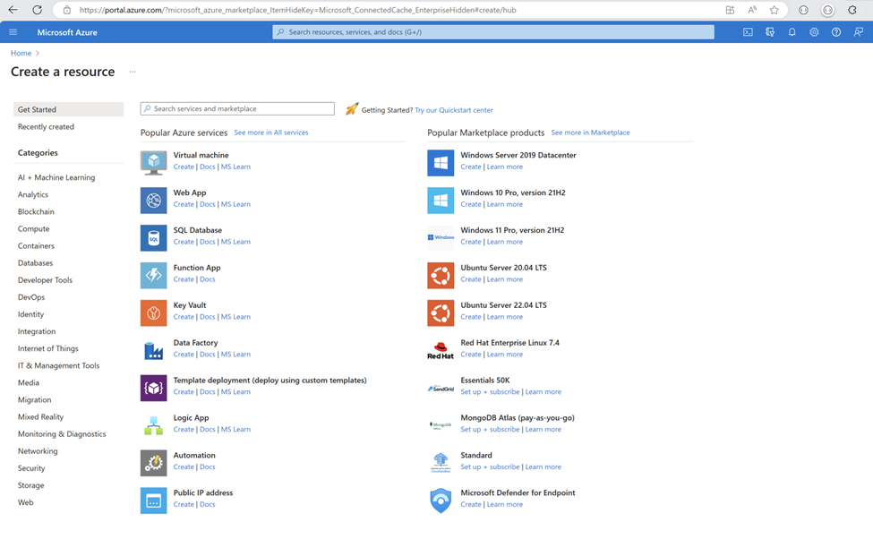
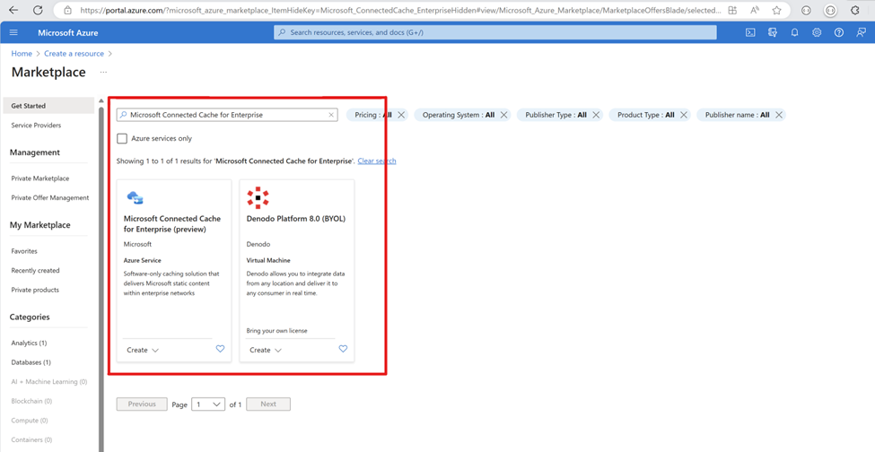
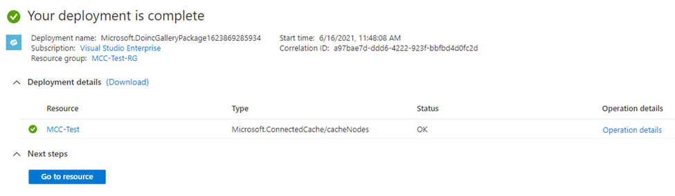
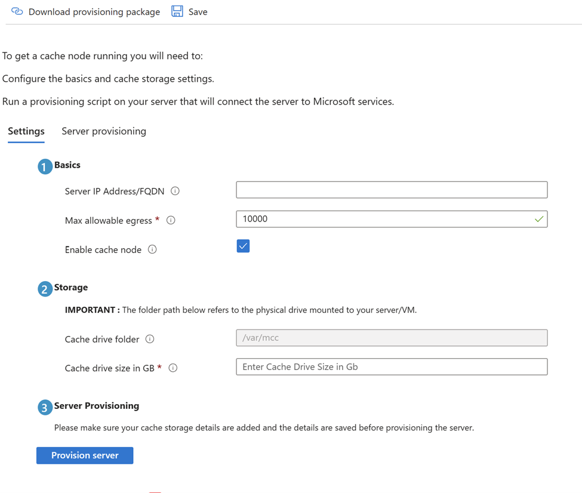

# Deploying your cache node

**Applies to**

- Windows 10
- Windows 11

## Create the Microsoft Connected Cache resource

1. Navigate to Azure portal by using the [following link](https://aka.ms/mcc-enterprise-preview): 
    > [!IMPORTANT]
    > You must access Azure portal using this link (https://aka.ms/mcc-enterprise-preview) in order to find the correct Microsoft Connected Cache resource.

    

1. In the search bar by **Get Started**, search for `Microsoft Connected Cache for Enterprise`.
    
1. Select **Create** to create your Microsoft Connected Cache resource. When prompted, choose the subscription, resource group, and location of your cache node. Also, enter a name for your cache node.
1. The creation of the cache node may take a few minutes. After a successful creation, you'll see a “Deployment complete” page as below. Select **Go to resource**.


## Create, provision, and deploy the cache node in Azure portal

To create, provision, and deploy the cache node in Azure portal, follow these steps:
1.	Open Azure portal and navigate to the Microsoft Connected Cache for Enterprise (preview) resource.
1.	Navigate to **Settings** > **Cache nodes** and select **Create Cache Node**.
1.	Provide a name for your cache node and select **Create** to create your cache node. 
1.	You may need to refresh to see the cache node. Select the cache node to configure it. 
1.	Fill out the Basics and Storage fields. Enter the cache drive size in GB - this has a minimum size of 50 GB.

    
Once complete, select **Save** at the top of the page and select **Provision server**.
1.	To deploy your cache node, download the installer by selecting **Download provisioning package**.
1.	Run the provided provisioning script - note that this is unique to each cache node. 

## Verify proper functioning MCC server

#### Verify client side

Connect to the EFLOW VM and check if MCC is properly running:

1. Open PowerShell as an Administrator.
2. Enter the following commands:

   ```powershell
   Connect-EflowVm
   sudo -s
   iotedge list
   ```

   :::image type="content" source="./images/ent-mcc-connect-eflowvm.png" alt-text="Screenshot of running connect-EflowVm, sudo -s, and iotedge list from PowerShell." lightbox="./images/ent-mcc-connect-eflowvm.png":::

You should see MCC, edgeAgent, and edgeHub running. If you see edgeAgent or edgeHub but not MCC, try this command in a few minutes. The MCC container can take a few minutes to deploy.

#### Verify server side

For a validation of properly functioning MCC, execute the following command in the EFLOW VM or any device in the network. Replace <CacheServerIP\> with the IP address of the cache server.

```powershell
wget [http://<CacheServerIP>/mscomtest/wuidt.gif?cacheHostOrigin=au.download.windowsupdate.com]
```

A successful test result will display a status code of 200 along with additional information.

:::image type="content" source="./images/ent-mcc-verify-server-ssh.png" alt-text="Screenshot of a successful wget with an SSH client." lightbox="./images/ent-mcc-verify-server-ssh.png":::

 :::image type="content" source="./images/ent-mcc-verify-server-powershell.png" alt-text="Screenshot of a successful wget using PowerShell." lightbox="./images/ent-mcc-verify-server-powershell.png":::

Similarly, enter the following URL from a browser in the network:

`http://<YourCacheServerIP>/mscomtest/wuidt.gif?cacheHostOrigin=au.download.windowsupdate.com`

If the test fails, see the [common issues](#common-issues) section for more information.

### Monitoring your metrics

To view the metrics associated with your cache nodes, navigate to the **Overview** > **Monitoring** tab within the Azure portal.

:::image type="content" source="./images/mcc-isp-metrics.png" alt-text="Screenshot of the Azure portal displaying the metrics view in the Overview tab.":::

You can choose to monitor the health and performance of all cache nodes or one at a time by using the dropdown menu. The **Egress bits per second** graph shows your inbound and outbound traffic of your cache nodes over time. You can change the time range (1 hour, 12 hours, 1 day, 7 days, 14 days, and 30 days) by selecting the time range of choice on the top bar.

If you're unable to view metrics for your cache node, it may be that your cache node is unhealthy, inactive, or hasn't been fully configured.


### Intune (or other management software) configuration for MCC

For an [Intune](/mem/intune/) deployment, create a **Configuration Profile** and include the Cache Host eFlow IP Address or FQDN:

:::image type="content" source="./images/ent-mcc-intune-do.png" alt-text="Screenshot of Intune showing the Delivery Optimization cache server host names.":::

## Common Issues

#### PowerShell issues

If you're seeing errors similar to this error: `The term Get-<Something> isn't recognized as the name of a cmdlet, function, script file, or operable program.`

1. Ensure you're running Windows PowerShell version 5.x.

1. Run \$PSVersionTable and ensure you're running version 5.x and *not version 6 or 7*.

1. Ensure you have Hyper-V enabled:

    **Windows 10:** [Enable Hyper-V on Windows 10](/virtualization/hyper-v-on-windows/quick-start/enable-hyper-v)

    **Windows Server:** [Install the Hyper-V role on Windows Server](/windows-server/virtualization/hyper-v/get-started/install-the-hyper-v-role-on-windows-server)

#### Verify Running MCC Container

Connect to the Connected Cache server and check the list of running IoT Edge modules using the following commands:

```bash
Connect-EflowVm
sudo iotedge list
```

:::image type="content" source="./images/ent-mcc-iotedge-list.png" alt-text="Screenshot of the iotedge list command." lightbox="./images/ent-mcc-iotedge-list.png":::

If edgeAgent and edgeHub containers are listed, but not "MCC", you may view the status of the IoT Edge security manager by using the command:

```bash
sudo journalctl -u iotedge -f
```

This command will provide the current status of the starting, stopping of a container, or the container pull and start.  

:::image type="content" source="./images/ent-mcc-journalctl.png" alt-text="Screenshot of the output from journalctl -u iotedge -f." lightbox="./images/ent-mcc-journalctl.png":::


> [!NOTE]
> You should consult the IoT Edge troubleshooting guide ([Common issues and resolutions for Azure IoT Edge](/azure/iot-edge/troubleshoot)) for any issues you may encounter configuring IoT Edge, but we've listed a few issues that we encountered during our internal validation.
