# Microsoft Connected Cache for Enterprises (private preview)

**Applies to**

- Windows 10
- Windows 11

## Overview

> [!IMPORTANT]
> Microsoft Connected Cache is currently a private preview feature. During this phase we invite customers to take part in early access for testing purposes. This phase does not include formal support, and should not be used for production workloads. For more information, see [Supplemental Terms of Use for Microsoft Azure Previews](https://azure.microsoft.com/support/legal/preview-supplemental-terms/).

Microsoft Connected Cache (MCC) preview is a software-only caching solution that delivers Microsoft content within Enterprise networks. MCC can be deployed to as many physical servers or VMs as needed, and is managed from a cloud portal. Cache nodes are created in the cloud portal and are configured by applying a [client policy](/mem/intune/configuration/delivery-optimization-settings.md#local-server-caching) using your management tool, such as Intune.

MCC is a hybrid (a mix of on-prem and cloud resources) SaaS solution built as an Azure IoT Edge module; it is a Docker compatible Linux container that is deployed to your Windows devices. IoT Edge for Linux on Windows (EFLOW) was chosen because it is a secure, reliable container management infrastructure. EFLOW is a Linux virtual machine, based on Microsoft's first party CBL-Mariner operating system. It’s built with the IoT Edge runtime and validated as a tier 1 supported environment for IoT Edge workloads. MCC will be a Linux IoT Edge module running on the Windows Host OS.

Even though your MCC scenario is not related to IoT, Azure IoT Edge is used as a more generic Linux container, deployment, and management infrastructure. The Azure IoT Edge runtime sits on your designated MCC device and performs management and communication operations. The runtime performs the following important functionsto manage MCC on your edge device: 

1. Installs and updates MCC on your edge device. 
2. Maintains Azure IoT Edge security standards on your edge device. 
3. Ensures that MCC is always running. 
4. Reports MCC health and usage to the cloud for remote monitoring.

To deploy a functional MCC to your device, you must obtain the necessary keys that will provision the Connected Cache instance to communicate with Delivery Optimization services and enable the device to cache and deliver content. See [figure 1](#fig1) below for a summary of the architecture of MCC, built using IoT Edge.

For more information about Azure IoT Edge, see [What is Azure IoT Edge](/azure/iot-edge/about-iot-edge).

## How MCC works

The following steps describe how MCC is provisioned and used.

1. The Azure Management Portal is used to create MCC nodes.
2. The MCC container is deployed and provisioned to a server using the installer provided in the portal.
3. Client policy is configured in your management solution to point to the IP address or FQDN of the cache server.
4. Microsoft end-user devices make range requests for content from the MCC node.
5. An MCC node pulls content from the CDN, seeds its local cache stored on disk, and delivers content to the client.
6. Subsequent requests from end-user devices for content come from the cache.

If an MCC node is unavailable, the client will pull content from CDN to ensure uninterrupted service for your subscribers.


<a id="fig1">Figure 1</a>: MCC processes. Each number in the diagram corresponds to the steps described above.

## Enterprise requirements for MCC

1. **Azure subscription**: MCC management portal is hosted within Azure and is used to create the Connected Cache [Azure resource](/azure/cloud-adoption-framework/govern/resource-consistency/resource-access-management.md) and IoT Hub resource – both are free services.

  You Azure subscription ID is first used to provision MCC services, and enable access to the preview. The MCC server requirement for an Azure subscription will cost you nothing. If you do not have an Azure subscription already, you can create an Azure [Pay-As-You-Go](https://azure.microsoft.com/offers/ms-azr-0003p/) account which requires a credit card for verification purposes. For more information, see the [Azure Free Account FAQ](https://azure.microsoft.com/free/free-account-faq/).

  The resources used for the preview and in the future when this product is ready for production will be completely free to you, like other caching solutions.

2. **Hardware to host MCC**: The recommended configuration will serve approximately 35000 managed devices, downloading a 2GB payload in 24-hour timeframe at a sustained rate of 6.5 Gbps.

  **EFLOW Requires Hyper-V support**
 - On Windows client, enable the Hyper-V feature
 - On Windows Server, install the Hyper-V role and create a default network switch

  Disk recommendations:
 - Using an SSD is recommended as cache read speed of SSD is superior to HDD

  NIC requirements:
 - Multiple NICs on a single MCC instance are not supported.
 - 1 Gbps NIC is the minimum speed recommended but any NIC is supported.
 - For best performance, NIC and BIOS should support SR-IOV

  VM networking:
 -  An external virtual switch to support outbound and inbound network communication (created during the installation process)

### Requirements summary:

|   | Branch Office / Small Enterprise | Large Enterprise |
| -- | --- | --- |
| OS|  Windows Server 2019*/2022 <br> Windows 10*/11 (Pro or Enterprise) with Hyper-V Support <br><br>* Windows 10 and Windows Server 2019 build 17763 or later | Same |
|NIC | 1 Gbps | 5 Gbps |
|Disk | SSD <br>1 drive <br>50GB each  |SSD <br>1 drive <br>200GB each  |
|Memory | 4GB | 8GB |
|Cores | 4 | 8  |

## Steps to set up MCC

Summary of steps required to deploy MCC to your server:

1.  [Provide Microsoft with the Azure subscription to use for MCC](#provide-microsoft-with-the-azure-subscription-id)
2.  [Create the MCC Resource in Azure](#create-the-mcc-resource-in-azure)
3.  [Create an MCC Node](#create-an-mcc-node-in-azure)
4.  [Edit Cache Node Information](#edit-cache-node-information)
5.  [Install MCC on a physical server or VM](#install-mcc-on-windows)
6.  [Verify proper functioning MCC server](#verify-proper-functioning-mcc-server)
7.  [Review common Issues](#common-issues) if needed.

For questions regarding these instructions contact [msconnectedcache@microsoft.com](mailto:msconnectedcache@microsoft.com)

## Provide Microsoft with the Azure Subscription ID

As part of the MCC preview onboarding process, an Azure subscription ID must be provided to Microsoft. 

> [!IMPORTANT]
> [contact Microsoft](mailto:mccforenterprise@microsoft.com?subject=[MCC%20for%20Enterprise]%20Please%20add%20our%20Azure%20subscription%20to%20the%20allow%20list) and provide this information if you have not already. You will not be able to proceed if you skip this step.

For information about creating or locating your subscription ID, see [Steps to obtain an Azure Subscription ID](#steps-to-obtain-an-azure-subscription-id).

## Create the MCC resource in Azure

The MCC Azure management portal is used to create and manage MCC nodes. An Azure Subscription ID is used to grant access to the preview and to create the MCC resource in Azure and Cache nodes.

### Use the following link and log in to Azure

<https://portal.azure.com/?microsoft_azure_marketplace_ItemHideKey=Microsoft_ConnectedCache_EntHidden>

1.  On the Azure Portal home page, Choose Create a resource  
    

2.  Type "Microsoft Connected Cache" into the search box and be sure to hit the
    Enter key to show search results.

    **NOTE:**

    **You will not see Microsoft Connected Cache in the drop down box, you need
    to type it and press enter to see the result**

3.  Select “Microsoft Connected Cache” and select “Create” on the next screen to
    start the process of creating the MCC resource.
    
    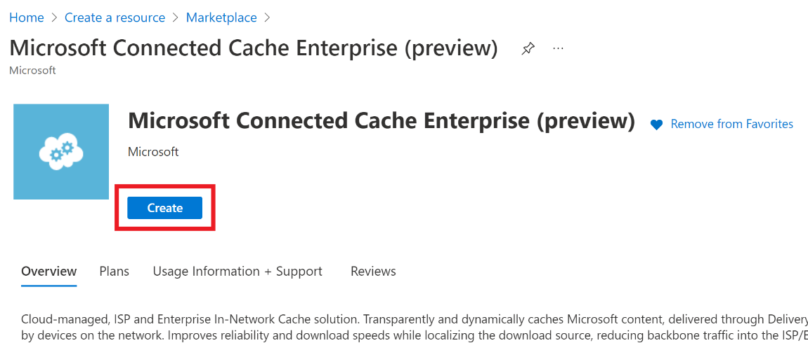


4.  Fill in the required fields to create the MCC
    resource.

    -   Choose the subscription provided to Microsoft.

    -   Azure resource groups are logical groups of resources. Create a new
        resource group and choose a name for your resource group.

    -   Choose “(US) **West US**” for the location of the resource. This choice
        will not impact MCC if the physical location is
        not in the West US, it is just a limitation of the preview.

        **NOTE:**

        **Your MCC resource will not be created properly if you do not select
        “(US) West US”**

    -   Choose a name for the MCC resource.

  > [!NOTE]
  > Your MCC resource must not contain the word “Microsoft” in it.

&nbsp;&nbsp;&nbsp;&nbsp;&nbsp;&nbsp;&nbsp;&nbsp;&nbsp;&nbsp;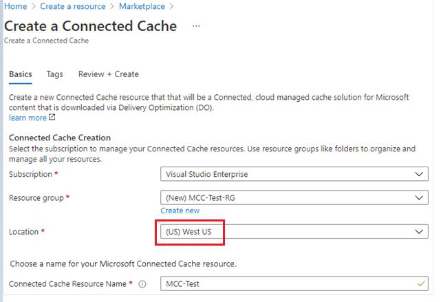


5.  Once all the information has been entered, click on the “Review + Create”
    button. Once validation is complete, click the “Create” button to start the
    resource creation.  
    


### Error: Validation failed

-   If you get a Validation failed error message on your portal, it is likely
    because you selected the Location as US West 2 or another location.

-   To bypass this error, navigate to the previous step and choose (US) West US.

    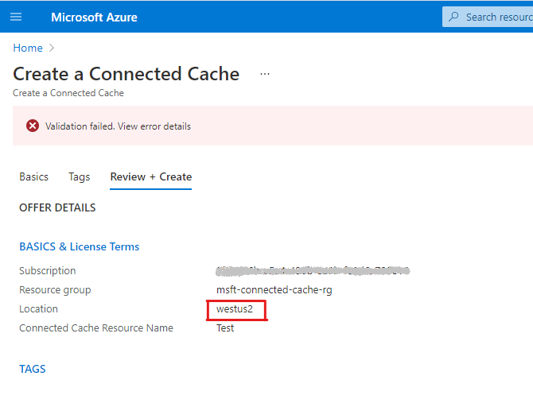


## Create an MCC node in Azure

Creating a MCC node is a multi-step process and the first step is to access the MCC private preview management portal.

1.  After the successful resource creation click on the "Go to resource".

2.  Under Cache Node Management section on the leftmost panel, click on Cache Nodes.

    


3.  On the Cache Nodes blade, click on the Create Cache Node button.

    


4.  Clicking the Create Cache Node button will open the Create Cache Node page, Cache Node Name is the only field required for cache node creation.

| **Field Name**      | **Expected Value**                         | **Description**                                                                                                                      |
|---------------------|--------------------------------------------|--------------------------------------------------------------------------------------------------------------------------------------|
| **Cache Node Name** | Alphanumeric name that includes no spaces. | The name of the cache node. You may choose names based on location like Seattle-1. This name must be unique cannot be changed later. |

5.  Enter the information for the Cache Node and click on the Create button.


If there are errors, the form will provide guidance on how to correct the
errors.

Once the MCC node has been created, the installer instructions will be exposed. More details on the installer instructions will be addressed later in this doc can be found at the [Install Connected Cache](#install-mcc-on-windows) section.

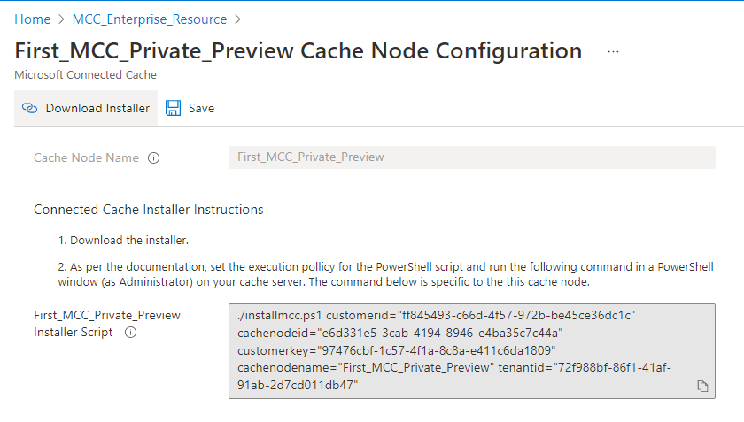

### Edit cache node information

Cache nodes can be deleted here by clicking the check box to the left of a Cache Node Name and then clicking the delete toolbar item. Be aware that if a cache node is deleted, there is no way to recover the cache node or any of the information related to the cache node.


## Install MCC on Windows

Installing MCC on your Windows machine is a
straightforward process. A PowerShell script performs the following tasks:

-   Installs the Azure CLI
-   Downloads, Installs, and Deploys EFLOW
-   Enables Microsoft Update so EFLOW can stay up to date
-   Creates a Virtual Machine
-   Enables the firewall and opens ports 80 and 22 for inbound and outbound
    traffic. Port 80 is used by MCC and port 22 is used
    for SSH communications.
-   Configures Connected Cache tuning settings.
-   Creates the necessary *FREE* Azure resource - IoT Hub/IoT Edge.
-   Deploys the MCC container to server.

### Run the installer

1.  Download and unzip mccinstaller.zip from the create cache node page or cache node configuration page which contains the necessary installation files

  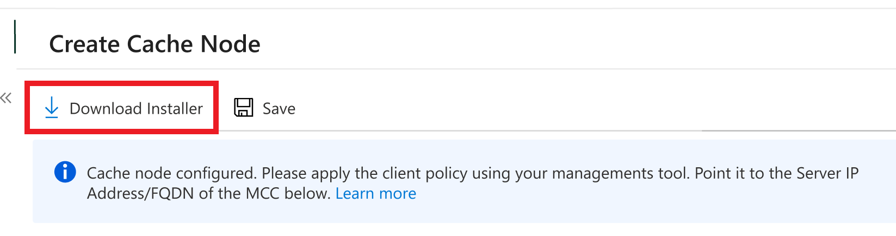

Files contained in the mccinstaller.zip file:

-   installmcc.ps1: Main installer file.
-   installEflow.ps1: Installs the necessary prerequisites such as the Linux VM, IoT Edge runtime, and Docker, and makes necessary host OS settings to optimize caching performance.
-   resourceDeploymentForConnectedCache.ps1: Creates Azure cloud resources required to support MCC control plane.
-   mccdeployment.json: Deployment manifest used by IoT Edge to deploy the MCC container and configure settings on the container, such as cache drive location sizes.
-   updatemcc.ps1: The update script used to upgrade MCC to a particular version.
-   mccupdate.json: Used as part of the update script

1.  Open Windows PowerShell as administrator and navigate to the location of these files.

> [!NOTE]
> Ensure that Hyper-V is enabled on your device.
> Do not use PowerShell ISE, PowerShell 6.x, or PowerShell 7.x. Only Windows PowerShell version 5.x is supported.

**Windows 10:** [Enable Hyper-V on Windows 10](/virtualization/hyper-v-on-windows/quick-start/enable-hyper-v)

**Windows Server:** [Install the Hyper-V role on Windows Server](/windows-server/virtualization/hyper-v/get-started/install-the-hyper-v-role-on-windows-server)

### If you are installing MCC on a local virtual machine:

1. Enable Nested Virtualization

Set -VMProcessor -VMName **\<"VM name"\>** -ExposeVirtualizationExtensions \$true

2. Enable Mac Spoofing

  Get-VMNetworkAdapter -VMName **\<"VM name"\>**\| Set-VMNetworkAdapter \-MacAddressSpoofing On

  **Virtual machine should be in the OFF state while enabling Nested Virtualization and Mac Spoofing**

3.  Set the execution policy

    Set-ExecutionPolicy -ExecutionPolicy Unrestricted -Scope Process

    **NOTE:**

    After setting the execution policy, you will see the following message: **Execution Policy Change**. Select **\[A\] Yes to all** to proceed.

    The execution policy helps protect you from scripts that you do not trust.
    
    Changing the execution policy might expose you to the security risks described in the about_Execution_Policies help topic at https:/go.microsoft.com/fwlink/?LinkID=135170. Do you want to change the  execution policy?

    [Y] Yes **[A] Yes to All** [N] No [L] No to All [S] Suspend [?] Help
    (default is "N"):

4.  Copy the command from the portal and run it in Windows PowerShell

    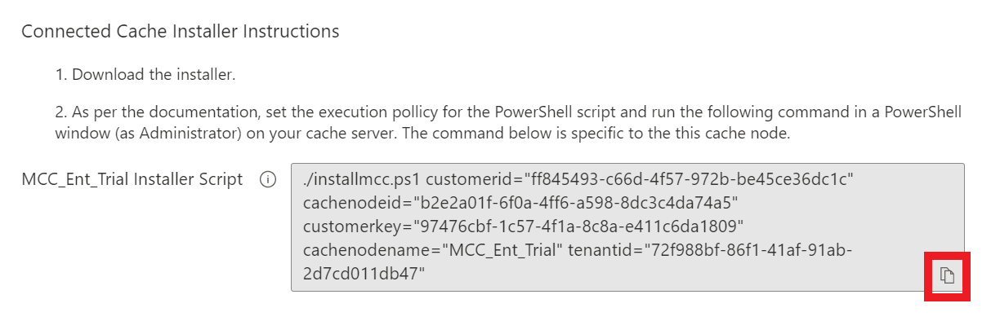

    **NOTE:**

    After running the command, and multiple times throughout the installation process, you will receive the following notice. Please select [R] Run once to proceed.

    Security warning

    Run only scripts that you trust. While scripts from the internet can be useful, this script can potentially harm your computer. If you trust this script, use the Unblock-File cmdlet to allow the script to run without this warning message. Do you want to run
    C:\\Users\\mccinstaller\\Eflow\\installmcc.ps1?

    [D] Do not run **[R] Run once** [S] Suspend [?] Help (default is "D"):

3.  Choose whether you would like to create a new virtual switch or select an existing one. Name your switch and select the Net Adapter to use for the switch. A computer restart will be required if you are creating a new switch.

    **NOTE:**

    Restarting your computer after creating a switch is recommended. You will notice network delays during installation if the computer has not been restarted.

    If you restarted your computer after creating a switch, start from Step 2 above and skip step 5.


  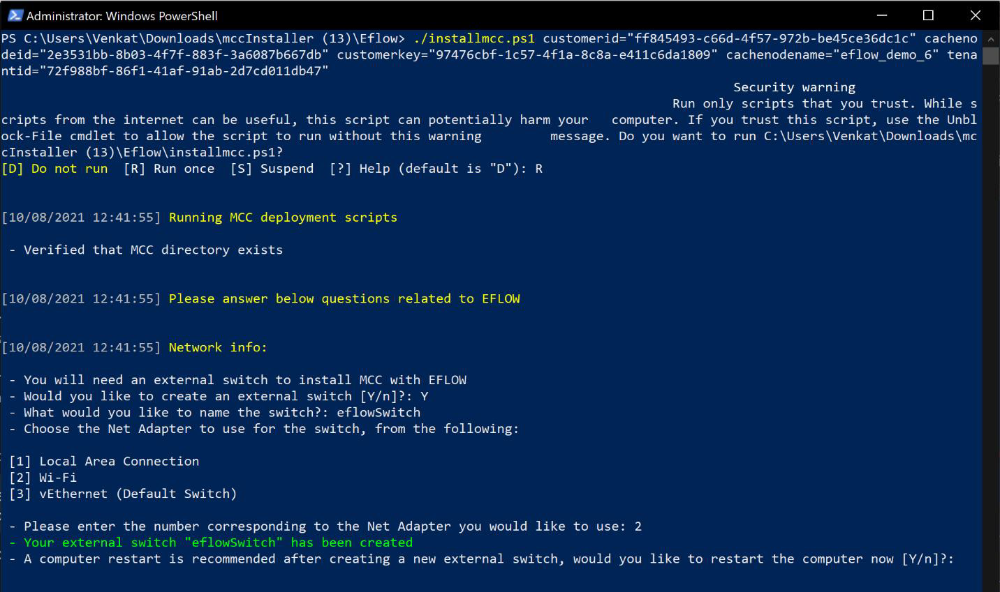

4.  Re-run the script after the restart. This time, select “No” when asked to create a new switch. Enter the number corresponding to the switch you previously created.


  

5.  Decide whether you would like to use dynamic or static address for the Eflow VM


  


 > [!NOTE]
 > Choosing a dynamic IP address might assign a different IP address when the MCC restarts.
 > A static IP address is recommended so you do not have to change this value in your management solution when MCC restarts.

6.  Choose where you would like to download, install, and store the virtual hard disk for EFLOW. You will also be asked how much memory, storage, and cores you would like to allocate for the VM. In this example, we chose the default values for all prompts

7.  Follow the Azure Device Login link and sign into the Azure Portal


  

8.  If this is your first MCC deployment, please select ‘n’ so that we can create a new IoT Hub. If you have already configured MCC before, we want to group your MCCs in the same IoT Hub, select “y”.

    1.  You will be shown a list of existing IoT Hubs in your Azure Subscription, enter the number corresponding to the IoT Hub to select it. (You will likely have only 1 IoT Hub in your subscription, in which case you want to enter “1”)

  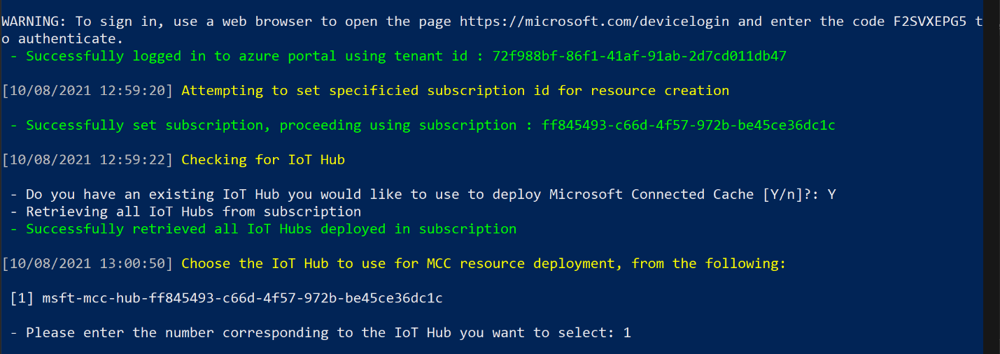
  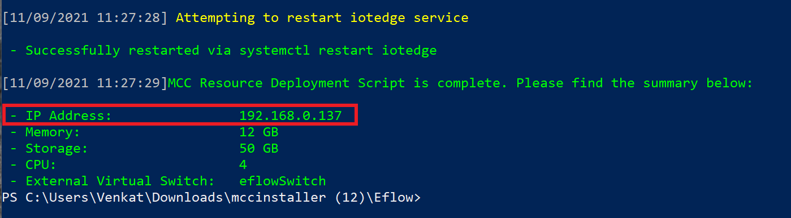

9.  Your MCC deployment is now complete

    1.  If you do not see any errors, please continue to the next section to validate your MCC deployment
    2.  After validating your MCC is properly functional, please review your management solution documentation, such as [Intune](/mem/intune/configuration/delivery-optimization-windows), to set the cache host policy to the IP address of your MCC.
    3.  If you had errors during your deployment, visit the [Troubleshooting](#troubleshooting) section in this document

## Verify proper functioning MCC server

### Verify Client Side

Let’s connect to the EFLOW VM and check if MCC is properly running

1.  Open PowerShell as an Administrator
2.  Enter the following commands:

```
Connect-EflowVm
sudo -s
iotedge list
```


You should see MCC, edgeAgent, and edgeHub running. If you see edgeAgent or edgeHub but not MCC, please try this command in a few minutes. The MCC container can take a few minutes to deploy

### Verify server side

For a validation of properly functioning MCC, execute the following command in the EFLOW VM or any device in the network. Replace \<CacheServerIP\> with the IP address of the cache server.

```
wget [http://\<CacheServerIP\>/mscomtest/wuidt.gif?cacheHostOrigin=au.download.windowsupdate.com]()
```

A successful test result will look like this:


OR

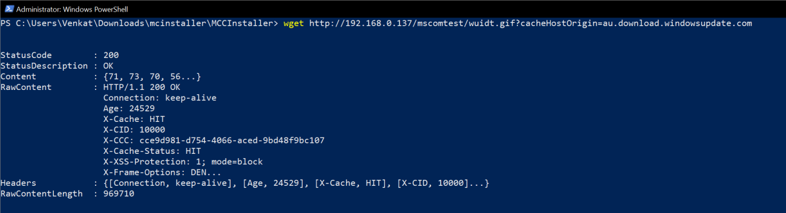

Similarly, enter this URL from a browser in the network:

[http://YourCacheServerIP/mscomtest/wuidt.gif?cacheHostOrigin=au.download.windowsupdate.com]()

If the test fails, see the common issues section for more information.

## Intune (or other management software) configuration for MCC

Example of setting the cache host policy to the MCC’s IP address / FQDN:


## Common Issues

##### PowerShell issues

If you are seeing errors similar to this: “The term ‘Get-Something’ is not recognized as the name of a cmdlet, function, script file, or operable program.”

1.  Ensure you are running Windows PowerShell version 5.x.

2.  Run \$PSVersionTable and ensure you’re running version 5.x and *not version 6 or 7*.

3.  Ensure you have Hyper-V enabled:

    **Windows 10:** [Enable Hyper-V on Windows 10](/virtualization/hyper-v-on-windows/quick-start/enable-hyper-v)

    **Windows Server:** [Install the Hyper-V role on Windows Server](/windows-server/virtualization/hyper-v/get-started/install-the-hyper-v-role-on-windows-server)

##### Verify Running MCC Container

Connect to the Connected Cache server and check the list of running IoT Edge modules using the following commands:

Connect-EflowVm

sudo iotedge list​


If edgeAgent and edgeHub containers are listed, but not “MCC”, you may view the status of the IoTEdge security manager using the command:

sudo journalctl -u iotedge -f

For example, this command will provide the current status of the starting, stopping of a container, or the container pull and start as is shown in the sample below:  


Use this command to check the IoT Edge Journal

sudo journalctl -u iotedge –f

Please note: You should consult the IoT Edge troubleshooting guide ([Common issues and resolutions for Azure IoT Edge](/azure/iot-edge/troubleshoot)) for any issues you may encounter configuring IoT Edge, but we have listed a few issues below that we hit during our internal validation.

## Diagnostics Script

If you are having issues with your MCC, we included a diagnostics script which will collect all your logs and zip them into a single file. You can then send us these logs via email for the MCC team to debug.

To run this script:

1.  Navigate to the following folder in the MCC installation files:

    mccinstaller \> Eflow \> Diagnostics

2.  Run the following commands:

    "Set-ExecutionPolicy -ExecutionPolicy Unrestricted -Scope Process"

    .\collectMccDiagnostics.ps1

3.  The script stores all the debug files into a folder and then creates a tar file. After the script is finished running, it will output the path of the tar file which you can share with us (should be
    “**\<currentpath\>**\\mccdiagnostics\\support_bundle_\$timestamp.tar.gz”)

4.  [Email the MCC team](mailto:mccforenterprise@microsoft.com?subject=Debugging%20Help%20Needed%20for%20MCC%20for%20Enterprise) and attach this file asking for debugging support. Screenshots of the error along with any other warnings you saw will be helpful during out debugging process.

## Update MCC

Throughout the private preview phase, we will send you security and feature updates for MCC. Please follow these steps to perform the update.

Run the following command with the **arguments** we provided in the email to update your MCC:

```
# .\updatemcc.ps1 version="**\<VERSION\>**" tenantid="**\<TENANTID\>**" customerid="**\<CUSTOMERID\>**" cachenodeid="**\<CACHENODEID\>**" customerkey="**\<CUSTOMERKEY\>**"
```
For example:
```
# .\updatemcc.ps1 version="msconnectedcacheprod.azurecr.io/mcc/linux/iot/mcc-ubuntu-iot-amd64:1.2.1.659" tenantid="72f988bf-86f1-41af-91ab-2d7cd011db47" customerid="99d897gg-86f1-41af-91ab-4jau6ske0sdf" cachenodeid=" cd01sdfh-435n-0das-56gh90dfrt67 " customerkey="h90d234f-vbnm-lk43-0742khsd45hj”
```
## Uninstall MCC

Please contact the MCC Team before uninstalling to let us know if you are facing
issues.

This script will remove the following:

1.  EFLOW + Linux VM
2.  IoT Edge
3.  Edge Agent
4.  Edge Hub
5.  MCC
6.  Moby CLI
7.  Moby Engine

To delete MCC, go to Control Panel \> Uninstall a program \> Select Azure IoT
Edge LTS \> Uninstall

## Appendix

### Steps to obtain an Azure Subscription ID

1. Sign in to https://portal.azure.com/ and navigate to the Azure services section.
2. Click on **Subscriptions**. If you do not see **Subscriptions**, click on the **More Services** arrow and search for **Subscriptions**. 
3. If you already have an Azure Subscription, skip to step 5. If you do not have an Azure Subscription, select **+ Add** on the top left. 
4. Select the **Pay-As-You-Go** subscription. You will be asked to enter credit card information, but you will not be charged for using the MCC service. 
5. On the **Subscriptions** blade, you will find details about your current subscription. Click on the subscription name. 
6. After you select the subscription name, you will find the subscription ID in the **Overview** tab. Click on the **Copy to clipboard** icon next to your Subscription ID to copy the value. 

#### Troubleshooting

If you’re not able to sign up for a Microsoft Azure subscription with the error: **Account belongs to a directory that cannot be associated with an Azure subscription. Please sign in with a different account.** See [Can't sign up for a Microsoft Azure subscription](/troubleshoot/azure/general/cannot-sign-up-subscription). 

Also see [Troubleshoot issues when you sign up for a new account in the Azure portal](/azure/cost-management-billing/manage/troubleshoot-azure-sign-up).

### IoT Edge runtime

The Azure IoT Edge runtime enables custom and cloud logic on IoT Edge devices.
The runtime sits on the IoT Edge device, and performs management and
communication operations. The runtime performs several functions:

-   Installs and update workloads (Docker containers) on the device.
-   Maintains Azure IoT Edge security standards on the device.
-   Ensures that IoT Edge modules (Docker containers) are always running.
-   Reports module (Docker containers) health to the cloud for remote monitoring.
-   Manages communication between an IoT Edge device and the cloud.

For more information on Azure IoT Edge, please see the [Azure IoT Edge documentation](/azure/iot-edge/about-iot-edge).

### EFLOW

[What is Azure IoT Edge for Linux on Windows \| Microsoft
Docs](https://docs.microsoft.com/azure/iot-edge/iot-edge-for-linux-on-windows?view=iotedge-2018-06&preserve-view=true)

[Install Azure IoT Edge for Linux on Windows \| Microsoft
Docs](https://docs.microsoft.com/azure/iot-edge/how-to-provision-single-device-linux-on-windows-symmetric?view=iotedge-2018-06&tabs=azure-portal%2Cpowershell#install-iot-edge)

[PowerShell functions for Azure IoT Edge for Linux on Windows \| Microsoft
Docs](https://docs.microsoft.com/azure/iot-edge/reference-iot-edge-for-linux-on-windows-functions?view=iotedge-2018-06)

EFLOW FAQ and Support: [Support · Azure/iotedge-eflow Wiki
(github.com)](https://github.com/Azure/iotedge-eflow/wiki/Support#how-can-i-apply-updates-to-eflow)

[Now ready for Production: Linux IoT Edge Modules on Windows -
YouTube](https://www.youtube.com/watch?v=pgqVCg6cxVU&ab_channel=MicrosoftIoTDevelopers)

### Routing local Windows Clients to an MCC

#### Get the IP address of your MCC using ifconfig

There are multiple methods that can be used to apply a policy to PCs that should participate in downloading from the MCC.

##### Registry Key

You can either set your MCC IP address or FQDN using:

1.  Registry Key in 1709 and higher -  
    [HKEY_LOCAL_MACHINE\\SOFTWARE\\Policies\\Microsoft\\Windows\\DeliveryOptimization]
    "DOCacheHost"=" "  
    
    From an elevated PowerShell or command shell:  
    reg add
    "HKEY_LOCAL_MACHINE\\SOFTWARE\\Policies\\Microsoft\\Windows\\DeliveryOptimization"
    /v DOCacheHost /t REG_SZ /d "10.137.187.38" /f

1.  MDM Path in 1809 or higher-
    .Vendor/MSFT/Policy/Config/DeliveryOptimization/DOCacheHost

2.  In build 1809 (RS5) and higher you can apply the policy via Group Policy Editor. The policy to apply is **DOCacheHost**. To configure the clients to pull content from the MCC by Group Policy setting the Cache Server Hostname (Setting found under Computer Configuration, Administrative Templates, Windows Components, Delivery Optimization) to the IP address of your MCC For example 10.137.187.38.

  

**Verify Content using the DO Client**

To verify that Delivery Optimization client can download content using Microsoft Connected Cache you can execute the following steps:

1.  Download a game or application from the Microsoft Store.   

  

2.  Verify downloads came from MCC by one of two methods

    1.  Using PowerShell Cmdlet Get-DeliveryOptimizationStatus you should see BytesFromCacheServer test  

  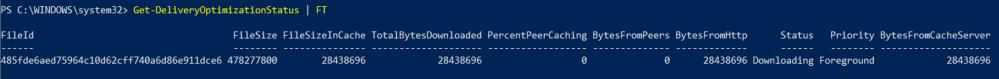

    2.  Looking at the Delivery Optimization Activity Monitor

  
