# MCC for Internet Service Providers

**Applies to**

- Windows 10
- Windows 11

## Overview

> [!IMPORTANT]
> Microsoft Connected Cache is currently a private preview feature. During this phase we invite customers to take part in early access for testing purposes. This phase does not include formal support, and should not be used for production workloads. For more information, see [Supplemental Terms of Use for Microsoft Azure Previews](https://azure.microsoft.com/support/legal/preview-supplemental-terms/).

Microsoft Connected Cache (MCC) preview is a software-only caching solution that delivers Microsoft content within Enterprise networks. MCC can be deployed to as many physical servers or VMs as needed, and is managed from a cloud portal. Microsoft cloud services handle routing of consumer devices to the cache server for content downloads.

MCC is a hybrid (a mix of on-prem and cloud resources) SaaS solution built as an Azure IoT Edge module; it is a Docker compatible Linux container that is deployed to your Windows devices. IoT Edge for Linux on Windows (EFLOW) was chosen because it is a secure, reliable container management infrastructure. EFLOW is a Linux virtual machine, based on Microsoft's first party CBL-Mariner operating system. It’s built with the IoT Edge runtime and validated as a tier 1 supported environment for IoT Edge workloads. MCC will be a Linux IoT Edge module running on the Windows Host OS. Azure IoT Edge consists of three components that the MCC infrastructure will utilize:

1. A cloud-based interface that enables secure, remote installation, monitoring, and management of MCC nodes.
2. A runtime that securely manages the modules deployed to each device.
3. Modules/containers that run the MCC functionality on your device.

## How MCC works

The following steps describe how MCC is provisioned and used.

1. The Azure Management Portal used to create and manage MCC nodes.
2. The MCC container is deployed and provisioned to the server.
3. The Azure Management Portal is used to configure Microsoft Delivery Optimization Services to route traffic to the MCC server by providing two pieces of information:
    - The publicly accessible IPv4 address of the server hosting the MCC container.
    - The CIDR blocks that represent the client IP address space, which should be routed to the MCC node.
4. Microsoft end-user devices periodically connect with Microsoft Delivery Optimization Services, and the services match the IP address of the client with the IP address of the corresponding MCC node.
5. Microsoft end-user devices make the range requests for content from the MCC node.
6. An MCC node pulls content from the CDN, seeds its local cache stored on disk, and delivers the content to the client.
7. Subsequent requests from end-user devices for content will now come from cache.
8. If the MCC node is unavailable, the client will pull content from CDN to ensure uninterrupted service for your subscribers.

    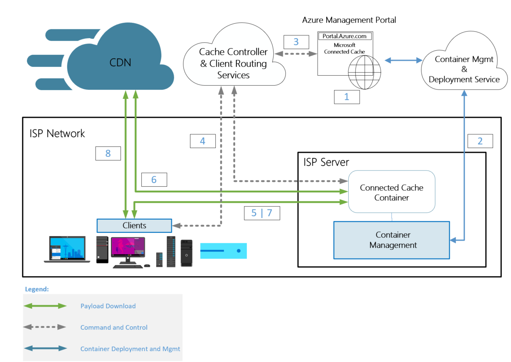

## ISP Requirements for MCC

1. **Azure subscription**: The MCC management portal is hosted within Azure, and is used to create the Connected Cache Azure resource and IoT Hub resource. Both are free services.

    Your Azure subscription ID is first used to provision MCC services, and enable access to the preview. The MCC server requirement for an Azure subscription will cost you nothing. If you do not have an Azure subscription already, you can create an Azure [Pay-As-You-Go](https://azure.microsoft.com/offers/ms-azr-0003p/) account which requires a credit card for verification purposes. For more information, see the [Azure Free Account FAQ](https://azure.microsoft.com/free/free-account-faq/).

    The resources used for the preview, and in the future when this product is ready for production, will be completely free to you - like other caching solutions. 
    
    > [!NOTE]
    > If you request Exchange or Public peering in the future, business email addresses must be used to register ASN's, because Microsoft does not accept gmail or other non-business email addresses.

2. **Hardware to host MCC**: The recommended configuration will serve approximately 35,000 consumer devices, downloading a 2GB payload in 24-hour timeframe at a sustained rate of 6.5 Gbps.

Disk requirements:
- SSDs are recommended due to improved cache read speeds of SSD, compared to HDD.
- Using multiple disks is recommended to improve cache performance.
- RAID disk configurations are discouraged because cache performance will be impacted. If you are using RAID disk configurations, ensure striping.
- The maximum number of disks supported is 10.

NIC requirements:
- Multiple NICs on a single MCC instance are not supported.
- 10Gbps NIC is the minimum speed recommended, but any NIC is supported.

### Sizing recommendations

|   | Minimum | Recommended |
| -- | --- | --- |
| OS|  Ubuntu 20.04 LTS VM or physical server | Ubuntu 20.04 LTS VM or physical server (preferred) |
|NIC | 10 Gbps| at least 10 Gbps |
|Disk | SSD <br>1 drive <br>2TB each  |SSD <br>2-4 drives <br>at least 2TB each  |
|Memory | 8GB | 32GB or greater |
|Cores | 4 | 8 or more  |

## Steps to deploy MCC

To deploy MCC:

1. [Provide Microsoft with the Azure subscription ID](#provide-microsoft-with-the-azure-subscription-id)
2. [Create the MCC Resource in Azure](#create-the-mcc-resource-in-azure)
3. [Create an MCC Node](#create-an-mcc-node-in-azure)
    - IP address space approval information is required 
4. [Edit Cache Node Information](#edit-cache-node-information)
5. [Set up your server](#set-up-your-server)
6. [Install MCC on a physical server or VM](#install-mcc-on-windows)
7. [Verify proper functioning MCC server](#verify-proper-functioning-mcc-server)
8. [Review the MCC summary report](#review-the-mcc-summary-report) 
9. [Review common Issues](#common-issues) if needed.

For questions regarding these instructions contact [msconnectedcache@microsoft.com](mailto:msconnectedcache@microsoft.com)

## Provide Microsoft with the Azure Subscription ID

As part of the MCC preview onboarding process an Azure subscription ID must be provided to Microsoft.

> [!IMPORTANT]
> [Contact Microsoft](mailto:mccforenterprise@microsoft.com?subject=[MCC%20for%20Enterprise]%20Please%20add%20our%20Azure%20subscription%20to%20the%20allow%20list) and provide your Azure subscription ID if you have not already. You will not be able to proceed if you skip this step.


For information about creating or locating your subscription ID, see [Steps to obtain an Azure Subscription ID](#steps-to-obtain-an-azure-subscription-id).

### Create the MCC resource in Azure

The MCC Azure management portal is used to create and manage MCC nodes. An Azure Subscription ID is used to grant access to the preview and to create the MCC resource in Azure and Cache nodes.

Use the following link to sign in to Azure: <https://portal.azure.com/?microsoft_azure_marketplace_ItemHideKey=Microsoft_ConnectedCache_EntHidden>

1. Choose **Create a resource**  

    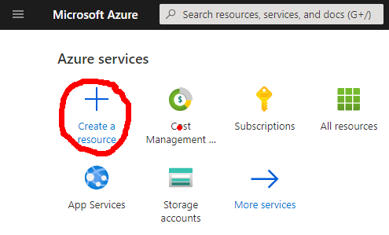

2. Type **Microsoft Connected Cache** into the search box, and hit **Enter** to show search results.

3.  Select **Microsoft Connected Cache** and choose **Create** on the next screen to start the process of creating the MCC resource.

    
    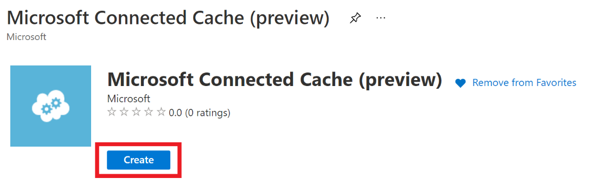

4.  Fill in the required fields to create the MCC resource.

    -   Choose the subscription that you provided to Microsoft.
    -   Azure resource groups are logical groups of resources. Create a new resource group and choose a name for your resource group.
    -   Choose **(US) West US**” for the location of the resource. This choice will not impact MCC if the physical location is not in the West US, it is just a limitation of the preview.

       > [!NOTE]
       > Your MCC resource will not be created properly if you do not select **(US) West US**

    -   Choose a name for the MCC resource.

        

5.  Once all the information has been entered, click the **Review + Create** button. Once validation is complete, click the **Create** button to start the
    resource creation.

    

#### Error: Validation failed

-   If you get a Validation failed error message on your portal, it is likely because you selected the **Location** as **US West 2** or some other location that is not **(US) West US**.
-   To resolve this error, go to the previous step and choose **(US) West US**.

    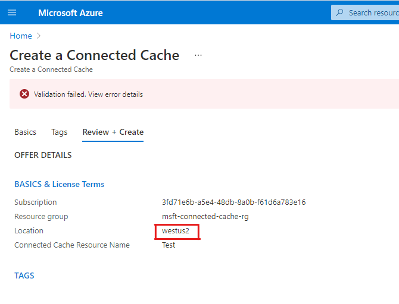

### Create an MCC node in Azure

Creating a MCC node is a multi-step process and the first step is to access the MCC private preview management portal.

1.  After the successful resource creation click on the **Go to resource**.
2.  Under **Cache Node Management** section on the leftmost panel, click on **Cache Nodes**.

    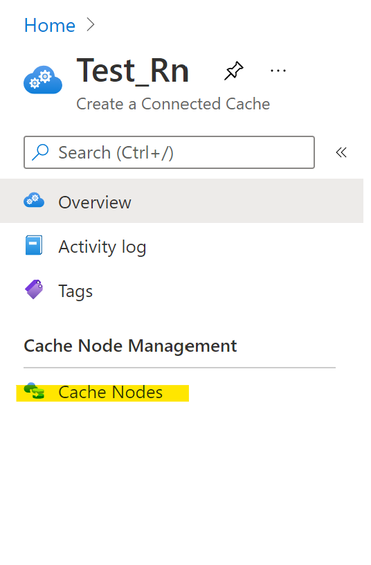

3.  On the **Cache Nodes** blade, click on the **Create Cache Node** button.

    

4.  Clicking the **Create Cache Node** button will open the **Create Cache Node** page; **Cache Node Name** is the only field required for cache node creation.

| **Field Name**                | **Expected Value**                         | **Description**                                                                                                                                                                                         |
|-------------------------------|--------------------------------------------|---------------------------------------------------------------------------------------------------------------------------------------------------------------------------------------------------------|
| **Cache Node Name**           | Alphanumeric name that includes no spaces. | The name of the cache node. You may choose names based on location like Seattle-1. This name must be unique cannot be changed later.                                                                    |
| **Server II Address**         | Ipv4 Address                               | IP address of your MCC server. This is used to route end-user devices in your network to the server for Microsoft content downloads. **The IP address must be publicly accessible.** |
| **Address Range/CIDR Blocks** | IPv4 CIDR notation                         | IP Address range/CIDR blocks that should be routed to the MCC server as a comma separated list. For example: 2.21.234.0/24 , 3.22.235.0/24 , 4.23.236.0/24                        |
| **Enable Cache Node**         | Enable/Disable Radio Button                | **Enable** permits the cache node to receive content requests. <br>**Disable** prevents the cache node from receiving content requests. <br>Cache nodes are enabled by default.          |

  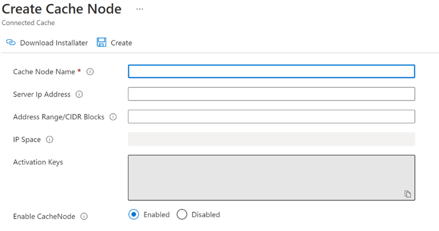

Hovering on the info  next to
each field will populate the details of that field.

  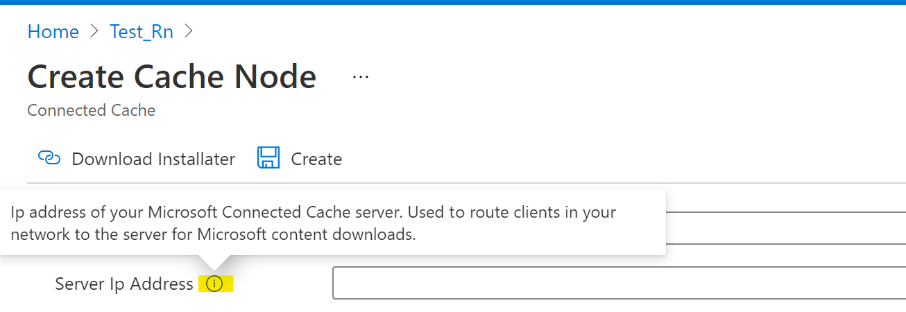

There are two other read-only fields on this page that are populated after the cache node is created:

| **Field Name**      | **Description**                                                                                                                                                          |
|---------------------|--------------------------------------------------------------------------------------------------------------------------------------------------------------------------|
| **IP Space**        | Number of IP addresses that will be routed to your cache server.                                                                                                        |
| **Activation Keys** | Set of keys to activate your cache node with the MCC services. Copy the keys for use during install. The CustomerID is your Azure subscripiton ID. |

5.  Enter the information for the Cache Node and click on the Create button. In the screenshot below only the Cache Node Name is provided, but all information can be included if desired.

    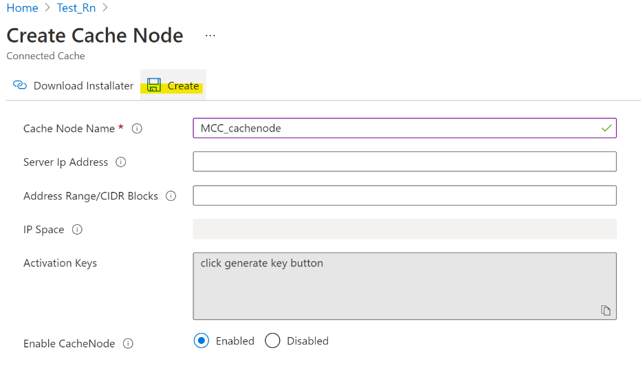

    If there are errors the form will provide guidance on how to correct the errors. For example:

    - The cache node name is in use in the resource or is an incorrect format.
    - If the CIDR block notation or list is incorrect.
    - The server IP address or CIDR block are already in use.

    See the following example with all information entered:

    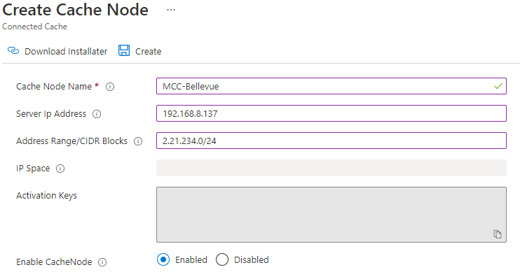

    Once the MCC Node has been created, the installer instructions will be exposed. More details on the installer instructions will be addressed later in this doc can be found at the [Install Connected Cache](#install-microsoft-connected-cache-on-a-server-or-vm) section.

    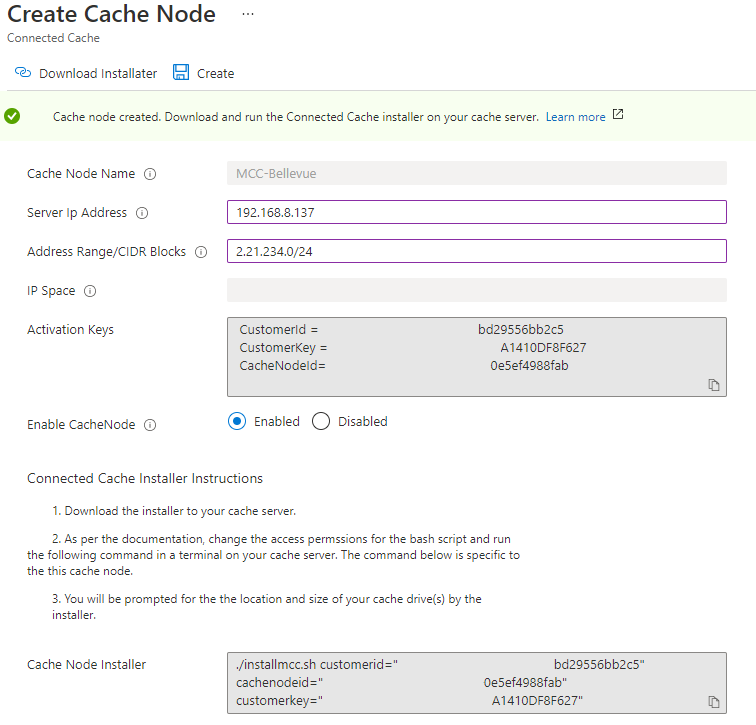

### IP address space approval

There are three states for IP address space that are explained in the table below. The preview will require approval from Microsoft CIDR block ranges that contain more than 50,000 IP addresses. In the future, MCC configuration will support BGP and will therefore have automatic routing capabilities.

| **IP address space status**    | **Description**     |
|------------------------|------------------------------------|
| **Valid**              | The IP address space is below the 50,000 IP address space threshold and the space does not overlap with existing cache nodes.    |
| **In Review**    | The IP address space exceeds the 50,000 IP address space and is under review with Microsoft to ensure valid IP address space.   |
| **Attention Required** | The IP address space has been reviewed and an issue was discovered. Some examples include: IP address space overlap with existing cache node belonging to another customer. IP address space was exceedingly large.  Contact Microsoft for more information if your IP address space has this status. |

See the following example:


## Edit Cache Node Information

IP address or CIDR information can be modified for existing MCC nodes in the portal.

To edit IP address or CIDR information, click on the Cache Node Name which will open the Cache Node Configuration page. Cache nodes can be deleted here by clicking the check box to the left of a Cache Node Name and then clicking the delete toolbar item. Be aware that if a cache node is deleted, there is no way to recover the cache node or any of the information related to the cache node.

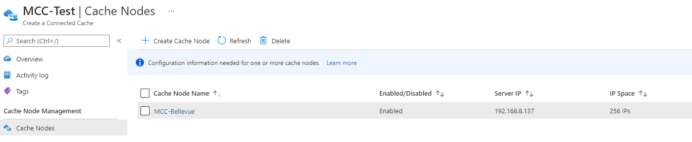

The Server IP Address, Address Range/CIDR Blocks, and Enable Cache Node are all editable as show below:

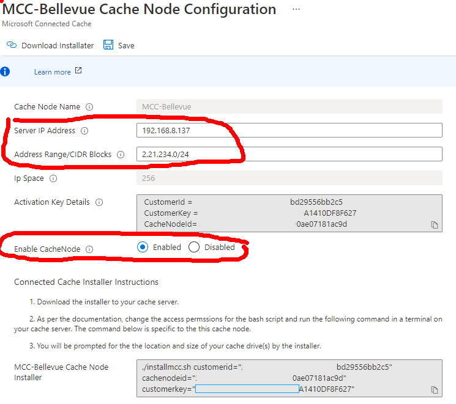

## Set up a server with SR or an Ubuntu 

The MCC module is optimized for Ubuntu 20.04 LTS. Install Ubuntu 20.04 LTS on a physical server or VM of your choice. As discussed earlier, the recommended configuration (details below) will serve approximately 35,000 consumer devices downloading a 2GB payload in 24-hour timeframe at a sustained rate of 6.5 Gbps.

|             | **Minimum**                                 | **Recommended**                                    |
|-------------|---------------------------------------------|----------------------------------------------------|
| **Server**  | Ubuntu 20.04 LTS VM or physical server      | Ubuntu 20.04 LTS VM or physical server (preferred) |
| **NIC**     | 10 Gbps                                     | 10 Gbps                                            |
| **Disk**    | SSD 1 – 2 drives minimum 2 TB each minimum  | SSD 2 – 4 drives minimum 2 TB each minimum         |
| **Memory**  | 8 GB                                        | 32 GB or more                                      |
| **Cores**   | 4                                           | 8 or more                                          |

## Install MCC on a Server or VM

Installing MCC on your physical server or VM is a straightforward process. A Bash script installer performs the following tasks:

-   Azure IoT Edge relies on an OCI-compatible container runtime. The script
    will install the Moby engine and CLI.
-   Installs IoT Edge.
-   Installs SSH to support remote access to the server
-   Enables the firewall and opens ports 80 and 22 for inbound and outbound traffic. Port 80 is used by MCC and port 22 is used for SSH communications.
-   Configures Connected Cache tuning settings.
-   Creates the necessary *FREE* Azure resource - IoT Hub/IoT Edge.
-   Deploys the MCC container to server.

> [!IMPORTANT]
> Ensure that port 5000 is open so Microsoft can verify proper functioning of the cache server

### Steps to install MCC

1.  Download and unzip mccinstaller.zip from the create cache node page or cache node configuration page which contains the necessary installation files.

    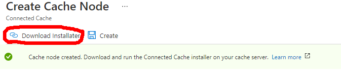

    Files contained in the mccinstaller.zip file:

    - **installmcc.sh** – main installer file.
    - **installIotEdge.sh** – Installs the necessary prerequisites like IoT Edge runtime and Docker and makes necessary host OS settings to optimization caching performance.
    - **resourceDeploymentForConnectedCache.sh** – Creates Azure cloud resources required to support MCC control plane.
    - **mccdeployment.json** – Deployment manifest used by IoT Edge to deploy the MCC container and configure settings on the container like cache drives location sizes.

2.  Copy all 4 installation files to your Linux server (physical or VM)

3.  Before proceeding, ensure that you have a data drive configured on your server. You will need to specify the location for this cache drive on step 9. Mimimum size for the data drive is 100GB. For instructions to mount a disk on a Linux VM, see [Attach a data disk to a Linux VM](/azure/virtual-machines/linux/attach-disk-portal#find-the-disk)

4.  Open a terminal and change the access permissions to execute on the **installmcc.sh** Bash script file using chmod.

    ```
    sudo chmod +x installmcc.sh
    ```

5.  Copy the Bash script line provided and run the Bash script from the terminal. 

    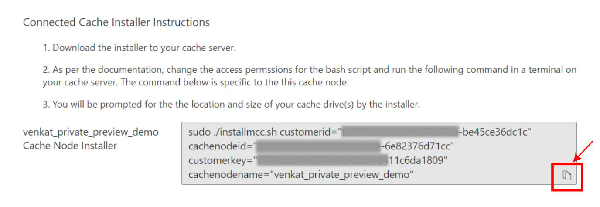

6.  You will be prompted to sign in to the Azure Portal using a device code.

    

7.  You will be prompted to enter the Azure Container Registry (ACR) password for access to the MCC container.

    

8.  You will then be prompted with the number of drives to configure.

    

9.  The script will prompt for location and size of the cache drives.

    

> [!IMPORTANT]
> The permissions / ownerships on the cache drive location will be changed to everyone via chmod 777<br>
> **Do not** point the cache drive location to any of the following: “**.**”, “**./var**”, “**/**”, “**\<space\>**”

Specifying any of the directories mentioned above will corrupt the VM and you
will need to provision a new one.


1.  If this is your first MCC deployment, select “n” when
    prompted for an IoT Hub. If this is **not** your first MCC deployment, you
    can use an existing IoT hub from your previous MCC installation. After
    selecting “Y”, we will display your existing IoT Hubs, you can copy and
    paste the resulting IoT Hub name to continue.

    

2.  If there are no errors go to the next step.

    -  If there are errors, inspect the installer logs which are under /etc/mccresourcecreation/.
    -  If there were follow the instructions to [Troubleshoot your IoT Edge device(/azure/iot-edge/troubleshoot).

## Verify Proper Functioning MCC Server

### Verify client side

Sign in to the Connected Cache server or ssh and run the following command from a terminal to see the running modules (containers):

```
sudo iotedge list​
```


If **edgeAgent** and **8edgeHub** containers are listed, but not “MCC”, you may view the status of the IoTEdge security manager using the command:

```
sudo journalctl -u iotedge -f
```

For example, this command provides the current status of the starting, stopping of a container, or the container pull and start as is shown in the sample below:


### Verify server side

It can take a few minutes for the container to deploy.

For a validation of properly functioning MCC, run the following command in the terminal of the cache server or any device in the network. Replace \<CacheServerIP\> with the IP address of the cache server.

```
wget http://<CacheServerIP>/mscomtest/wuidt.gif?cacheHostOrigin=au.download.windowsupdate.com
```

A successful test result will look like this:

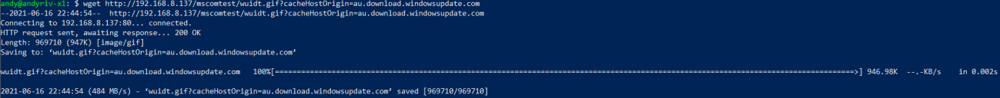

Similarly, enter the following URL into a web browser on the network:

```
http://<CacheServerIP>/mscomtest/wuidt.gif?cacheHostOrigin=au.download.windowsupdate.com
```

If the test fails, see the [common issues](#common-issues) section below for more information.

## Common Issues

> [!NOTE]
> Consult the [IoT Edge troubleshooting guide](/azure/iot-edge/troubleshoot) for any issues you may encounter configuring IoT Edge. A few common issues are listed below.

Use the following command to check the IoT Edge Journal:

```
sudo journalctl -u iotedge –f
```

## DNS needs to be nonfigured

Run the following IoT Edge setup/install state check:

```
sudo iotedge check --verbose
```

If you see issues with ports 5671, 443, and 8883 similar to the screenshot below, it means that your IoT Edge device needs to update the DNS for Docker.

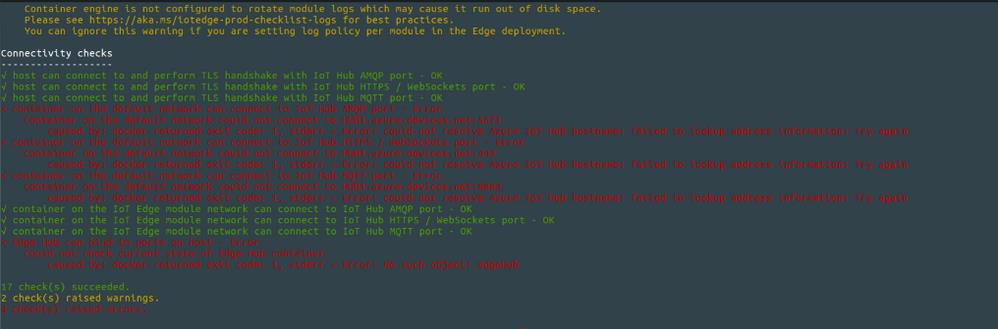

Follow the steps below to configure the device to work with your DNS:

1.  Use ifconfig to find appropriate NIC adapter name.

    ```
    ifconfig​
    ```
2.  Run nmcli device show \<network adapter\> to show you the DNS name for Ethernet adapter. For example to show DNS
    information for eno1:

    ```
    nmcli device show eno1 
    ``` 

    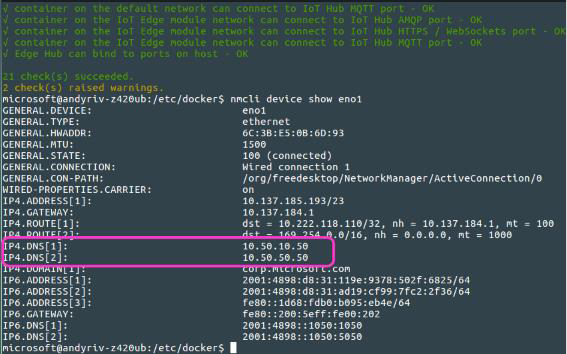

3.  Open/create the Docker configuration file used to configure the DNS server

    ```
    sudo nano /etc/docker/daemon.json​
    ```

4.  Paste the following into the daemon.json file (In the example above IP4.DNS[1] is used)  

    ```
    { "dns": ["x.x.x.x"]}
    ```
5.  Save the file changes to daemon.json. **Note**: You might need to change permissions on this file. For example:  

    ```
    sudo chmod 555 /etc/docker/daemon.json​
    ```

6.  Restart Docker (to pick up the new DNS) and restart IoTEdge  
    
    ```
    sudo systemctl restart dockersudo systemctl daemon-reloadsudo restart IoTEdge
    ```

## Diagnostics Script

If you are having issues with your MCC, we included a diagnostics script which will collect all your logs and zip them into a single file. You can then send us these logs via email for the MCC team to debug.

To run this script:

1.  Navigate to the following folder in the MCC installation files:

**mccinstaller** \> **MccResourceInstall** \> **Diagnostics**

2.  Run the following commands:

    ```
    sudo chmod +x collectMccDiagnostics.sh
    sudo ./collectMccDiagnostics.sh
    ```
3.  The script stores all the debug files into a folder and the creates a tar file. After the script is finished running, it will output the path of the tar file that you can share with the MCC team. The file should be **/etc/mccdiagnostics/support_bundle_\$timestamp.tar.gz**.

4.  [Email the MCC team](mailto:msconnectedcache@microsoft.com?subject=Debugging%20Support%20Request%20for%20MCC) and attach this tar file, asking for debugging support. Screenshots of the error along with any other warnings you saw will be helpful during out debugging process.

## Updating your MCC

Throughout the private preview phase, we will send you security and feature updates for MCC. Please follow these steps to perform the update.

Run the following commands with the **arguments** we provided in the email to update your MCC:

```
sudo chmod +x updatemcc.sh
sudo chmod +x installIoTEdge.sh
sudo ./updatemcc.sh version="\<**VERSION**\>" tenantid="\<**TENANTID**\>" customerid="\<**CUSTOMERID**\>" cachenodeid="\<**CACHENODEID**\>" customerkey="\<**CUSTOMERKEY**\>"
```

For example:
```
sudo ./updatemcc.sh version="msconnectedcacheprod.azurecr.io/mcc/linux/iot/mcc-ubuntu-iot-amd64:1.2.1.981" tenantid="72f988bf-86f1-41af-91ab-2d7cd011db47" customerid="99d897gg-86f1-41af-91ab-4jau6ske0sdf" cachenodeid=" cd01sdfh-435n-0das-56gh90dfrt67 " customerkey="h90d234f-vbnm-lk43-0742khsd45hj”
```

## Uninstalling MCC

In the zip file, you will find the file **uninstallmcc.sh** which uninstalls MCC and all the related components. Please contact the MCC Team before running this script and only run this script if you are facing issues with MCC installation. **Exercise caution before running this script as existing IoT workflows in this VM will also be erased.**

The **uninstallmcc.sh** script will remove the following:

- IoT Edge
- Edge Agent
- Edge Hub
- MCC
- Moby CLI
- Moby Engine

To run the script, enter the following commands:

```
sudo chmod +x uninstallmcc.sh
sudo ./uninstallmcc.sh
```

## Appendix

Performance of MCC in Hypervisor environments

We have observed in hypervisor environments the cache server peak egress at around 1.1 Gbps. If you wish to maximize the egress in hypervisor environments it is critical to make two settings changes.

1. Enable **SR-IOV** in the BIOS AND enable **SR-IOV** in the NIC properties, and finally, enable **SR-IOV** in the hypervisors for the MCC VM. Microsoft has found these settings to double egress when using a Microsoft Hyper-V deployment.

2. Enable “high performance” in the BIOS as opposed to energy savings. Microsoft has found this setting nearly doubled egress a Microsoft Hyper-V deployment.

## Setting up a VM on Windows Server

You can use hardware that will natively run Ubuntu 20.04 LTS, or you can run an Ubuntu VM. The following steps describe how to set up a VM on Hyper-V.

1.  Download the ISO. You can use either Ubuntu Desktop or Ubuntu Server.

    1.  [Download Ubuntu Desktop](https://ubuntu.com/download/desktop)
    2.  [Download Ubuntu Server](https://mirror.cs.jmu.edu/pub/ubuntu-iso/20.04.2/ubuntu-20.04.2-live-server-amd64.iso)

2.  Start the **New Virtual Machine Wizard**, give your VM a name, and choose a location.  
    
    
    

3.  Choose a **Generation 2** VM, and specify the startup memory. You cannot change the VM generation 2 later.  
    
    
    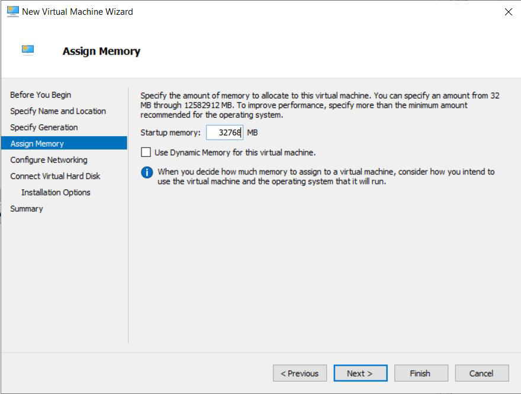

4.  Choose the network adapter.  
    
    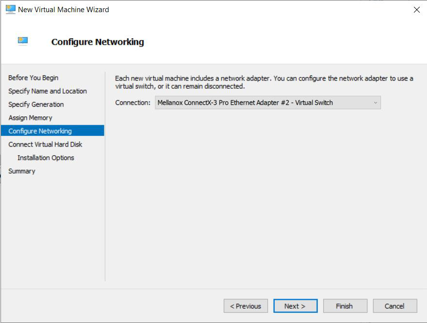

5.  Set the virtual hard disk parameters. You should specify enough space for the OS and the content that will be cached. That example below allocates one terabyte.  
    
    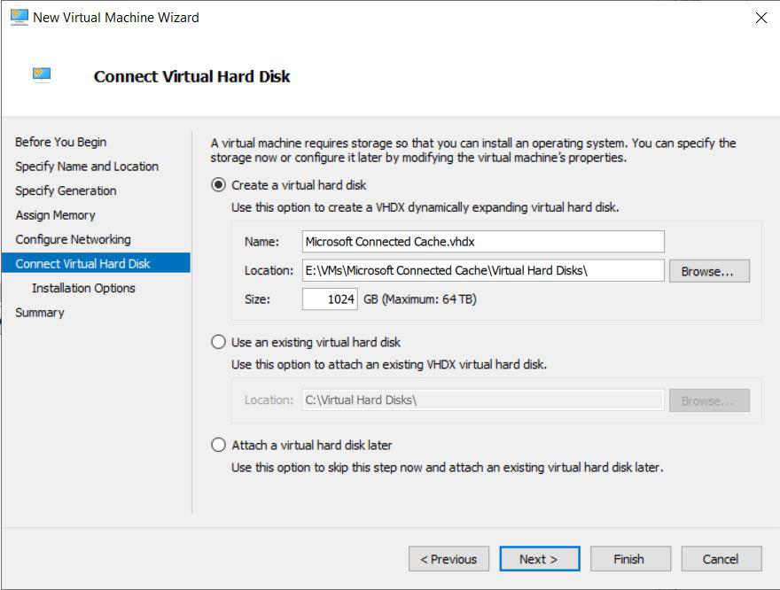

6.  Install from the ISO for Ubuntu 20.04 LTS that you downloaded.  
    
    

7.  Finish the creation of the Ubuntu VM.  
    
    

8.  Before you start the Ubuntu VM make sure secure boot is **disabled** and that you have allocated multiple cores to the VM. The example below has allocated 12, but your configuration may vary.  
    
    
    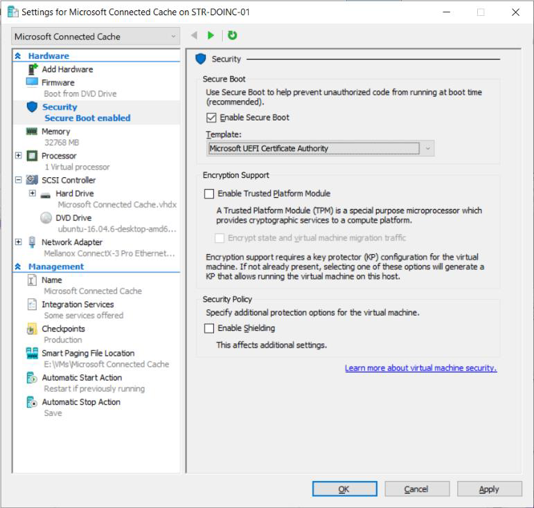
    

9.  Start the VM and choose the option that will Install Ubuntu. Choose your default language.  
    
    
    

10. Choose the options you wish for installing updates and third party hardware. In the example below, we have chosen to download updates and install
    third party software drivers.  
    
    

11. If you had a previous version of Ubuntu installed, we recommend erasing and installing Ubuntu 16.04. Choose your time zone, and keyboard layout.  
    
    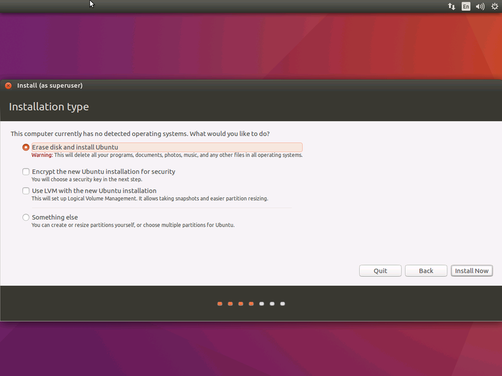
    
    
    

12. Choose your username, a name for your computer, and a password. Remember, everything is case sensitive in Linux. You will be asked to reboot in order to complete the installation.  
    
    
    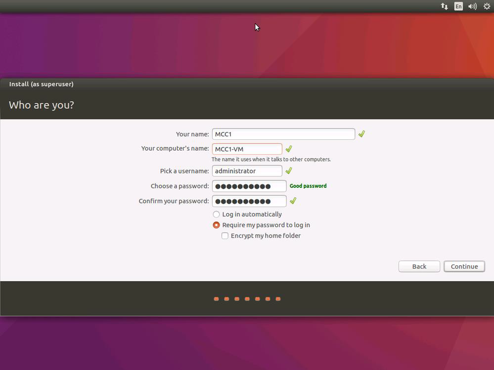

13. **Important**: When prompted with the option to upgrade, decline.

    
    

Your Ubuntu VM should now be ready for the next step: [*Install Microsoft Connected Cache on Your Server or VM*](#install-mcc-on-a-server-or-vm)

## IoT Edge runtime

The Azure IoT Edge runtime enables custom and cloud logic on IoT Edge devices. The runtime sits on the IoT Edge device, and performs management and communication operations. The runtime performs several functions:

-   Installs and update workloads (Docker containers) on the device.
-   Maintains Azure IoT Edge security standards on the device.
-   Ensures that IoT Edge modules (Docker containers) are always running.
-   Reports module (Docker containers) health to the cloud for remote
    monitoring.
-   Manages communication between an IoT Edge device and the cloud.

For more information on Azure IoT Edge, please see the [Azure IoT Edge documentation](/azure/iot-edge/about-iot-edge).

## Also see

[Microsoft Connected Cache for Enterprises](mcc-enterprise.md)<br>
[Introducing Microsoft Connected Cache](https://techcommunity.microsoft.com/t5/windows-it-pro-blog/introducing-microsoft-connected-cache-microsoft-s-cloud-managed/ba-p/963898)
