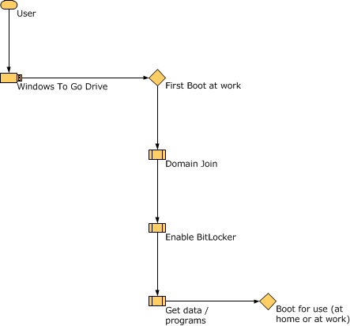
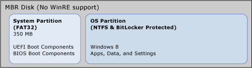

# Deployment considerations for Windows To Go

**Applies to**

- Windows 10

> [!IMPORTANT]
> Windows To Go is removed in Windows 10, version 2004 and later operating systems. The feature does not support feature updates and therefore does not enable you to stay current. It also requires a specific type of USB that is no longer supported by many OEMs.

From the start, Windows To Go was designed to minimize differences between the user experience of working on a laptop and Windows To Go booted from a USB drive. Given that Windows To Go was designed as an enterprise solution, extra consideration was given to the deployment workflows that enterprises already have in place. Additionally, there has been a focus on minimizing the number of differences in deployment between Windows To Go workspaces and laptop PCs.

> [!NOTE]
> Windows To Go does not support operating system upgrades. Windows To Go is designed as a feature that is managed centrally. IT departments that plan to transition from one operating system version to a later version will need to incorporate re-imaging their existing Windows To Go drives as part of their upgrade deployment process.

The following sections discuss the boot experience, deployment methods, and tools that you can use with Windows To Go.

- [Initial boot experiences](#wtg-initboot)
- [Image deployment and drive provisioning considerations](#wtg-imagedep)
- [Application installation and domain join](#wtg-appinstall)
- [Management of Windows To Go using Group Policy](#bkmk-wtggp)
- [Supporting booting from USB](#wtg-bootusb)
- [Updating firmware](#stg-firmware)
- [Configure Windows To Go startup options](#wtg-startup)
- [Change firmware settings](#wtg-changefirmware)

## Initial boot experiences

The following diagrams illustrate the two different methods you could use to provide Windows To Go drives to your users. The experiences differ depending on whether the user will be booting the device initially on-premises or off-premises:

When a Windows To Go workspace is first used at the workplace, the Windows To Go workspace can be joined to the domain through the normal procedures that occur when a new computer is introduced. It obtains a lease, applicable policies are applied and set, and user account tokens are placed appropriately. BitLocker protection can be applied and the BitLocker recovery key automatically stored in Active Directory Domain Services. The user can access network resources to install software and get access to data sources. When the workspace is subsequently booted at a different location either on or off premises, the configuration required for it to connect back to the work network using either DirectAccess or a virtual private network connection can be configured. It isn't necessary to configure the workspace for offline domain join. DirectAccess can make connecting to organizational resources easier, but isn't required.

When the Windows To Go workspace is going to be used first on an off-premises computer, such as one at the employee's home, then the IT professional preparing the Windows To Go drives should configure the drive to be able to connect to organizational resources and to maintain the security of the workspace. In this situation, the Windows To Go workspace needs to be configured for offline domain join and BitLocker needs to be enabled before the workspace has been initialized.

> [!TIP]
> Applying BitLocker Drive Encryption to the drives before provisioning is a much faster process than encrypting the drives after data has already been stored on them due to a new feature called used-disk space only encryption. For more information, see [What's New in BitLocker](/previous-versions/windows/it-pro/windows-server-2012-R2-and-2012/dn306081(v=ws.11)).

DirectAccess can be used to ensure that the user can log in with their domain credentials without needing a local account. For instructions on setting up a DirectAccess solution, for a small pilot deployment see [Deploy a Single Remote Access Server using the Getting Started Wizard](/previous-versions/windows/it-pro/windows-server-2012-R2-and-2012/hh831520(v=ws.11)) for a larger scale deployment, see [Deploy Remote Access in an Enterprise](/previous-versions/windows/it-pro/windows-server-2012-R2-and-2012/jj134200(v=ws.11)). If you don't want to use DirectAccess as an alternative user could log on using a local user account on the Windows To Go workspace and then use a virtual private network for remote access to your organizational network.

### Image deployment and drive provisioning considerations

The Image Deployment process can be accomplished either by a centralized IT process for your organization or by individual users creating their own Windows To Go workspaces. You must have local Administrator access and access to a Windows 10 Enterprise or Windows 10 Education image to create a Windows To Go workspace, or you must be using Configuration Manager Service Pack 1 or later to distribute Windows To Go workspaces to users. The image deployment process takes a blank USB drive and a Windows 10 Enterprise image (WIM) and turns it into a Windows To Go drive.

The simplest way to provision a Windows To Go drive is to use the Windows To Go Creator. After a single Windows To Go workspace has been created, it can be duplicated as many times as necessary using widely available USB duplicator products as long as the device hasn't been booted. After the Windows To Go drive is initialized, it shouldn't be duplicated. Alternatively, Windows To Go Workspace Creator can be run multiple times to create multiple Windows To Go drives.

> [!TIP]
> When you create your Windows To Go image use sysprep /generalize, just as you do when you deploy Windows 10 to a standard PC. In fact, if appropriate, use the same image for both deployments.

**Driver considerations**

Windows includes most of the drivers that you'll need to support a wide variety of host computers. However, you'll occasionally need to download drivers from Windows Update to take advantage of the full functionality of a device. If you're using Windows To Go on a set of known host computers, you can add any more drivers to the image used on Windows To Go to make Windows To Go drives more quickly usable by your employees. Especially ensure that network drivers are available so that the user can connect to Windows Update to get more drivers if necessary.

Wi-Fi network adapter drivers are one of the most important drivers to make sure that you include in your standard image so that users can easily connect to the internet for any additional updates. IT administrators that are attempting to build Windows 10 images for use with Windows To Go should consider adding additional Wi-Fi drivers to their image to ensure that their users have the best chance of still having basic network connectivity when roaming between systems.

The following list of commonly used Wi-Fi network adapters that aren't supported by the default drivers provided with Windows 10 is provided to help you ascertain whether or not you need to add drivers to your image.

|Vendor name|Product description|HWID|Windows Update availability|
|--- |--- |--- |--- |
|Broadcom|802.11abgn Wireless SDIO adapter|sd\vid_02d0&pid_4330&fn_1|Contact the system OEM or Broadcom for driver availability.|
|Broadcom|802.11n Network Adapter|pci\ven_14e4&dev_4331&subsys_00d6106b&rev_02|Contact the system OEM or Broadcom for driver availability.|
|Broadcom|802.11n Network Adapter|pci\ven_14e4&dev_4331&subsys_00f5106b&rev_02|Contact the system OEM or Broadcom for driver availability.|
|Broadcom|802.11n Network Adapter|pci\ven_14e4&dev_4331&subsys_00ef106b&rev_02|Contact the system OEM or Broadcom for driver availability.|
|Broadcom|802.11n Network Adapter|pci\ven_14e4&dev_4331&subsys_00f4106b&rev_02|Contact the system OEM or Broadcom for driver availability.|
|Broadcom|802.11n Network Adapter|pci\ven_14e4&dev_4331&subsys_010e106b&rev_02|Contact the system OEM or Broadcom for driver availability.|
|Broadcom|802.11n Network Adapter|pci\ven_14e4&dev_4331&subsys_00e4106b&rev_02|Contact the system OEM or Broadcom for driver availability.|
|Broadcom|802.11n Network Adapter|pci\ven_14e4&dev_4331&subsys_433114e4&rev_02|Contact the system OEM or Broadcom for driver availability.|
|Broadcom|802.11n Network Adapter|pci\ven_14e4&dev_4331&subsys_010f106b&rev_02|Contact the system OEM or Broadcom for driver availability.|
|Marvell|Yukon 88E8001/8003/8010 PCI Gigabit Ethernet|pci\ven_11ab&dev_4320&subsys_811a1043|[32-bit driver](https://go.microsoft.com/fwlink/p/?LinkId=619080) [64-bit driver](https://go.microsoft.com/fwlink/p/?LinkId=619082)|
|Marvell|Libertas 802.11b/g Wireless|pci\ven_11ab&dev_1faa&subsys_6b001385&rev_03|[32-bit driver](https://go.microsoft.com/fwlink/p/?LinkId=619128) [64-bit driver](https://go.microsoft.com/fwlink/p/?LinkId=619129)|
|Qualcomm|Atheros AR6004 Wireless LAN Adapter|sd\vid_0271&pid_0401|[32-bit driver](https://go.microsoft.com/fwlink/p/?LinkId=619086) 64-bit driver not available|
|Qualcomm|Atheros AR5BWB222 Wireless Network Adapter|pci\ven_168c&dev_0034&subsys_20031a56|[32-bit driver](https://go.microsoft.com/fwlink/p/?LinkId=619348) 64-bit driver not available|
|Qualcomm|Atheros AR5BWB222 Wireless Network Adapter|pci\ven_168c&dev_0034&subsys_020a1028&rev_01|Contact the system OEM or Qualcom for driver availability.|
|Qualcomm|Atheros AR5005G Wireless Network Adapter|pci\ven_168c&dev_001a&subsys_04181468&rev_01|[32-bit driver](https://go.microsoft.com/fwlink/p/?LinkId=619349)
[64-bit driver](https://go.microsoft.com/fwlink/p/?LinkId=619091)|
|Ralink|Wireless-G PCI Adapter|pci\ven_1814&dev_0301&subsys_00551737&rev_00|[32-bit driver](https://go.microsoft.com/fwlink/p/?LinkId=619092)
[64-bit driver](https://go.microsoft.com/fwlink/p/?LinkId=619093)|
|Ralink|Turbo Wireless LAN Card|pci\ven_1814&dev_0301&subsys_25611814&rev_00|[32-bit driver](https://go.microsoft.com/fwlink/p/?LinkId=619094)
[64-bit driver](https://go.microsoft.com/fwlink/p/?LinkId=619095)|
|Ralink|Wireless LAN Card V1|pci\ven_1814&dev_0302&subsys_3a711186&rev_00|[32-bit driver](https://go.microsoft.com/fwlink/p/?LinkId=619097)
[64-bit driver](https://go.microsoft.com/fwlink/p/?LinkId=619098)|
|Ralink|D-Link AirPlus G DWL-G510 Wireless PCI Adapter(rev.C)|pci\ven_1814&dev_0302&subsys_3c091186&rev_00|[32-bit driver](https://go.microsoft.com/fwlink/p/?LinkId=619099)
[64-bit driver](https://go.microsoft.com/fwlink/p/?LinkId=619100)|

IT administrators that want to target Windows To Go images for specific systems should test their images to ensure that the necessary system drivers are in the image, especially for critical functionality like Wi-Fi that isn't supported by class drivers. Some consumer devices require OEM-specific driver packages, which may not be available on Windows Update. For more information on how to add a driver to a Windows Image, please refer to the [Basic Windows Deployment Step-by-Step Guide](/previous-versions/windows/it-pro/windows-8.1-and-8/hh825212(v=win.10)).

### Application installation and domain join

Unless you're using a customized Windows image that includes unattended installation settings, the initial Windows To Go workspace won't be domain joined and won't contain applications. This is exactly like a new installation of Windows on a desktop or laptop computer. When planning your deployment, you should develop methods to join Windows to Go drives to the domain and install the standard applications that users in your organization require. These methods probably will be similar to the ones used for setting up desktop and laptop computers with domain privileges and applications

### Management of Windows To Go using Group Policy

In general, management of Windows To Go workspaces is same as that for desktop and laptop computers. There are Windows To Go specific Group Policy settings that should be considered as part of Windows To Go deployment. Windows To Go Group Policy settings are located at `\\Computer Configuration\Administrative Templates\Windows Components\Portable Operating System\` in the Local Group Policy Editor.

The use of the Store on Windows To Go workspaces that are running Windows 8 can also be controlled by Group Policy. This policy setting is located at `\\Computer Configuration\Administrative Templates\Windows Components\Store\` in the Local Group Policy Editor. The policy settings have specific implications for Windows To Go that you should be aware of when planning your deployment:

**Settings for workspaces**

- **Allow hibernate (S4) when started from a Windows To Go workspace**

    This policy setting specifies whether the PC can use the hibernation sleep state (S4) when started from a Windows To Go workspace. By default, hibernation is disabled when using Windows To Go workspace, so enabling this setting explicitly turns this ability back on. When a computer enters hibernation, the contents of memory are written to disk. When the disk is resumed, it's important that the hardware attached to the system, and the disk itself, are unchanged. This is inherently incompatible with roaming between PC hosts. Hibernation should only be used when the Windows To Go workspace isn't being used to roam between host PCs.

    > [!IMPORTANT]
    > For the host-PC to resume correctly when hibernation is enabled the Windows To Go workspace must continue to use the same USB port.

- **Disallow standby sleep states (S1-S3) when starting from a Windows To Go workspace**

    This policy setting specifies whether the PC can use standby sleep states (S1–S3) when started from a Windows To Go workspace. The Sleep state also presents a unique challenge to Windows To Go users. When a computer goes to sleep, it appears as if it's shut down. It could be easy for a user to think that a Windows To Go workspace in sleep mode was actually shut down and they could remove the Windows To Go drive and take it home. Removing the Windows To Go drive in this scenario is equivalent to an unclean shutdown, which may result in the loss of unsaved user data or the corruption on the drive. Moreover, if the user now boots the drive on another PC and brings it back to the first PC, which still happens to be in the sleep state, it will lead to an arbitrary crash and eventually corruption of the drive and result in the workspace becoming unusable. If you enable this policy setting, the Windows To Go workspace can't use the standby states to cause the PC to enter sleep mode. If you disable or don't configure this policy setting, the Windows To Go workspace can place the PC in sleep mode.

**Settings for host PCs**

- **Windows To Go Default Startup Options**

    This policy setting controls whether the host computer will boot to Windows To Go if a USB device containing a Windows To Go workspace is connected, and controls whether users can make changes using the **Windows To Go Startup Options** settings dialog. If you enable this policy setting, booting to Windows To Go when a USB device is connected will be enabled and users won't be able to make changes using the **Windows To Go Startup Options** settings dialog. If you disable this policy setting, booting to Windows To Go when a USB device is connected won't be enabled unless a user configures the option manually in the firmware. If you don't configure this policy setting, users who are members of the local Administrators group can enable or disable booting from USB using the **Windows To Go Startup Options** settings dialog.

    > [!IMPORTANT]
    > Enabling this policy setting will cause PCs running Windows to attempt to boot from any USB device that is inserted into the PC before it is started.

## Supporting booting from USB

The biggest hurdle for a user wanting to use Windows To Go is configuring their computer to boot from USB. This is traditionally done by entering the firmware and configuring the appropriate boot order options. To ease the process of making the firmware modifications required for Windows To Go, Windows includes a feature named **Windows To Go Startup Options** that allows a user to configure their computer to boot from USB from within Windows—without ever entering their firmware, as long as their firmware supports booting from USB.

> [!NOTE]
> Enabling a system to always boot from USB first has implications that you should consider. For example, a USB device that includes malware could be booted inadvertently to compromise the system, or multiple USB drives could be plugged in to cause a boot conflict. For this reason, the Windows To Go startup options are disabled by default. In addition, administrator privileges are required to configure Windows To Go startup options.

If you're going to be using a Windows 7 computer as a host-PC, see the wiki article [Tips for configuring your BIOS settings to work with Windows To Go](https://go.microsoft.com/fwlink/p/?LinkID=618951).

### Roaming between different firmware types

Windows supports two types of PC firmware: Unified Extensible Firmware Interface (UEFI), which is the new standard, and legacy BIOS firmware, which was used in most PCs shipping with Windows 7 or earlier version of Windows. Each firmware type has completely different Windows boot components that are incompatible with each other. Beyond the different boot components, Windows supports different partition styles and layout requirements for each type of firmware as shown in the following diagrams.

This presented a unique challenge for Windows To Go because the firmware type isn't easily determined by end users—a UEFI computer looks just like a legacy BIOS computer and Windows To Go must boot on both types of firmware.

To enable booting Windows To Go on both types of firmware, a new disk layout is provided for Windows 8 or later that contains both sets of boot components on a FAT32 system partition and a new command-line option was added to bcdboot.exe to support this configuration. The **/f** option is used with the **bcdboot /s** command to specify the firmware type of the target system partition by appending either **UEFI**, **BIOS** or **ALL**. When creating Windows To Go drives manually, you must use the **ALL** parameter to provide the Windows To Go drive the ability to boot on both types of firmware. For example, on volume H: (your Windows To Go USB drive letter), you would use the command **bcdboot C:\\windows /s H: /f ALL**. The following diagram illustrates the disk layout that results from that command:

This is the only supported disk configuration for Windows To Go. With this disk configuration, a single Windows To Go drive can be booted on computers with UEFI and legacy BIOS firmware.

### Configure Windows To Go startup options

Windows To Go Startup Options is a setting available on Windows 10-based PCs that enables the computer to be booted from a USB without manually changing the firmware settings of the PC. To configure Windows To Go Startup Options, you must have administrative rights on the computer and the **Windows To Go Default Startup Options** Group Policy setting must not be configured.

**To configure Windows To Go startup options**

1. On the Start screen, type, type **Windows To Go Startup Options**, click **Settings** and, then press Enter.

   

2. Select **Yes** to enable the startup options.

    > [!TIP]
    > If your computer is part of a domain, the Group Policy setting can be used to enable the startup options instead of the dialog.

3. Click **Save Changes**. If the User Account Control dialog box is displayed, confirm that the action it displays is what you want, and then click **Yes**.

### Change firmware settings

If you choose to not use the Windows To Go startup options or are using a PC running Windows 7 as your host computer, you'll need to manually configure the firmware settings. The process used to accomplish this will depend on the firmware type and manufacturer. If your host computer is protected by BitLocker and running Windows 7, you should suspend BitLocker before making the change to the firmware settings. After the firmware settings have been successfully reconfigured, resume BitLocker protection. If you don't suspend BitLocker first, BitLocker will assume that the computer has been tampered with and will boot into BitLocker recovery mode.

## Related topics

[Windows To Go: feature overview](windows-to-go-overview.md) 
[Prepare your organization for Windows To Go](prepare-your-organization-for-windows-to-go.md) 
[Security and data protection considerations for Windows To Go](security-and-data-protection-considerations-for-windows-to-go.md) 
[Windows To Go: frequently asked questions](windows-to-go-frequently-asked-questions.yml)
