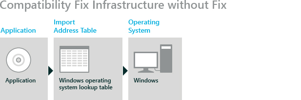
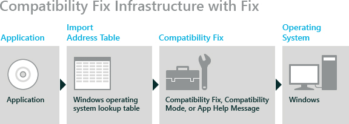

# Understanding and Using Compatibility Fixes

**Applies to**

-   Windows 10
-   Windows 8.1
-   Windows 8
-   Windows 7
-   Windows Server 2012
-   Windows Server 2008 R2

As the Windows operating system evolves to support new technology and functionality, the implementations of some functions may change. This can cause problems for applications that relied upon the original implementation. You can avoid compatibility issues by using the Microsoft Windows Application Compatibility (Compatibility Fix) infrastructure to create a specific application fix for a particular version of an application.

## How the Compatibility Fix Infrastructure Works

The Compatibility Fix infrastructure uses the linking ability of APIs to redirect an application from Windows code directly to alternative code that implements the compatibility fix.

The Windows Portable Executable File Format includes headers that contain the data directories that are used to provide a layer of indirection between the application and the linked file. API calls to the external binary files take place through the Import Address Table (IAT), which then directly calls the Windows operating system, as shown in the following figure.

Specifically, the process modifies the address of the affected Windows function in the IAT to point to the compatibility fix code, as shown in the following figure.

**Note**  
For statically linked DLLs, the code redirection occurs as the application loads. You can also fix dynamically linked DLLs by hooking into the GetProcAddress API.

 

## Design Implications of the Compatibility Fix Infrastructure

There are important considerations to keep in mind when determining your application fix strategy, due to certain characteristics of the Compatibility Fix infrastructure.

-   The compatibility fix is not part of the Windows operating system (as shown in the previous figure). Therefore, the same security restrictions apply to the compatibility fix as apply to the application code, which means that you cannot use compatibility fixes to bypass any of the security mechanisms of the operating system. Therefore, compatibility fixes do not increase your security exposure, nor do you need to lower your security settings to accommodate compatibility fixes.

-   The Compatibility Fix infrastructure injects additional code into the application before it calls the operating system. This means that any remedy that can be accomplished by a compatibility fix can also be addressed by fixing the application code.

-   The compatibility fixes run as user-mode code inside of a user-mode application process. This means that you cannot use a compatibility fix to fix kernel-mode code issues. For example, you cannot use a compatibility fix to resolve device-driver issues.

    **Note**  
    Some antivirus, firewall, and anti-spyware code runs in kernel mode.

     

## Determining When to Use a Compatibility Fix

The decision to use compatibility fixes to remedy your compatibility issues may involve more than just technical issues. The following scenarios reflect other common reasons for using a compatibility fix.

### Scenario 1

**The compatibility issue exists on an application which is no longer supported by the vendor.**

As in many companies, you may run applications for which the vendor has ended support. In this situation, you cannot have the vendor make the fix, nor can you access the source code to modify the issue yourself. However, it is possible that the use of a compatibility fix might resolve the compatibility issue.

### Scenario 2

**The compatibility issue exists on an internally created application.**

While it is preferable to fix the application code to resolve the issue, this is not always possible. Your internal team might not be able to fix all of the issues prior to the deployment of the new operating system. Instead, they might choose to employ a compatibility fix anywhere that it is possible. They can then fix the code only for issues that cannot be resolved in this manner. Through this method, your team can modify the application as time permits, without delaying the deployment of the new operating system into your environment.

### Scenario 3

**The compatibility issue exists on an application for which a compatible version is to be released in the near future, or an application that is not critical to the organization, regardless of its version.**

In the situation where an application is either unimportant to your organization, or for which a newer, compatible version is to be released shortly, you can use a compatibility fix as a temporary solution. This means that you can continue to use the application without delaying the deployment of a new operating system, with the intention of updating your configuration as soon as the new version is released.

## Determining Which Version of an Application to Fix

You can apply a compatibility fix to a particular version of an application, either by using the "up to or including" clause or by selecting that specific version. This means that the next version of the application will not have the compatibility fix automatically applied. This is important, because it allows you to continue to use your application, but it also encourages the vendor to fix the application.

## Support for Compatibility Fixes

Compatibility fixes are shipped as part of the Windows operating system and are updated by using Windows Update. Therefore, they receive the same level of support as Windows itself.

You can apply the compatibility fixes to any of your applications. However, Microsoft does not provide the tools to use the Compatibility Fix infrastructure to create your own custom fixes.

## Related topics
[Managing Application-Compatibility Fixes and Custom Fix Databases](managing-application-compatibility-fixes-and-custom-fix-databases.md)
