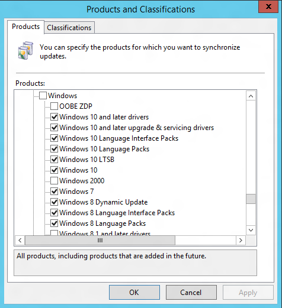

# Windows 10 infrastructure requirements

**Applies to**

-   Windows 10

There are specific infrastructure requirements to deploy and manage Windows 10 that should be in place prior to significant Windows 10 deployments within your organization.

## High-level requirements

For initial Windows 10 deployments, as well as subsequent Windows 10 upgrades, ensure that sufficient disk space is available for distribution of the Windows 10 installation files (about 3 GB for Windows 10 x64 images, slightly smaller for x86). Also, be sure to take into account the network impact of moving these large images to each PC; you may need to leverage local server storage.

For persistent VDI environments, carefully consider the I/O impact from upgrading large numbers of PCs in a short period of time. Ensure that upgrades are performed in smaller numbers, or during off-peak time periods. (For pooled VDI environments, a better approach is to replace the base image with a new version.)

## Deployment tools

A new version of the Assessment and Deployment Toolkit (ADK) has been released to support Windows 10. This new version, available for download [here](https://go.microsoft.com/fwlink/p/?LinkId=526740), is required for Windows 10; you should not use earlier versions of the ADK to deploy Windows 10. It also supports the deployment of Windows 7, Windows 8, and Windows 8.1.

Significant enhancements in the ADK for Windows 10 include new runtime provisioning capabilities, which leverage the Windows Imaging and Configuration Designer (Windows ICD), as well as updated versions of existing deployment tools (DISM, USMT, Windows PE, and more).

Microsoft Deployment Toolkit 2013 Update 1, available for download [here](https://go.microsoft.com/fwlink/p/?LinkId=625079), has also been updated to support Windows 10 and the new ADK; older versions do not support Windows 10. New in this release is task sequence support for Windows 10 in-place upgrades.

For System Center Configuration Manager, Windows 10 support is offered with various releases:

| Release                                     | Windows 10 management? | Windows 10 deployment?                         |
|---------------------------------------------|------------------------|------------------------------------------------|
| System Center Configuration Manager 2007    | Yes, with a hotfix     | No                                             |
| System Center Configuration Manager 2012    | Yes, with SP2 and CU1  | Yes, with SP2, CU1, and the ADK for Windows 10 |
| System Center Configuration Manager 2012 R2 | Yes, with SP1 and CU1  | Yes, with SP1, CU1, and the ADK for Windows 10 |

>Note: Configuration Manager 2012 supports Windows 10 version 1507 (build 10.0.10240) and 1511 (build 10.0.10586) for the lifecycle of these builds. Future releases of Windows 10 CB/CBB are not supported With Configuration Manager 2012, and will require System Center Configuration Manager current branch for supported management. 
 

For more details about System Center Configuration Manager support for Windows 10, see [Deploy Windows 10 with System Center 2012 R2 Configuration Manager](../deploy-windows-sccm/deploy-windows-10-with-system-center-2012-r2-configuration-manager.md).

## Management tools

In addition to System Center Configuration Manager, Windows 10 also leverages other tools for management. For Windows Server and Active Directory, existing supported versions are fully supported for Windows 10. New Group Policy templates will be needed to configure new settings available in Windows 10; these templates are available in the Windows 10 media images, and are available as a separate download [here](https://go.microsoft.com/fwlink/p/?LinkId=625081). See [Group Policy settings reference](https://go.microsoft.com/fwlink/p/?LinkId=625082) for a list of the new and modified policy settings. If you are using a central policy store, follow the steps outlined [here](https://go.microsoft.com/fwlink/p/?LinkId=625083) to update the ADMX files stored in that central store.

No new Active Directory schema updates or specific functional levels are currently required for core Windows 10 product functionality, although subsequent upgrades could require these to support new features.

Microsoft Desktop Optimization Pack (MDOP) has been updated to support Windows 10. The minimum versions required to support Windows 10 are as follows:

| Product                                                  | Required version         |
|----------------------------------------------------------|--------------------------|
| Advanced Group Policy Management (AGPM)                  | AGPM 4.0 Service Pack 3  |
| Application Virtualization (App-V)                       | App-V 5.1                |
| Diagnostics and Recovery Toolkit (DaRT)                  | DaRT 10                  |
| Microsoft BitLocker Administration and Monitoring (MBAM) | MBAM 2.5 SP1 (2.5 is OK) |
| User Experience Virtualization (UE-V)                    | UE-V 2.1 SP1             |

 

For more information, see the [MDOP TechCenter](https://go.microsoft.com/fwlink/p/?LinkId=625090).

For devices you manage with mobile device management (MDM) solutions such as Microsoft Intune, existing capabilities (provided initially in Windows 8.1) are fully supported in Windows 10; new Windows 10 MDM settings and capabilities will require updates to the MDM services. See [Mobile device management](https://go.microsoft.com/fwlink/p/?LinkId=625084) for more information.

Windows Server Update Services (WSUS) requires some additional configuration to receive updates for Windows 10. Use the Windows Server Update Services admin tool and follow these instructions:

1.  Select the **Options** node, and then click **Products and Classifications**.

2.  In the **Products** tree, select the **Windows 10** and **Windows 10 LTSB** products and any other Windows 10-related items that you want. Click **OK**.

3.  From the **Synchronizations** node, right-click and choose **Synchronize Now**.

Figure 1. WSUS product list with Windows 10 choices

Because Windows 10 updates are cumulative in nature, each month’s new update will supersede the previous month's. Consider leveraging “express installation” packages to reduce the size of the payload that needs to be sent to each PC each month; see [Express installation files](https://go.microsoft.com/fwlink/p/?LinkId=625086) for more information. (Note that this will increase the amount of disk storage needed by WSUS, and impacts all operating systems being managed with WSUS.)

## Activation

Windows 10 volume license editions of Windows 10 will continue to support all existing activation methods (KMS, MAK, and AD-based activation). An update will be required for existing KMS servers:

| Product                                | Required update                                                                             |
|----------------------------------------|---------------------------------------------------------------------------------------------|
| Windows 10                             | None                                                                                        |
| Windows Server 2012 R2 and Windows 8.1 | [https://support.microsoft.com/kb/3058168](https://go.microsoft.com/fwlink/p/?LinkId=625087) |
| Windows Server 2012 and Windows 8      | [https://support.microsoft.com/kb/3058168](https://go.microsoft.com/fwlink/p/?LinkId=625087) |
| Windows Server 2008 R2 and Windows 7   | [https://support.microsoft.com/kb/3079821](https://support.microsoft.com/kb/3079821)                                                                   |

 

Also see: [Windows Server 2016 Volume Activation Tips](https://blogs.technet.microsoft.com/askcore/2016/10/19/windows-server-2016-volume-activation-tips/)

Additionally, new product keys will be needed for all types of volume license activation (KMS, MAK, and AD-based Activation); these keys are available on the Volume Licensing Service Center (VLSC) for customers with rights to the Windows 10 operating system. To find the needed keys:

-   Sign into the [Volume Licensing Service Center (VLSC)](https://go.microsoft.com/fwlink/p/?LinkId=625088) at with a Microsoft account that has appropriate rights.

-   For KMS keys, click **Licenses** and then select **Relationship Summary**. Click the appropriate active license ID, and then select **Product Keys** near the right side of the page. For KMS running on Windows Server, find the **Windows Srv 2012R2 DataCtr/Std KMS for Windows 10** product key; for KMS running on client operating systems, find the **Windows 10** product key.

-   For MAK keys, click **Downloads and Keys**, and then filter the list by using **Windows 10** as a product. Click the **Key** link next to an appropriate list entry (for example, **Windows 10 Enterprise** or **Windows 10 Enterprise LTSB**) to view the available MAK keys. (You can also find keys for KMS running on Windows 10 in this list. These keys will not work on Windows servers running KMS.)

Note that Windows 10 Enterprise and Windows 10 Enterprise LTSB installations use different MAK keys. But you can use the same KMS server or Active Directory-based activation environment for both; the KMS keys obtained from the Volume Licensing Service Center will work with both.

## Related topics

[Windows 10 servicing options](../update/waas-servicing-strategy-windows-10-updates.md)
 [Windows 10 deployment considerations](windows-10-deployment-considerations.md)
 [Windows 10 compatibility](windows-10-compatibility.md)

 

 

