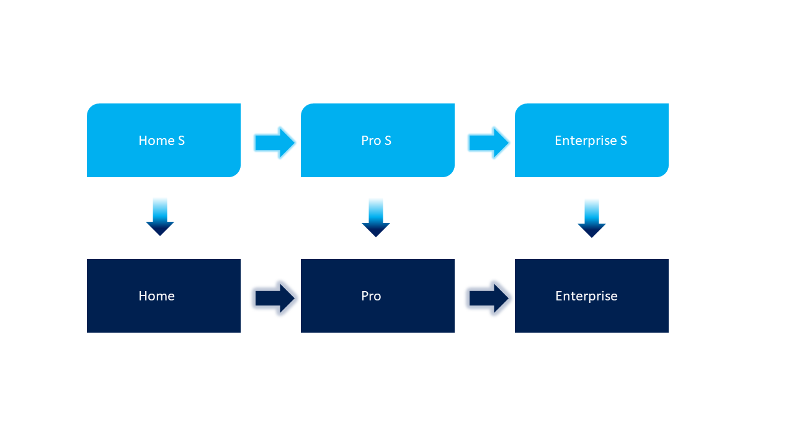

# Windows 10 in S mode - What is it?
S mode is an evolution of the S SKU introduced with Windows 10 April 2018 Update. It's a configuration that's available on all Windows Editions when enabled at the time of manufacturing. The edition of Windows can be upgrade at any time as shown below. However, the switch from S mode is a onetime switch and can only be undone by a wipe and reload of the OS. 

## S mode key features
**Microsoft-verified security**

With Windows 10 in S mode, you’ll find your favorite applications, such as Office, Evernote, and Spotify in the Microsoft Store where they’re Microsoft-verified for security. You can also feel secure when you’re online. Microsoft Edge, your default browser, gives you protection against phishing and socially engineered malware. 

**Performance that lasts**

Start-ups are quick, and S mode is built to keep them that way. With Microsoft Edge as your browser, your online experience is fast and secure. Plus, you’ll enjoy a smooth, responsive experience, whether you’re streaming HD video, opening apps, or being productive on the go. 

**Choice and flexibility**

Save your files to your favorite cloud, like OneDrive or Dropbox, and access them from any device you choose. Browse the Microsoft Store for thousands of apps, and if you don’t find exactly what you want, you can easily [switch out of S mode](https://docs.microsoft.com/windows/deployment/windows-10-pro-in-s-mode) to Windows 10 Home, Pro, or Enterprise editions at any time and search the web for more choices, as shown below. 

## Deployment

Windows 10 in S mode is built for [modern management](https://docs.microsoft.com/windows/client-management/manage-windows-10-in-your-organization-modern-management) which means using [Windows Autopilot](https://docs.microsoft.com/windows/deployment/windows-autopilot/windows-10-autopilot). Windows Autopilot lets you deploy the device directly to a user without IT having to touch the physical device. Instead of manually deploying a custom image, Windows Autopilot will start with a generic PC that can only be used to join the company domain; policies are then deployed automatically through mobile device management to customize the device to the user and the desired environment. Devices are shipped in S mode; you can either keep them in S mode or use Windows Autopilot to switch the device out of S mode during the first run process or later using mobile device management, if desired. 

## Keep line of business apps functioning with Desktop Bridge

Worried about your line of business apps not working in S mode? [Desktop Bridge](https://docs.microsoft.com/windows/uwp/porting/desktop-to-uwp-root) enables you to convert your line of business apps to a packaged app with UWP manifest. After testing and validating you can distribute the app through the Microsoft Store, making it ideal for Windows 10 in S mode. 

## Repackage Win32 apps into the MSIX format

The [MSIX Packaging Tool](https://docs.microsoft.com/windows/application-management/msix-app-packaging-tool), available from the Microsoft Store, enables you to repackage existing Win32 applications to the MSIX format. You can run your desktop installers through this tool interactively and obtain an MSIX package that you can install on your device and upload to the Microsoft Store. This is another way to get your apps ready to run on Windows 10 in S mode.

## Related links

- [Consumer applications for S mode](https://www.microsoft.com/en-us/windows/s-mode)
- [S mode devices](https://www.microsoft.com/en-us/windows/view-all-devices)
- [Windows Defender Application Control deployment guide](https://docs.microsoft.com/windows/security/threat-protection/windows-defender-application-control/windows-defender-application-control-deployment-guide)
- [Windows Defender Advanced Threat Protection](https://www.microsoft.com/en-us/WindowsForBusiness/windows-atp)
