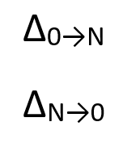
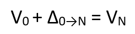
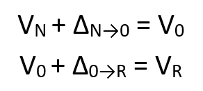

# Windows Updates using forward and reverse differentials

Windows 10 monthly quality updates are cumulative, containing all previously
released fixes to ensure consistency and simplicity. For an operating system
platform like Windows 10, which stays in support for multiple years, the size of
monthly quality updates can quickly grow large, thus directly impacting network
bandwidth consumption.

Today, this problem is addressed by using express downloads, where differential
downloads for every changed file in the update are generated based on selected
historical revisions plus the base version. In this paper, we introduce a new
technique to build compact software update packages that are applicable to any
revision of the base version, and then describe how Windows 10 quality updates
uses this technique.

## General Terms

The following general terms apply throughout this document:

-   *Base version*: A major software release with significant changes, such as
    Windows 10, version 1809 (Windows 10 Build 17763.1)

-   *Revision*: Minor releases in between the major version releases, such as
    KB4464330 (Windows 10 Build 17763.55)

-   *Baseless Patch Storage Files (Baseless PSF)*: Patch storage files that
    contain full binaries or files

## Introduction

In this paper, we introduce a new technique that can produce compact software
updates optimized for any origin/destination revision pair. It does this by
calculating forward the differential of a changed file from the base version and
its reverse differential back to the base version. Both forward and reverse
differentials are then packaged as an update and distributed to the endpoints
running the software to be updated. The update package contents can be symbolized as follows:

The endpoints that have the base version of the file (V0) hydrate the target
revision (VN) by applying a simple transformation:

The endpoints that have revision N of the file (VN), hydrate the target revision
(VR) by applying the following set of transformations:

The endpoints retain the reverse differentials for the software revision they
are on, so that it can be used for hydrating and applying next revision update.

By using a common baseline, this technique produces a single update package with
numerous advantages:

-   Compact in size

-   Applicable to all baselines

-   Simple to build

-   Efficient to install

-   Redistributable

Historically, download sizes of Windows 10 quality updates (Windows 10, version
1803 and older supported versions of Windows 10) are optimized by using express
download. Express download is optimized such that updating Windows 10 systems
will download the minimum number of bytes. This is achieved by generating
differentials for every updated file based on selected historical base revisions
of the same file + its base or RTM version.

For example, if the October monthly quality update has updated Notepad.exe,
differentials for Notepad.exe file changes from September to October, August to
October, July to October, June to October, and from the original feature release
to October are generated. All these differentials are stored in a Patch Storage
File (PSF, also referred to as “express download files”) and hosted or cached on
Windows Update or other update management or distribution servers (for example,
Windows Server Update Services (WSUS), System Center Configuration Manager, or a
non-Microsoft update management or distribution server that supports express
updates). A device leveraging express updates uses network protocol to determine
optimal differentials, then downloads only what is needed from the update
distribution endpoints.

The flipside of express download is that the size of PSF files can be very large
depending on the number of historical baselines against which differentials were
calculated. Downloading and caching large PSF files to on-premises or remote
update distribution servers is problematic for most organizations, hence they
are unable to leverage express updates to keep their fleet of devices running
Windows 10 up to date. Secondly, due to the complexity of generating
differentials and size of the express files that need to be cached on update
distribution servers, it is only feasible to generate express download files for
the most common baselines, thus express updates are only applicable to selected
baselines. Finally, calculation of optimal differentials is expensive in terms
of system memory utilization, especially for low-cost systems, impacting their
ability to download and apply an update seamlessly.

In the following sections, we describe how Windows 10 quality updates will
leverage this technique based on forward and reverse differentials for newer
releases of Windows 10 and Windows Server to overcome the challenges with
express downloads.

## High-level Design

### Update packaging

Windows 10 quality update packages will contain forward differentials from
quality update RTM baselines (∆RTM→N) and reverse differentials back to RTM
(∆N→RTM) for each file that has changed since RTM. By using the RTM version as
the baseline, we ensure that all devices will have an identical payload. Update
package metadata, content manifests, and forward and reverse differentials will
be packaged into a cabinet file (.cab). This .cab file, and the applicability
logic, will also be wrapped in Microsoft Standalone Update (.msu) format.

There can be cases where new files are added to the system during servicing.
These files will not have RTM baselines, thus forward and reverse differentials
cannot be used. In these scenarios, null differentials will be used to handle
servicing. Null differentials are the slightly compressed and optimized version
of the full binaries. Update packages can have either
forward or reverse differentials, or null differential of any given binary in
them. The following image symbolizes the content of a Windows 10 quality update installer:

### Hydration and installation 

Once the usual applicability checks are performed on the update package and are
determined to be applicable, the Windows component servicing infrastructure will
hydrate the full files during pre-installation and then proceed with the usual
installation process.

Below is a high-level sequence of activities that the component servicing
infrastructure will run in a transaction to complete installation of the update:

-   Identify all files that are required to install the update.

-   Hydrate each of necessary files using current version (VN) of the file,
    reverse differential (VN--->RTM) of the file back to quality update RTM/base
    version and forward differential (VRTM--->R) from feature update RTM/base
    version to the target version. Also, use null differential hydration to
    hydrate null compressed files.

-   Stage the hydrated files (full file), forward differentials (under ‘f’
    folder) and reverse differentials (under ‘r’ folder) or null compressed
    files (under ‘n’ folder) in the component store (%windir%\\WinSxS folder).

-   Resolve any dependencies and install components.

-   Clean up older state (VN-1); the previous state VN is retained for
    uninstallation and restoration or repair.

### **Resilient Hydration**

To ensure resiliency against component store corruption or missing files that
could occur due to susceptibility of certain types of hardware to file system
corruption, a corruption repair service has been traditionally used to recover
the component store automatically (“automatic corruption repair”) or on demand
(“manual corruption repair”) using an online or local repair source. This
service will continue to offer the ability to repair and recover content for
hydration and successfully install an update, if needed.

When corruption is detected during update operations, automatic corruption
repair will start as usual and use the Baseless Patch Storage File published to
Windows Update for each update to fix corrupted manifests, binary differentials,
or hydrated or full files. Baseless patch storage files will contain reverse and
forward differentials and full files for each updated component. Integrity of
the repair files will be hash verified.

Corruption repair will use the component manifest to detect missing files and
get hashes for corruption detection. During update installation, new registry
flags for each differential staged on the machine will be set. When automatic
corruption repair runs, it will scan hydrated files using the manifest and
differential files using the flags. If the differential cannot be found or
verified, it will be added to the list of corruptions to repair.

### Lazy automatic corruption repair

“Lazy automatic corruption repair” runs during update operations to detect
corrupted binaries and differentials. While applying an update, if hydration of
any file fails, "lazy" automatic corruption repair automatically starts,
identifies the corrupted binary or differential file, and then adds it to the
corruption list. Later, the update operation continues as far as it can go, so
that "lazy" automatic corruption repair can collect as many corrupted files to fix
as possible. At the end of the hydration section, the update fails, and
automatic corruption repair starts. Automatic corruption repair runs as usual
and at the end of its operation, adds the corruption list generated by "lazy"
automatic corruption repair on top of the new list to repair. Automatic
corruption repair then repairs the files on the corruption list and installation
of the update will succeed on the next attempt.
