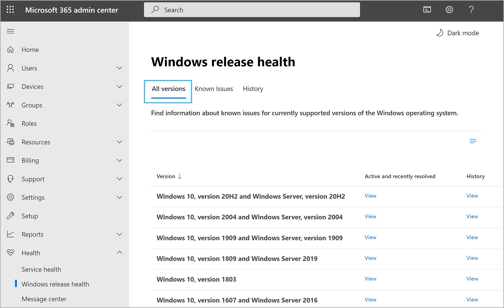
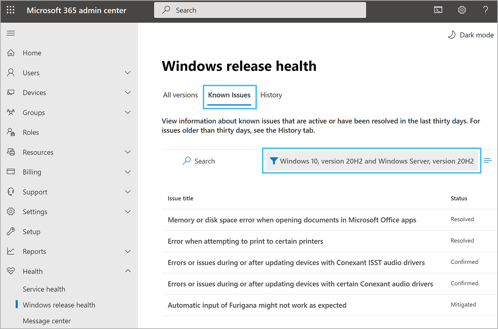
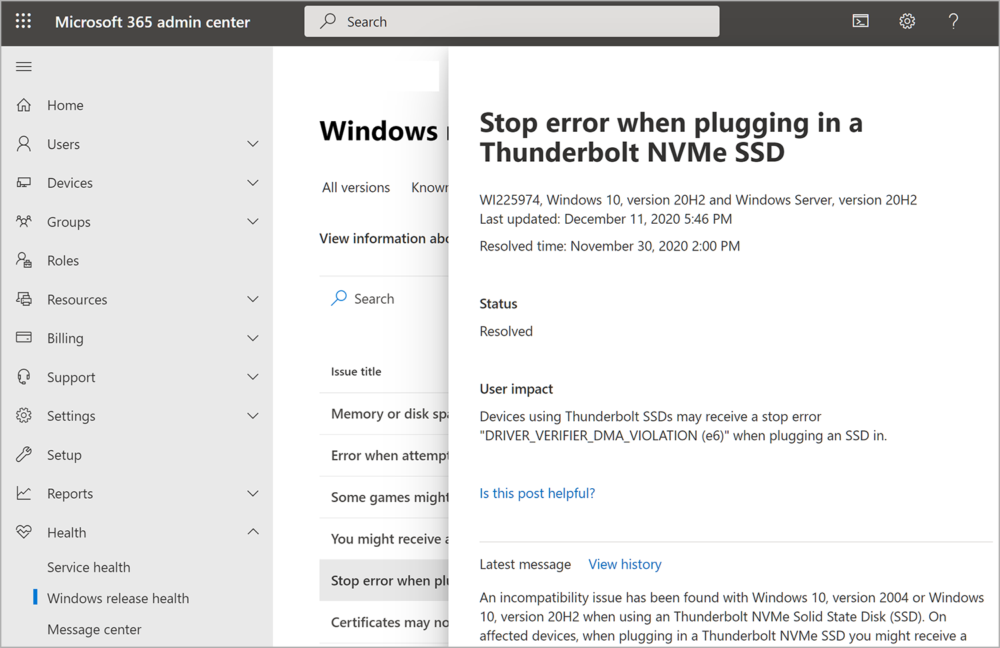
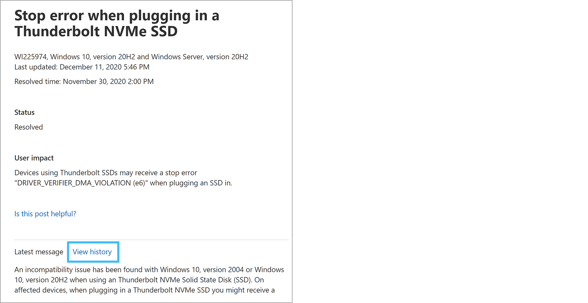
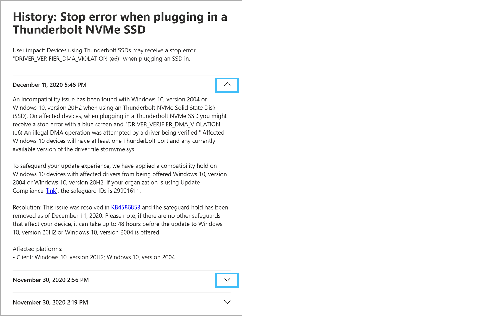

# How to check Windows release health

The Windows release health page in the Microsoft 365 admin center enables you to view the latest information on known issues for Windows monthly and feature updates. A known issue is an issue that has been identified in a Windows monthly update or feature update that impacts Windows devices. The Windows release health page is designed to inform you about known issues so you can troubleshoot issues your users may be experiencing and/or to determine when, and at what scale, to deploy an update in your organization. 

If you are unable to sign in to the Microsoft 365 admin portal, check the [Microsoft 365 service health](https://status.office365.com) status page to check for known issues preventing you from logging into your tenant. 

To be informed about the latest updates and releases, follow us on Twitter [@WindowsUpdate](https://twitter.com/windowsupdate).

## How to review Windows release health information

1. Go to the Microsoft 365 admin center at [https://admin.microsoft.com](https://go.microsoft.com/fwlink/p/?linkid=2024339), and sign in with an administrator account.

    > [!NOTE]
    > By default, the Windows release health page is available to individuals who have been assigned the global admin or service administrator role for their tenant. To allow Exchange, SharePoint, and Skype for Business admins to view the Windows release health page, you must first assign them to a Service admin role. For more information about roles that can view service health, see [About admin roles](https://docs.microsoft.com/microsoft-365/admin/add-users/about-admin-roles?view=o365-worldwide&preserve-view=true#roles-available-in-the-microsoft-365-admin-center).
  
2. To view Windows release health in the Microsoft 365 Admin Center, go to **Health > Windows release health**.

3. On the **Windows release health** page, you will have access to known issue information for all supported versions of the Windows operating system.

   The **All versions** tab (the default view) shows all Windows products with access to their posted known issues.

   

   A known issue is an issue that has been identified in a Windows monthly update or feature update that impacts Windows devices. The **Active and recently resolved** column provides a link to the **Known issues** tab filtered to the version selected. Selecting the **Known issues** tab will show known issues that are active or resolved within the last 30 days. 
   
   
   
   The **History** tab shows the history of known issues that have been resolved for up to 6 months.

   

   The known issue summary provides the following information:

   - **Title** - A summary of the problem.
   - **Version** - The name of the affected Windows product version.
   - **Status** - The current status of the issue.
   - **Originating KB** - The KB number where the issue was first identified.
   - **Originating build** - The build number for the KB.

   Select the **Issue title** to access more information, including a link to the history of all status updates posted while we work on a solution. Here is an example:

   
     
## Status definitions

In the **Windows release health** experience, every known issue is assigned as status. Those statuses are defined as follows:

| Status | Definition |
|:-----|:-----|
|**Reported** | An issue has been brought to the attention of Windows teams. At this stage, there is no confirmation that users are affected. |
|**Confirmed** | A known issue has been confirmed but details are emerging regarding the issue’s scope of impact, root cause, and mitigation steps. |
|**Mitigated** | A workaround is available and communicated to Windows customers. A known issue will stay in this state until a KB is released by Microsoft to resolve the known issue. |
|**Mitigated: External** | A Microsoft partner has a workaround for a known issue created by component released by them. A known issue will stay in this state until a fix is released by the partner to resolve the known issue. |
|**Resolved** | A solution has been released by Microsoft and has been documented in a KB article that will resolve the known issue once it’s deployed in the customer’s environment. |
|**Resolved: External** | A solution has been released by a Microsoft partner that will resolve the known issue once it’s deployed in the customer’s environment. |

## Known issue history

The Windows release health page lets you view the history of all status updates posted for a specific known issue. To view all past updates posted for a given issue, select **View history** on the issue detail page.
  

  
A list of all status updates posted in the selected timeframe will be displayed, as shown below. You can expand any row to view the specific information provided in that status update.  

  
## Frequently asked questions

### Windows release health coverage

-   **What is Windows release health?**   
    Windows release health is a Microsoft informational service created to keep licensed Windows customers aware of identified known issues and important announcements.

-   **Microsoft 365 service health content is specific to my tenants and services. Is the content in Windows release health specific to my Windows environment?**   
    Windows release health does not monitor user environments or collect customer environment information. In Windows release health, all known issue content across all supported Windows versions is published to all subscribed customers. Future iterations of the solution may target content based on customer location, industry, or Windows version.

-   **Where do I find Windows release health?**   
    After logging into Microsoft 365 admin center, expand the left-hand menu using **…Show All**, click **Health** and you’ll see **Windows release health**.

-   **Is the Windows release health content published to Microsoft 365 admin center the same as the content on Windows release health on Docs.microsoft.com?**   
    No. While the content is similar, you may see more issues and more technical details published to Windows release health on Microsoft 365 admin center to better support the IT admin. For example, you’ll find details to help you diagnose issues in your environment, steps to mitigate issues, and root cause analysis.

-   **How often will content be updated?**   
    In an effort to ensure Windows customers have important information as soon as possible, all major known issues will be shared with Windows customers on both Docs.microsoft.com and the Microsoft 365 admin center. We may also update the details available for Windows release health in the Microsoft 365 admin center when we have additional details on workarounds, root cause, or other information to help you be planful in your environment.

-   **Can I share this content publicly or with other Windows customers?**   
    Windows release health is provided to you as a licensed Windows customer and is not to be shared publicly.

-   **Is the content redundant? How is the content organized in the different tabs?**   
    Windows release health provides three tabs. The landing **All versions** tab allows you to click into a specific version of Windows. The Known issues tab shows the list of issues that are active or resolved in the past 30 days. The History tab shows a six-month history of known issues that have been resolved.

-   **How do I find information for the versions of Windows I’m managing?**   
    On the **All versions** tab, you can select any Windows version. This will take you to the Known issues tab filtered for the version you selected. The known issues tab provides the list of active known issues and those resolved in the last 30 days. This selection persists throughout your session until changed. From the History tab you can view the list of resolved issues for that version. To change versions, use the filter in the tab.

### Microsoft 365 Admin Center functions

-   **How do I best search for issues impacting my environment?**   
    You can search Microsoft 365 admin center pages using keywords. For Windows release health, go to the desired product page and search using KB numbers, build numbers, or keywords.

-   **How do I add other Windows admins?**   
    Using the left-hand menu, go to Users, then select the Active Users tab and follow the prompts to add a new user, or assign an existing user, to the role of “Service Support admin.”

-   **Why can’t I click to the KB article from the Known issues or History tabs?**   
    Within the issue description, you’ll find links to the KB articles. In the Known issue and History tabs, the entire row is a clickable entry to the issue’s Details pane.

-   **Microsoft 365 admin center has a mobile app but I don’t see Windows release health under the Health menu. Is this an open issue?**   
    We are working to build the Windows release health experience on mobile devices in a future release.

### Help and support
  
-   **What should I do if I have an issue with Windows that is not reported in Windows release health?**   
    Seek assistance through Premier support, the [Microsoft Support website](https://support.microsoft.com), or connect with your normal channels for Windows support.

-   **When reaching out to Support, they asked me for an advisory ID. What is this and where can it?**   
    The advisory ID can be found in the upper left-hand corner of the known issue Details pane. To find it, select the Known issue you’re seeking help on, click the Details pane and you’ll find the ID under the issue title. It will be the letters WI followed by a number, similar to “WI123456”.

-   **How can I learn more about expanding my use of Microsoft 365 admin center?**
    To learn more, see the [Microsoft 365 admin center documentation](https://docs.microsoft.com/microsoft-365/admin/admin-overview/about-the-admin-center).
