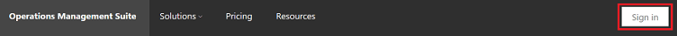
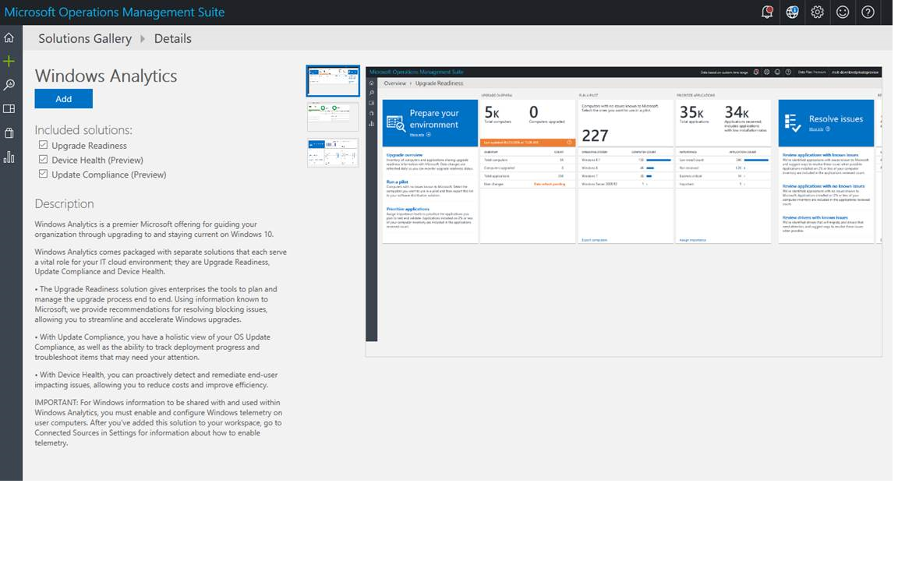
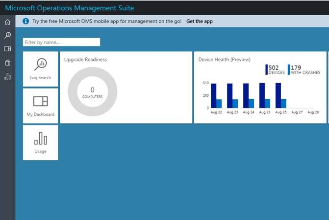

# Get started with Device Health

This topic explains the steps necessary to configure your environment for Windows Analytics: Device Health. 

Steps are provided in sections that follow the recommended setup process:
1.	Ensure that [prerequisites](#device-health-prerequisites) are met.
2.	[Add Device Health](#add-device-health-to-microsoft-operations-management-suite) to Microsoft Operations Management Suite.
3.	[Deploy your Commercial ID](#deploy-your-commercial-id-to-your-windows-10-devices and set the telemetry level) to your organization’s devices.

## Device Health prerequisites

Device Health has the following requirements: 
1. Device Health is currently only compatible with Windows 10 and Windows Server 2016 devices. The solution is intended to be used with desktop devices (Windows 10 workstations and laptops). 
2. The solution requires that at least the [enhanced level of telemetry](https://technet.microsoft.com/itpro/windows/manage/configure-windows-telemetry-in-your-organization#basic-level) is enabled on all devices that are intended to be displayed in the solution. To learn more about Windows telemetry, see [Configure Windows telemetry in your organization](/windows/configuration/configure-windows-telemetry-in-your-organization). 
3. The telemetry of your organization’s Windows devices must be successfully transmitted to Microsoft. Microsoft has specified [endpoints for each of the telemetry services](https://technet.microsoft.com/itpro/windows/manage/configure-windows-telemetry-in-your-organization#endpoints), which must be whitelisted by your organization so the data can be transmitted. The following table is taken from the article on telemetry endpoints and summarizes the use of each endpoint:

Service | Endpoint
--- | ---
Connected User Experience and Telemetry component | v10.vortex-win.data.microsoft.com<BR>settings-win.data.microsoft.com
Windows Error Reporting | watson.telemetry.microsoft.com
Online Crash Analysis | oca.telemetry.microsoft.com

>[!NOTE]  
> If your deployment includes devices running Windows 10 versions prior to Windows 10, version 1703, you must **exclude** *authentication* for the endpoints listed in Step 3. Windows Error Reporting did not support authenticating proxies until Windows 10, version 1703. See [Configure Windows telemetry in your organization](/windows/configuration/configure-windows-telemetry-in-your-organization) for steps to exclude authentication for these endpoints.


## Add Device Health to Microsoft Operations Management Suite

Device Health is offered as a solution in the Microsoft Operations Management Suite (OMS), a collection of cloud-based servicing for monitoring and automating your on-premise and cloud environments. For more information about OMS, see [Operations Management Suite overview](https://azure.microsoft.com/en-us/documentation/articles/operations-management-suite-overview/). 

**If you are already using OMS**, you’ll find Device Health in the Solutions Gallery. Select the **Device Health** tile in the gallery and then click **Add** on the solution's details page. Device Health is now visible in your workspace. While you're in the Solutions Gallery, you should consider installing the [Upgrade Readiness](../upgrade/use-upgrade-readiness-to-manage-windows-upgrades.md)  and [Update Compliance](update-compliance-monitor.md) solutions as well, if you haven't already.

**If you are not yet using OMS**, use the following steps to subscribe to OMS Device Health:

1.	Go to [Operations Management Suite](https://www.microsoft.com/en-us/cloud-platform/operations-management-suite) on Microsoft.com and click **Sign in**.
   [](images/uc-02.png)


2.	Sign in to Operations Management Suite (OMS). You can use either a Microsoft Account or a Work or School account to create a workspace. If your company is already using Azure Active Directory (Azure AD), use a Work or School account when you sign in to OMS. Using a Work or School account allows you to use identities from your Azure AD to manage permissions in OMS.
   [](images/uc-03.png)


3.	Create a new OMS workspace.

     [](images/uc-04.png)

4.	Enter a name for the workspace, select the workspace region, and provide the email address that you want associated with this workspace. Click **Create**.

    [](images/uc-05.png)

5.	If your organization already has an Azure subscription, you can link it to your workspace. Note that you may need to request access from your organization’s Azure administrator. If your organization does not have an Azure subscription, create a new one or select the default OMS Azure subscription from the list. If you do not yet have an Azure subscription, follow [this guide](https://blogs.technet.microsoft.com/upgradeanalytics/2016/11/08/linking-operations-management-suite-workspaces-to-microsoft-azure/) to create and link an Azure subscription to an OMS workspace.

    [](images/uc-06.png)

6.	To add Device Health to your workspace, go to the Solution Gallery, Select the **Device Health** tile and then select **Add** on the solution's detail page. While you have this dialog open, you should also consider adding the [Upgrade Readiness](../upgrade/use-upgrade-readiness-to-manage-windows-upgrades.md) and [Update Compliance](update-compliance-monitor.md) solutions as well, if you haven't already. To do so, just select the check boxes for those solutions.

    [](images/solution-bundle.png)

7.	Click the **Device Health** tile to configure the solution. The **Settings Dashboard** opens. In this example, both Upgrade Readiness and Device Health solutions have been added.

    [](images/OMS-after-adding-solution.jpg)


After you have added Device Health and devices have a Commercial ID, you will begin receiving data. It will typically take 24-48 hours for the first data to begin appearing. The following section explains how to deploy your Commercial ID to your Windows 10 devices.

>[!NOTE]
>You can unsubscribe from the Device Health solution if you no longer want to monitor your organization’s devices. User device data will continue to be shared with Microsoft while the opt-in keys are set on user devices and the proxy allows traffic.

## Deploy your Commercial ID to your Windows 10 devices and set the telemetry level

In order for your devices to show up in Windows Analytics: Device Health, they must be configured with your organization’s Commercial ID. This is so that Microsoft knows that a given device is a member of your organization and to feed that device’s data back to you. There are two primary methods for widespread deployment of your Commercial ID: Group Policy and Mobile Device Management (MDM). 

- Using Group Policy<BR><BR>
    Deploying your Commercial ID using Group Policy can be accomplished by configuring domain Group Policy Objects with the Group Policy Management Editor, or by configuring local Group Policy using the Local Group Policy Editor.
    1. In the console tree, navigate to **Computer Configuration** > **Administrative Templates** > **Windows Components** > **Data Collection and Preview Builds**
    2. Double-click **Configure the Commercial ID**
    3. In the **Options** box, under **Commercial Id**, type the Commercial ID GUID, and then click **OK**.<P>

- Using Microsoft Mobile Device Management (MDM)<BR><BR>
Microsoft’s Mobile Device Management can be used to deploy your Commercial ID to your organization’s devices. The Commercial ID is listed under **Provider/ProviderID/CommercialID**. You can find more information on deployment using MDM at the [DMClient Configuration Service Provider topic](https://msdn.microsoft.com/windows/hardware/commercialize/customize/mdm/dmclient-csp).  

## Perform checks to ensure and verify successful deployment

While you're waiting for the initial data to populate, there are some configuration details it's worth confirming to ensure that the necessary data connections are set up properly.

### Check for disabled Windows Error Reporting (WER)
 
If WER is disabled or redirected on your Windows devices, then reliability information cannot be shown in Device Health. 

Check these Registry settings in **HKEY_LOCAL_MACHINE\Software\Policies\Microsoft\Windows\Windows Error Reporting**:

- Verify that the value "Disabled" (REG_DWORD), if set, is 0.
- Verify that the value "DontSendAdditionalData" (REG_DWORD), if set, is 0.
- Verify that the value "CorporateWERServer" (REG_SZ) is not configured.
 
If you need further information on Windows Error Reporting (WER) settings, see [WER Settings](https://msdn.microsoft.com/library/windows/desktop/bb513638(v=vs.85).aspx).
 

### Endpoint connectivity

Devices must be able to reach the endpoints specified in the "Device Health prerequisites" section of this topic. 

>[!NOTE]  
> If your deployment includes devices running Windows 10 versions prior to Windows 10, version 1703, you must **exclude** *authentication* for the endpoints listed in Step 3 of the "Device Health prerequisites" section of this topic. Windows Error Reporting did not support authenticating proxies until Windows 10, version 1703. (If you need more information about telemetry endpoints and how to manage them, see [Configure Windows telemetry in your organization](https://docs.microsoft.com/windows/configuration/configure-windows-telemetry-in-your-organization).

If you are using proxy server authentication, it is worth taking extra care to check the configuration. Prior to Windows 10, version 1703, WER uploads error reports in the machine context. Both user (typically authenticated) and machine (typically anonymous) contexts require access through proxy servers to the diagnostic endpoints. In Windows 10, version 1703, and later WER will attempt to use the context of the user that is logged on for proxy authentication such that only the user account requires proxy access.

Therefore, it's important to ensure that both machine and user accounts have access to the endpoints using authentication (or to whitelist the endpoints so that outbound proxy authentication is not required).

To test access as a given user, you can run this Windows PowerShell cmdlet *while logged on as that user*: 

```powershell

$endPoints = @(
        'v10.vortex-win.data.microsoft.com'
        'settings-win.data.microsoft.com'
        'watson.telemetry.microsoft.com'
        'oca.telemetry.microsoft.com'
        'vortex.data.microsoft.com'
    )

$endPoints | %{ Test-NetConnection -ComputerName $_ -Port 443 -ErrorAction Continue } | Select-Object -Property ComputerName,TcpTestSucceeded

```

If this is successful, `TcpTestSucceeded` should return `True` for each of the endpoints.

To test access in the machine context (requires administrative rights), run the above as SYSTEM using PSexec or Task Scheduler, as in this example:

```powershell

[scriptblock]$accessTest = {
    $endPoints = @(
        'v10.vortex-win.data.microsoft.com'
        'settings-win.data.microsoft.com'
        'watson.telemetry.microsoft.com'
        'oca.telemetry.microsoft.com'
        'vortex.data.microsoft.com'
    )

    $endPoints | %{ Test-NetConnection -ComputerName $_ -Port 443 -ErrorAction Continue } | Select-Object -Property ComputerName,TcpTestSucceeded
}

$scriptFullPath = Join-Path $env:ProgramData "TestAccessToMicrosoftEndpoints.ps1"
$outputFileFullPath = Join-Path $env:ProgramData "TestAccessToMicrosoftEndpoints_Output.txt"
$accessTest.ToString() > $scriptFullPath
$null > $outputFileFullPath
$taskAction = New-ScheduledTaskAction -Execute 'powershell.exe' -Argument "-ExecutionPolicy Bypass -Command `"&{$scriptFullPath > $outputFileFullPath}`"" 
$taskTrigger = New-ScheduledTaskTrigger -Once -At (Get-Date).Addseconds(10)
$task = Register-ScheduledTask -User 'NT AUTHORITY\SYSTEM' -TaskName 'MicrosoftTelemetryAccessTest' -Trigger $taskTrigger -Action $taskAction -Force
Start-Sleep -Seconds 120
Unregister-ScheduledTask -TaskName $task.TaskName -Confirm:$false
Get-Content $outputFileFullPath

```

As in the other example, if this is successful, `TcpTestSucceeded` should return `True` for each of the endpoints.


## Related topics

[Use Device Health to monitor frequency and causes of device crashes](device-health-using.md)<BR>
For the latest information on Windows Analytics, including new features and usage tips, see the [Windows Analytics blog](https://blogs.technet.microsoft.com/upgradeanalytics)
