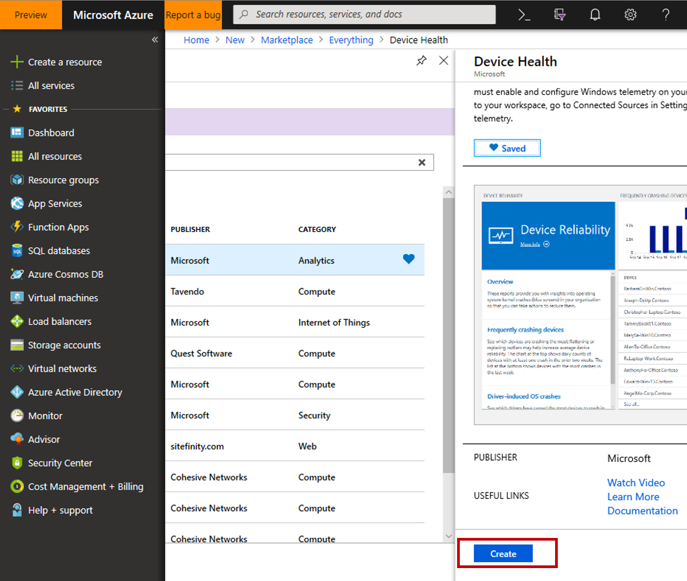
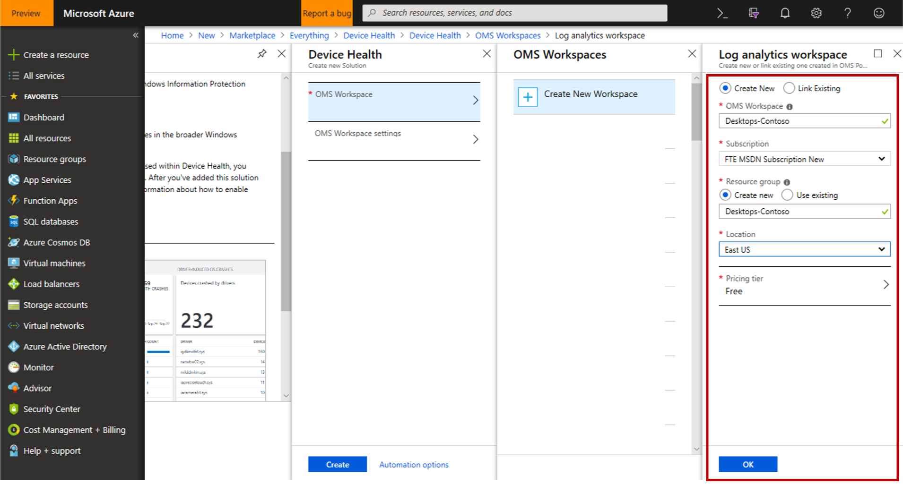
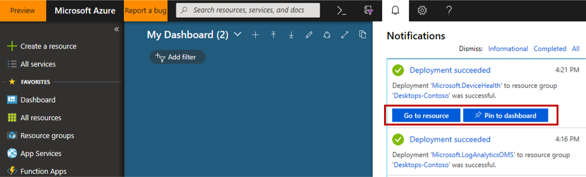

# Get started with Device Health

This topic explains the steps necessary to configure your environment for Windows Analytics Device Health. 

- [Get started with Device Health](#get-started-with-device-health)
    - [Add the Device Health solution to your Azure subscription](#add-the-device-health-solution-to-your-azure-subscription)
    - [Enroll devices in Windows Analytics](#enroll-devices-in-windows-analytics)
    - [Use Device Health to monitor device crashes, app crashes, sign-in failures, and more](#use-device-health-to-monitor-device-crashes-app-crashes-sign-in-failures-and-more)
    - [Related topics](#related-topics)

## Add the Device Health solution to your Azure subscription

Device Health is offered as a *solution* which you link to a new or existing [Azure Monitor](https://azure.microsoft.com/services/monitor/) *workspace* within your Azure *subscription*. To configure this, follows these steps:

1. Sign in to the [Azure Portal](https://portal.azure.com) with your work or school account or a Microsoft account. If you don't already have an Azure subscription you can create one (including free trial options) through the portal.
   
    >[!NOTE] 
    > Device Health is included at no additional cost with Windows 10 [education and enterprise licensing](https://docs.microsoft.com/windows/deployment/update/device-health-monitor#device-health-licensing). An Azure subscription is required for managing and using Device Health, but no Azure charges are expected to accrue to the subscription as a result of using Device Health. 

2. In the Azure portal select **Create a resource**, search for "Device Health", and then select **Create** on the **Device Health** solution.
    

    
3. Choose an existing workspace or create a new workspace to host the Device Health solution. 
    
    - If you are using other Windows Analytics solutions (Upgrade Readiness or Update Compliance) you should add Device Health to the same workspace.
    - If you are creating a new workspace, and your organization does not have policies governing naming conventions and structure, consider the following workspace settings to get started:
        - Choose a workspace name which reflects the scope of planned usage in your organization, for example *PC-Analytics*.
        - For the resource group setting select **Create new** and use the same name you chose for your new workspace.
        - For the location setting, choose the Azure region where you would prefer the data to be stored.
        - For the pricing tier select **per GB**.
4. Now that you have selected a workspace, you can go back to the Device Health blade and select **Create**.
    
5. Watch for a Notification (in the Azure portal) that "Deployment 'Microsoft.DeviceHealth' to resource group 'YourResourceGroupName' was successful." and then select **Go to resource** This might take several minutes to appear.
       
    - Suggestion: Choose the **Pin to Dashboard** option to make it easy to navigate to your newly added Device Health solution.
    - Suggestion: If a "resource unavailable" error occurs when navigating to the solution, try again after one hour.

## Enroll devices in Windows Analytics

Once you've added Device Health to a workspace in your Azure subscription, you can start enrolling the devices in your organization. For Device Health there are two key steps for enrollment:
1. Deploy your CommercialID (from Device Health Settings page) to your Windows 10 devices (typically using Group Policy or similar)
2. Ensure the Windows Diagnostic Data setting on devices is set to Enhanced or Full (typically using Group Policy or similar). Note that the [Limit Enhanced](https://docs.microsoft.com/windows/privacy/enhanced-diagnostic-data-windows-analytics-events-and-fields) policy can substantially reduce the amount of diagnostic data shared with Microsoft while still allowing Device Health to function.
For full enrollment instructions and troubleshooting, see [Enrolling devices in Windows Analytics](windows-analytics-get-started.md).

After enrolling your devices (by deploying your CommercialID and Windows Diagnostic Data settings), it may take 48-72 hours for the first data to appear in the solution. Until then, the Device Health tile will show "Performing Assessment."

## Use Device Health to monitor device crashes, app crashes, sign-in failures, and more

Once your devices are enrolled and data is flowing, you can move on to [Using Device Health](device-health-using.md).

>[!NOTE]
>You can remove the Device Health solution from your workspace if you no longer want to monitor your organization’s devices. Windows diagnostic data will continue to be shared with Microsoft as normal as per the diagnostic data sharing settings on the devices.

## Related topics

[Use Device Health to monitor frequency and causes of device crashes](device-health-using.md) 
For the latest information on Windows Analytics, including new features and usage tips, see the [Windows Analytics blog](https://blogs.technet.microsoft.com/upgradeanalytics)
