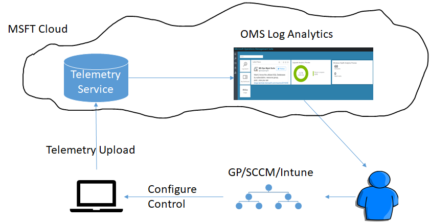

# Monitor the health of devices with Device Health

## Introduction

Device Health is the newest Windows Analytics solution that complements the existing Upgrade Readiness and Update Compliance solutions by providing IT with reports on some common problems the end users might experience so they can be proactively remediated, thus saving support calls and improving end-user productivity.

Like Upgrade Readiness and Update Compliance, Device Health is a solution built in Azure Portal, a cloud-based monitoring and automation service that has a flexible servicing subscription based on data usage and retention. This release is free for customers to try and will not incur charges on your Azure Portal workspace for its use. For more information about Azure Portal, see [Windows Analytics in the Azure Portal](windows-analytics-azure-portal.md) .

Device Health uses Windows diagnostic data that is part of all Windows 10 devices. If you have already employed Upgrade Readiness or Update Compliance solutions, all you need to do is select Device Health from the Azure Portal solution gallery and add it to your Azure Portal workspace. Device Health requires enhanced diagnostic data, so you might need to implement this policy if you've not already done so.

Device Health provides the following:

- Identification of devices that crash frequently, and therefore might need to be rebuilt or replaced
- Identification of device drivers that are causing device crashes, with suggestions of alternative versions of those drivers that might reduce the number of crashes
- Notification of Windows Information Protection misconfigurations that send prompts to end users
- No need for new complex customized infrastructure, thanks to cloud-connected access using Windows 10 diagnostic data

See the following topics in this guide for detailed information about configuring and using the Device Health solution:

- [Get started with Device Health](device-health-get-started.md): How to add Device Health to your environment.
- [Using Device Health](device-health-using.md): How to begin using Device Health.

An overview of the processes used by the Device Health solution is provided below.

## Device Health licensing

Use of Windows Analytics Device Health requires one of the following licenses:

- Windows 10 Enterprise or Windows 10 Education per-device with active Software Assurance
- Windows 10 Enterprise E3 or E5 per-device or per-user subscription (including Microsoft 365 F1, E3, or E5)
- Windows 10 Education A3 or A5 (including Microsoft 365 Education A3 or A5)
- Windows VDA E3 or E5 per-device or per-user subscription

You don't have to install Windows 10 Enterprise on a per-device basis--you just need enough of the above licenses for the number of devices using Device Health.

## Device Health architecture

The Device Health architecture and data flow is summarized by the following five-step process:

**(1)** User computers send diagnostic data to a secure Microsoft data center using the Microsoft Data Management Service. 
**(2)** Diagnostic data is analyzed by the Microsoft Telemetry Service. 
**(3)** Diagnostic data is pushed from the Microsoft Telemetry Service to your Azure Portal workspace. 
**(4)** Diagnostic data is available in the Device Health solution. 
**(5)** You are now able to proactively monitor Device Health issues in your environment. 

These steps are illustrated in following diagram:

 

>[!NOTE]
>This process assumes that Windows diagnostic data is enabled and data sharing is enabled as described in [Enrolling devices in Windows Analytics](windows-analytics-get-started.md).

 
## Related topics

[Get started with Device Health](device-health-get-started.md)

[Use Device Health to monitor frequency and causes of device crashes](device-health-using.md)

For the latest information on Windows Analytics, including new features and usage tips, see the [Windows Analytics blog](https://blogs.technet.microsoft.com/upgradeanalytics)
