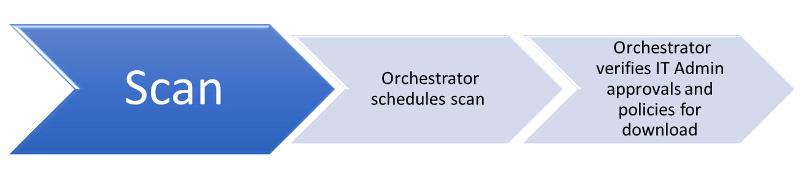
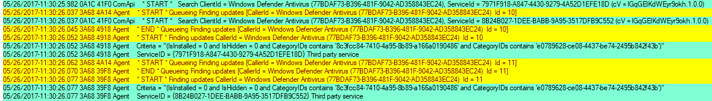
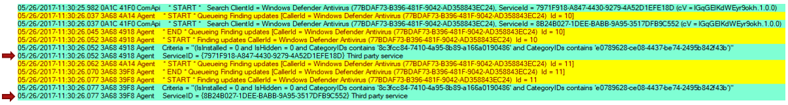
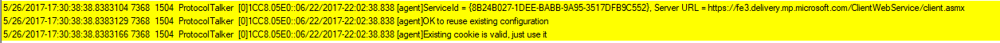
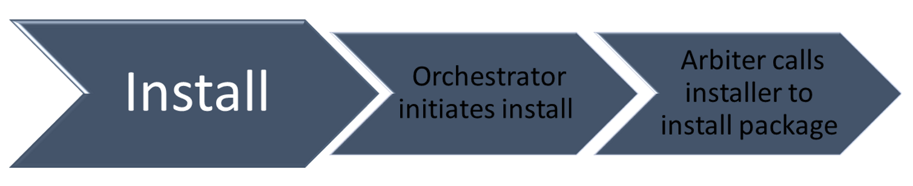
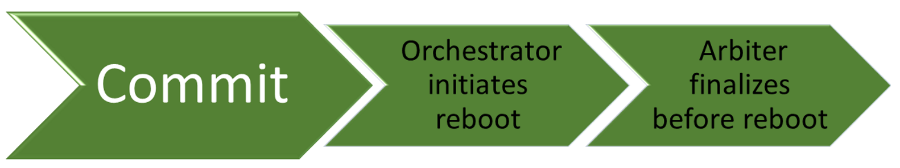

# How does Windows Update work?

>Applies to: Windows 10

The Windows Update workflow has four core areas of functionality: 

### Scan

1. Orchestrator schedules the scan.
2. Orchestrator verifies admin approvals and policies for download.

### Download
1. Orchestrator initiates downloads.
2. Windows Update downloads manifest files and provides them to the arbiter.
3. The arbiter evaluates the manifest and tells the Windows Update client to download files.
4. Windows Update client downloads files in a temporary folder.
5. The arbiter stages the downloaded files.

### Install
1. Orchestrator initates the installation.
2. The arbiter calls the installer to install the package.

### Commit
1. Orchestrator initiates a restart.
2. The arbiter finalizes before the restart.

## How updating works 
During the updating process, the Windows Update Orchestrator operates in the background to scan, download, and install updates. It does this automatically, according to your settings, and in a silent manner that doesn’t disrupt your computer usage. 

## Scanning updates 

The Windows Update Orchestrator on your PC checks the Microsoft Update server or your WSUS endpoint for new updates at random intervals. The randomization ensures that the Windows Update server isn't overloaded with requests all at the same time. The Update Orchestrator searches only for updates that have been added since the last time updates were searched, allowing it to find updates quickly and efficiently.  

When checking for updates, the Windows Update Orchestrator evaluates whether the update is appropriate for your computer using guidelines defined by the publisher of the update, for example, Microsoft Office including enterprise group policies. 

Make sure you're familiar with the following terminology related to Windows Update scan:

|Term|Definition|
|----|----------|
|Update|We use this term to mean a lot of different things, but in this context it's the actual patch or change.| 
|Bundle update|An update that contains 1-N child updates; doesn't contain payload itself.| 
|Child update|Leaf update that's bundled by another update; contains payload.| 
|Detectoid update|A special 'update' that contains "IsInstalled" applicability rule only and no payload. Used for prereq evaluation.| 
|Category update|A special 'detectoid' that has always true IsInstalled rule. Used for grouping updates and for client to filter updates. |
|Full scan|Scan with empty datastore.| 
|Delta scan|Scan with updates from previous scan already cached in datastore.| 
|Online scan|Scan that hits network and goes against server on cloud. |
|Offline scan|Scan that doesn't hit network and goes against local datastore. Only useful if online scan has been performed before. |
|CatScan|Category scan where caller can specify a categoryId to get updates published under the categoryId.| 
|AppCatScan|Category scan where caller can specify an AppCategoryId to get apps published under the appCategoryId.| 
|Software sync|Part of the scan that looks at software updates only (OS and apps).|  
|Driver sync|Part of the scan that looks at Driver updates only. This is run after Software sync and is optional.| 
|ProductSync|Attributes based sync, where client provides a list of device, product and caller attributes ahead of time to allow service to evaluate applicability in the cloud. |

### How Windows Update scanning works 
 
Windows Update takes the following sets of actions when it runs a scan. 

#### Starts the scan for updates  
When users start scanning in Windows Update through the Settings panel, the following occurs:  

- The scan first generates a “ComApi” message. The caller (Windows Defender Antivirus) tells the WU engine to scan for updates. 
- "Agent" messages: queueing the scan, then actually starting the work: 
   - Updates are identified by the different IDs ("Id = 10", "Id = 11") and from the different thread ID numbers. 
   - Windows Update uses the thread ID filtering to concentrate on one particular task. 

      

#### Identifies service IDs

- Service IDs indicate which update source is being scanned. 
   Note The next screen shot shows Microsoft Update and the Flighting service. 

- The Windows Update engine treats every service as a separate entity, even though multiple services may contain the same updates. 
   
- Common service IDs 

   >[!IMPORTANT]
   >ServiceId here identifies a client abstraction, not any specific service in the cloud. No assumption should be made of which server a serviceId is pointing to, it's totally controlled by the SLS responses. 
 
|Service|ServiceId|
|-------|---------| 
|Unspecified / Default|WU, MU or WSUS  00000000-0000-0000-0000-000000000000 |
|WU|9482F4B4-E343-43B6-B170-9A65BC822C77| 
|MU|7971f918-a847-4430-9279-4a52d1efe18d| 
|Store|855E8A7C-ECB4-4CA3-B045-1DFA50104289| 
|OS Flighting|8B24B027-1DEE-BABB-9A95-3517DFB9C552| 
|WSUS or SCCM|Via ServerSelection::ssManagedServer  3DA21691-E39D-4da6-8A4B-B43877BCB1B7 |
|Offline scan service|Via IUpdateServiceManager::AddScanPackageService| 

#### Finds network faults
Common update failure is caused due to network issues. To find the root of the issue:  

- Look for "ProtocolTalker" messages to see client-server sync network traffic. 
- "SOAP faults" can be either client- or server-side issues; read the message. 
- The WU client uses SLS (Service Locator Service) to discover the configurations and endpoints of Microsoft network update sources – WU, MU, Flighting. 

   >[!NOTE]
   >Warning messages for SLS can be ignored if the search is against WSUS/SCCM. 

- On sites that only use WSUS/SCCM, the SLS may be blocked at the firewall. In this case the SLS request will fail, and can’t scan against Windows Update or Microsoft Update but can still scan against WSUS/SCCM, since it’s locally configured.
   
   
## Downloading updates 

Once the Windows Update Orchestrator determines which updates apply to your computer, it will begin downloading the updates, if you have selected the option to automatically download updates. It does this in the background without interrupting your normal use of the computer.  

To ensure that your other downloads aren’t affected or slowed down because updates are downloading, Windows Update uses the Delivery Optimization (DO) technology which downloads updates and reduces bandwidth consumption. 
 
For more information see [Configure Delivery Optimization for Windows 10 updates](waas-delivery-optimization.md). 

## Installing updates 

When an update is applicable, the "Arbiter" and metadata are downloaded. Depending on your Windows Update settings, when downloading is complete, the Arbiter will gather details from the device, and compare that with the downloaded metadata to create an "action list".  

The action list describes all the files needed from WU, and what the install agent (such as CBS or Setup) should do with them. The action list is provided to the install agent along with the payload to begin the installation. 
 
## Committing Updates 

When the option to automatically install updates is configured, the Windows Update Orchestrator, in most cases, automatically restarts the PC for you after installing the updates. This is necessary because your PC may be insecure, or not fully updated, until a restart is completed. You can use Group Policy settings, mobile device management (MDM), or  the registry (not recommended) to configure when devices will restart after a Windows 10 update is installed.  

For more information see [Manage device restarts after updates](waas-restart.md). 
