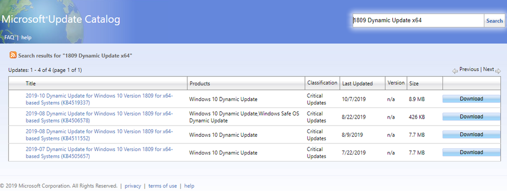

# Update Windows 10 media with Dynamic Update

**Applies to**: Windows 10

This topic explains how to acquire and apply Dynamic Update packages to existing Windows 10 images *prior to deployment* and includes Windows PowerShell scripts you can use to automate this process.

Volume-licensed media is available for each release of Windows 10 in the Volume Licensing Service Center (VLSC) and other relevant channels such as Windows Update for Business, Windows Server Update Services (WSUS), and Visual Studio Subscriptions. You can use Dynamic Update to ensure that Windows 10 devices have the latest feature update packages as part of an in-place upgrade while preserving language pack and Features on Demand (FODs) that might have been previously installed. Dynamic Update also eliminates the need to install a separate quality update as part of the in-place upgrade process.

## Dynamic Update

Whenever installation of a feature update starts (whether from media or an environment connected to Windows Update), *Dynamic Update* is one of the first steps. Windows 10 Setup contacts a Microsoft endpoint to fetch Dynamic Update packages, and then applies those updates to your operating system installation media. The update packages includes the following kinds of updates:

- Updates to Setup.exe binaries or other files that Setup uses for feature updates
- Updates for the "safe operating system" (SafeOS) that is used for the Windows recovery environment
- Updates to the servicing stack necessary to complete the feature update (see [Servicing stack updates](servicing-stack-updates.md) for more information)
- The latest cumulative (quality) update
- Updates to applicable drivers already published by manufacturers specifically intended for Dynamic Update

Dynamic Update preserves language pack and Features on Demand packages by reacquiring them.

Devices must be able to connect to the internet to obtain Dynamic Updates. In some environments, it's not an option to obtain Dynamic Updates. You can still do a media-based feature update by acquiring Dynamic Update packages and applying it to the image prior to starting Setup on the device.

## Acquire Dynamic Update packages

You can obtain Dynamic Update packages from the [Microsoft Update Catalog](https://www.catalog.update.microsoft.com/Home.aspx). At that site, use the search bar in the upper right to find the Dynamic Update packages for a particular release. For example, you could enter *1809 Dynamic Update x64*, which would return results like this:



The various Dynamic Update packages might not all be present in the results from a single search, so you might have to search with different keywords to find all of the updates. And you'll need to check various parts of the results to be sure you've identified the needed files. This table shows in **bold** the key items to search for or look for in the results. For example, to find the relevant "Setup Dynamic Update," you'll have to check the detailed description for the download by selecting the link in the **Title** column of the search results.

|To find this Dynamic Update packages, search for or check the results here-->  |Title  |Product  |Description (select the **Title** link to see **Details**)  |
|---------|---------|---------|---------|
|Safe OS Dynamic Update      | 2019-08 Dynamic Update...        | Windows 10 Dynamic Update,Windows **Safe OS Dynamic Update**         | ComponentUpdate:        |
|Setup Dynamic Update     | 2019-08 Dynamic Update...         | Windows 10 Dynamic Update        | **SetupUpdate**        |
|Latest cumulative update     | 2019-08 **Cumulative Update for Windows 10**    |  Windows 10       |  Install this update to resolve issues in Windows...       |
|Servicing stack Dynamic Update     | 2019-09 **Servicing Stack Update for Windows 10**        |  Windows 10...       | Install this update to resolve issues in Windows...        |

If you want to customize the image with additional languages or Features on Demand, download supplemental media ISO files from the [Volume Licensing Service Center](https://www.microsoft.com/licensing/servicecenter/default.aspx). For example, since Dynamic Update will be disabled for your devices, and if users require specific Features on Demand, you can preinstall these into the image.

## Update Windows 10 installation media

Properly updating the installation media involves a large number of actions operating on several different targets (image files). Some actions are repeated on different targets. The target images files include:

- Windows Preinstallation Environment (WinPE): a small operating system used to install, deploy, and repair Windows operating systems
- Windows Recovery Environment (WinRE): repairs common causes of unbootable operating systems. WinRE is based on WinPE and can be customized with additional drivers, languages, optional packages, and other troubleshooting or diagnostic tools.
- Windows operating system: one or more editions of Windows 10 stored in \sources\install.wim
- Windows installation media: the complete collection of files and folders in the Windows 10 installation media. For example, \sources folder, \boot folder, Setup.exe, and so on.

This table shows the correct sequence for applying the various tasks to the files. For example, the full sequence starts with adding the servicing stack update to WinRE (1) and concludes with adding the Dynamic Update for Setup to the new media (26).

|Task  |WinRE (winre.wim)  |WinPE (boot.wim)  |Operating system (install.wim)  | New media |
|---------|---------|---------|---------|------|
|Add servicing stack Dynamic Update     |  1       | 9        | 18        |
|Add language pack     | 2        |   10      |  19       |
|Add localized optional packages     |  3       | 11        |         |
|Add font support     |  4       |  12       |         |
|Add text-to-speech      | 5        |   13      |         |
|Update Lang.ini     |         |  14       |         |
|Add Features on Demand     |         |         |  20       |
|Add Safe OS Dynamic Update     | 6        |        |       |
|Add Setup Dynamic Update     |         |         |         | 26
|Add latest cumulative update     |         | 15        | 21        |
|Clean up the image     |  7       | 16        | 22        |
|Add Optional Components     |         |         |  23       |
|Add .NET and .NET cumulative updates     |         |        | 24        |
|Export image     | 8        |  17       | 25        |

### Multiple Windows editions

The main operating system file (install.wim) contains multiple editions of Windows 10. It’s possible that only an update for a given edition is required to deploy it, based on the index. Or, it might be that all editions need an update. Further, ensure that languages are installed before Features on Demand, and the latest cumulative update is always applied last.

### Additional languages and features

You don't have to add more languages and features to the image to accomplish the updates, but it's an opportunity to customize the image with more languages, Optional Components, and Features on Demand beyond what is in your starting image. To do this, it's important to make these changes in the correct order: first apply servicing stack updates, followed by language additions, then by feature additions, and finally the latest cumulative update. The provided sample script installs a second language (in this case Japanese (ja-JP)). Since this language is backed by an lp.cab, there's no need to add a Language Experience Pack. Japanese is added to both the main operating system and to the recovery environment to allow the user to see the recovery screens in Japanese. This includes adding localized versions of the packages currently installed in the recovery image.

Optional Components, along with the .NET feature, can be installed offline, however doing so creates pending operations that require the device to restart. As a result, the call to perform image cleanup would fail. There are two options to avoid this. One option is to skip the image cleanup step, though that will result in a larger install.wim. Another option is to install the .NET and Optional Components in a step after cleanup but before export. This is the option in the sample script. By doing this, you will have to start with the original install.wim (with no pending actions) when you maintain or update the image the next time (for example, the next month).

## Windows PowerShell scripts to apply Dynamic Updates to an existing image

These examples are for illustration only, and therefore lack error handling. The script assumes that the following packages are stored locally in this folder structure:

|Folder  |Description  |
|---------|---------|
|C:\mediaRefresh     |  Parent folder that contains the PowerShell script       |
|C:\mediaRefresh\oldMedia |  Folder that contains the original media that will be refreshed. For example, contains Setup.exe, and \sources folder.       |
|C:\mediaRefresh\newMedia     | Folder that will contain the updated media. It is copied from \oldMedia, then used as the target for all update and cleanup operations.        |

### Get started

The script starts by declaring global variables and creating folders to use for mounting images. Then, make a copy of the original media, from \oldMedia to \newMedia, keeping the original media in case there is a script error and it's necessary to start over from a known state. Also, it will provide a comparison of old versus new media to evaluate changes. To ensure that the new media updates, make sure they are not read-only.

```powershell
#Requires -RunAsAdministrator

function Get-TS { return "{0:HH:mm:ss}" -f [DateTime]::Now }

Write-Output "$(Get-TS): Starting media refresh"

# Declare language for showcasing adding optional localized components
$LANG  = "ja-jp"
$LANG_FONT_CAPABILITY = "jpan"

# Declare media for FOD and LPs
$FOD_ISO_PATH    = "C:\mediaRefresh\packages\FOD-PACKAGES_OEM_PT1_amd64fre_MULTI.iso"
$LP_ISO_PATH     = "C:\mediaRefresh\packages\CLIENTLANGPACKDVD_OEM_MULTI.iso"

# Declare Dynamic Update packages
$LCU_PATH        = "C:\mediaRefresh\packages\LCU.msu"
$SSU_PATH        = "C:\mediaRefresh\packages\SSU_DU.msu"
$SETUP_DU_PATH   = "C:\mediaRefresh\packages\Setup_DU.cab"
$SAFE_OS_DU_PATH = "C:\mediaRefresh\packages\SafeOS_DU.cab"
$DOTNET_CU_PATH  = "C:\mediaRefresh\packages\DotNet_CU.msu"

# Declare folders for mounted images and temp files
$MEDIA_OLD_PATH  = "C:\mediaRefresh\oldMedia"
$MEDIA_NEW_PATH  = "C:\mediaRefresh\newMedia"
$WORKING_PATH    = "C:\mediaRefresh\temp"
$MAIN_OS_MOUNT   = "C:\mediaRefresh\temp\MainOSMount"
$WINRE_MOUNT     = "C:\mediaRefresh\temp\WinREMount"
$WINPE_MOUNT     = "C:\mediaRefresh\temp\WinPEMount"

# Mount the language pack ISO
Write-Output "$(Get-TS): Mounting LP ISO"
$LP_ISO_DRIVE_LETTER = (Mount-DiskImage -ImagePath $LP_ISO_PATH -ErrorAction stop | Get-Volume).DriveLetter

# Declare language related cabs
$WINPE_OC_PATH              = "$LP_ISO_DRIVE_LETTER`:\Windows Preinstallation Environment\x64\WinPE_OCs"
$WINPE_OC_LANG_PATH         = "$WINPE_OC_PATH\$LANG"
$WINPE_OC_LANG_CABS         = Get-ChildItem $WINPE_OC_LANG_PATH -Name
$WINPE_OC_LP_PATH           = "$WINPE_OC_LANG_PATH\lp.cab"
$WINPE_FONT_SUPPORT_PATH    = "$WINPE_OC_PATH\WinPE-FontSupport-$LANG.cab"
$WINPE_SPEECH_TTS_PATH      = "$WINPE_OC_PATH\WinPE-Speech-TTS.cab"
$WINPE_SPEECH_TTS_LANG_PATH = "$WINPE_OC_PATH\WinPE-Speech-TTS-$LANG.cab"
$OS_LP_PATH                 = "$LP_ISO_DRIVE_LETTER`:\x64\langpacks\Microsoft-Windows-Client-Language-Pack_x64_$LANG.cab"

# Mount the Features on Demand ISO
Write-Output "$(Get-TS): Mounting FOD ISO"
$FOD_ISO_DRIVE_LETTER = (Mount-DiskImage -ImagePath $FOD_ISO_PATH -ErrorAction stop | Get-Volume).DriveLetter
$FOD_PATH = $FOD_ISO_DRIVE_LETTER + ":\"

# Create folders for mounting images and storing temporary files
New-Item -ItemType directory -Path $WORKING_PATH -ErrorAction Stop | Out-Null
New-Item -ItemType directory -Path $MAIN_OS_MOUNT -ErrorAction stop | Out-Null
New-Item -ItemType directory -Path $WINRE_MOUNT -ErrorAction stop | Out-Null
New-Item -ItemType directory -Path $WINPE_MOUNT -ErrorAction stop | Out-Null

# Keep the original media, make a copy of it for the new, updated media.
Write-Output "$(Get-TS): Copying original media to new media path"
Copy-Item -Path $MEDIA_OLD_PATH"\*" -Destination $MEDIA_NEW_PATH -Force -Recurse -ErrorAction stop | Out-Null
Get-ChildItem -Path $MEDIA_NEW_PATH -Recurse | Where-Object { -not $_.PSIsContainer -and $_.IsReadOnly } | ForEach-Object { $_.IsReadOnly = $false }
```

### Update WinRE

The script assumes that only a single edition is being updated, indicated by Index = 1 (Windows 10 Education Edition). Then the script mounts the image, saves Winre.wim to the working folder, and mounts it. It then applies servicing stack Dynamic Update, since its components are used for updating other components. Since the script is optionally adding Japanese, it adds the language pack to the image, and installs the Japanese versions of all optional packages already installed in Winre.wim. Then, it applies the Safe OS Dynamic Update package.

It finishes by cleaning and exporting the image to reduce the image size.

> [!NOTE]
> Skip adding the latest cumulative update to Winre.wim because it contains unnecessary components in the recovery environment. The components that are updated and applicable are contained in the safe operating system Dynamic Update package. This also helps to keep the image small.

```powershell
# Mount the main operating system, used throughout the script
Write-Output "$(Get-TS): Mounting main OS"
Mount-WindowsImage -ImagePath $MEDIA_NEW_PATH"\sources\install.wim" -Index 1 -Path $MAIN_OS_MOUNT -ErrorAction stop| Out-Null  

#
# update Windows Recovery Environment (WinRE)
#
Copy-Item -Path $MAIN_OS_MOUNT"\windows\system32\recovery\winre.wim" -Destination $WORKING_PATH"\winre.wim" -Force -Recurse -ErrorAction stop | Out-Null
Write-Output "$(Get-TS): Mounting WinRE"
Mount-WindowsImage -ImagePath $WORKING_PATH"\winre.wim" -Index 1 -Path $WINRE_MOUNT -ErrorAction stop | Out-Null

# Add servicing stack update
Write-Output "$(Get-TS): Adding package $SSU_PATH"
Add-WindowsPackage -Path $WINRE_MOUNT -PackagePath $SSU_PATH -ErrorAction stop | Out-Null  

#
# Optional: Add the language to recovery environment
#
# Install lp.cab cab
Write-Output "$(Get-TS): Adding package $WINPE_OC_LP_PATH"
Add-WindowsPackage -Path $WINRE_MOUNT -PackagePath $WINPE_OC_LP_PATH -ErrorAction stop | Out-Null  

# Install language cabs for each optional package installed
$WINRE_INSTALLED_OC = Get-WindowsPackage -Path $WINRE_MOUNT
Foreach ($PACKAGE in $WINRE_INSTALLED_OC) {

    if ( ($PACKAGE.PackageState -eq "Installed") `
            -and ($PACKAGE.PackageName.startsWith("WinPE-")) `
            -and ($PACKAGE.ReleaseType -eq "FeaturePack") ) {

        $INDEX = $PACKAGE.PackageName.IndexOf("-Package")
        if ($INDEX -ge 0) {
            $OC_CAB = $PACKAGE.PackageName.Substring(0, $INDEX) + "_" + $LANG + ".cab"
            if ($WINPE_OC_LANG_CABS.Contains($OC_CAB)) {
                $OC_CAB_PATH = Join-Path $WINPE_OC_LANG_PATH $OC_CAB
                Write-Output "$(Get-TS): Adding package $OC_CAB_PATH"
                Add-WindowsPackage -Path $WINRE_MOUNT -PackagePath $OC_CAB_PATH -ErrorAction stop | Out-Null  
            }
        }
    }
}

# Add font support for the new language
if ( (Test-Path -Path $WINPE_FONT_SUPPORT_PATH) ) {
    Write-Output "$(Get-TS): Adding package $WINPE_FONT_SUPPORT_PATH"
    Add-WindowsPackage -Path $WINRE_MOUNT -PackagePath $WINPE_FONT_SUPPORT_PATH -ErrorAction stop | Out-Null
}

# Add TTS support for the new language
if (Test-Path -Path $WINPE_SPEECH_TTS_PATH) {
    if ( (Test-Path -Path $WINPE_SPEECH_TTS_LANG_PATH) ) {

        Write-Output "$(Get-TS): Adding package $WINPE_SPEECH_TTS_PATH"
        Add-WindowsPackage -Path $WINRE_MOUNT -PackagePath $WINPE_SPEECH_TTS_PATH -ErrorAction stop | Out-Null

        Write-Output "$(Get-TS): Adding package $WINPE_SPEECH_TTS_LANG_PATH"
        Add-WindowsPackage -Path $WINRE_MOUNT -PackagePath $WINPE_SPEECH_TTS_LANG_PATH -ErrorAction stop | Out-Null
    }
}

# Add Safe OS
Write-Output "$(Get-TS): Adding package $SAFE_OS_DU_PATH"
Add-WindowsPackage -Path $WINRE_MOUNT -PackagePath $SAFE_OS_DU_PATH -ErrorAction stop | Out-Null

# Perform image cleanup
Write-Output "$(Get-TS): Performing image cleanup on WinRE"
DISM /image:$WINRE_MOUNT /cleanup-image /StartComponentCleanup | Out-Null

# Dismount
Dismount-WindowsImage -Path $WINRE_MOUNT  -Save -ErrorAction stop | Out-Null

# Export
Write-Output "$(Get-TS): Exporting image to $WORKING_PATH\winre2.wim"
Export-WindowsImage -SourceImagePath $WORKING_PATH"\winre.wim" -SourceIndex 1 -DestinationImagePath $WORKING_PATH"\winre2.wim" -ErrorAction stop | Out-Null
Move-Item -Path $WORKING_PATH"\winre2.wim" -Destination $WORKING_PATH"\winre.wim" -Force -ErrorAction stop | Out-Null
```

### Update WinPE

This script is similar to the one that updates WinRE, but instead it mounts Boot.wim, applies the packages with the latest cumulative update last, and saves. It repeats this for all images inside of Boot.wim, typically two images. It starts by applying the servicing stack Dynamic Update. Since the script is customizing this media with Japanese, it installs the language pack from the WinPE folder on the language pack ISO. Additionally, add font support and text to speech (TTS) support. Since the script is adding a new language, it rebuilds lang.ini, used to identify languages installed in the image. Finally, it cleans and exports Boot.wim, and copies it back to the new media.

```powershell
#
# update Windows Preinstallation Environment (WinPE)
#

# Get the list of images contained within WinPE
$WINPE_IMAGES = Get-WindowsImage -ImagePath $MEDIA_NEW_PATH"\sources\boot.wim"

Foreach ($IMAGE in $WINPE_IMAGES) {

    # update WinPE
    Write-Output "$(Get-TS): Mounting WinPE"
    Mount-WindowsImage -ImagePath $MEDIA_NEW_PATH"\sources\boot.wim" -Index $IMAGE.ImageIndex -Path $WINPE_MOUNT -ErrorAction stop | Out-Null  

    # Add SSU
    Write-Output "$(Get-TS): Adding package $SSU_PATH"
    Add-WindowsPackage -Path $WINPE_MOUNT -PackagePath $SSU_PATH -ErrorAction stop | Out-Null

    # Install lp.cab cab
    Write-Output "$(Get-TS): Adding package $WINPE_OC_LP_PATH"
    Add-WindowsPackage -Path $WINPE_MOUNT -PackagePath $WINPE_OC_LP_PATH -ErrorAction stop | Out-Null  

    # Install language cabs for each optional package installed
    $WINPE_INSTALLED_OC = Get-WindowsPackage -Path $WINPE_MOUNT
    Foreach ($PACKAGE in $WINPE_INSTALLED_OC) {

        if ( ($PACKAGE.PackageState -eq "Installed") `
                -and ($PACKAGE.PackageName.startsWith("WinPE-")) `
                -and ($PACKAGE.ReleaseType -eq "FeaturePack") ) {

            $INDEX = $PACKAGE.PackageName.IndexOf("-Package")
            if ($INDEX -ge 0) {

                $OC_CAB = $PACKAGE.PackageName.Substring(0, $INDEX) + "_" + $LANG + ".cab"
                if ($WINPE_OC_LANG_CABS.Contains($OC_CAB)) {
                    $OC_CAB_PATH = Join-Path $WINPE_OC_LANG_PATH $OC_CAB
                    Write-Output "$(Get-TS): Adding package $OC_CAB_PATH"
                    Add-WindowsPackage -Path $WINPE_MOUNT -PackagePath $OC_CAB_PATH -ErrorAction stop | Out-Null  
                }
            }
        }
    }

    # Add font support for the new language
    if ( (Test-Path -Path $WINPE_FONT_SUPPORT_PATH) ) {
        Write-Output "$(Get-TS): Adding package $WINPE_FONT_SUPPORT_PATH"
        Add-WindowsPackage -Path $WINPE_MOUNT -PackagePath $WINPE_FONT_SUPPORT_PATH -ErrorAction stop | Out-Null
    }

    # Add TTS support for the new language
    if (Test-Path -Path $WINPE_SPEECH_TTS_PATH) {
        if ( (Test-Path -Path $WINPE_SPEECH_TTS_LANG_PATH) ) {

            Write-Output "$(Get-TS): Adding package $WINPE_SPEECH_TTS_PATH"
            Add-WindowsPackage -Path $WINPE_MOUNT -PackagePath $WINPE_SPEECH_TTS_PATH -ErrorAction stop | Out-Null

            Write-Output "$(Get-TS): Adding package $WINPE_SPEECH_TTS_LANG_PATH"
            Add-WindowsPackage -Path $WINPE_MOUNT -PackagePath $WINPE_SPEECH_TTS_LANG_PATH -ErrorAction stop | Out-Null
        }
    }

    # Generates a new Lang.ini file which is used to define the language packs inside the image
    if ( (Test-Path -Path $WINPE_MOUNT"\sources\lang.ini") ) {
        Write-Output "$(Get-TS): Updating lang.ini"
        DISM /image:$WINPE_MOUNT /Gen-LangINI /distribution:$WINPE_MOUNT | Out-Null
    }

    # Add latest cumulative update
    Write-Output "$(Get-TS): Adding package $LCU_PATH"
    Add-WindowsPackage -Path $WINPE_MOUNT -PackagePath $LCU_PATH -ErrorAction stop | Out-Null  

    # Perform image cleanup
    Write-Output "$(Get-TS): Performing image cleanup on WinPE"
    DISM /image:$WINPE_MOUNT /cleanup-image /StartComponentCleanup | Out-Null

    # Dismount
    Dismount-WindowsImage -Path $WINPE_MOUNT -Save -ErrorAction stop | Out-Null

    #Export WinPE
    Write-Output "$(Get-TS): Exporting image to $WORKING_PATH\boot2.wim"
    Export-WindowsImage -SourceImagePath $MEDIA_NEW_PATH"\sources\boot.wim" -SourceIndex $IMAGE.ImageIndex -DestinationImagePath $WORKING_PATH"\boot2.wim" -ErrorAction stop | Out-Null

}

Move-Item -Path $WORKING_PATH"\boot2.wim" -Destination $MEDIA_NEW_PATH"\sources\boot.wim" -Force -ErrorAction stop | Out-Null
```

### Update the main operating system

For this next phase, there is no need to mount the main operating system, since it was already mounted in the previous scripts. This script starts by applying the servicing stack Dynamic Update. Then, it adds Japanese language support and then the Japanese language features. Unlike the Dynamic Update packages, it leverages `Add-WindowsCapability` to add these features. For a full list of such features, and their associated capability name, see [Available Features on Demand](https://docs.microsoft.com/windows-hardware/manufacture/desktop/features-on-demand-non-language-fod).

Now is the time to enable other Optional Components or add other Features on Demand. If such a feature has an associated cumulative update (for example, .NET), this is the time to apply those. The script then proceeds with applying the latest cumulative update. Finally, the script cleans and exports the image.

You can install Optional Components, along with the .NET feature, offline, but that will require the device to be restarted. This is why the script installs .NET and Optional Components after cleanup and before export.

```powershell
#
# update Main OS
#

# Add servicing stack update
Write-Output "$(Get-TS): Adding package $SSU_PATH"
Add-WindowsPackage -Path $MAIN_OS_MOUNT -PackagePath $SSU_PATH -ErrorAction stop | Out-Null

# Optional: Add language to main OS
Write-Output "$(Get-TS): Adding package $OS_LP_PATH"
Add-WindowsPackage -Path $MAIN_OS_MOUNT -PackagePath $OS_LP_PATH -ErrorAction stop | Out-Null  

# Optional: Add a Features on Demand to the image
Write-Output "$(Get-TS): Adding language FOD: Language.Fonts.Jpan~~~und-JPAN~0.0.1.0"
Add-WindowsCapability -Name "Language.Fonts.$LANG_FONT_CAPABILITY~~~und-$LANG_FONT_CAPABILITY~0.0.1.0" -Path $MAIN_OS_MOUNT -Source $FOD_PATH -ErrorAction stop | Out-Null

Write-Output "$(Get-TS): Adding language FOD: Language.Basic~~~$LANG~0.0.1.0"
Add-WindowsCapability -Name "Language.Basic~~~$LANG~0.0.1.0" -Path $MAIN_OS_MOUNT -Source $FOD_PATH -ErrorAction stop | Out-Null

Write-Output "$(Get-TS): Adding language FOD: Language.OCR~~~$LANG~0.0.1.0"
Add-WindowsCapability -Name "Language.OCR~~~$LANG~0.0.1.0" -Path $MAIN_OS_MOUNT -Source $FOD_PATH -ErrorAction stop | Out-Null

Write-Output "$(Get-TS): Adding language FOD: Language.Handwriting~~~$LANG~0.0.1.0"
Add-WindowsCapability -Name "Language.Handwriting~~~$LANG~0.0.1.0" -Path $MAIN_OS_MOUNT -Source $FOD_PATH -ErrorAction stop | Out-Null

Write-Output "$(Get-TS): Adding language FOD: Language.TextToSpeech~~~$LANG~0.0.1.0"
Add-WindowsCapability -Name "Language.TextToSpeech~~~$LANG~0.0.1.0" -Path $MAIN_OS_MOUNT -Source $FOD_PATH -ErrorAction stop | Out-Null

Write-Output "$(Get-TS): Adding language FOD:Language.Speech~~~$LANG~0.0.1.0"
Add-WindowsCapability -Name "Language.Speech~~~$LANG~0.0.1.0" -Path $MAIN_OS_MOUNT -Source $FOD_PATH -ErrorAction stop | Out-Null

# Note: If I wanted to enable additional Features on Demand, I'd add these here.

# Add latest cumulative update
Write-Output "$(Get-TS): Adding package $LCU_PATH"
Add-WindowsPackage -Path $MAIN_OS_MOUNT -PackagePath $LCU_PATH -ErrorAction stop | Out-Null

# Copy our updated recovery image from earlier into the main OS
# Note: If I were updating more than 1 edition, I'd want to copy the same recovery image file
# into each edition to enable single instancing
Copy-Item -Path $WORKING_PATH"\winre.wim" -Destination $MAIN_OS_MOUNT"\windows\system32\recovery\winre.wim" -Force -Recurse -ErrorAction stop | Out-Null

# Perform image cleanup
Write-Output "$(Get-TS): Performing image cleanup on main OS"
DISM /image:$MAIN_OS_MOUNT /cleanup-image /StartComponentCleanup | Out-Null

#
# Note: If I wanted to enable additional Optional Components, I'd add these here.
# In addition, we'll add .NET 3.5 here as well. Both .NET and Optional Components might require
# the image to be booted, and thus if we tried to cleanup after installation, it would fail.
#

Write-Output "$(Get-TS): Adding NetFX3~~~~"
Add-WindowsCapability -Name "NetFX3~~~~" -Path $MAIN_OS_MOUNT -Source $FOD_PATH -ErrorAction stop | Out-Null

# Add .NET Cumulative Update
Write-Output "$(Get-TS): Adding package $DOTNET_CU_PATH"
Add-WindowsPackage -Path $MAIN_OS_MOUNT -PackagePath $DOTNET_CU_PATH -ErrorAction stop | Out-Null

# Dismount
Dismount-WindowsImage -Path $MAIN_OS_MOUNT -Save -ErrorAction stop | Out-Null

# Export
Write-Output "$(Get-TS): Exporting image to $WORKING_PATH\install2.wim"
Export-WindowsImage -SourceImagePath $MEDIA_NEW_PATH"\sources\install.wim" -SourceIndex 1 -DestinationImagePath $WORKING_PATH"\install2.wim" -ErrorAction stop | Out-Null
Move-Item -Path $WORKING_PATH"\install2.wim" -Destination $MEDIA_NEW_PATH"\sources\install.wim" -Force -ErrorAction stop | Out-Null
```

### Update remaining media files

This part of the script updates the Setup files. It simply copies the individual files in the Setup Dynamic Update package to the new media. This step brings an updated Setup.exe as needed, along with the latest compatibility database, and replacement component manifests.

```powershell
#
# update remaining files on media
#

# Add Setup DU by copy the files from the package into the newMedia
Write-Output "$(Get-TS): Adding package $SETUP_DU_PATH"
cmd.exe /c $env:SystemRoot\System32\expand.exe $SETUP_DU_PATH -F:* $MEDIA_NEW_PATH"\sources" | Out-Null
```

### Finish up

As a last step, the script removes the working folder of temporary files, and unmounts our language pack and Features on Demand ISOs.

```powershell
#
# Perform final cleanup
#

# Remove our working folder
Remove-Item -Path $WORKING_PATH -Recurse -Force -ErrorAction stop | Out-Null

# Dismount ISO images
Write-Output "$(Get-TS): Dismounting ISO images"
Dismount-DiskImage -ImagePath $LP_ISO_PATH -ErrorAction stop | Out-Null
Dismount-DiskImage -ImagePath $FOD_ISO_PATH -ErrorAction stop | Out-Null

Write-Output "$(Get-TS): Media refresh completed!"
```
