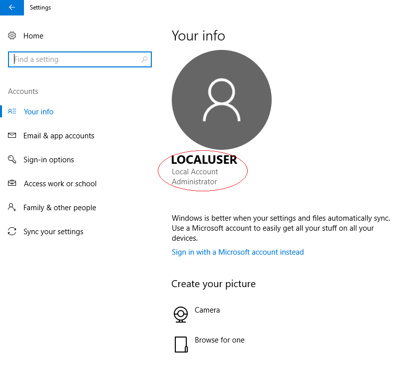
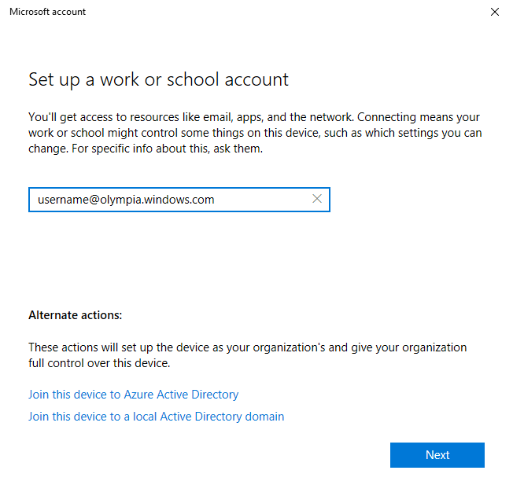
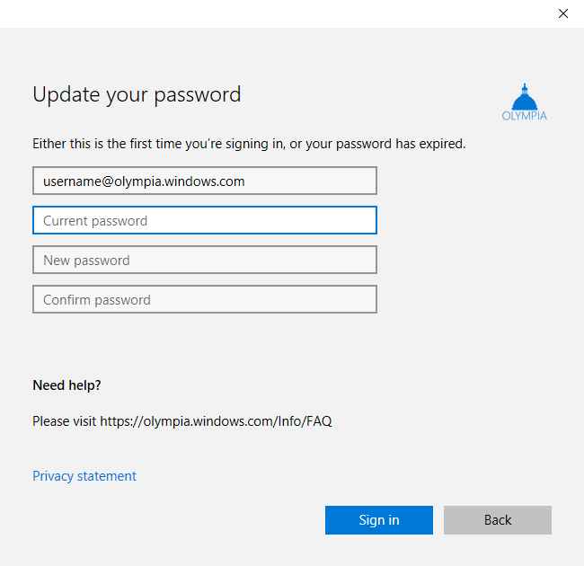
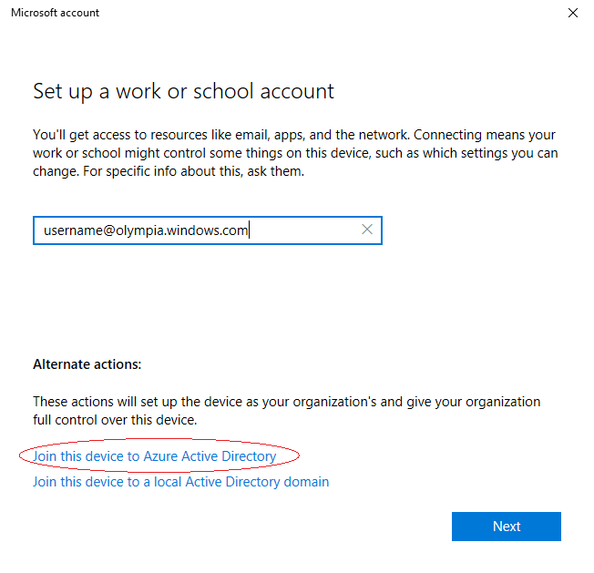
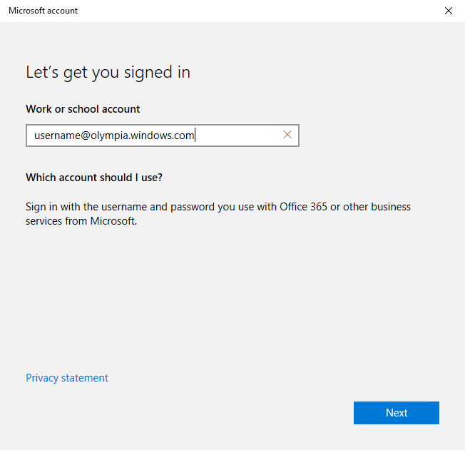

# Olympia Corp

## What is Windows Insider Lab for Enterprise and Olympia Corp?

Windows Insider Lab for Enterprise is intended for Windows Insiders who want to try new experimental and pre-release enterprise privacy and security features. To get the complete experience of these enterprise features, Olympia Corp, a virtual corporation has been set up to reflect the IT infrastructure of real world business. Selected customers are invited to join Olympia Corp and try these features.

As an Olympia user, you will have an opportunity to: 

-   Use various enterprise features like Windows Information Protection (WIP), Advanced Threat Protection (ATP), windows Defender Application Guard (WDAG), and Application Virtualization (APP-V).
-   Learn how Microsoft is preparing for GDPR, as well as enabling enterprise customers to prepare for their own readiness.
-   Validate and test pre-release software in your environment.
-   Provide feedback.
-   Interact with engineering team members through a variety of communication channels.

>[!Note]
>Enterprise features might have reduced or different security, privacy, accessibility, availability, and reliability standards relative to commercially provided services and software. We may change or discontinue any of the enterprise features at any time without notice.

For more information about Olympia Corp, see [https://olympia.windows.com/Info/FAQ](https://olympia.windows.com/Info/FAQ).

To request an Olympia Corp account, fill out the survey at [https://aka.ms/RegisterOlympia](https://aka.ms/RegisterOlympia).

## Enrollment guidelines

Welcome to Olympia Corp. Here are the steps needed to enroll.

As part of Windows Insider Lab for Enterprise, you can upgrade to Windows 10 Enterprise from Windows 10 Pro. This upgrade is optional. Since certain features such as Windows Defender Application Guard are only available on Windows 10 Enterprise, we recommend you to upgrade.

Choose one of the following two enrollment options:

- To set up an AAD-registered device, [follow these steps](#enrollment-keep-current-edition). In this case, you log onto the device by using an existing (non-Olympia) account.

- If you are running Windows 10 Pro, we recommend that you upgrade to Windows 10 Enterprise by following these steps to  [set up an Azure Active Directory-joined device](#enrollment-upgrade-to-enterprise). In this case, you will be able to log on to the device with your Olympia account.

### Set up an Azure Active Directory-REGISTERED Windows 10 device

This is the Bring Your Own Device (BYOD) method--your device will receive Olympia policies and features, but a new account will not be created. See [Set up Azure Active Directory registered Windows 10 devices](https://docs.microsoft.com/azure/active-directory/device-management-azuread-registered-devices-windows10-setup) for additional information.

1. Go to **Start > Settings > Accounts > Access work or school**. To see this setting, you need to have administrator rights to your device (see [local administrator](https://support.microsoft.com/instantanswers/5de907f1-f8ba-4fd9-a89d-efd23fee918c/create-a-local-user-or-administrator-account-in-windows-10)).

    

2. If you are already connected to a domain, click the existing account and then click **Disconnect**. Click **Restart Later**.

3. Click **Connect** and enter your **Olympia corporate account** (e.g., username@olympia.windows.com). Click **Next**.

    

4. Enter the temporary password that was sent to you. Click **Sign in**. Follow the instructions to set a new password.

    > [!NOTE]
    > Passwords should contain 8-16 characters, including at least one special character or number.

    

5. Read the **Terms and Conditions**. Click **Accept** to participate in the program.

6. If this is the first time you are logging in, fill in the additional information to help you retrieve your account details.

7. Create a PIN for signing into your Olympia corporate account.

8. Go to **Start > Settings > Update & Security > Windows Insider Program**. Click on the current Windows Insider account, and click **Change**. Sign in with your **Olympia corporate account**.

    > [!NOTE]
    > To complete this step, you will need to register your account with the [Windows Insider Program for Business](https://insider.windows.com/ForBusiness).

9. Open the **Feedback Hub**, and sign in with your **Olympia corporate account**.

### Set up Azure Active Directory-JOINED Windows 10 device

-   This method will upgrade your Windows 10 Pro license to Enterprise and create a new account. See [Set up Azure Active Directory joined devices](https://docs.microsoft.com/azure/active-directory/device-management-azuread-joined-devices-setup) for more information.

1. Go to **Start > Settings > Accounts > Access work or school**. To see this setting, you need to have administrator rights to your device (see [local administrator](https://support.microsoft.com/instantanswers/5de907f1-f8ba-4fd9-a89d-efd23fee918c/create-a-local-user-or-administrator-account-in-windows-10)).

    

2. If you are already connected to a domain, click the existing account and then click **Disconnect**. Click **Restart Later**.
	
3. Click **Connect**, then click **Join this device to Azure Active Directory**.

    

4. Enter your **Olympia corporate account** (e.g., username@olympia.windows.com). Click **Next**.

    

5. Enter the temporary password that was sent to you. Click **Sign in**. Follow the instructions to set a new password.

    > [!NOTE]
    > Passwords should contain 8-16 characters, including at least one special character or number.

    

6. When asked to make sure this is your organization, verify that the information is correct. If so, click **Join**.

7. If this is the first time you are signing in, fill in the additional information to help you retrieve your account details.

8. Create a PIN for signing into your Olympia corporate account.

9. When asked to make sure this is your organization, verify that the information is correct. If so, click **Join**.

10. Restart your device.

11. In the sign-in screen, choose **Other User** and sign in with your **Olympia corporate account**. Your device will upgrade to Windows 10 Enterprise.

12. Go to **Start > Settings > Update & Security > Windows Insider Program**. Click on the current Windows Insider account, and click **Change**. Sign in with your **Olympia corporate account**.

    > [!NOTE]
    > To complete this step, you will need to register your account with the [Windows Insider Program for Business](https://insider.windows.com/ForBusiness).

13. Open the **Feedback Hub**, and sign in with your **Olympia corporate account**.

>[!NOTE]
> Your Windows 10 Enterprise license will not be renewed if your device is not connected to Olympia.

