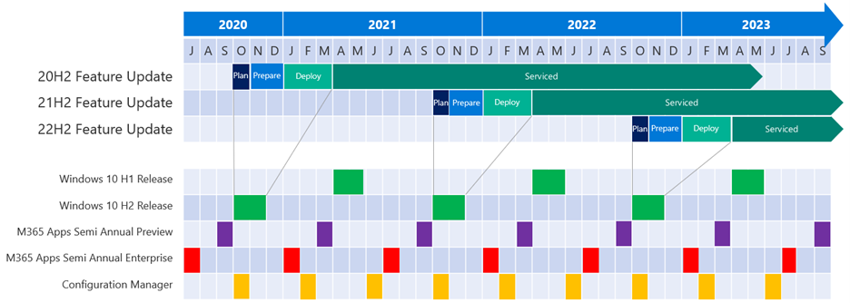
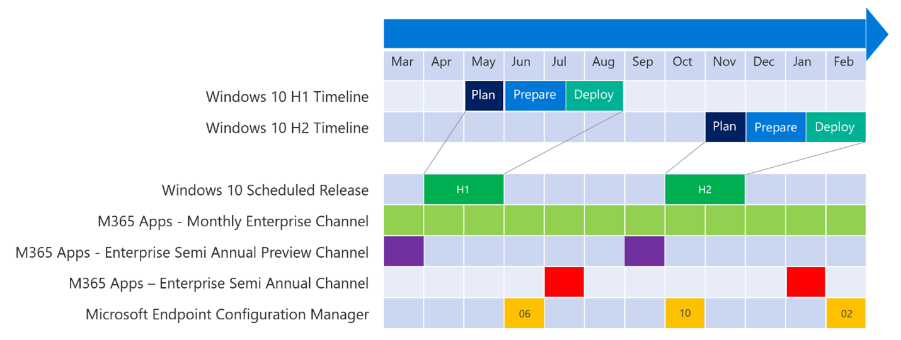

# Define update strategy with a calendar

Traditionally, organizations treated the deployment of operating system updates (especially feature updates) as a discrete project that had a beginning, a middle, and an end. A release was "built" (usually in the form of an image) and then distributed to users and their devices.

Today, more organizations are treating deployment as a continual process of updates that roll out across the organization in waves. In this approach, an update is plugged into this process and while it runs, you monitor for anomalies, errors, or user impact and respond as issues arise--without interrupting the entire process. Microsoft has been evolving its Windows 10 release cycles, update mechanisms, and relevant tools to support this model. Feature updates are released twice per year, around March and September. All releases of Windows 10 have 18 months of servicing for all editions. Fall releases of the Enterprise and Education editions have an additional 12 months of servicing for specific Windows 10 releases, for a total of 30 months from initial release.

Though we encourage you to deploy every available release and maintain a fast cadence for some portion of your environment, we also recognize that you might have a large number of devices, and a need for little or no disruption, and so you might choose to update annually. The 18/30 month lifecycle cadence lets you allow some portion of your environment to move faster while a majority can move less quickly.

## Calendar approaches
You can use a calendar approach for either a faster twice-per-year cadence or an annual cadence. Depending on company size, installing Windows 10 feature updates less often than once annually risks devices going out of service and becoming vulnerable to security threats, because they will stop receiving the monthly security updates.

### Annual
Here's a calendar showing an example schedule that applies one Windows 10 feature update per calendar year, aligned with Microsoft Endpoint Manager and Microsoft 365 Apps release cycles:

This approach provides approximately 12 months of use from each feature update before the next update is due to be installed. By aligning to the Windows 10, version H2 feature update, each release will be serviced for 30 months from the time of availability, giving you more flexibility when applying future feature updates.

This cadence might be most suitable for you if any of these conditions apply:

- You are just starting your journey with the Windows 10 servicing process. If you are unfamiliar with new processes that support Windows 10 servicing, moving from a project happening once every three to five years to a twice-a-year feature update process can be daunting. This approach gives you time to learn new approaches and tools to reduce effort and cost.

- You want to wait and see how successful other companies are at adopting a Windows 10 feature update.

- You want to go quickly with feature updates, and want the ability to skip a feature update while keeping Windows 10 serviced in case business priorities change. Aligning to the Windows 10 feature update released in the second half of each calendar year, you get additional servicing for Windows 10 (30 months of servicing compared to 18 months).

### Rapid
This calendar shows an example schedule that installs each feature update as it is released, twice per year:

This cadence might be best for you if these conditions apply:

- You have a strong appetite for change.
- You want to continuously update supporting infrastructure and unlock new scenarios.
- Your organization has a large population of information workers that can use the latest features and functionality in Windows 10 and Office.
- You have experience with feature updates for Windows 10.
