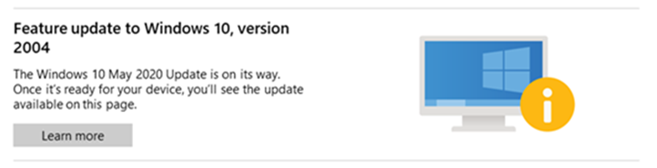

# Safeguard holds

Microsoft uses quality and compatibility data to identify issues that might cause a Windows 10 feature update to fail or roll back. When we find such an issue, we might apply holds to the updating service to prevent affected devices from installing the update in order to safeguard them from these experiences. We also use holds when a customer, a partner, or Microsoft internal validation finds an issue that would cause severe impact (for example, rollback of the update, data loss, loss of connectivity, or loss of key functionality) and when a workaround is not immediately available.

Safeguard holds prevent a device with a known issue from being offered a new operating system version. We renew the offering once a fix is found and verified. We use holds to ensure customers have a successful experience as their device moves to a new version of Windows 10.

The lifespan of holds varies depending on the time required to investigate and fix an issue. During this time Microsoft works diligently to procure, develop, and validate a fix and then offer it to affected devices. We monitor quality and compatibility data to confirm that a fix is complete before releasing the hold. Once we release the hold, Windows Update will resume offering new operating system versions to devices.

Safeguard holds only affect devices that use the Window Update service for updates. We encourage IT admins who manage updates to devices through other channels (such as media installations or updates coming from Windows Server Update Services) to remain aware of known issues that might also be present in their environments.

## Am I affected by a safeguard hold?

IT admins can use [Update Compliance](update-compliance-feature-update-status.md#safeguard-holds) to monitor various update health metrics for devices in their organization, including ones affected by a safeguard hold that prevents them from updating to a newer operating system version. 

Queries identify Safeguard IDs for each affected device, giving IT admins a detailed view into the various protections extended to devices. Safeguard IDs for publicly discussed known issues are also included in the [Windows release health](https://aka.ms/windowsreleasehealth) dashboard, where you can easily find information related to publicly available safeguards.

On devices that use Windows Update (but not Windows Update for Business), the **Windows Update** page in the Settings app displays a message stating that an update is on its way, but not ready for the device. Instead of the option to download and install the update, users will see this message:

If you see this message, it means one or more holds affect your device. When the issue is fixed and the update is safe to install, we’ll release the hold and the update can resume safely.

## What can I do?

We recommend that you do not attempt to manually update until issues have been resolved and holds released.

> [!CAUTION]
> Opting out of a safeguard hold can put devices at risk from known performance issues. We strongly recommend that you complete robust testing to ensure the impact is acceptable before opting out.
  
With that in mind, IT admins who stay informed with [Update Compliance](update-compliance-feature-update-status.md#safeguard-holds) and the [Windows release health](https://aka.ms/windowsreleasehealth) dashboard can choose to temporarily [opt-out of the protection of all safeguard holds](safeguard-opt-out.md) and allow an update to proceed. We recommend opting out only in an IT environment and for validation purposes. If you do opt out of a hold, this condition is temporary. Once an update is complete, the protection of safeguard holds is reinstated automatically. 
