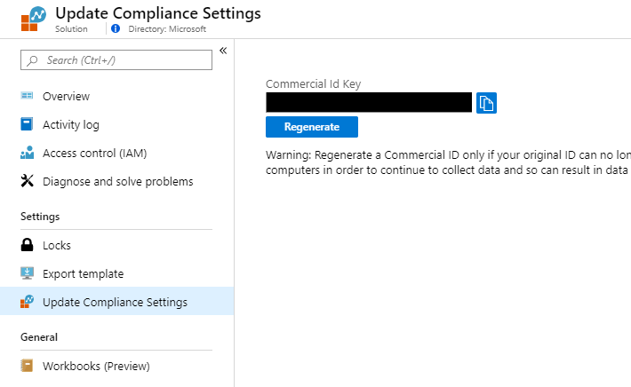
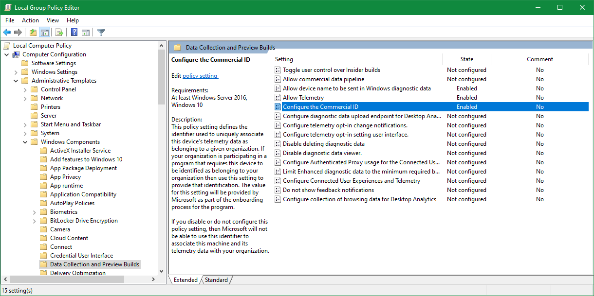
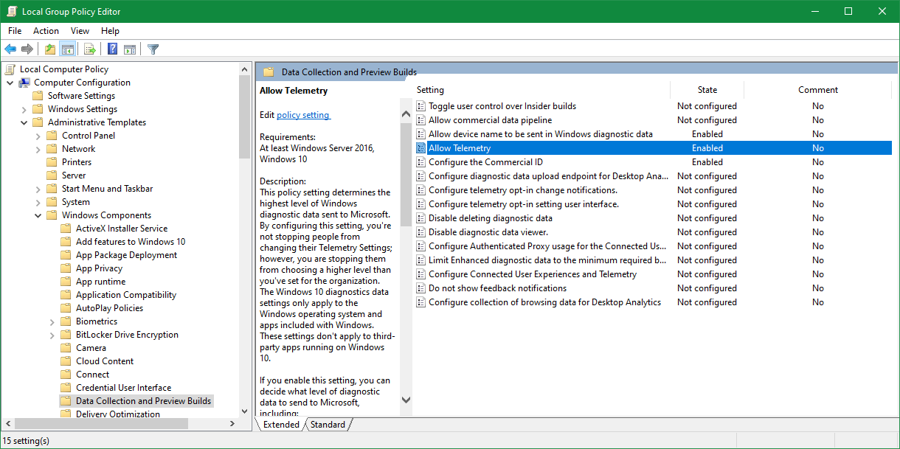

# Get started with Update Compliance
This topic explains the steps necessary to configure your environment for Update Compliance.

Steps are provided in sections that follow the recommended setup process:

1. Ensure you meet the [Update Compliance prerequisites](#update-compliance-prerequisites).
2. [Add Update Compliance to your Azure subscription](#add-update-compliance-to-your-azure-subscription).
3. [Enroll devices in Update Compliance](#enroll-devices-in-update-compliance).
4. [Use Update Compliance](update-compliance-using.md) to monitor Windows Updates and get Delivery Optimization insights.

## Update Compliance prerequisites
Before you begin the process to add Update Compliance to your Azure subscription, first ensure you can meet the prerequisites:
1. Update Compliance works only with Windows 10 Professional, Education, and Enterprise editions. Update Compliance only provides data for the standard Desktop Windows 10 version and is not currently compatible with Windows Server, Surface Hub, IoT, etc. 
2. Update Compliance provides detailed deployment data for devices on the Semi-Annual Channel and the Long-term Servicing Channel. Update Compliance will show Windows Insider Preview devices, but currently will not provide detailed deployment information for them.
3. Update Compliance requires at least the Basic level of diagnostic data and a Commercial ID to be enabled on the device. 
4. For Windows 10 1803+, device names will not appear in Update Compliance unless you opt in. The steps to accomplish this is outlined in the [Enroll devices in Update Compliance](#enroll-devices-in-update-compliance) section.

## Add Update Compliance to your Azure subscription
Update Compliance is offered as a solution which is linked to a new or existing [Azure Log Analytics](https://docs.microsoft.com/azure/log-analytics/query-language/get-started-analytics-portal) workspace within your Azure subscription. To configure this, follow these steps:

1. Sign in to the [Azure Portal](https://portal.azure.com) with your work or school account or a Microsoft account. If you don't already have an Azure subscription you can create one (including free trial options) through the portal.

> [!NOTE]
> Update Compliance is included at no additional cost with Windows 10 Professional, Education, and Enterprise editions. An Azure subscription is required for managing and using Update Compliance, but no Azure charges are expected to accrue to the subscription as a result of using Update Compliance. 

2. In the Azure portal select **+ Create a resource**, and search for “Update Compliance". You should see it in the results below. 

3. Select **Update Compliance** and a blade will appear summarizing the solution’s offerings. At the bottom, select **Create** to begin adding the solution to Azure.

4. Choose an existing workspace or create a new workspace that will be assigned to the Update Compliance solution. 
   - [Desktop Analytics](https://docs.microsoft.com/sccm/desktop-analytics/overview) customers are advised to use the same workspace for Update Compliance. 
   - If you are creating a new workspace, and your organization does not have policies governing naming conventions and structure, consider the following workspace settings to get started:
       - Choose a workspace name which reflects the scope of planned usage in your organization, for example *PC-Analytics*.
       - For the resource group setting select **Create new** and use the same name you chose for your new workspace.
       - For the location setting, choose the Azure region where you would prefer the data to be stored.
       - For the pricing tier select **per GB**.

5. The resource group and workspace creation process could take a few minutes. After this, you are able to use that workspace for Update Compliance. Select **Create**.

6. Watch for a notification in the Azure portal that your deployment has been successful. This might take a few minutes. Then, select **Go to resource**. 

## Enroll devices in Update Compliance
Once you've added Update Compliance to a workspace in your Azure subscription, you can start enrolling the devices in your organization. For Update Compliance there are three key steps to ensure successful enrollment:

### Deploy your Commercial ID to devices
A Commercial ID is a globally-unique identifier assigned to a specific Log Analytics workspace. This is used to identify devices as part of your environment.

To find your Commercial ID within Azure: 
1. Navigate to the **Solutions** tab for your workspace, and then select the **WaaSUpdateInsights** solution. 
2. From there, select the Update Compliance Settings page on the navbar. 
3. Your Commercial ID is available in the settings page.

>**Important**
>
>Regenerate your Commercial ID only if your Original ID key can no longer be used or if you want to completely reset your workspace. Regenerating your Commercial ID cannot be undone and will result in you losing data for all devices that have the current Commercial ID until the new Commercial ID is deployed to devices.

#### Deploying Commercial ID using Group Policy
Commercial ID can be deployed using Group Policy. The Group Policy for Commercial ID is under **Computer Configuration\Administrative Templates\Windows Components\Data Collection and Preview Builds\Configure the Commercial ID**. 

#### Deploying Commercial ID using MDM
Commercial ID can be deployed through a [Mobile Device Management](https://docs.microsoft.com/windows/client-management/mdm/) (MDM) policy beginning with Windows 10, version 1607. Commercial ID is under the [DMClient configuration service provider](https://docs.microsoft.com/windows/client-management/mdm/dmclient-csp). 

### Ensure endpoints are whitelisted
To enable data sharing between devices, your network, and Microsoft's Diagnostic Data Service, configure your proxy to whitelist the following endpoints. You may need security group approval to do this. 

| **Endpoint**  | **Function**  |
|---------------------------------------------------------|-----------|
| `https://v10c.events.data.microsoft.com` | Connected User Experience and Diagnostic component endpoint for Windows 10, version 1803 and later. |
| `https://v10.vortex-win.data.microsoft.com` | Connected User Experience and Diagnostic component endpoint for Windows 10, version 1709 or earlier. |
| `https://settings-win.data.microsoft.com` | Enables the compatibility update to send data to Microsoft. |
| `http://adl.windows.com` | Allows the compatibility update to receive the latest compatibility data from Microsoft. |
| `https://watson.telemetry.microsoft.com` | Windows Error Reporting (WER), used to provide more advanced error reporting in the event of certain Feature Update deployment failures. |
| `https://oca.telemetry.microsoft.com`  | Online Crash Analysis, used to provide device-specific recommendations and detailed errors in the event of certain crashes. |
| `https://login.live.com` | This endpoint is optional but allows for the Update Compliance service to more reliably identify and process devices. If you want to disable end-user managed service account (MSA) access, you should apply the appropriate [policy](https://docs.microsoft.com/windows/security/identity-protection/access-control/microsoft-accounts#block-all-consumer-microsoft-account-user-authentication) instead of blocking this endpoint. |

### Set diagnostic data levels
Update Compliance requires that devices are configured to send Microsoft at least the Basic level of diagnostic data in order to function. For more information on Windows diagnostic data, see [Configure Windows diagnostic data in your organization](https://docs.microsoft.com/windows/privacy/configure-windows-diagnostic-data-in-your-organization).

#### Configuring Telemetry level using Group Policy
You can set Allow Telemetry through Group Policy, this setting is in the same place as the Commercial ID policy, under **Computer Configuration\Administrative Templates\Windows Components\Data Collection and Preview Builds\Allow Telemetry**. Update Compliance requires at least Basic (level 1) to function.

#### Configuring Telemetry level using MDM
Telemetry level can additionally be configured through a [Mobile Device Management](https://docs.microsoft.com/windows/client-management/mdm/) (MDM) policy. Allow Telemetry is under the [Policy Configuration Service Provider](https://docs.microsoft.com/windows/client-management/mdm/policy-configuration-service-provider) as [System/AllowTelemetry](https://docs.microsoft.com/windows/client-management/mdm/policy-csp-system#system-allowtelemetry).

### Enabling Device Name in telemetry
Beginning with Windows 10, version 1803, Device Name is no longer collected as part of normal Windows Diagnostic Data and must explicitly be allowed to be sent to Microsoft. If devices do not have this policy enabled, their device name will appear as '#' instead. 

#### Allow Device Name in Telemetry with Group Policy
Allow Device Name in Telemetry is under the same node as Commercial ID and Allow Telemetry policies in Group Policy, listed as **Allow device name to be sent in Windows diagnostic data**. 

#### Allow Device Name in Telemetry with MDM
Allow Device Name in Telemetry is under the [Policy Configuration Service Provider](https://docs.microsoft.com/windows/client-management/mdm/policy-configuration-service-provider) as [System/AllowTelemetry](https://docs.microsoft.com/windows/client-management/mdm/policy-csp-system#system-allowtelemetry). 

>[!NOTE]
>After enrolling your devices (by deploying your CommercialID and Windows Diagnostic Data settings), it might take 48-72 hours for the first data to appear in the solution. Until then, Update Compliance will indicate it is still assessing devices. 