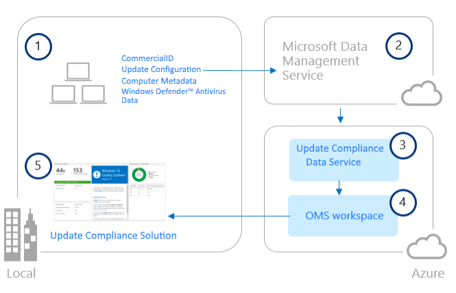

# Monitor Windows Updates and Windows Defender Antivirus with Update Compliance

## Introduction

With Windows 10, organizations need to change the way they approach monitoring and deploying updates. Update Compliance is a powerful set of tools that enable organizations to monitor and track all important aspects of the new servicing strategy from Microsoft: [Windows as a Service](waas-overview.md).

Update Compliance is a solution built within Operations Management Suite (OMS), a cloud-based monitoring and automation service which has a flexible servicing subscription based off data usage/retention. For more information about OMS, see [Operations Management Suite overview](http://azure.microsoft.com/documentation/articles/operations-management-suite-overview/).

Update Compliance uses the Windows telemetry that is part of all Windows 10 devices. It collects system data including update installation progress, Windows Update for Business (WUfB) configuration data, Windows Defender Antivirus data, and other update-specific information, and then sends this data privately to a secure cloud to be stored for analysis and usage within the solution. 

Update Compliance provides the following:

- Dedicated drill-downs for devices that might need attention
- An inventory of devices, including the version of Windows they are running and their update status
- The ability to track protection and threat status for Windows Defender Antivirus-enabled devices
- An overview of WUfB deferral configurations (Windows 10 Anniversary Update [1607] and later)
- Powerful built-in [log analytics](https://www.microsoft.com/en-us/cloud-platform/insight-and-analytics?WT.srch=1&WT.mc_id=AID529558_SEM_%5B_uniqid%5D&utm_source=Bing&utm_medium=CPC&utm_term=log%20analytics&utm_campaign=Hybrid_Cloud_Management) to create useful custom queries
- Cloud-connected access utilizing Windows 10 telemetry means no need for new complex, customized infrastructure

See the following topics in this guide for detailed information about configuring and using the Update Compliance solution:

- [Get started with Update Compliance](update-compliance-get-started.md): How to add Update Compliance to your environment.
- [Using Update Compliance](update-compliance-using.md): How to begin using Update Compliance.

<iframe width="560" height="315" align="center" src="https://www.youtube.com/embed/1cmF5c_R8I4" frameborder="0" allowfullscreen></iframe>

An overview of the processes used by the Update Compliance solution is provided below.

## Update Compliance architecture
 
The Update Compliance architecture and data flow is summarized by the following five-step process:

**(1)** User computers send telemetry data to a secure Microsoft data center using the Microsoft Data Management Service. 
**(2)** Telemetry data is analyzed by the Update Compliance Data Service. 
**(3)** Telemetry data is pushed from the Update Compliance Data Service to your OMS workspace. 
**(4)** Telemetry data is available in the Update Compliance solution. 
**(5)** You are able to monitor and troubleshoot Windows updates and Windows Defender AV in your environment. 

These steps are illustrated in following diagram:

>[!NOTE]
>This process assumes that Windows telemetry is enabled and you [have assigned your Commercial ID to devices](update-compliance-get-started.md#deploy-your-commercial-id-to-your-windows-10-devices).

 
## Related topics

[Get started with Update Compliance](update-compliance-get-started.md) 
[Use Update Compliance to monitor Windows Updates](update-compliance-using.md)