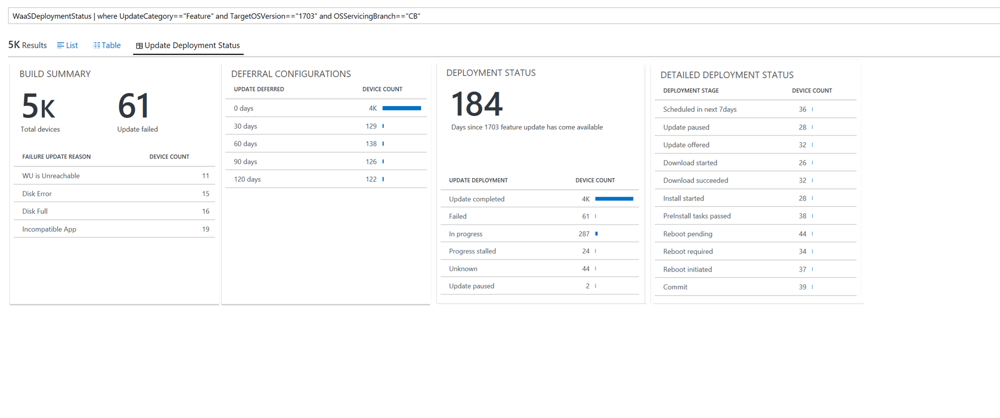

# Perspectives

Perspectives are elaborations on specific queries hand-crafted by developers which data views that provide deeper insight into your data. Perspectives are loaded whenever clicking into more detailed views from both the Security Update Status section and Feature Update Status section of Update Compliance. 

There is only one perspective framework; it is for **Update Deployment Status**. The same framework is utilized for both feature and quality updates. 

The first blade is the **Build Summary** blade. This blade summarizes the most important aspects of the given build being queried, listing the total number of devices, the total number of update failures for the build, and a breakdown of the different errors encountered. 

The second blade is the **Deferral Configurations** blade, breaking down Windows Update for Business deferral settings (if any). 

## Deployment status

The third blade is the **Deployment Status** blade. This defines how many days it has been since the queried version has been released, and breaks down the various states in the update funnel each device has reported to be in. The possible states are as follows:

| State | Description |
| --- | --- |
| Update Completed | When a device has finished the update process and is on the queried update, it will display here as Update completed. |
| In Progress |	Devices that report they are “In Progress” are one of the various stages of installing an update; these stages are reported in the Detailed Deployment Status blade. |
| Deferred | When a device’s Windows Update for Business deferral policy dictates that the update is not yet applicable due to deferral, it will report as such in this blade. |
| Progress stalled | Devices that report as “Progress stalled” have been stuck at “In progress” for more than 7 days. |
| Cancelled | The update was cancelled. |
| Blocked | There is a hard block on the update being completed. This could be that another update must be completed before this one, or some other task is blocking the installation of the update. |
| Unknown | Devices that do not report detailed information on the status of their updates will report Unknown. This is most likely devices that do not use Windows Update for deployment. |
| Update paused | These devices have Windows Update for Business pause enabled, preventing this update from being installed. |
| Failed | A device is unable to install an update. This failure could be linked to a serious error in the update installation process or, in some cases, a [compatibility hold](update-compliance-feature-update-status.md#compatibility-holds).  |

## Detailed deployment status

The final blade is the **Detailed Deployment Status** blade. This blade breaks down the detailed stage of deployment a device is in, beyond the generalized terms defined in Deployment Status. The following are the possible stages a device can report:

| State | Description |
| --- | --- |
| Update deferred |	When a device’s Windows Update for Business policy dictates the update is deferred. |
| Update paused | The device’s Windows Update for Business policy dictates the update is paused from being offered. |
| Update offered | The device has been offered the update, but has not begun downloading it. |
| Pre-Download tasks passed | The device has finished all necessary tasks prior to downloading the update. |
| Compatibility hold | The device has been placed under a *compatibility hold* to ensure a smooth feature update experience and will not resume the update until the hold has been cleared. For more information see [Feature Update Status report](update-compliance-feature-update-status.md#compatibility-holds) |
| Download Started | The update has begun downloading on the device. |
| Download Succeeded | The update has successfully completed downloading. |
| Pre-Install Tasks Passed | Tasks that must be completed prior to installing the update have been completed. |
| Install Started |	Installation of the update has begun. |
| Reboot Required |	The device has finished installing the update, and a reboot is required before the update can be completed.
| Reboot Pending | The device has a scheduled reboot to apply the update. |
| Reboot Initiated | The scheduled reboot has been initiated. |
| Update Completed/Commit |	The update has successfully installed. |

>[!NOTE]
>Interacting with any rows in the perspective view will automatically apply the given value to the query and execute it with the new parameter, narrowing the perspective to devices that satisfy that criteria. For example, clicking “Not configured (-1)” devices in Deferral Configurations will filter the query to only contain devices that do not have a deferral configuration. These filters can also be applied to queries via the filter sidebar.
