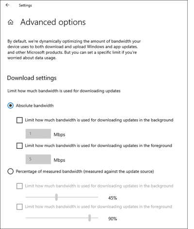

# Delivery Optimization for Windows 10 updates

**Applies to**

- Windows 10

> **Looking for Group Policy objects?** See [Delivery Optimization reference](waas-delivery-optimization-reference.md) or the master spreadsheet available at the [Download Center](https://www.microsoft.com/download/details.aspx?id=102158).

Windows updates, upgrades, and applications can contain packages with very large files. Downloading and distributing updates can consume quite a bit of network resources on the devices receiving them. You can use Delivery Optimization to reduce bandwidth consumption by sharing the work of downloading these packages among multiple devices in your deployment. Delivery Optimization is a self-organizing distributed cache that allows clients to download those packages from alternate sources (such as other peers on the network) in addition to the traditional Internet-based servers. You can use Delivery Optimization with Windows Update, Windows Server Update Services (WSUS), Windows Update for Business, or Microsoft Endpoint Manager (when installation of Express Updates is enabled).  

Delivery Optimization is a cloud-managed solution. Access to the Delivery Optimization cloud services is a requirement. This means that in order to use the peer-to-peer functionality of Delivery Optimization, devices must have access to the internet.

For information about setting up Delivery Optimization, including tips for the best settings in different scenarios, see [Set up Delivery Optimization for Windows 10 updates](waas-delivery-optimization-setup.md). For a comprehensive list of all Delivery Optimization settings, see [Delivery Optimization reference](waas-delivery-optimization-reference.md).

>[!NOTE]
>WSUS can also use [BranchCache](waas-branchcache.md) for content sharing and caching. If Delivery Optimization is enabled on devices that use BranchCache, Delivery Optimization will be used instead. 

## New in Windows 10, version 2004

- Enterprise network throttling: new settings have been added in Group Policy and mobile device management (MDM) to control foreground and background throttling as absolute values (Maximum Background Download Bandwidth in (in KB/s)). These settings are also available in the Windows user interface:

  

- Activity Monitor now identifies the cache server used for as the source for Microsoft Connected Cache. For more information about using Microsoft Connected Cache with Configuration Manager, see [Microsoft Connected Cache](/mem/configmgr/core/plan-design/hierarchy/microsoft-connected-cache).

- New options for [`Get-DeliveryOptimizationPerfSnap`](waas-delivery-optimization-setup.md#analyze-usage).

- New cmdlets:
    - `Enable-DeliveryOptimizationVerboseLogs`
    - `Disable-DeliveryOptimizationVerboseLogs`
    - `Get-DeliveryOptimizationLogAnalysis [ETL Logfile path] [-ListConnections]`
    
- New policy settings:
    - [DOCacheHost](waas-delivery-optimization-reference.md#cache-server-hostname)
    - [DOCacheHostSource](waas-delivery-optimization-reference.md#cache-server-hostname-source)
    - [DOMaxForegroundDownloadBandwidth](waas-delivery-optimization-reference.md#maximum-foreground-download-bandwidth-in-kbs); replaces DOPercentageMaxDownloadBandwidth
    - [DOMaxBackgroundDownloadBandwidth](waas-delivery-optimization-reference.md#maximum-background-download-bandwidth-in-kbs)
    
- Removed policy settings (if you set these policies in Windows 10, 2004, they will have no effect):
    - DOMaxDownloadBandwidth; use [DOMaxBackgroundDownloadBandwidth](waas-delivery-optimization-reference.md#maximum-background-download-bandwidth-in-kbs) or [DOMaxForegroundDownloadBandwidth](waas-delivery-optimization-reference.md#maximum-foreground-download-bandwidth-in-kbs) instead.
    - DOPercentageMaxDownloadBandwidth; use [DOMaxBackgroundDownloadBandwidth](waas-delivery-optimization-reference.md#maximum-background-download-bandwidth-in-kbs) or [DOMaxForegroundDownloadBandwidth](waas-delivery-optimization-reference.md#maximum-foreground-download-bandwidth-in-kbs) instead.
    - DOMaxUploadBandwidth
    
- Support for new types of downloads:
    - Office installs and updates
    - Xbox game pass games
    - MSIX apps (HTTP downloads only)
    - Microsoft Edge browser installations and updates
    - [Dynamic updates](https://techcommunity.microsoft.com/t5/windows-it-pro-blog/the-benefits-of-windows-10-dynamic-update/ba-p/467847) 

## Requirements

The following table lists the minimum Windows 10 version that supports Delivery Optimization:

| Device type | Minimum Windows version |
|------------------|---------------|
| Computers running Windows 10 | 1511 |
| Computers running Server Core installations of Windows Server | 1709 |
| IoT devices | 1803 |

**Types of download packages supported by Delivery Optimization**

| Download package | Minimum Windows version |
|------------------|---------------|
| Windows 10 updates (feature updates and quality updates) | 1511 |
| Windows 10 drivers | 1511 |
| Windows Store files | 1511 |
| Windows Store for Business files | 1511 |
| Windows Defender definition updates | 1511 |
| Microsoft 365 Apps and updates | 1709 (for more information, see [Delivery Optimization and Microsoft 365 Apps](/deployoffice/delivery-optimization)) |
| Win32 apps for Intune | 1709 |
| Xbox game pass games | 2004 |
| MSIX apps (HTTP downloads only) | 2004 |
| Configuration Manager Express updates | 1709 + Configuration Manager version 1711 |
| Edge browser installs and updates | 1809 |
| [Dynamic updates](https://techcommunity.microsoft.com/t5/windows-it-pro-blog/the-benefits-of-windows-10-dynamic-update/ba-p/467847) | 1903 |

> [!NOTE]
> Starting with Configuration Manager version 1910, you can use Delivery Optimization for the distribution of all Windows update content for clients running Windows 10 version 1709 or newer, not just express installation files. For more, see [Delivery Optimization starting in version 1910](/mem/configmgr/sum/deploy-use/optimize-windows-10-update-delivery#bkmk_DO-1910).

In Windows 10 Enterprise, Professional, and Education editions, Delivery Optimization is enabled by default for peer-to-peer sharing on the local network (NAT). Specifically, all of the devices must be behind the same NAT, but you can configure it differently in Group Policy and mobile device management (MDM) solutions such as Microsoft Intune.

For more information, see "Download mode" in [Delivery optimization reference](waas-delivery-optimization-reference.md).

## Set up Delivery Optimization

See [Set up Delivery Optimization](waas-delivery-optimization-setup.md) for suggested values for a number of common scenarios.

You can use Group Policy or an MDM solution like Intune to configure Delivery Optimization. 

You will find the Delivery Optimization settings in Group Policy under **Configuration\Policies\Administrative Templates\Windows Components\Delivery Optimization**.
In MDM, the same settings are under **.Vendor/MSFT/Policy/Config/DeliveryOptimization/**.

Starting with Microsoft Intune version 1902, you can set many Delivery Optimization policies as a profile, which you can then apply to groups of devices. For more information, see [Delivery Optimization settings in Microsoft Intune](/intune/delivery-optimization-windows))

**Starting with Windows 10, version 1903,** you can use the Azure Active Directory (Azure AD) Tenant ID as a means to define groups. To do this set the value for DOGroupIdSource to its new maximum value of 5.

## Reference

For complete list of every possible Delivery Optimization setting, see [Delivery Optimization reference](waas-delivery-optimization-reference.md).

## How Microsoft uses Delivery Optimization
At Microsoft, to help ensure that ongoing deployments weren't affecting our network and taking away bandwidth for other services, Microsoft IT used a couple of different bandwidth management strategies. Delivery Optimization, peer-to-peer caching enabled through Group Policy, was piloted and then deployed to all managed devices using Group Policy. Based on recommendations from the Delivery Optimization team, we used the "group" configuration to limit sharing of content to only the devices that are members of the same Active Directory domain. The content is cached for 24 hours. More than 76 percent of content came from peer devices versus the Internet.

For more details, check out the [Adopting Windows as a Service at Microsoft](https://www.microsoft.com/itshowcase/Article/Content/851/Adopting-Windows-as-a-service-at-Microsoft) technical case study.

## Frequently asked questions

#### Does Delivery Optimization work with WSUS?
Yes. Devices will obtain the update payloads from the WSUS server, but must also have an internet connection as they communicate with the Delivery Optimization cloud service for coordination.

#### Which ports does Delivery Optimization use?
Delivery Optimization listens on port 7680 for requests from other peers by using TCP/IP. The service will register and open this port on the device, but you might need to set this port to accept inbound traffic through your firewall yourself. If you don't allow inbound traffic over port 7680, you can't use the peer-to-peer functionality of Delivery Optimization. However, devices can still successfully download by using HTTP or HTTPS traffic over port 80 (such as for default Windows Update data).

If you set up Delivery Optimization to create peer groups that include devices across NATs (or any form of internal subnet that uses gateways or firewalls between subnets), it will use Teredo. For this to work, you must allow inbound TCP/IP traffic over port 3544. Look for a "NAT traversal" setting in your firewall to set this up.

Delivery Optimization also communicates with its cloud service by using HTTP/HTTPS over port 80.

#### What are the requirements if I use a proxy?
For Delivery Optimization to successfully use the proxy, you should set up the proxy by using Windows proxy settings or Internet Explorer proxy settings. For details see [Using a proxy with Delivery Optimization](./delivery-optimization-proxy.md). Most content downloaded with Delivery Optimization uses byte range requests. Make sure your proxy allows byte range requests. For more information, see [Proxy requirements for Windows Update](https://support.microsoft.com/help/3175743/proxy-requirements-for-windows-update).

#### What hostnames should I allow through my firewall to support Delivery Optimization?

For communication between clients and the Delivery Optimization cloud service: **\*.do.dsp.mp.microsoft.com**.

**For Delivery Optimization metadata**:

- *.dl.delivery.mp.microsoft.com
- *.emdl.ws.microsoft.com

**For the payloads (optional)**:

- *.download.windowsupdate.com 
- *.windowsupdate.com

#### Does Delivery Optimization use multicast?
No. It relies on the cloud service for peer discovery, resulting in a list of peers and their IP addresses. Client devices then connect to their peers to obtain download files over TCP/IP.

#### How does Delivery Optimization deal with congestion on the router from peer-to-peer activity on the LAN?
Starting in Windows 10, version 1903, Delivery Optimization uses LEDBAT to relieve such congestion. For more details, see this post on the [Networking Blog](https://techcommunity.microsoft.com/t5/Networking-Blog/Windows-Transport-converges-on-two-Congestion-Providers-Cubic/ba-p/339819).

#### How does Delivery Optimization handle VPNs?
Delivery Optimization attempts to identify VPNs by checking the network adapter type and details and will treat the connection as a VPN if the adapter description contains certain keywords, such as "VPN" or "secure."

If the connection is identified as a VPN, Delivery Optimization will suspend uploads to other peers. However, you can allow uploads over a VPN by using the [Enable Peer Caching while the device connects via VPN](waas-delivery-optimization-reference.md#enable-peer-caching-while-the-device-connects-via-vpn) policy.

If you have defined a boundary group in Configuration Manager for VPN IP ranges, you can set the DownloadMode policy to 0 for that boundary group to ensure that there will be no peer-to-peer activity over the VPN. When the device is not connected using a VPN, it can still use peer-to-peer with the default of LAN.

With split tunneling, make sure to allow direct access to these endpoints:

Delivery Optimization service endpoint:
- `https://*.prod.do.dsp.mp.microsoft.com`

Delivery Optimization metadata:
- `http://emdl.ws.microsoft.com`
- `http://*.dl.delivery.mp.microsoft.com`

Windows Update and Microsoft Store backend services and Windows Update and Microsoft Store payloads

- `http://*.windowsupdate.com`
- `https://*.delivery.mp.microsoft.com`
- `https://*.update.microsoft.com`
- `https://tsfe.trafficshaping.dsp.mp.microsoft.com`

For more information about remote work if you're using Configuration Manager, see this post on the [Configuration Manager blog](https://techcommunity.microsoft.com/t5/configuration-manager-blog/managing-patch-tuesday-with-configuration-manager-in-a-remote/ba-p/1269444).

#### How does Delivery Optimization handle networks where a Public IP address is used in place of a Private IP address?

Prior to Windows 10, version 1903, Delivery Optimization only allowed connections between LAN peers if those peers utilized Private IP addresses. Starting with version 1903 or higher, this is no longer enforced. Customers who utilize Public IP addresses in place of Private IP addresses can now use DO in LAN mode.

> [NOTE]
> One side effect of this change is that bytes downloaded from or uploaded to LAN peers with Public IP addresses may be reported as coming from Internet peers.

## Troubleshooting

This section summarizes common problems and some solutions to try.

### If you don't see any bytes from peers

If you don't see any bytes coming from peers the cause might be one of the following issues:

- Clients aren’t able to reach the Delivery Optimization cloud services.
- The cloud service doesn’t see other peers on the network. 
- Clients aren’t able to connect to peers that are offered back from the cloud service.
- None of the computers on the network are getting updates from peers.

### Clients aren't able to reach the Delivery Optimization cloud services.

Try these steps:

1. Start a download of an app that is larger than 50 MB from the Store (for example "Candy Crush Saga").
2. Run `Get-DeliveryOptimizationStatus` from an elevated PowerShell window and observe the DownloadMode setting. For peering to work, DownloadMode should be 1, 2, or 3.
3. If **DownloadMode** is 99, it could indicate your device is unable to reach the Delivery Optimization cloud services. Ensure that the Delivery Optimization host names are allowed access: most importantly **\*.do.dsp.mp.microsoft.com**.

### The cloud service doesn't see other peers on the network.

Try these steps:

1. Download the same app on two different devices on the same network, waiting 10 – 15 minutes between downloads.
2. Run `Get-DeliveryOptimizationStatus` from an elevated PowerShell window and ensure that **DownloadMode** is 1 or 2 on both devices.
3. Run `Get-DeliveryOptimizationPerfSnap` from an elevated PowerShell window on the second device. The **NumberOfPeers** field should be non-zero.
4. If the number of peers is zero and you have **DownloadMode** = 1, ensure that both devices are using the same public IP address to reach the internet. Open a browser Windows and search for “what is my IP”. You can **DownloadMode 2** (Group) and a custom GroupID (Guid) to fix this if the devices aren’t reporting the same public IP address.

> [!NOTE]
> Starting in Windows 10, version 2004, `Get-DeliveryOptimizationStatus` has a new option `-PeerInfo` which returns a real-time list of the connected peers.

### Clients aren't able to connect to peers offered by the cloud service

Try a Telnet test between two devices on the network to ensure they can connect using port 7680. Follow these steps:

1. Install Telnet by running `dism /online /Enable-Feature /FeatureName:TelnetClient` from an elevated command prompt.
2. Run the test. For example, if you are on device with IP 192.168.8.12 and you are trying to test the connection to 192.168.9.17 run `telnet 192.168.9.17 7680` (the syntax is *telnet [destination IP] [port]*. You will either see a connection error or a blinking cursor like this /_. The blinking cursor means success.

> [!NOTE]
> You can also use [Test-NetConnection](/powershell/module/nettcpip/test-netconnection?view=windowsserver2019-ps) instead of Telnet to run the test.
> **Test-NetConnection -ComputerName 192.168.9.17 -Port 7680**

### None of the computers on the network are getting updates from peers

Check Delivery Optimization settings that could limit participation in peer caching. Check whether the following settings in assigned group policies, local group policies, or MDM policies are too restrictive:

- Minimum RAM (inclusive) allowed to use peer caching
- Minimum disk size allowed to use peer caching
- Enable peer caching while the device connects using VPN.
- Allow uploads when the device is on battery while under the set battery level

## Learn more

[Windows 10, Delivery Optimization, and WSUS](/archive/blogs/mniehaus/windows-10-delivery-optimization-and-wsus-take-2)

## Related articles

- [Update Windows 10 in the enterprise](index.md)
- [Overview of Windows as a service](waas-overview.md)
- [Prepare servicing strategy for Windows 10 updates](waas-servicing-strategy-windows-10-updates.md)
- [Build deployment rings for Windows 10 updates](waas-deployment-rings-windows-10-updates.md)
- [Assign devices to servicing channels for Windows 10 updates](waas-servicing-channels-windows-10-updates.md)
- [Optimize update delivery for Windows 10 updates](waas-optimize-windows-10-updates.md)
- [Configure BranchCache for Windows 10 updates](waas-branchcache.md)
- [Deploy updates using Windows Update for Business](waas-manage-updates-wufb.md)
- [Configure Windows Update for Business](waas-configure-wufb.md)
- [Integrate Windows Update for Business with management solutions](waas-integrate-wufb.md)
- [Walkthrough: use Group Policy to configure Windows Update for Business](waas-wufb-group-policy.md)
- [Walkthrough: use Intune to configure Windows Update for Business](/intune/windows-update-for-business-configure)
- [Deploy Windows 10 updates using Windows Server Update Services](waas-manage-updates-wsus.md)
- [Deploy Windows 10 updates using Microsoft Endpoint Configuration Manager](/mem/configmgr/osd/deploy-use/manage-windows-as-a-service)
- [Manage device restarts after updates](waas-restart.md)
