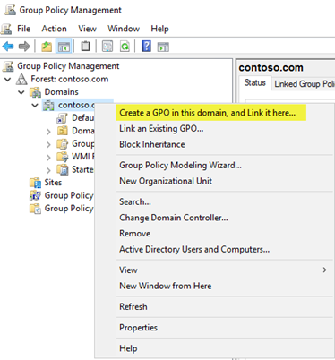

# Deploy Windows 10 updates using Windows Server Update Services (WSUS)

**Applies to**

- Windows 10

> **Looking for consumer information?** See [Windows Update: FAQ](https://support.microsoft.com/help/12373/windows-update-faq) 

>[!IMPORTANT]
>Due to [naming changes](waas-overview.md#naming-changes), older terms like CB and CBB might still be displayed in some of our products, such as in Group Policy or the registry. If you encounter these terms, "CB" refers to the Semi-Annual Channel (Targeted)--which is no longer used--while "CBB" refers to the Semi-Annual Channel.

WSUS is a Windows Server role available in the Windows Server operating systems. It provides a single hub for Windows updates within an organization. WSUS allows companies not only to defer updates but also to selectively approve them, choose when they’re delivered, and determine which individual devices or groups of devices receive them. WSUS provides additional control over Windows Update for Business but does not provide all the scheduling options and deployment flexibility that System Center Configuration Manager provides.

When you choose WSUS as your source for Windows updates, you use Group Policy to point Windows 10 client devices to the WSUS server for their updates. From there, updates are periodically downloaded to the WSUS server and managed, approved, and deployed through the WSUS administration console or Group Policy, streamlining enterprise update management. If you’re currently using WSUS to manage Windows updates in your environment, you can continue to do so in Windows 10. 

## Requirements for Windows 10 servicing with WSUS

To be able to use WSUS to manage and deploy Windows 10 feature updates, you must use a supported WSUS version: 
- WSUS 10.0.14393 (role in Windows Server 2016)
- WSUS 10.0.17763 (role in Windows Server 2019) 
- WSUS 6.2 and 6.3 (role in Windows Server 2012 and Windows Server 2012 R2)
- KB 3095113 and KB 3159706 (or an equivalent update) must be installed on WSUS 6.2 and 6.3.

> [!IMPORTANT]
> Both [KB 3095113](https://support.microsoft.com/kb/3095113) and [KB 3159706](https://support.microsoft.com/kb/3159706) are included in the **Security Monthly Quality Rollup** starting in July 2017. This means you might not see KB 3095113 and KB 3159706 as installed updates since they might have been installed with a rollup. However, if you need either of these updates, we recommend installing a **Security Monthly Quality Rollup** released after **October 2017** since they contain an additional WSUS update to decrease memory utilization on WSUS's clientwebservice.
>If you have synced either of these updates prior to the security monthly quality rollup, you can experience problems. To recover from this, see [How to Delete Upgrades in WSUS](https://blogs.technet.microsoft.com/wsus/2016/01/29/how-to-delete-upgrades-in-wsus/).

## WSUS scalability

To use WSUS to manage all Windows updates, some organizations may need access to WSUS from a perimeter network, or they might have some other complex scenario. WSUS is highly scalable and configurable for organizations of any size or site layout. For specific information about scaling WSUS, including upstream and downstream server configuration, branch offices, WSUS load balancing, and other complex scenarios, see [Choose a Type of WSUS Deployment](https://technet.microsoft.com/library/cc720448%28v=ws.10%29.aspx).
 

## Configure automatic updates and update service location

When using WSUS to manage updates on Windows client devices, start by configuring the **Configure Automatic Updates** and **Intranet Microsoft Update Service Location** Group Policy settings for your environment. Doing so forces the affected clients to contact the WSUS server so that it can manage them. The following process describes how to specify these settings and deploy them to all devices in the domain.

**To configure the Configure Automatic Updates and Intranet Microsoft Update Service Location Group Policy settings for your environment**

1. Open Group Policy Management Console (gpmc.msc).

2. Expand *Forest\Domains\\*Your_Domain**. 

3. Right-click **Your_Domain**, and then select **Create a GPO in this domain, and Link it here**.

    
    
   >[!NOTE]
   >In this example, the **Configure Automatic Updates** and **Intranet Microsoft Update Service Location** Group Policy settings are specified for the entire domain. This is not a requirement; you can target these settings to any security group by using Security Filtering or a specific OU.
    
4. In the **New GPO** dialog box, name the new GPO **WSUS – Auto Updates and Intranet Update Service Location**.

5. Right-click the **WSUS – Auto Updates and Intranet Update Service Location** GPO, and then click **Edit**.

6. In the Group Policy Management Editor, go to Computer Configuration\Policies\Administrative Templates\Windows Components\Windows Update.

7. Right-click the **Configure Automatic Updates** setting, and then click **Edit**.

   
    
8. In the **Configure Automatic Updates** dialog box, select **Enable**.

9. Under **Options**, from the **Configure automatic updating** list, select **3 - Auto download and notify for install**, and then click **OK**.

   
    
   > [!NOTE]
   > There are three other settings for automatic update download and installation dates and times. This is simply the option this example uses. For more examples of how to control automatic updates and other related policies, see [Configure Automatic Updates by Using Group Policy](https://technet.microsoft.com/library/cc720539%28v=ws.10%29.aspx). 
    
10. Right-click the **Specify intranet Microsoft update service location** setting, and then select **Edit**. 

11. In the **Specify intranet Microsoft update service location** dialog box, select **Enable**.

12. Under **Options**, in the **Set the intranet update service for detecting updates** and **Set the intranet statistics server** options, type <strong>http://Your_WSUS_Server_FQDN:PortNumber</strong>, and then select **OK**.

    >[!NOTE]
    >The URL `http://CONTOSO-WSUS1.contoso.com:8530` in the following image is just an example. In your environment, be sure to use the server name and port number for your WSUS instance.
    
     
     
     >[!NOTE]
     >The default HTTP port for WSUS is 8530, and the default HTTP over Secure Sockets Layer (HTTPS) port is 8531. (The other options are 80 and 443; no other ports are supported.)

As Windows clients refresh their computer policies (the default Group Policy refresh setting is 90 minutes and when a computer restarts), computers start to appear in WSUS. Now that clients are communicating with the WSUS server, create the computer groups that align with your deployment rings.

## Create computer groups in the WSUS Administration Console

>[!NOTE]
>The following procedures use the groups from Table 1 in [Build deployment rings for Windows 10 updates](waas-deployment-rings-windows-10-updates.md) as examples.

You can use computer groups to target a subset of devices that have specific quality and feature updates. These groups represent your deployment rings, as controlled by WSUS. You can populate the groups either manually by using the WSUS Administration Console or automatically through Group Policy. Regardless of the method you choose, you must first create the groups in the WSUS Administration Console. 

**To create computer groups in the WSUS Administration Console**

1. Open the WSUS Administration Console. 

2. Go to *Server_Name*\Computers\All Computers, and then click **Add Computer Group**. 

    
    
3. Type **Ring 2 Pilot Business Users** for the name, and then click **Add**.

4. Repeat these steps for the **Ring 3 Broad IT** and **Ring 4 Broad Business Users** groups. When you’re finished, there should be three deployment ring groups.

Now that the groups have been created, add the computers to the computer groups that align with the desired deployment rings. You can do this through [Group Policy](#wsus-gp) or manually by using the [WSUS Administration Console](#wsus-admin).

## Use the WSUS Administration Console to populate deployment rings

Adding computers to computer groups in the WSUS Administration Console is simple, but it could take much longer than managing membership through Group Policy, especially if you have many computers to add. Adding computers to computer groups in the WSUS Administration Console is called *server-side targeting*. 

In this example, you add computers to computer groups in two different ways: by manually assigning unassigned computers and by searching for multiple computers.

### Manually assign unassigned computers to groups

When new computers communicate with WSUS, they appear in the **Unassigned Computers** group. From there, you can use the following procedure to add computers to their correct groups. For these examples, you use two Windows 10 PCs (WIN10-PC1 and WIN10-PC2) to add to the computer groups.

**To assign computers manually**

1. In the WSUS Administration Console, go to *Server_Name*\Computers\All Computers\Unassigned Computers.

    Here, you see the new computers that have received the GPO you created in the previous section and started communicating with WSUS. This example has only two computers; depending on how broadly you deployed your policy, you will likely have many computers here.

2. Select both computers, right-click the selection, and then click **Change Membership**.

    

3. In the **Set Computer Group Membership** dialog box, select the **Ring 2 Pilot Business Users** deployment ring, and then click **OK**.

    Because they were assigned to a group, the computers are no longer in the **Unassigned Computers** group. If you select the **Ring 2 Pilot Business Users** computer group, you will see both computers there.

### Search for multiple computers to add to groups

Another way to add multiple computers to a deployment ring in the WSUS Administration Console is to use the search feature.

**To search for multiple computers**

1. In the WSUS Administration Console, go to *Server_Name*\Computers\All Computers, right-click **All Computers**, and then click **Search**.

2. In the search box, type **WIN10**.

3. In the search results, select the computers, right-click the selection, and then click **Change Membership**.

    
    
4. Select the **Ring 3 Broad IT** deployment ring, and then click **OK**.

You can now see these computers in the **Ring 3 Broad IT** computer group.

## Use Group Policy to populate deployment rings

The WSUS Administration Console provides a friendly interface from which you can manage Windows 10 quality and feature updates. When you need to add many computers to their correct WSUS deployment ring, however, it can be time-consuming to do so manually in the WSUS Administration Console. For these cases, consider using Group Policy to target the correct computers, automatically adding them to the correct WSUS deployment ring based on an Active Directory security group. This process is called *client-side targeting*. Before enabling client-side targeting in Group Policy, you must configure WSUS to accept Group Policy computer assignment.

**To configure WSUS to allow client-side targeting from Group Policy**

1. Open the WSUS Administration Console, and go to *Server_Name*\Options, and then click **Computers**.

     
     
2. In the **Computers** dialog box, select **Use Group Policy or registry settings on computers**, and then click **OK**.

    >[!NOTE]
    >This option is exclusively either-or. When you enable WSUS to use Group Policy for group assignment, you can no longer manually add computers through the WSUS Administration Console until you change the option back. 
    
Now that WSUS is ready for client-side targeting, complete the following steps to use Group Policy to configure client-side targeting:

**To configure client-side targeting**

>[!TIP]
>When using client-side targeting, consider giving security groups the same names as your deployment rings. Doing so simplifies the policy-creation process and helps ensure that you don’t add computers to the incorrect rings.

1. Open Group Policy Management Console (gpmc.msc).

2. Expand Forest\Domains\\*Your_Domain*.

3. Right-click *Your_Domain*, and then click **Create a GPO in this domain, and Link it here**.

4. In the **New GPO** dialog box, type **WSUS – Client Targeting – Ring 4 Broad Business Users** for the name of the new GPO.

5. Right-click the **WSUS – Client Targeting – Ring 4 Broad Business Users** GPO, and then click **Edit**.

    
    
6. In the Group Policy Management Editor, go to Computer Configuration\Policies\Administrative Templates\Windows Components\Windows Update.

7. Right-click **Enable client-side targeting**, and then click **Edit**.

8. In the **Enable client-side targeting** dialog box, select **Enable**.

9. In the **Target group name for this computer** box, type *Ring 4 Broad Business Users*. This is the name of the deployment ring in WSUS to which these computers will be added.

    

> [!WARNING]
> The target group name must match the computer group name.

10. Close the Group Policy Management Editor.

Now you’re ready to deploy this GPO to the correct computer security group for the **Ring 4 Broad Business Users** deployment ring. 

**To scope the GPO to a group**

1. In GPMC, select the **WSUS – Client Targeting – Ring 4 Broad Business Users** policy.

2. Click the **Scope** tab.

3. Under **Security Filtering**, remove the default **AUTHENTICATED USERS** security group, and then add the **Ring 4 Broad Business Users** group.

    
    
The next time the clients in the **Ring 4 Broad Business Users** security group receive their computer policy and contact WSUS, they will be added to the **Ring 4 Broad Business Users** deployment ring. 

## Automatically approve and deploy feature updates

For clients that should have their feature updates approved as soon as they’re available, you can configure Automatic Approval rules in WSUS.

>[!NOTE]
>WSUS respects the client device's servicing branch. If you approve a feature update while it is still in one branch, such as Insider Preview, WSUS will install the update only on devices that are in that servicing branch. When Microsoft releases the build for Semi-Annual Channel, the devices in the Semi-Annual Channel will install it. Windows Update for Business branch settings do not apply to feature updates through WSUS.

**To configure an Automatic Approval rule for Windows 10 feature updates and approve them for the Ring 3 Broad IT deployment ring**

1. In the WSUS Administration Console, go to Update Services\\*Server_Name*\Options, and then select **Automatic Approvals**.

2. On the **Update Rules** tab, click **New Rule**.

3. In the **Add Rule** dialog box, select the **When an update is in a specific classification**, **When an update is in a specific product**, and **Set a deadline for the approval** check boxes.

     
     
4. In the **Edit the properties** area, select **any classification**. Clear everything except **Upgrades**, and then click **OK**.

5. In the **Edit the properties area**, click the **any product** link. Clear all check boxes except **Windows 10**, and then click **OK**.

    Windows 10 is under All Products\Microsoft\Windows.
    
6. In the **Edit the properties** area, click the **all computers** link. Clear all the computer group check boxes except **Ring 3 Broad IT**, and then click **OK**.

7. Leave the deadline set for **7 days after the approval at 3:00 AM**.

8. In the **Step 3: Specify a name** box, type **Windows 10 Upgrade Auto-approval for Ring 3 Broad IT**, and then click **OK**.

    
    
9. In the **Automatic Approvals** dialog box, click **OK**.

    >[!NOTE]
    >WSUS does not honor any existing month/week/day [deferral settings](waas-configure-wufb.md#configure-when-devices-receive-feature-updates). That said, if you’re using Windows Update for Business for a computer for which WSUS is also managing updates, when WSUS approves the update, it will be installed on the computer regardless of whether you configured Group Policy to wait.

Now, whenever Windows 10 feature updates are published to WSUS, they will automatically be approved for the **Ring 3 Broad IT** deployment ring with an installation deadline of 1 week.

> [!WARNING]
> The auto approval rule runs after synchronization occurs. This means that the *next* upgrade for each Windows 10 version will be approved. If you select **Run Rule**, all possible updates that meet the criteria will be approved, potentially including older updates that you don't actualy want--which can be a problem when the download sizes are very large.

## Manually approve and deploy feature updates

You can manually approve updates and set deadlines for installation within the WSUS Administration Console, as well. It might be best to approve update rules manually after your pilot deployment has been updated.

To simplify the manual approval process, start by creating a software update view that contains only Windows 10 updates.

**To approve and deploy feature updates manually**

1.	 In the WSUS Administration Console, go to Update Services\\*Server_Name*\Updates. In the **Action** pane, click **New Update View**.

2. In the **Add Update View** dialog box, select **Updates are in a specific classification** and **Updates are for a specific product**.

3. Under **Step 2: Edit the properties**, click **any classification**. Clear all check boxes except **Upgrades**, and then click **OK**.

4. Under **Step 2: Edit the properties**, click **any product**. Clear all check boxes except **Windows 10**, and then click **OK**.

    Windows 10 is under All Products\Microsoft\Windows.
    
5. In the **Step 3: Specify a name** box, type **All Windows 10 Upgrades**, and then click **OK**.

     

Now that you have the **All Windows 10 Upgrades** view, complete the following steps to manually approve an update for the **Ring 4 Broad Business Users** deployment ring:

1. In the WSUS Administration Console, go to Update Services\\*Server_Name*\Updates\All Windows 10 Upgrades.

2. Right-click the feature update you want to deploy, and then click **Approve**.

        
      
3. In the **Approve Updates** dialog box, from the **Ring 4 Broad Business Users** list, select **Approved for Install**.

       
      
4. In the **Approve Updates** dialog box, from the **Ring 4 Broad Business Users** list, click **Deadline**, click **One Week**, and then click **OK**. 

       
      
5. If the **Microsoft Software License Terms** dialog box opens, click **Accept**.

    If the deployment is successful, you should receive a successful progress report.
    
     

6. In the **Approval Progress** dialog box, click **Close**.

 

## Steps to manage updates for Windows 10

| | |
| --- | --- |
|  | [Learn about updates and servicing channels](waas-overview.md) |
|  | [Prepare servicing strategy for Windows 10 updates](waas-servicing-strategy-windows-10-updates.md) |
|  | [Build deployment rings for Windows 10 updates](waas-deployment-rings-windows-10-updates.md) |
|  | [Assign devices to servicing channels for Windows 10 updates](waas-servicing-channels-windows-10-updates.md) |
|  | [Optimize update delivery for Windows 10 updates](waas-optimize-windows-10-updates.md) |
|  | [Deploy updates using Windows Update for Business](waas-manage-updates-wufb.md) or Deploy Windows 10 updates using Windows Server Update Services (this topic) or [Deploy Windows 10 updates using System Center Configuration Manager](waas-manage-updates-configuration-manager.md) |

## Related topics

- [Update Windows 10 in the enterprise](index.md)
- [Overview of Windows as a service](waas-overview.md)
- [Prepare servicing strategy for Windows 10 updates](waas-servicing-strategy-windows-10-updates.md)
- [Build deployment rings for Windows 10 updates](waas-deployment-rings-windows-10-updates.md)
- [Assign devices to servicing channels for Windows 10 updates](waas-servicing-channels-windows-10-updates.md)
- [Optimize update delivery for Windows 10 updates](waas-optimize-windows-10-updates.md)
- [Configure Delivery Optimization for Windows 10 updates](waas-delivery-optimization.md)
- [Configure BranchCache for Windows 10 updates](waas-branchcache.md)
- [Deploy updates for Windows 10 Mobile Enterprise and Windows 10 IoT Mobile](waas-mobile-updates.md) 
- [Deploy updates using Windows Update for Business](waas-manage-updates-wufb.md)
- [Configure Windows Update for Business](waas-configure-wufb.md)
- [Integrate Windows Update for Business with management solutions](waas-integrate-wufb.md)
- [Walkthrough: use Group Policy to configure Windows Update for Business](waas-wufb-group-policy.md)
- [Walkthrough: use Intune to configure Windows Update for Business](https://docs.microsoft.com/intune/windows-update-for-business-configure)
- [Deploy Windows 10 updates using System Center Configuration Manager](waas-manage-updates-configuration-manager.md)
- [Manage device restarts after updates](waas-restart.md)
