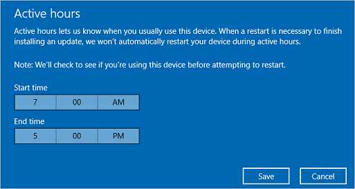

# Manage device restarts after updates

> **Looking for consumer information?** See [Windows Update: FAQ](https://support.microsoft.com/help/12373/windows-update-faq)

You can use Group Policy settings, mobile device management (MDM), or Registry (not recommended) to configure when devices will restart after a Windows update is installed. You can schedule update installation and set policies for restart, configure active hours for when restarts won't occur, or you can do both.

## Schedule update installation

In Group Policy, within **Configure Automatic Updates**, you can configure a forced restart after a specified installation time.

To set the time, you need to go to **Configure Automatic Updates**, select option **4 - Auto download and schedule the install**, and then enter a time in the **Scheduled install time** dropdown. Alternatively, you can specify that installation occurs during the automatic maintenance time (configured using **Computer Configuration\Administrative Templates\Windows Components\Maintenance Scheduler**).

**Always automatically restart at the scheduled time** forces a restart after the specified installation time and lets you configure a timer to warn a signed-in user that a restart is going to occur.

While not recommended, the same result can be achieved through Registry. Under **HKLM\Software\Policies\Microsoft\Windows\WindowsUpdate\AU**, set **AuOptions** to **4**, set the install time with **ScheduledInstallTime**, enable **AlwaysAutoRebootAtScheduledTime** and specify the delay in minutes through **AlwaysAutoRebootAtScheduledTimeMinutes**. Similar to Group Policy, **AlwaysAutoRebootAtScheduledTimeMinutes** sets the timer to warn a signed-in user that a restart is going to occur.

For a detailed description of these registry keys, see [Registry keys used to manage restart](#registry-keys-used-to-manage-restart).

## Delay automatic reboot

When **Configure Automatic Updates** is enabled in Group Policy, you can also enable one of the following policies to delay an automatic reboot after update installation:

- **Turn off auto-restart for updates during active hours** prevents automatic restart during active hours.
- **No auto-restart with logged on users for scheduled automatic updates installations** prevents automatic restart when a user is signed in. If a user schedules the restart in the update notification, the device restarts at the time the user specifies even if a user is signed in at the time. This policy only applies when **Configure Automatic Updates** is set to option **4-Auto download and schedule the install**.

> [!NOTE]
> When using Remote Desktop Protocol connections, only active RDP sessions are considered as logged on users. Devices that do not have locally logged on users, or active RDP sessions, will be restarted.

You can also use Registry, to prevent automatic restarts when a user is signed in. Under **HKLM\Software\Policies\Microsoft\Windows\WindowsUpdate\AU**, set **AuOptions** to **4** and enable **NoAutoRebootWithLoggedOnUsers**. As with Group Policy, if a user schedules the restart in the update notification, it overrides this setting.

For a detailed description of these registry keys, see [Registry keys used to manage restart](#registry-keys-used-to-manage-restart).

## Configure active hours

*Active hours* identify the period of time when you expect the device to be in use. Automatic restarts after an update occur outside of the active hours.

By default, active hours are from 8 AM to 5 PM on PCs and from 5 AM to 11 PM on phones. Users can change the active hours manually.

Starting with Windows 10, version 1703, you can also specify the max active hours range. The specified range is counted from the active hours start time.

Administrators can use multiple ways to set active hours for managed devices:

- You can use Group Policy, as described in the procedure that follows.
- You can use MDM, as described in [Configuring active hours with MDM](#configuring-active-hours-with-mdm).
- While not recommended, you can also configure active hours, as described in [Configuring active hours through Registry](#configuring-active-hours-through-registry).

### Configuring active hours with Group Policy

To configure active hours using Group Policy, go to **Computer Configuration\Administrative Templates\Windows Components\Windows Update** and open the **Turn off auto-restart for updates during active hours** policy setting. When the policy is enabled, you can set the start and end times for active hours.

### Configuring active hours with MDM

MDM uses the [Update/ActiveHoursStart and Update/ActiveHoursEnd](/windows/client-management/mdm/policy-configuration-service-provider#Update_ActiveHoursEnd)  and [Update/ActiveHoursMaxRange](/windows/client-management/mdm/policy-configuration-service-provider#update-activehoursmaxrange) settings in the [Policy CSP](/windows/client-management/mdm/policy-configuration-service-provider) to configure active hours.

### Configuring active hours through Registry

This method isn't recommended, and should only be used when you can't use Group Policy or MDM.
Any settings configured through Registry may conflict with any existing configuration that uses any of the methods mentioned above.

Configure active hours by setting a combination of the following registry values:

Under **HKLM\Software\Policies\Microsoft\Windows\WindowsUpdate** use **SetActiveHours** to enable or disable active hours and **ActiveHoursStart** and **ActiveHoursEnd** to specify the range of active hours.

For a detailed description of these registry keys, see [Registry keys used to manage restart](#registry-keys-used-to-manage-restart).

>[!NOTE]
>To configure active hours manually on a single device, go to **Settings** > **Update & security** > **Windows Update** and select **Change active hours**.
>
>

### Configuring active hours max range

With Windows 10, version 1703, administrators can specify the max active hours range users can set. This option gives you additional flexibility to leave some of the decision for active hours on the user's side, while making sure you allow enough time for updating. The max range is calculated from active hours start time.

To configure active hours max range through Group Policy, go to **Computer Configuration\Administrative Templates\Windows Components\Windows Update** and open the **Specify active hours range for auto-restarts**.

To configure active hours max range through MDM, use [**Update/ActiveHoursMaxRange**](/windows/client-management/mdm/policy-configuration-service-provider#update-activehoursmaxrange).

## Limit restart delays

After an update is installed, Windows attempts automatic restart outside of active hours. If the restart doesn't succeed after seven days (by default), the user will see a notification that restart is required. You can use the **Specify deadline before auto-restart for update installation** policy to change the delay from seven days to any number of days between 2 and 14.

## Control restart notifications

### Display options for update notifications

Starting in Windows 10 version 1809, you can define which Windows Update notifications are displayed to the user. This policy doesn't control how and when updates are downloaded and installed. You can use **Computer Configuration > Administrative Templates > Windows Components > Windows Update > Display options for update notifications** with these values:

**0** (default) - Use the default Windows Update notifications  
**1** - Turn off all notifications, excluding restart warnings  
**2** - Turn off all notifications, including restart warnings  

To configure this behavior through MDM, use [**Update/UpdateNotificationLevel**](/windows/client-management/mdm/policy-configuration-service-provider#update-updatenotificationlevel).

Starting in Windows 11, version 22H2, **Apply only during active hours** was added as an additional option for **Display options for update notifications**. When **Apply only during active hours** is selected, the notifications will only be disabled during active hours when options `1` or `2` are used. To ensure that the device stays updated, a notification will still be shown during active hours if **Apply only during active hours** is selected, and once a deadline has been reached when [Specify deadlines for automatic updates and restarts](wufb-compliancedeadlines.md) is configured. <!--6286260-->

To configure this behavior through MDM, use [**Update/UpdateNotificationLevel**](/windows/client-management/mdm/policy-csp-update#update-NoUpdateNotificationDuringActiveHours).

### Auto restart notifications

Administrators can override the default behavior for the auto restart required notification. By default, this notification dismisses automatically. This setting was added in Windows 10, version 1703.

To configure this behavior through Group Policy, go to **Computer Configuration\Administrative Templates\Windows Components\Windows Update** and select **Configure auto-restart required notification for updates**. When configured to **2 - User Action**, a user that gets this notification must manually dismiss it.

To configure this behavior through MDM, use [**Update/AutoRestartRequiredNotificationDismissal**](/windows/client-management/mdm/policy-configuration-service-provider#update-AutoRestartRequiredNotificationDismissal)

You can also configure the period prior to an update that this notification shows up. The default value is 15 minutes.

To change it through Group Policy, select **Configure auto-restart-reminder notifications for updates** under **Computer Configuration\Administrative Templates\Windows Components\Windows Update** and select the period in minutes.

To change it through MDM, use [**Update/AutoRestartNotificationSchedule**](/windows/client-management/mdm/policy-configuration-service-provider#update-AutoRestartNotificationSchedule).

In some cases, you don't need a notification to show up.

To do so through Group Policy, go to **Computer Configuration\Administrative Templates\Windows Components\Windows Update** and select **Turn off auto-restart notifications for update installations**.

To do so through MDM, use [**Update/SetAutoRestartNotificationDisable**](/windows/client-management/mdm/policy-configuration-service-provider#update-setautorestartnotificationdisable).

### Scheduled auto restart warnings

Since users aren't able to postpone a scheduled restart once the deadline has been reached, you can configure a warning reminder prior to the scheduled restart. You can also configure a warning prior to the restart, to notify users once the restart is imminent and allow them to save their work.

To configure both through Group Policy, find **Configure auto-restart warning notifications schedule for updates** under **Computer Configuration\Administrative Templates\Windows Components\Windows Update**. The warning reminder can be configured by **Reminder (hours)** and the warning prior to an imminent auto restart can be configured by **Warning (mins)**.

In MDM, the warning reminder is configured using [**Update/ScheduleRestartWarning**](/windows/client-management/mdm/policy-configuration-service-provider#update-ScheduleRestartWarning) and the auto restart imminent warning is configured using [**Update/ScheduleImminentRestartWarning**](/windows/client-management/mdm/policy-configuration-service-provider#update-ScheduleImminentRestartWarning).

### Engaged restart

Engaged restart is the period of time when users are required to schedule a restart. Initially, Windows auto-restarts outside of working hours. Once the set period ends (seven days by default), Windows transitions to user scheduled restarts.

The following settings can be adjusted for engaged restart:
* Period of time before auto restart transitions to engaged restart.
* The number of days that users can snooze engaged restart reminder notifications.
* The number of days before a pending restart automatically executes outside of working hours.

In Group Policy, go to **Computer Configuration\Administrative Templates\Windows Components\Windows Update** and pick **Specify Engaged restart transition and notification schedule for updates**.

In MDM, use [**Update/EngagedRestartTransitionSchedule**](/windows/client-management/mdm/policy-configuration-service-provider#update-EngagedRestartTransitionSchedule), [**Update/EngagedRestartSnoozeSchedule**](/windows/client-management/mdm/policy-configuration-service-provider#update-EngagedRestartSnoozeSchedule) and [**Update/EngagedRestartDeadline**](/windows/client-management/mdm/policy-configuration-service-provider#update-EngagedRestartDeadline) respectively.

## Group Policy settings for restart

In the Group Policy editor, you'll see policy settings that pertain to restart behavior in **Computer Configuration\Administrative Templates\Windows Components\Windows Update**. The following table shows which policies apply to Windows 10.

| Policy | Applies to Windows 10 | Notes |
| --- | --- | --- |
| Turn off auto-restart for updates during active hours | Yes | Use this policy to configure active hours, during which the device won't be restarted. This policy has no effect if the **No auto-restart with logged on users for scheduled automatic updates installations** or **Always automatically restart at the scheduled time** policies are enabled.  |
| Always automatically restart at the scheduled time | Yes | Use this policy to configure a restart timer (between 15 and 180 minutes) that will start immediately after Windows Update installs important updates. This policy has no effect if the **No auto-restart with logged on users for scheduled automatic updates installations** policy is enabled. |
| Specify deadline before auto-restart for update installation | Yes | Use this policy to specify how many days (between 2 and 14) an automatic restart can be delayed. This policy has no effect if the **No auto-restart with logged on users for scheduled automatic updates installations** or **Always automatically restart at the scheduled time** policies are enabled.  |
| No auto-restart with logged on users for scheduled automatic updates installations | Yes | Use this policy to prevent automatic restart when a user is logged on. This policy applies only when the **Configure Automatic Updates** policy is configured to perform scheduled installations of updates. |
| Re-prompt for restart with scheduled installations | No |   |
| Delay Restart for scheduled installations | No |   |
| Reschedule Automatic Updates scheduled installations | No |   |

>[!NOTE]
>You can only choose one path for restart behavior.
>If you set conflicting restart policies, the actual restart behavior may not be what you expected.
>When using RDP, only active RDP sessions are considered as logged on users.

## Registry keys used to manage restart
The following tables list registry values that correspond to the Group Policy settings for controlling restarts after updates in Windows 10.

**HKLM\Software\Policies\Microsoft\Windows\WindowsUpdate**

| Registry key |	Key type | Value |
| --- | --- | --- |
| ActiveHoursEnd	| REG_DWORD | 0-23: set active hours to end at a specific hour   starts with 12 AM (0) and ends with 11 PM (23) |
| ActiveHoursStart | REG_DWORD | 0-23: set active hours to start at a specific hour   starts with 12 AM (0) and ends with 11 PM (23) |
| SetActiveHours | REG_DWORD | 0: disable automatic restart after updates outside of active hours 1: enable automatic restart after updates outside of active hours |

**HKLM\Software\Policies\Microsoft\Windows\WindowsUpdate\AU**

| Registry key | Key type | Value |
| --- | --- | --- |
| AlwaysAutoRebootAtScheduledTime | REG_DWORD | 0: disable automatic reboot after update installation at scheduled time 1: enable automatic reboot after update installation at a scheduled time |
| AlwaysAutoRebootAtScheduledTimeMinutes | REG_DWORD | 15-180: set automatic reboot to occur after given minutes |
| AUOptions | REG_DWORD | 2: notify for download and notify for installation of updates 3: automatically download and notify for installation of updates 4: Automatically download and schedule installation of updates 5: allow the local admin to configure these settings **Note:** To configure restart behavior, set this value to **4** |
| NoAutoRebootWithLoggedOnUsers | REG_DWORD | 0: disable don't reboot if users are logged on 1: don't reboot after an update installation if a user is logged on **Note:** If disabled: Automatic Updates will notify the user that the computer will automatically restart in 5 minutes to complete the installation  |
| ScheduledInstallTime | REG_DWORD | 0-23: schedule update installation time to a specific hour   starts with 12 AM (0) and ends with 11 PM (23) |

There are three different registry combinations for controlling restart behavior:

- To set active hours, **SetActiveHours** should be **1**, while **ActiveHoursStart** and **ActiveHoursEnd** should define the time range.
- To schedule a specific installation and reboot time, **AUOptions** should be **4**, **ScheduledInstallTime** should specify the installation time, and **AlwaysAutoRebootAtScheduledTime** set to **1** and **AlwaysAutoRebootAtScheduledTimeMinutes** should specify number of minutes to wait before rebooting.
- To delay rebooting if a user is logged on, **AUOptions** should be **4**, while **NoAutoRebootWithLoggedOnUsers** is set to **1**.

## More resources

- [Overview of Windows as a service](waas-overview.md)
- [Configure Delivery Optimization for Windows updates](../do/waas-delivery-optimization.md)
- [Configure BranchCache for Windows updates](waas-branchcache.md)
- [Configure Windows Update for Business](waas-configure-wufb.md)
- [Integrate Windows Update for Business with management solutions](waas-integrate-wufb.md)
- [Walkthrough: use Group Policy to configure Windows Update for Business](waas-wufb-group-policy.md)
- [Manage Windows 10 and Windows 11 software updates in Intune](/mem/intune/protect/windows-update-for-business-configure)
