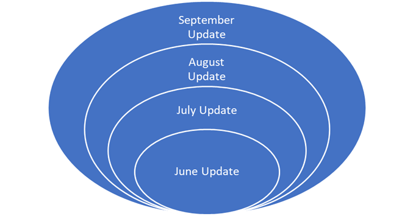

# Understanding the differences between servicing Windows 10-era and legacy Windows operating systems 

> Applies to: Windows 10 
> 
> **February 15, 2019:  This document has been corrected and edited to reflect that security-only updates for legacy OS versions are not cumulative. They were previously identified as cumulative similar to monthly rollups, which is inaccurate.**

Today, many enterprise customers have a mix of modern and legacy client and server operating systems. Managing the servicing and updating differences between those legacy operating systems and Windows 10 versions adds a level of complexity that is not well understood. This can be confusing. With the end of support for legacy [Windows 7 SP1](https://support.microsoft.com/help/4057281/windows-7-support-will-end-on-january-14-2020) and Windows Server 2008 R2 variants on January 14, 2020, System Administrators have a critical need critical to understand how best to leverage a modern workplace to support system updates.
 
The following provides an initial overview of how updating client and server differs between the Windows 10-era Operating Systems (such as, Windows 10 version 1709, Windows Server 2016) and legacy operating systems (such as Windows 7, Windows 8.1, Windows Server 2008 R2, Windows Server 2012 R2). 

>[!NOTE]
>A note on naming convention in this article: For brevity, "Windows 10" refers to all operating systems across client, server and IoT released since July 2015, while "legacy" refers to all operating systems prior to that period for client and server, including Windows 7, Window 8.1, Windows Server 2008 R2, Windows Server 2012 R2, etc.

## Infinite fragmentation
Prior to Windows 10, all updates to operating system (OS) components were published individually. On "Update Tuesday," customers would pick and choose individual updates they wanted to apply. Most chose to update security fixes, while far fewer selected non-security fixes, updated drivers, or installed .NET Framework updates. 

As a result, each environment within the global Windows ecosystem that had only a subset of security and non-security fixes installed had a different set of binaries and behaviors than those that consistently installed every available update as tested by Microsoft. 

This resulted in a fragmented ecosystem  that created diverse challenges in predictively testing interoperability, resulting in high update failure rates - which were subsequently mitigated by customers removing individual updates that were causing issues. Each customer that selectively removed individual updates amplified this fragmentation by creating more diverse environment permutations across the ecosystem. As an IT Administrator once quipped, "If you’ve seen one Windows 7 PC, you have seen one Windows 7 PC," suggesting no consistency or predictability across more than 250M commercial devices at the time.

## Windows 10 – Next generation
Windows 10 provided an opportunity to end the era of infinite fragmentation. With Windows 10 and the Windows as a service model, updates came rolled together in the "latest cumulative update" (LCU) packages for both client and server. Every new update published includes all changes from previous updates, as well as new fixes. Since Windows client and server share the same code base, these LCUs allow the same update to be installed on the same client and server OS family, further reducing fragmentation.

This helps simplify servicing. Devices with the original Release to Market (RTM) version of a feature release installed could get up to date by installing the most recent LCU. 

Windows publishes the new LCU packages for each Windows 10 version (1607, 1709, etc.) on the second Tuesday of each month. This package is classified as a required security update and contains contents from the previous LCU as well as new security, non-security and Internet Explorer 11 (IE11) fixes. The security classification, by definition, requires a reboot of the device to complete installation of the update.

*Figure 1.0 - High level cumulative update model*

Another benefit of the LCU model is fewer steps. Devices that have the original Release to Market (RTM) version of a release can install the most recent LCU to get up to date in one step, rather than having to install multiple updates with reboots after each.

This cumulative update model for Windows 10 has helped provide the Windows ecosystem with consistent update experiences that can be predicted by baseline testing before release. Even with highly complex updates with hundreds of fixes, the number of incidents with monthly security updates for Windows 10 have fallen month over month since the initial release of Windows 10.

### Points to consider

- Windows 10 does not have the concept of a Security-Only or Monthly Rollup for updates. All updates are an LCU package, which includes the last release plus anything new.
- Windows 10 no longer has the concept of a "hotfix" since all individual updates must be rolled into the cumulative packages. (Note: Any private fix is offered for customer validation only, and then rolled into an LCU.)
- [Updates for the .NET Framework](https://blogs.msdn.microsoft.com/dotnet/2016/10/11/net-framework-monthly-rollups-explained/) are NOT included in the Windows 10 LCU. They are separate packages with different behaviors depending on the version of .NET Framework being updated, and on which OS. As of October 2018, .NET Framework updates for Windows 10 will be separate and have their own cumulative update model.
- For Windows 10, available update types vary by publishing channel: 
   - For customers using Windows Server Update Services (WSUS) and for the Update Catalog, several different updates types for Windows 10 are rolled together for the core OS in a single LCU package, with exception of Servicing Stack Updates.
   - Servicing Stack Updates (SSU) are available for download from the Update Catalog and can be imported through WSUS. Servicing Stack Updates (SSU) will be synced automatically (See this example for Windows 10, version 1709). Learn more about [Servicing Stack Updates](https://docs.microsoft.com/windows/deployment/update/servicing-stack-updates).
   - For customers connecting to Windows Update, the new cloud update architecture uses a database of updates which break out all the different update types, including Servicing Stack Updates (SSU) and Dynamic Updates (DU). The update scanning in the Windows 10 servicing stack on the client automatically takes only the updates that are needed by the device to be completely up to date.
- Windows 7 and other legacy operating systems have cumulative updates that operate differently than in Windows 10 (see next section).

## Windows 7 and legacy OS versions
While Windows 10 updates could have been controlled as cumulative from "Day 1," the legacy OS ecosystem for both client and server was highly fragmented. Recognizing the challenges of update quality in a fragmented environment, we moved Windows 7 to a cumulative update model in October 2016. 

Customers saw the LCU model used for Windows 10 as having packages that were too large and represented too much of a change for legacy operating systems, so a different model was implemented. Windows instead offered one cumulative package (Monthly Rollup) and one individual package (Security Only) for all legacy operating systems.

The Monthly Rollup includes new non-security (if appropriate), security updates, Internet Explorer (IE) updates, and all updates from the previous month similar to the Windows 10 model. The Security-only package includes only new security updates for the month. This means that any security updates from any previous month are not included in current month’s Security-Only Package. If a Security-Only update is missed, it is missed. Those updates will not appear in a future Security-Only update. Additionally, a cumulative package is offered for IE, which can be tested and installed separately, reducing the total update package size. The IE cumulative update includes both security and non-security fixes following the same model as Windows 10.

*Figure 2.0 - Legacy OS security-only update model*

Moving to the cumulative model for legacy OS versions continues to improve predictability of update quality. The Windows legacy environments which have fully updated machines with Monthly Rollups are running the same baseline against which all legacy OS version updates are tested. These include all of the updates (security and non-security) prior to and after October 2016. Many customer environments do not have all updates prior to this change installed, which leaves some continued fragmentation in the ecosystem. Further, customers who are installing Security-Only Updates and potentially doing so inconsistently are also more fragmented than Microsoft’s test environments for legacy OS version. This remaining fragmentation results in issues like those seen when the September 2016 Servicing Stack Update (SSU) was needed for smooth installation of the August 2018 security update. These environments did not have the SSU applied previously.

### Points to consider
- Windows 7 and Windows 8 legacy operating system updates [moved from individual to cumulative in October 2016](https://techcommunity.microsoft.com/t5/Windows-Blog-Archive/More-on-Windows-7-and-Windows-8-1-servicing-changes/ba-p/166783). Devices with updates missing prior to that point are still missing those updates, as they were not included in the subsequent cumulative packages. 
-  "Hotfixes" are no longer published for legacy OS versions. All updates are rolled into the appropriate package depending on their classification as either non-security, security, or Internet Explorer updates. (Note: any private fix is offered for customer validation only. Once validated they are then rolled into a Monthly Rollup or IE cumulative update, as appropriate.)
- Both Monthly Rollups and Security-only updates released on Update Tuesday for legacy OS versions are identified as "security required" updates, because both have the full set of security updates in them. The Monthly Rollup may have additional non-security updates that are not included in the Security Only update. The "security" classification requires the device be rebooted so the update can be fully installed.
- Given the differences between the cumulative Monthly Rollups and the single-month Security-only update packages, switching between these update types is not advised. Differences in the baselines of these packages may result in installation errors and conflicts. Choosing one and staying on that update type with high consistency – Monthly Rollup or Security-only – is recommended.
- With all Legacy OS versions now in the Extended Support stage of their 10-year lifecycle, they typically receive only security updates for both Monthly Rollup and Security Only updates. Using Express for the Monthly Rollup results in almost the same package size as Security Only, with the added confidence of ensuring all relevant updates are installed.
- In [February 2017](https://techcommunity.microsoft.com/t5/Windows-Blog-Archive/Simplified-servicing-for-Windows-7-and-Windows-8-1-the-latest/ba-p/166798), Windows pulled IE updates out of the legacy OS versions Security-only updates, while leaving them in the Monthly Rollup updates. This was done specifically to reduce package size based on customer feedback.
- The IE cumulative update includes both security and non-security updates and is also needed for to help secure the entire environment. This update can be installed separately or as part of the Monthly Rollup.
- [Updates for .NET Framework](https://blogs.msdn.microsoft.com/dotnet/2016/10/11/net-framework-monthly-rollups-explained/) are NOT included in legacy Monthly Rollup or Security Only packages. They are separate packages with different behaviors depending on the version of the .NET Framework, and which legacy OS, being updated.
- For [Windows Server 2008 SP2](https://cloudblogs.microsoft.com/windowsserver/2018/06/12/windows-server-2008-sp2-servicing-changes/), cumulative updates began in October 2018, and follow the same model as Windows 7. Updates for IE9 are included in those packages, as the last supported version of Internet Explorer for that Legacy OS version. 

## Public preview releases
Lastly, the cumulative update model directly impacts the public Preview releases offered in the 3rd and/or 4th weeks of the month. Update Tuesday, also referred to as the "B" week release occurs on the second Tuesday of the month. It is always a required security update across all operating systems. In addition to this monthly release, Windows also releases non-security update "previews" targeting the 3rd (C) and the 4th (D) weeks of the month. These preview releases include that month’s B-release plus a set of non-security updates for testing and validation as a cumulative package. We recommend IT Administrators uses the C/D previews to test the update in their environments. Any issues identified with the updates in the C/D releases are identified and then fixed or removed, prior to being rolled up in to the next month’s B release package together with new security updates. Security-only Packages are not part of the C/D preview program.

### Examples
Windows 10 version 1709:
- (9B) September 11, 2018 Update Tuesday / B release - includes security, non-security and IE update. This update is categorized as "Required, Security" it requires a system reboot.
- (9C) September 26, 2018 Preview C release - includes everything from 9B PLUS some non-security updates for testing/validation. This update is qualified as not required, non-security. No system reboot is required.
- (10B) October 9, 2018 Update Tuesday / B release includes all fixes included in 9B, all fixes in 9C and introduces new security fixes and IE updates. This update is qualified as "Required, Security" and requires a system reboot.
All of these updates are cumulative and build on each other for Windows 10. This is in contrast to legacy OS versions, where the 9C release becomes part of the "Monthly Rollup," but not the "Security Only" update. In other words, a Window 7 SP1 9C update is part of the cumulative "Monthly Rollup" but not included in the "Security Only" update because the fixes are qualified as "non-security". This is an important variation to note on the two models. 

*Figure 3.0 - Preview releases within the Windows 10 LCU model*

## Previews vs. on-demand releases
In 2018, we experienced incidents which required urgent remediation that didn’t map to the monthly update release cadence. These incidents were situations that required an immediate fix to an Update Tuesday release. While Windows engineering worked aggressively to respond within a week of the B-release, these "on-demand" releases created confusion with the C Preview releases.

As a general policy, if a Security-Only package has a regression, which is defined as an unintentional error in the code of an update, then the fix for that regression will be added to the next month’s Security-Only Update. The fix for that regression may also be offered as part an On-Demand release and will be rolled into the next Monthly Update. (Note: Exceptions do exist to this policy, based on timing.)

### Point to consider
- When Windows identifies an issue with a Update Tuesday release, engineering teams work to remediate or fix the issue as quickly as possible. The outcome is often a new update which may be released at any time, including during the 3rd or 4th week of the month. Such updates are independent of the regularly scheduled "C" and "D" update previews. These updates are created on-demand to remediate a customer impacting issue. In most cases they are qualified as a "non-security" update, and do not require a system reboot.
- Rarely do incidents with Update Tuesday releases impact more than .1% of the total population. With the new Windows Update (WU) architecture, updates can be targeted to affected devices. This targeting is not available through the Update Catalog or WSUS channels, however. 
- On-demand releases address a specific issue with an Update Tuesday release and are often qualified as "non-security" for one of two reasons. First, the fix may not be an additional security fix, but a non-security change to the update. Second, the "non-security" designation allows individuals or companies to choose when and how to reboot the devices, rather than forcing a system reboot on all Windows devices receiving the update globally. This trade-off is rarely a difficult choice as it has the potential to impact customer experience across client and server, across consumer and commercial customers for more than one billion devices.
- Because the cumulative model is used across Window 10 and legacy Windows OS versions, despite variations between these OS versions, an out of band release will include all of the changes from the Update Tuesday release plus the fix that addresses the issue. And since Windows no longer releases hotfixes, everything is cumulative in some way.

In closing, I hope this overview of the update model across current and legacy Windows OS versions highlights the benefits of the Windows 10 cumulative update model to help defragment the Windows ecosystem environments, simplify servicing and help make systems more secure. 

## Resources
- [Simplifying updates for Windows 7 and 8.1](https://techcommunity.microsoft.com/t5/Windows-Blog-Archive/Simplifying-updates-for-Windows-7-and-8-1/ba-p/166530) 
- [Further simplifying servicing models for Windows 7 and Windows 8.1](https://techcommunity.microsoft.com/t5/Windows-Blog-Archive/Further-simplifying-servicing-models-for-Windows-7-and-Windows-8/ba-p/166772) 
- [More on Windows 7 and Windows 8.1 servicing changes](https://techcommunity.microsoft.com/t5/Windows-Blog-Archive/More-on-Windows-7-and-Windows-8-1-servicing-changes/ba-p/166783)  
- [.NET Framework Monthly Rollups Explained](https://blogs.msdn.microsoft.com/dotnet/2016/10/11/net-framework-monthly-rollups-explained/)   
- [Simplified servicing for Windows 7 and Windows 8.1: the latest improvements](https://techcommunity.microsoft.com/t5/Windows-Blog-Archive/Simplified-servicing-for-Windows-7-and-Windows-8-1-the-latest/ba-p/166798)  
- [Windows Server 2008 SP2 servicing changes](https://cloudblogs.microsoft.com/windowsserver/2018/06/12/windows-server-2008-sp2-servicing-changes/) 
- [Windows 10 update servicing cadence](https://techcommunity.microsoft.com/t5/Windows-IT-Pro-Blog/Windows-10-update-servicing-cadence/ba-p/222376) 
- [Windows 7 servicing stack updates: managing change and appreciating cumulative updates](https://techcommunity.microsoft.com/t5/Windows-IT-Pro-Blog/Windows-7-servicing-stack-updates-managing-change-and/ba-p/260434)
