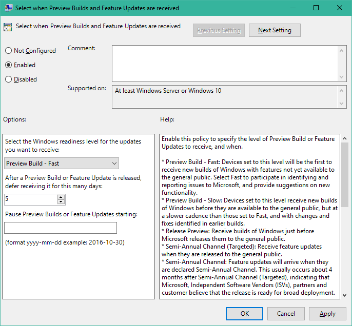

# Windows Insider Program for Business

**Applies to**

- Windows 10

> **Looking for information about Windows 10 for personal or home use?** See [Windows Update: FAQ](https://support.microsoft.com/help/12373/windows-update-faq)

For many IT pros, gaining visibility into feature updates early, before they’re available to the Semi-Annual Channel, can be both intriguing and valuable for future end user communications as well as provide additional prestaging for Semi-Annual Channel devices. With Windows 10, feature flighting enables Windows Insiders to consume and deploy preproduction code to their test devices, gaining early visibility into the next build. Testing the early builds of Windows 10 helps both Microsoft and its customers because they have the opportunity to discover possible issues before the update is ever publicly available and can report it to Microsoft. Also, as flighted builds get closer to their release to the Semi-Annual Channel, organizations can test their deployment on test devices for compatibility validation.

The Windows Insider Program for Business gives you the opportunity to: 
* Get early access to Windows Insider Preview Builds. 
* Provide feedback to Microsoft in real-time via the Feedback Hub app.
* Sign-in with corporate credentials (Azure Active Directory) and increase the visibility of your organization's feedback with Microsoft – especially on features that support your productivity and business needs.
* Register your Azure AD domain into the program, to cover all users within your organization with just one registration.
* Starting with Windows 10, version 1709, enable, disable, defer and pause the installation of preview builds through policies.
* Track feedback provided through the Feedback Hub App, across your organization.

Microsoft recommends that all organizations have at least a few PCs enrolled in the Windows Insider Program, to include the Windows Insider Program in their deployment plans and to provide feedback on any issues they encounter to Microsoft via our Feedback Hub App. 

The Windows Insider Program isn’t intended to replace Semi-Annual Channel deployments in an organization. Rather, it provides IT Pros and other interested parties with pre-release Windows builds that they can test and ultimately provide feedback on to Microsoft. 

## Getting started with Windows Insider Program for Business

To get started with the Windows Insider Program for Business, you can follow a few simple steps:

1. [Register your organizational Azure AD account](#individual-registration) to the Windows Insider Program for Business.
2. [Register your organization's Azure AD domain](#organizational-registration) to the Windows Insider Program for Business. **Note:** Registering user has to be a Global Administrator in the Azure AD domain.
3. [Set policies](#manage-windows-insider-preview-builds) to enable Windows Insider Preview builds and select flight rings.

>[!IMPORTANT]
>The **Allow Telemetry** setting has to be set to 2 or higher, to receive Windows Insider preview builds.
>
>The setting is available in **Group Policy**, through **Computer Configuration/Administrative Templates/Windows Components/Data Collection and Preview Builds - Allow Telemetry** or in **MDM**, through [**System/AllowTelemetry**](/windows/client-management/mdm/policy-csp-system#system-allowtelemetry). 

Below are additional details to accomplish the steps described above.

## Register to the Windows Insider Program for Business

Registration in the Windows Insider Program for Business can be done individually per user or for an entire organization: 

### Individual registration

>[!IMPORTANT]
>This step is a prerequisite to register your organization's Azure AD domain. 

Navigate to the [**Getting Started**](https://insider.windows.com/en-us/getting-started/) page on [Windows Insider](https://insider.windows.com), go to **Register your organization account** and follow the instructions.

>[!NOTE]
>Make sure your device is [connected to your company's Azure AD subscription](waas-windows-insider-for-business-faq.md#connected-to-aad). 

### Organizational registration

This method enables to your register your entire organization to the Windows Insider Program for Business, to avoid having to register each individual user.

>[!IMPORTANT] 
>The account performing these steps has to first be registered to the program individually. Additionally, Global Administrator privileges on the Azure AD domain are required.

1. On the [Windows Insider](https://insider.windows.com) website, go to **For Business > Getting Started** to [register your organizational Azure AD account](https://insider.windows.com/en-us/insidersigninaad/).
2. **Register your domain**. Rather than have each user register individually for Insider Preview builds, administrators can simply [register their domain](https://insider.windows.com/en-us/for-business-organization-admin/) and control settings centrally. **Note:** The signed-in user needs to be a **Global Administrator** of the Azure AD domain in order to be able to register the domain.

>[!NOTE]
>At this point, the Windows Insider Program for Business only supports [Azure Active Directory (Azure AD)](/azure/active-directory/active-directory-whatis) (and not Active Directory on premises) as a corporate authentication method.
>
>If your company is currently not using Azure AD – but has a paid subscription to Office 365, Microsoft Dynamics CRM Online, Enterprise Mobility Suite, or other Microsoft services – you have a free subscription to Microsoft Azure Active Directory. This subscription can be used to create users for enrollment in the Windows Insider Program for Business.

## Manage Windows Insider Preview builds

Starting with Windows 10, version 1709, administrators can control how and when devices receive Windows Insider Preview builds on their devices.

The **Manage preview builds** setting gives enables or prevents preview build installation on a device. You can also decide to stop preview builds once the release is public.
* Group Policy: **Computer Configuration/Administrative Templates/Windows Components/Windows Update/Windows Update for Business** - *Manage preview builds*
* MDM: **Update/ManagePreviewBuilds**

>[!NOTE]
>**MDM Values for ManagePreviewBuilds**:
>* 0 - Disable preview builds
>* 1 - Disable preview builds once next release is public
>* 2 - Enable preview builds
>* 3 - Preview builds are left to user selection *(default)*

The **Branch Readiness Level** settings allows you to choose between preview [flight rings](#flight-rings), and defer or pause the delivery of updates.
* Group Policy: **Computer Configuration/Administrative Templates/Windows Components/Windows Update/ Windows Update for Business** - *Select when Preview Builds and Feature Updates are received*
* MDM: [**Update/BranchReadinessLevel**](/windows/client-management/mdm/policy-csp-update#update-branchreadinesslevel)

### Individual enrollment

If you want to manage Windows Insider preview builds prior to Windows 10, version 1709, or wish to enroll a single device, follow these steps:

1. Enroll your device by going to **Start > Settings > Update & security > Windows Insider Program** and selecting **Get Started**. Sign-in using the account you used to register for the Windows Insider Program.
2. After reading the privacy statement and clicking **Next**, **Confirm** and schedule a restart.
3. You are ready to install your first preview build. To do so, go to **Start** > **Settings** > **Update & security** > **Windows Insider Program** to select your Windows Insider level. The device receives the most recent Windows Insider build for the Windows Insider level you select. 

>[!NOTE]
>To enroll your PC, you’ll require administration rights on the machine and it needs to be running Windows 10, Version 1703 or later. If you are already registered in the Windows Insider Program using your Microsoft account, you’ll need to [switch enrollment to the organizational account](#how-to-switch-between-your-msa-and-your-corporate-aad-account).

>[!TIP]
>Administrators have the option to use [Device Health](/windows/deployment/update/device-health-monitor) in Windows Analytics to monitor devices running Windows 10 Insider Preview builds.

## Flight rings

Flighting rings are used to evaluate the quality of our software as it is released to progressively larger audiences. We will flight a Feature Update, application, etc. to the first ring if it passes all required automated testing in the lab. The flight will continue to be evaluated against a set of criteria to ensure it is ready to progress to the next ring.

These are the available flight rings:

### Release Preview

Best for Insiders who enjoy getting early access to updates for the Semi-Annual Channel, Microsoft applications, and drivers, with minimal risk to their devices, and still want to provide feedback to make Windows devices great.

Insiders on this level receive builds of Windows just before Microsoft releases them to the Semi-Annual Channel. Although these builds aren’t final, they are the most complete and stable builds available to Windows Insider Program participants. This level provides the best testing platform for organizations that conduct early application compatibility testing on Windows Insider PCs.

* The Release Preview Ring will only be visible when your Windows build version is the same as the Semi-Annual Channel.
* To go from a Preview build to the Semi-Annual Channel, use the [Media Creation Tool](http://go.microsoft.com/fwlink/?LinkId=691209) (for PC) or [Windows Device Recovery Tool](http://go.microsoft.com/fwlink/p/?LinkId=522381) (for Mobile) to reinstall Windows.  

### Slow

The Slow Windows Insider level is for users who enjoy seeing new builds of Windows with minimal risk to their devices but still want to provide feedback to Microsoft about their experience with the new build.

* Builds are sent to the Slow Ring after feedback has been received from Windows Insiders within the Fast Ring and analyzed by our Engineering teams.  
* These builds will include updates to fix key issues that would prevent many Windows Insiders from being able to use the build on a daily basis.  
* These builds still may have issues that would be addressed in a future flight.

### Fast

Best for Windows Insiders who enjoy being the first to get access to builds and feature updates, with some risk to their devices in order to identify issues, and provide suggestions and ideas to make Windows software and devices great.

* Windows Insiders with devices in the Fast Ring should be prepared for more issues that may block key activities that are important to you or may require significant workarounds. 
* Because we are also validating a build on a smaller set of devices before going to Fast, there is also a chance that some features may work on some devices but may fail in other device configurations. 
* Windows Insiders should be ready to reinstall Windows using the [Media Creation Tool](http://go.microsoft.com/fwlink/?LinkId=691209) or [Windows Device Recovery Tool](http://go.microsoft.com/fwlink/p/?LinkId=522381) when you are significantly blocked.
* Please remember to report any issue to us through the Windows Insider Feedback Hub or the Windows Insider community forum.

>[!NOTE]
>Once your machine is updated to Windows 10 and you select your desired flight ring, the process known as "Compatibility check" will need to run in the background. There is no manual way to force this process to run. This process allows for the discovery of your OS type (32-bit, 64-bit), build edition (Home, Pro, Enterprise), country and language settings, and other required information. Once this process is complete, your machine will be auto-targeted for the next available flight for your selected ring. For the first build on any given machine, this may take up to 24 hours to complete.

### How to switch between flight rings

During your time in the Windows Insider Program, you may want to change between flight rings for any number of reasons. Starting with Windows 10, version 1709, use the **Branch Readiness Level** to switch between flight rings. 
* Group Policy: **Computer Configuration/Administrative Templates/Windows Components/Windows Update/ Windows Update for Business** - *Select when Preview Builds and Feature Updates are received*
* MDM: [**Update/BranchReadinessLevel**](/windows/client-management/mdm/policy-csp-update#update-branchreadinesslevel)

To switch flights prior to Windows 10, version 1709, follow these steps:

1. Go to **Settings > Updates & Security >  Windows Insider Program**
2. Under **Choose your level**, select between the following rings -
  * [Windows Insider Fast](#fast)
  * [Windows Insider Slow](#slow)
  * [Release Preview](#release-preview)

## How to switch between your MSA and your Corporate AAD account

If you were using your Microsoft Account (MSA) to enroll to the Windows Insider Program, switch to your organizational account by going to **Settings > Updates & Security >  Windows Insider Program**, and under **Windows Insider account** select **Change**.

>[!NOTE]
>If you would like to use your corporate account, your device must be connected to your corporate account in AAD for the account to appear in the account list.

## Sharing Feedback Via the Feedback Hub
As you know a key benefit to being a Windows Insider is Feedback. It’s definitely a benefit to us, and we hope it’s a benefit to you. Feedback is vital for making changes and improvements in Windows 10. Receiving quality and actionable feedback is key in achieving these goals.

Please use the [**Feedback Hub App**](feedback-hub://?referrer=wipForBizDocs&tabid=2) to submit your feedback to Microsoft.  

When providing feedback, please consider the following: 
1. Check for existing feedback on the topic you are preparing to log. Another user may have already shared the same feedback. If they have, please “upvote” the existing feedback to help prevent duplicate submissions. Adding additional comments to existing feedback can help others by providing clarity to existing information or additional scenarios to review. 
2. Provide as much information to us as possible: include reproduction steps, screenshots, any detail you think would help us experience the issue as you have, so that we can work on a fix and get it into a new build as soon as possible.

>[!TIP]
>You can then track feedback provided by all users in your organization through the Feedback Hub. Simply filter by **My Organization**. 
>
>If you're signed in to the Feedback Hub App using your personal Microsoft Account (MSA), you can switch to your work account, by clicking on your account, signing out, and signing back in.

>[!NOTE]
>If you signed into the Feedback Hub previously with your MSA, your feedback and badges will not be transferred to your Azure AD sign-in. However, you can switch back to your MSA account in the Feedback Hub to access feedback you’ve submitted and badges you’ve earned.

### User consent requirement

With the current version of the Feedback Hub app, we need the user's consent to access their AAD account profile data (We read their name, organizational tenant ID and user ID). When they sign in for the first time with the AAD account, they will see a popup asking for their permission, like this:

Once agreed, everything will work fine, and that user won't be prompted for permission again.

#### Something went wrong

The option for users to give consent for apps to access their profile data is controlled through Azure Active Directory. This means the AAD administrators have the ability to allow or block users from giving consent.

In case the administrators blocked this option, when the user signs in with the AAD account, they will see the following error message:

This blocks the user from signing in, which means they won't be able to use the Feedback Hub app with their AAD credentials.

**To fix this issue**, an administrator of the AAD directory will need to enable user consent for apps to access their data.

To do this through the **classic Azure portal**:
1. Go to https://manage.windowsazure.com/ .
2. Switch to the **Active Directory** dashboard.  
   
3. Select the appropriate directory and go to the **Configure** tab.
4. Under the **integrated applications** section, enable **Users may give applications permissions to access their data**.  
   

To do this through the **new Azure portal**:
1. Go to https://portal.azure.com/ .
2. Switch to the **Active Directory** dashboard.  
   
3. Switch to the appropriate directory.  
   
4. Under the **Manage** section, select **User settings**.  
   
5. In the **Enterprise applications** section, enable **Users can allow apps to access their data**.  
   

## Not receiving Windows 10 Insider Preview build updates?

In some cases, your PC may not update to the latest Windows Insider Preview build as expected. Here are items that you can review to troubleshoot this issue:

### Perform a manual check for updates 
Go to **Settings > Updates & Security**. Review available updates or select **Check for updates**.

>[!NOTE]
>If you have set Active Hours, ensure your device is left turned on and signed in during the off-hours so the install process can complete.

### Make sure Windows is activated 
Go to **Settings > Updates & Security > Activation** to verify Windows is activated.

### Make sure your corporate account in AAD is connected to your device
Open **Settings \ Accounts \ Access work or school**. If your PC is not listed as connected to your account in AAD, click Connect and enter your AAD account.

### Make sure you have selected a flight ring
Open **Settings > Update & Security > Windows Insider Program** and select your flight ring.

### Have you recently done a roll-back? 
If so, please double-check your flight settings under **Settings > Update & Security > Windows Insider Program**.

### Did you do a clean install? 
After a clean-install and initial setup of a Microsoft or corporate account (even one that has been used previously for flighting) the appropriate targeting needs to take place for your PC. This background process is known as Compatibility Checker and will run during idle time on your PC. This process may take up to 24 hours. Please leave your PC turned on to ensure this occurs in timely manner. 

### Are there known issues for your current build?
On rare occasion, there may be an issue with a build that could lead to issues with updates being received. Please check the most recent Blog Post or reach out to the Windows Insider team on Twitter for verification (*@WindowsInsider*). You can also check the **Feedback Hub** for announcements and known issues.

## Exiting flighting

After you’ve tried the latest Windows Insider Preview builds, you may want to opt out. In order to do that, go to  **Settings > Update & Security > Windows Insider Program** and select **Stop Insider Preview Builds**. Follow the on-screen instructions to stop flighting to your device.

To go from a Preview build to the Semi-Annual Channel, use the [Media Creation Tool](http://go.microsoft.com/fwlink/?LinkId=691209) (for PC) or [Windows Device Recovery Tool](http://go.microsoft.com/fwlink/p/?LinkId=522381) (for Mobile) to reinstall Windows.  

## Unregister

If you no longer plan to manage Windows Insider Preview policies for your organization, you will need to [unregister your domain with the Windows Insider Program](https://insider.windows.com/en-us/insiderorgleaveprogram/). 

Unregistering will not allow any other administrators at your organization to continue to set policies to manage Windows Insider Preview builds across your organization.

Your individual registration with the Insider program will not be impacted. If you wish to leave the Insider program, see the [leave the program](https://insider.windows.com/en-us/how-to-overview/#leave-the-program) instructions.

>[!IMPORTANT]
>Once your domain is unregistered, setting the **Branch Readiness Level** to preview builds will have no effect. Return this setting to its unconfigured state in order to enable users to control it from their devices.

## Additional help resources

* [**Windows Blog**](https://blogs.windows.com/blog/tag/windows-insider-program/) - With each new build release we publish a Windows Blog post that outlines key feature changes as well as known issues that Insiders may encounter while using the build.
* [**Microsoft Technical Community for Windows Insiders**](https://techcommunity.microsoft.com/t5/Windows-Insider-Program/bd-p/WindowsInsiderProgram) - Engage with Windows Insiders around the world in a community dedicated to the Windows Insider Program.
* [**Windows Insider Preview community forum**](https://answers.microsoft.com/en-us/insider/forum/insider_wintp) - Answers is Microsoft’s forum platform and there is an entire area dedicated to the Windows Insider Program. Insiders can filter between PC, Office, Edge, and many others.

## Learn More
- [Windows Insider Program for Business using Azure Active Directory](waas-windows-insider-for-business-aad.md)
- [Windows Insider Program for Business Frequently Asked Questions](waas-windows-insider-for-business-faq.md)

## Related Topics
- [Overview of Windows as a service](waas-overview.md)
- [Prepare servicing strategy for Windows 10 updates](waas-servicing-strategy-windows-10-updates.md)
- [Build deployment rings for Windows 10 updates](waas-deployment-rings-windows-10-updates.md)
- [Assign devices to servicing channels for Windows 10 updates](waas-servicing-channels-windows-10-updates.md)
- [Optimize update delivery for Windows 10 updates](waas-optimize-windows-10-updates.md)