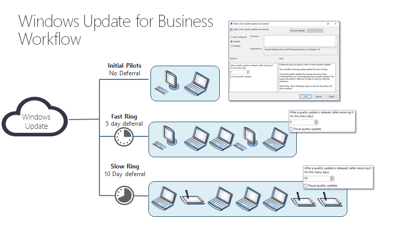
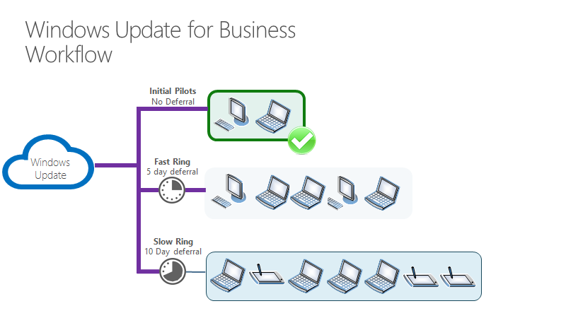
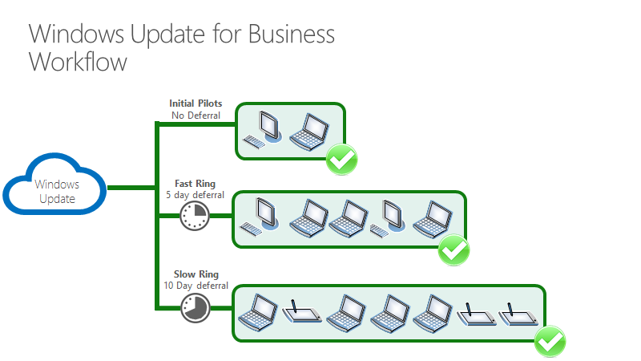
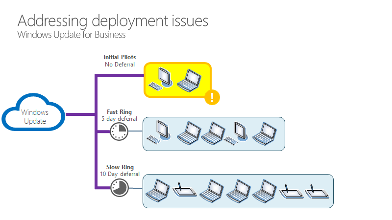

# Walkthrough: use Group Policy to configure Windows Update for Business

**Applies to**

- Windows 10

> **Looking for consumer information?** See [Windows Update: FAQ](https://support.microsoft.com/help/12373/windows-update-faq) 

## Overview 

You can use Group Policy through the Group Policy Management Console (GPMC) to control how Windows Update for Business works. You should consider and devise a deployment strategy for updates before you make changes to the Windows Update for Business settings. See 

An IT administrator can set policies for Windows Update for Business by using Group Policy, or they can be set locally (per device). All of the relevant policies are under the path **Computer configuration > Administrative Templates > Windows Components > Windows Update**.

To manage updates with Windows Update for Business as described in this topic, you should prepare with these steps, if you haven't already:

- Create Active Directory security groups that align with the deployment rings you use to phase deployment of updates. See [Build deployment rings for Windows 10 updates](waas-deployment-rings-windows-10-updates.md) to learn more about deployment rings in Windows 10.
- Allow access to the Windows Update service.
- Download and install ADMX templates appropriate to your Windows 10 version. For more information, see [How to create and manage the Central Store for Group Policy Administrative Templates in Windows](https://support.microsoft.com/help/3087759) and [Step-By-Step: Managing Windows 10 with Administrative templates](https://blogs.technet.microsoft.com/canitpro/2015/10/20/step-by-step-managing-windows-10-with-administrative-templates/).

## Set up Windows Update for Business

In this example, one security group is used to manage updates. Typically we would recommend having at least three rings (early testers for pre-release builds, broad deployment for releases, critical devices for mature releases) to deploy. See [Build deployment rings for Windows 10 updates](waas-deployment-rings-windows-10-updates.md) for more information.

Follow these steps on a device running the Remote Server Administration Tools or on a domain controller:

### Set up a ring
1. Start Group Policy Management Console (gpmc.msc).
2. Expand **Forest > Domains > *\<your domain\>*.
3. Right-click *\<your domain>* and select **Create a GPO in this domain and link it here**.
4. In the **New GPO** dialog box, enter *Windows Update for Business - Group 1* as the name of the new Group Policy Object.
5. Right-click the **Windows Update for Business - Group 1" object, and then select **Edit**.
6. In the Group Policy Management Editor, go to **Computer Configuration > Policies > Administrative Templates > Windows Components > Windows Update**. You are now ready to start assigning policies to this ring (group) of devices.

## Offering

You can control when updates are applied, for example by deferring when an update is installed on a device or by pausing updates for a certain period of time.

### Manage which updates are offered

Windows Update for Business offers you the ability to turn on or off both driver and Microsoft product updates.   

- Drivers (on/off): **Computer configuration > Administrative Templates > Windows Components > Windows Update > Do not include drivers with Windows Updates**
- Microsoft product updates (on/off): **Computer configuration > Administrative Templates > Windows Components > Windows Update > Get updates for other Microsoft Products**

We recommend that you allow the driver policy to allow drivers to updated on devices (the default), but you can turn this setting off if you prefer to manage drivers manually. We also recommend that you leave the "Microsoft product updates" setting on.

### Manage when updates are offered
You can defer or pause the installation of updates for a set period of time.

#### Defer or pause an update

A Windows Update for Business administrator can defer or pause updates and preview builds. You can defer features updates for up to 365 days. You can pause feature or quality updates for up to 35 days from a given start date that you specify.

- Defer or pause a feature update: **Computer configuration > Administrative Templates > Windows Components > Windows Update > Windows Update for Business > Select when Preview Builds and Feature Updates are Received**
- Defer or pause a quality update: **Computer configuration > Administrative Templates > Windows Components > Windows Update > Windows Update for Business > Select when Quality Updates are Received**

#### Example

In this example, there are three rings for quality updates. The first ring ("pilot") has a deferral period of 0 days. The second ring ("fast") has a deferral of five days. The third ring ("slow") has a deferral of ten days.

When the quality update is released, it is offered to devices in the pilot ring the next time they scan for updates.

##### Five days later
The devices in the fast ring are offered the quality update the next time they scan for updates.

##### Ten days later
Ten days after the quality update is released, it is offered to the devices in the slow ring the next time they scan for updates.

If no problems occur, all of the devices that scan for updates will be offered the quality update within ten days of its release, in three waves.

##### What if a problem occurs with the update?

In this example, some problem is discovered during the deployment of the update to the "pilot" ring.

At this point, the IT administrator can set a policy to pause the update. In this example, the admin selects the **Pause quality updates** check box.

Now all devices are paused from updating for 35 days. When the pause is removed, they will be offered the *next* quality update, which ideally will not have the same issue. If there is still an issue, the IT admin can pause updates again.

#### Set branch readiness level for feature updates

This policy only applies to feature updates. To enable preview builds for devices in your organization, set the "Enable preview builds" policy and then use the "Select when preview builds and feature updates are received" policy.

We recommend that you set up a ring to receive preview builds by joining the Windows Insider Program for Business. By having a ring of devices receiving "pre-release slow" builds and learning about commercial pre-release features, you can ensure that any issues you have with the release are fixed before it is ever released and far before you broadly deploy. 

- Enable preview builds: **Computer configuration > Administrative Templates > Windows Components > Windows Update > Windows Update for Business > Manage Preview Builds**

- Set branch readiness level: **Computer configuration > Administrative Templates > Windows Components > Windows Update > Windows Update for Business > Select when Preview Builds and Feature Updates are Received**

## Related topics

- [Update Windows 10 in the enterprise](index.md)
- [Overview of Windows as a service](waas-overview.md)
- [Prepare servicing strategy for Windows 10 updates](waas-servicing-strategy-windows-10-updates.md)
- [Build deployment rings for Windows 10 updates](waas-deployment-rings-windows-10-updates.md)
- [Assign devices to servicing channels for Windows 10 updates](waas-servicing-channels-windows-10-updates.md)
- [Optimize update delivery for Windows 10 updates](waas-optimize-windows-10-updates.md)
- [Configure Delivery Optimization for Windows 10 updates](waas-delivery-optimization.md)
- [Configure BranchCache for Windows 10 updates](waas-branchcache.md)
- [Deploy updates for Windows 10 Mobile Enterprise and Windows 10 IoT Mobile](waas-mobile-updates.md) 
- [Deploy updates using Windows Update for Business](waas-manage-updates-wufb.md)
- [Configure Windows Update for Business](waas-configure-wufb.md)
- [Integrate Windows Update for Business with management solutions](waas-integrate-wufb.md)
- [Walkthrough: use Intune to configure Windows Update for Business](https://docs.microsoft.com/intune/windows-update-for-business-configure)
- [Deploy Windows 10 updates using Windows Server Update Services](waas-manage-updates-wsus.md)
- [Deploy Windows 10 updates using System Center Configuration Manager](waas-manage-updates-configuration-manager.md)
- [Manage device restarts after updates](waas-restart.md)

