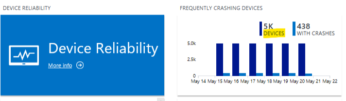
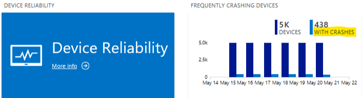
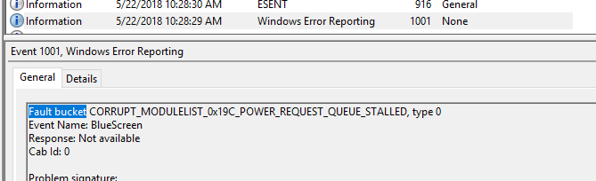
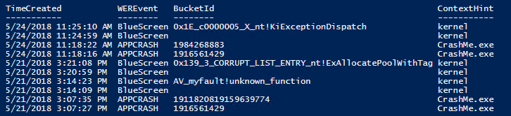
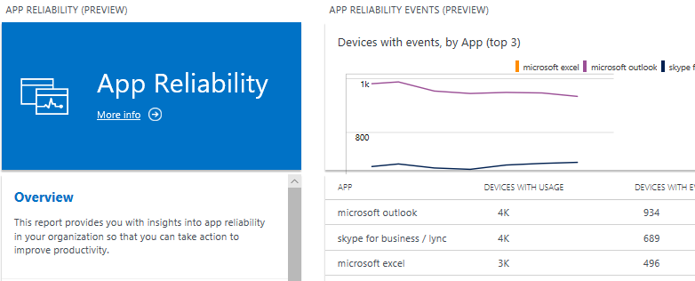
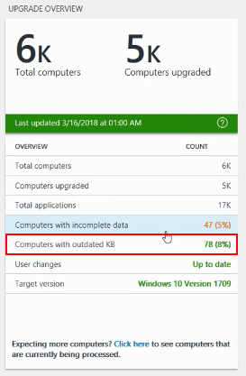

# Frequently asked questions and troubleshooting Windows Analytics

>[!IMPORTANT]
>**The OMS portal has been deprecated; you should start using the [Azure portal](https://portal.azure.com) instead as soon as possible.** Many experiences are the same in the two portals, but there are some key differences. See [Windows Analytics in the Azure Portal](windows-analytics-azure-portal.md) for steps to use Windows Analytics in the Azure portal. For much more information about the transition from OMS to Azure, see [OMS portal moving to Azure](https://docs.microsoft.com/azure/log-analytics/log-analytics-oms-portal-transition).

This topic compiles the most common issues encountered with configuring and using Windows Analytics, as well as general questions. This FAQ, along with the [Windows Analytics Technical Community](https://techcommunity.microsoft.com/t5/Windows-Analytics/ct-p/WindowsAnalytics), are recommended resources to consult before contacting Microsoft support.

## Troubleshooting common problems

If you've followed the steps in the [Enrolling devices in Windows Analytics](windows-analytics-get-started.md) topic and are still encountering problems, you might find the solution here.

[Devices not appearing in Upgrade Readiness](#devices-not-appearing-in-upgrade-readiness)

[Devices not appearing in Device Health Device Reliability](#devices-not-appearing-in-device-health-device-reliability)

[Device crashes not appearing in Device Health Device Reliability](#device-crashes-not-appearing-in-device-health-device-reliability)

[Apps not appearing in Device Health App Reliability](#apps-not-appearing-in-device-health-app-reliability)

[Upgrade Readiness shows many "Computers with outdated KB"](#upgrade-readiness-shows-many-computers-with-outdated-kb)

[Upgrade Readiness shows many "Computers with incomplete data"](#upgrade-readiness-shows-many-computers-with-incomplete-data)

[Upgrade Readiness doesn't show app inventory data on some devices](#upgrade-readiness-doesnt-show-app-inventory-data-on-some-devices)

[Upgrade Readiness doesn't show IE site discovery data from some devices](#upgrade-readiness-doesnt-show-ie-site-discovery-data-from-some-devices)

[Device names not appearing for Windows 10 devices](#device-names-not-appearing-for-windows-10-devices)

[Custom log queries using the AbnormalShutdownCount field of Device Health show zero or lower than expected results](#custom-log-queries-using-the-abnormalshutdowncount-field-of-device-health-show-zero-or-lower-than-expected-results)

[Disable Upgrade Readiness](#disable-upgrade-readiness)

[Exporting large data sets](#exporting-large-data-sets)


### Devices not appearing in Upgrade Readiness

In Log Analytics, go to **Settings > Connected sources > Windows telemetry** and verify that you are subscribed to the Windows Analytics solutions you intend to use.

Even though devices can take 2-3 days after enrollment to show up due to latency in the system, you can now verify the status of your devices within a few hours of running the deployment script as described in [You can now check on the status of your computers within hours of running the deployment script](https://techcommunity.microsoft.com/t5/Windows-Analytics-Blog/You-can-now-check-on-the-status-of-your-computers-within-hours/ba-p/187213) on the Tech Community Blog.

>[!NOTE]
> If you generate the status report and get an error message saying "Sorry! We’re not recognizing your Commercial Id," go to **Settings > Connected sources > Windows telemetry** remove the Upgrade Readiness solution, and then re-add it.
 
If devices are not showing up as expected, find a representative device and follow these steps to run the latest pilot version of the Upgrade Readiness deployment script on it to troubleshoot issues:

1. Download and extract the [Upgrade Readiness Deployment Script](https://www.microsoft.com/download/details.aspx?id=53327). Ensure that the **Pilot/Diagnostics** folder is included.
2. Edit the script as described in [Upgrade Readiness deployment script](../upgrade/upgrade-readiness-deployment-script.md).
3. Check that `isVerboseLogging` is set to `$true`.
4. Run the script again. Log files will be saved to the directory specified in the script.
5. Check the output of the script in the command window and/or log **UA_dateTime_machineName.txt** to ensure that all steps were completed successfully.
6. If you are still seeing errors you can't diagnose, then consider open a support case with Microsoft Support through your regular channel and provide this information.

If you want to check a large number of devices, you should run the latest script at scale from your management tool of choice (for example, System Center Configuration Manager) and check the results centrally.

If you think the issue might be related to a network proxy, check "Enable data sharing" section of the [Enrolling devices in Windows Analytics](windows-analytics-get-started.md) topic. Also see [Understanding connectivity scenarios and the deployment script](https://blogs.technet.microsoft.com/upgradeanalytics/2017/03/10/understanding-connectivity-scenarios-and-the-deployment-script/) on the Windows Analytics blog.

If you have deployed images that have not been generalized, then many of them might have the same ID and so Windows Analytics will see them as one device. If you suspect this is the issue, then you can reset the IDs on the non-generalized devices by performing these steps:
1. Net stop diagtrack
2. Reg delete hklm\software\microsoft\sqmclient /v MachineId /f
3. Net start diagtrack

#### Devices not appearing in Device Health Device Reliability

[](images/device-reliability-device-count.png)

If you have devices that appear in other solutions, but not Device Health (the Device Health overview tile shows "Performing Assessment" or the device count is lower than expected), follow these steps to investigate the issue:
1. Using the Azure portal, remove the Device Health (appears as DeviceHealthProd on some pages) solution from your Log Analytics workspace. After completing this, add the Device Health solution to you workspace again.
2. Confirm that the devices are running Windows 10.
3. Verify that the Commercial ID is present in the device's registry. For details see [https://gpsearch.azurewebsites.net/#13551](https://gpsearch.azurewebsites.net/#13551).
4. Confirm that devices are opted in to send diagnostic data by checking in the registry that **AllowTelemetry** is set to either 2 (Enhanced) or 3 (Full). 
    - **AllowTelemetry** under **HKLM\Software\Policies\Microsoft\Windows\DataCollection** is the IT policy path.
    - **AllowTelemetry** under **HKLM\Software\Microsoft\Windows\CurrentVersion\Policies\DataCollection** is the user preference (Settings app) path. 
    - IMPORTANT: By convention (and in earlier versions of Windows 10) the IT policy would take precedence over any user preference. Starting with Windows 10, version 1803, the user can lower the device's effective value even when an IT policy is set. This change assists organizations in complying with regional or organizational expectations about user control over privacy settings. For organizations where user control of privacy settings is not required, the previous behavior (IT policy path always wins) can be enabled using the new policy **Computer Configuration\Administrative Templates\Windows Components\Data Collection and Preview Builds\Configure telemetry opt-in setting user interface**.
5. Verify that devices can reach the endpoints specified in [Enrolling devices in Windows Analytics](windows-analytics-get-started.md). Also check settings for SSL inspection and proxy authentication; see [Configuring endpoint access with SSL inspection](https://docs.microsoft.com/windows/deployment/update/windows-analytics-get-started#configuring-endpoint-access-with-ssl-inspection) for more information.
6. Wait 48 hours for activity to appear in the reports.
7. If you need additional troubleshooting, contact Microsoft Support.


### Device crashes not appearing in Device Health Device Reliability

[](images/device-reliability-crash-count.png)

If you know that devices are experiencing stop error crashes that do not seem to be reflected in the count of devices with crashes, follow these steps to investigate the issue:

1. Verify that devices are reporting data properly by following the steps in the [Devices not appearing in Device Health Device Reliability](#devices-not-appearing-in-device-health-device-reliability) section of this topic.
2. Trigger a known crash on a test device by using a tool such as [NotMyFault](https://docs.microsoft.com/sysinternals/downloads/notmyfault) from Windows Sysinternals.
3. Verify that Windows Error Reporting (WER) is not disabled or redirected by confirming the registry settings in **HKLM\SOFTWARE\Microsoft\Windows\Windows Error Reporting** (or **HKLM\Software\Policies\Microsoft\Windows\DataCollection**, which will take precedence if set):

    - Verify that the value "Disabled" (REG_DWORD), if set, is 0.
    - Verify that the value "DontSendAdditionalData" (REG_DWORD), if set, is 0.
    - Verify that the value "CorporateWERServer" (REG_SZ) is not configured.

4. Verify that WER can reach all diagnostic endpoints specified in [Enrolling devices in Windows Analytics](windows-analytics-get-started.md)--if WER can only reach some of the endpoints, it could be included in the device count while not reporting crashes.
5. Check that crash reports successfully complete the round trip with Event 1001 and that BucketID is not blank. A typical such event looks like this:

   [](images/event_1001.png)
 
   You can use the following Windows PowerShell snippet to summarize recent occurrences of Event 1001. Most events should have a value for BucketID (a few intermittent blank values are OK, however).

   ```powershell
   $limitToMostRecentNEvents = 20
   Get-WinEvent -FilterHashTable @{ProviderName="Windows Error Reporting"; ID=1001} | 
     ?{ $_.Properties[2].Value -match "crash|blue" } |
     % { [pscustomobject]@{ 
       TimeCreated=$_.TimeCreated
       WEREvent=$_.Properties[2].Value
       BucketId=$_.Properties[0].Value
       ContextHint = $(
          if($_.Properties[2].Value -eq "bluescreen"){"kernel"}
          else{ $_.Properties[5].Value }
       )
     }} | Select-Object -First $limitToMostRecentNEvents
   ```
   The output should look something like this:
   [](images/device-reliability-event1001-PSoutput.png)

6. Check that some other installed device, app, or crash monitoring solution is not intercepting crash events.
7. Wait 48 hours for activity to appear in the reports.
8. If you need additional troubleshooting, contact Microsoft Support.

#### Endpoint connectivity

Devices must be able to reach the endpoints specified in [Enrolling devices in Windows Analytics](windows-analytics-get-started.md).

If you are using proxy server authentication, it's worth taking extra care to check the configuration. Prior to Windows 10, version 1703, WER only uploads error reports in the machine context, so whitelisting endpoints to allow non-authenticated access was typically used. In Windows 10, version 1703 and later versions, WER will attempt to use the context of the user that is logged on for proxy authentication such that only the user account requires proxy access.


For more information, see [Enrolling devices in Windows Analytics](windows-analytics-get-started.md#configuring-endpoint-access-with-proxy-server-authentication).

### Apps not appearing in Device Health App Reliability

[](images/app-reliability.png)

If apps that you know are crashing do not appear in App Reliability, follow these steps to investigate the issue:

1. Double-check the steps in the [Devices not appearing in Device Health Device Reliability](#devices-not-appearing-in-device-health-device-reliability) and [Device crashes not appearing in Device Health Device Reliability](#device-crashes-not-appearing-in-device-health-device-reliability) sections of this topic.
2. Confirm that an in-scope application has crashed on an enrolled device. Keep the following points in mind:
    - Not all user-mode crashes are included in App Reliability, which tracks only apps that have a GUI, have been used interactively by a user, and are not part of the operating system.
    - Enrolling more devices helps to ensure that there are enough naturally occurring app crashes.
    - You can also use test apps which are designed to crash on demand.

3. Verify that *per-user* Windows Error Reporting (WER) is not disabled or redirected by confirming the registry settings in **HKCU\SOFTWARE\Microsoft\Windows\Windows Error Reporting** (or **HKCU\Software\Policies\Microsoft\Windows\DataCollection**, which will take precedence if set):

    - Verify that the value "Disabled" (REG_DWORD), if set, is 0.
    - Verify that the value "DontSendAdditionalData" (REG_DWORD), if set, is 0.
    - Verify that the value "CorporateWERServer" (REG_SZ) is not configured.
4. Check that some other installed device, app, or crash monitoring solution is not intercepting crash events.
5. Wait 48 hours for activity to appear in the reports.
6. If you need additional troubleshooting, contact Microsoft Support.


### Upgrade Readiness shows many "Computers with outdated KB"
If you see a large number of devices reported as shown in this screenshot of the Upgrade Readiness tile:

[](images/outdated_outdated.png)

On Windows 7 SP1 and Windows 8.1 devices, you must deploy the compatibility update as described in [Enrolling devices in Windows Analytics](windows-analytics-get-started.md).

Note that the compatibility update retains the same KB number when a new version is released, so even if the update is installed on your devices, *they might not be running the latest version*. The compatibility update is now a critical update, so you can check that the latest version is installed from your management tool.


### Upgrade Readiness shows many "Computers with incomplete data"
If you see a large number of devices reported as shown in this screenshot of the Upgrade Readiness tile:

[](images/outdated_incomplete.png)

Download the latest deployment script and run it on an affected device to check for issues. See the [Upgrade Readiness deployment script](../upgrade/upgrade-readiness-deployment-script.md) topic for information about obtaining and running the script, and for a description of the error codes that can be displayed. Remember to wait up to 48-72 hours to see the results.
See ["Understanding connectivity scenarios and the deployment script"](https://blogs.technet.microsoft.com/upgradeanalytics/2017/03/10/understanding-connectivity-scenarios-and-the-deployment-script/) on the Windows Analytics blog for a summary of setting the ClientProxy for the script, which will enable the script properly check for diagnostic data endpoint connectivity.


If this becomes a recurring issue, schedule a full inventory scan monthly, as per the device enrollment guidelines for deployment at scale.


### Upgrade Readiness doesn't show app inventory data on some devices
Upgrade Readiness only collects app inventory on devices that are not yet upgraded to the target operating system version specified in the Upgrade Readiness Overview blade. This is because Upgrade Readiness targets upgrade planning (for devices not yet upgraded).


### Upgrade Readiness doesn't show IE site discovery data from some devices
Double-check that IE site discovery opt-in has been configured in the deployment script. (See the [Upgrade Readiness deployment script](../upgrade/upgrade-readiness-deployment-script.md) topic for information about obtaining and running the script, and for a description of the error codes that can be displayed. See ["Understanding connectivity scenarios and the deployment script"](https://blogs.technet.microsoft.com/upgradeanalytics/2017/03/10/understanding-connectivity-scenarios-and-the-deployment-script/) on the Windows Analytics blog for a summary of setting the ClientProxy for the script, which will enable the script properly check for diagnostic data endpoint connectivity.)

Also, on Windows 10 devices remember that IE site discovery requires data diagnostics set to the Enhanced level.

There are two additional configurations to check:
1. Make sure Flip Ahead with Page Prediction is enabled. It can be configured at Internet Options -> Advanced -> Browsing -> Enable flip ahead with page prediction.
2. Make sure IE is not running in InPrivate mode. 

Finally, Upgrade Readiness only collects IE site discovery data on devices that are not yet upgraded to the target operating system version specified in the Upgrade Readiness Overview blade. This is because Upgrade Readiness targets upgrade planning (for devices not yet upgraded).

>[!NOTE]
> IE site discovery is disabled on devices running Windows 7 and Windows 8.1 that are in Switzerland and EU countries.

### Device names not appearing for Windows 10 devices
Starting with Windows 10, version 1803, the device name is no longer collected by default and requires a separate opt-in. For more information, see [Enrolling devices in Windows Analytics](windows-analytics-get-started.md). Allowing device names to be collected can make it easier for you to identify individual devices that report problems. Without the device name, Windows Analytics can only label devices by a GUID that it generates.

### Custom log queries using the AbnormalShutdownCount field of Device Health show zero or lower than expected results
This issue affects custom queries of the Device Health data by using the **Logs > Search page** or API. It does not impact any of the built-in tiles or reports of the Device Health solution. The **AbnormalShutdownCount** field of the **DHOSReliability** data table represents abnormal shutdowns other than crashes, such as sudden power loss or holding down the power button.
 
We have identified an incompatibility between AbnormalShutdownCount and the Limited Enhanced diagnostic data level on Windows 10, versions 1709, 1803, and 1809. Such devices do not send the abnormal shutdown signal to Microsoft. You should not rely on AbnormalShutdownCount in your custom queries unless you use any one of the following workarounds:
 

- Upgrade devices to Windows 10, version 1903 when available. Participants in the Windows Insider program can preview this change using Windows Insider builds.
- Change the diagnostic data setting from devices running Windows 10, versions 1709, 1803, and 1809 normal Enhanced level instead of Limited Enhanced.
- Use alternative data from devices to track abnormal shutdowns. For example, you can forward abnormal shutdown events from the Windows Event Log to your Log Analytics workspace by using the Log Analytics agent. Suggested events to forward include:
    - Log: System, ID: 41, Source: Kernel-Power
    - Log System, ID: 6008, Source: EventLog


### Disable Upgrade Readiness

If you want to stop using Upgrade Readiness and stop sending diagnostic data to Microsoft, follow these steps:

1.  Unsubscribe from the Upgrade Readiness solution in Azure Portal. In Azure Portal, go to **Settings** > **Connected Sources** > **Windows Telemetry** and choose the **Unsubscribe** option.

  

2.  Disable the Commercial Data Opt-in Key on computers running Windows 7 SP1 or 8.1. On computers running Windows 10, set the diagnostic data level to **Security**:

  **Windows 7 and Windows 8.1**: Delete CommercialDataOptIn registry property from *HKLM:\SOFTWARE\Microsoft\Windows\CurrentVersion\Policies\DataCollection*

  **Windows 10**: Follow the instructions in [Configure Windows diagnostic data in your organization](https://docs.microsoft.com/windows/privacy/configure-windows-diagnostic-data-in-your-organization).

3.	If you enabled **Internet Explorer Site Discovery**, you can disable Internet Explorer data collection by setting the *IEDataOptIn* registry key to value "0".  The IEDataOptIn key can be found under: *HKLM:\SOFTWARE\Microsoft\Windows\CurrentVersion\Policies\DataCollection*.
4.	**Optional step:** You can also remove the “CommercialId” key from: "HKLM:\SOFTWARE\Microsoft\Windows\CurrentVersion\Policies\DataCollection". 

### Exporting large data sets

Azure Log Analytics is optimized for advanced analytics of large data sets and can efficiently generate summaries and analytics for them. The query language is not optimized (or intended) for returning large raw data sets and has built-in limits to protect against overuse. There are times when it might be necessary to get more data than this, but that should be done sparingly since this is not the intended way to use Azure Log Analytics. The following code snippet shows how to retrieve data from UAApp one “page” at a time:

```
let snapshot = toscalar(UAApp | summarize max(TimeGenerated));
let pageSize = 100000;
let pageNumber = 0;
 
UAApp
| where TimeGenerated == snapshot and IsRollup==true and RollupLevel=="Granular" and Importance == "Low install count"
| order by AppName, AppVendor, AppVersion desc
| serialize
| where row_number(0) >= (pageSize * pageNumber)
| take pageSize
```

 

## Other common questions

### What are the requirements and costs for Windows Analytics solutions?
| Windows Analytics solution| Windows license requirements | Windows version requirements | Minimum diagnostic data requirements |
|----------------------|-----------------------------------|------------------------------|------------------------------|
| Upgrade Readiness | No additional requirements  |  Windows 7 with Service Pack 1, Windows 8.1, Windows 10 | Basic level in most cases; Enhanced level to support Windows 10 app usage data and IE site discovery |
|  Update Compliance | No additional requirements | Windows 10 | Basic level |
| Device Health  |  **Any** of the following licenses: <br>- Windows 10 Enterprise or Windows 10 Education per-device with active Software Assurance<br>- Windows 10 Enterprise E3 or E5 per-device or per-user subscription (including Microsoft 365 F1, E3, or E5)<br>- Windows 10 Education A3 or A5 (including Microsoft 365 Education A3 or A5)<br>- Windows VDA E3 or E5 per-device or per-user subscription<br>- Windows Server 2016 or later    | Windows 10 | - For Windows 10 version 1709 or later: Enhanced (Limited)<br>- For earlier versions: Enhanced

>[!NOTE]
> Regarding licensing requirements for Device Health, you do not need per-seat licensing, but only enough licenses to cover your total device usage. For example, if you have 100 E3 licenses, you can monitor 100 devices with Device Health.

Beyond the cost of Windows operating system licenses, there is no additional cost for using Windows Analytics. Within Azure Log Analytics, Windows Analytics is "zero-rated;" this means it is excluded from data limits and costs regardless of the Azure Log Analytics pricing tier you have chosen. To be more specific, Azure Log Analytics is available in different pricing tiers as described in [Pricing - Log Analytics](https://azure.microsoft.com/pricing/details/log-analytics/).
- If you are using the free tier, which has a cap on the amount of data collected per day, the Windows Analytics data will not count towards this cap. You will be able to collect all the Windows Analytics data from your devices and still have the full cap available for collecting additional data from other sources.
- If you are using a paid tier that charges per GB of data collected, the Windows Analytics data will not be charged. You will be able to collect all the Windows Analytics data from your devices and not incur any costs.

Note that different Azure Log Analytics plans have different data retention periods, and the Windows Analytics solutions inherit the workspace's data retention policy. So, for example, if your workspace is on the free plan then Windows Analytics will retain the last week's worth of "daily snapshots" that are collected in the workspace.


### Why do SCCM and Upgrade Readiness show different counts of devices that are ready to upgrade?
System Center Configuration Manager (SCCM) considers a device ready to upgrade if *no installed app* has an upgrade decision of “not ready” (that is, they are all "ready" or "in progress"), while Upgrade Readiness considers a device ready to upgrade only if *all* installed apps are marked “ready”.
 
Currently, you can choose the criteria you wish to use:
- To use the SCCM criteria, create the collection of devices ready to upgrade within the SCCM console (using the analytics connector).
- To use the Upgrade Readiness criteria, export the list of ready-to-upgrade devices from the corresponding Upgrade Readiness report, and then build the SCCM collection from that spreadsheet.

### How does Upgrade Readiness collect the inventory of devices and applications?
For details about this process and some tips, see [How does Upgrade Readiness in WA collects application inventory for your OMS workspace?](https://techcommunity.microsoft.com/t5/Windows-Analytics-Blog/How-does-Upgrade-Readiness-in-WA-collects-application-inventory/ba-p/213586) on the Windows Analytics blog.
