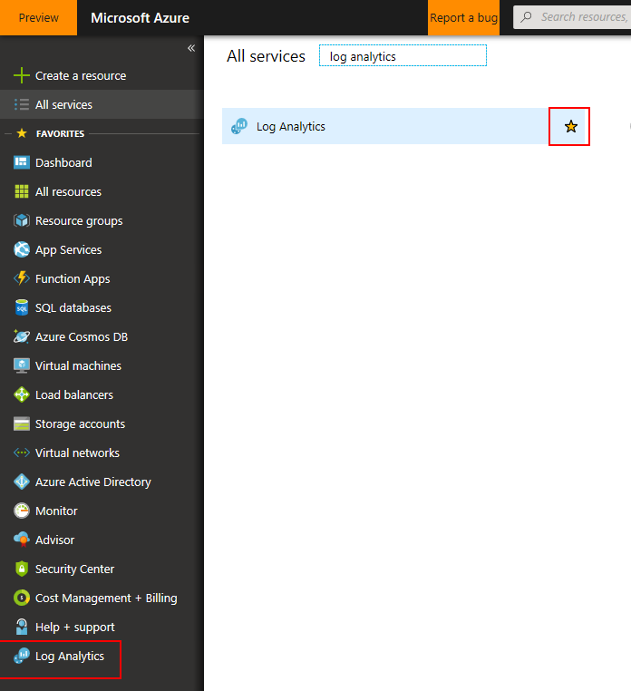
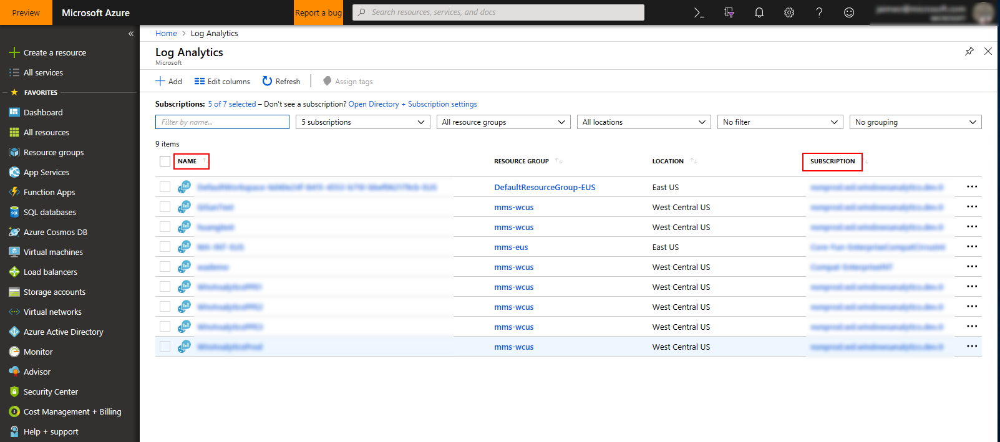
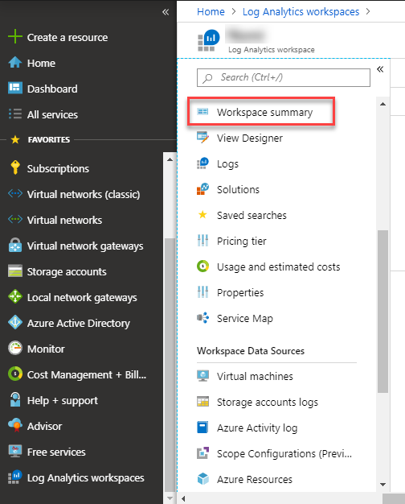
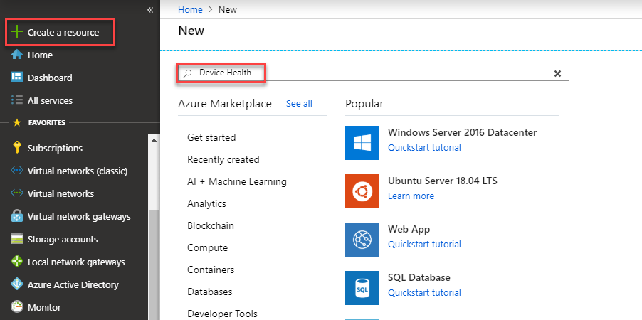

# Windows Analytics in the Azure Portal

Windows Analytics uses Azure Log Analytics workspaces (formerly known as Operations Management Suite or OMS), a collection of cloud-based servicing for monitoring and automating your on-premises and cloud environments.

**The OMS portal has been deprecated; you should start using the [Azure portal](https://portal.azure.com) instead as soon as possible.** Many experiences are the same in the two portals, but there are some key differences, which this topic will explain. For much more information about the transition from OMS to Azure, see [OMS portal moving to Azure](https://docs.microsoft.com/azure/log-analytics/log-analytics-oms-portal-transition).

## Navigation and permissions in the Azure portal

Go to the [Azure portal](https://portal.azure.com), select **All services**, and search for *Log Analytics workspaces*. Once it appears, you can select the star to add it to your favorites for easy access in the future.

### Permissions

It's important to understand the difference between Azure Active Directory and an Azure subscription:

**Azure Active Directory** is the directory that Azure uses. Azure Active Directory (Azure AD) is a separate service which sits by itself and is used by all of Azure and also Office 365.
 
An **Azure subscription** is a container for billing, but also acts as a security boundary. Every Azure subscription has a trust relationship with at least one Azure AD instance. This means that a subscription trusts that directory to authenticate users, services, and devices.

>[!IMPORTANT]
>Unlike the OMS portal (which only requires permission to access the Azure Log Analytics workspace), the Azure portal also requires access to be configured to either the linked *Azure subscription* or Azure resource group.

To check the Log Analytics workspaces you can access, select **Log Analytics workspaces**. You should see a grid control listing all workspaces, along with the Azure subscription each is linked to:

If you do not see your workspace in this view, but you are able to access the workspace from the classic portal, that means you do not have access to the workspace's Azure subscription or resource group. To remedy this, you will need to find someone with admin rights to grant you access, which they can do by selecting the subscription name and selecting **Access control (IAM)** (alternatively they can configure your access at the resource group level). They should either grant you "Log Analytics Reader" access (for read-only access) or "Log Analytics Contributor" access (which enables making changes such as creating deployment plans and changing application readiness states).

When permissions are configured, you can select the workspace and then select **Workspace summary** to see information similar to what was shown in the OMS overview page.

## Adding Windows Analytics solutions

In the Azure portal, the simplest way to add Windows Analytics solutions (Upgrade Readiness, Update Compliance, and Device Health) is to select **+ Create a resource** and then type the solution name in the search box. In this example, the search is for "Device Health":

Select the solution from the list that is returned by the search, and then select **Create** to add the solution.

## Navigating to Windows Analytics solutions settings

To adjust settings for a Windows Analytics solution, first navigate to the **Solutions** tab for your workspace, and then select the solution to configure. In this example, Upgrade Readiness is being adjusted by selecting **CompatibilityAssessment**:

From there, select the settings page to adjust specific settings:

>[!NOTE]
>To access these settings, both the subscription and workspace require "contributor" permissions. You can view your current role and make changes in other roles by using the **Access control (IAM)** tab in Azure.
