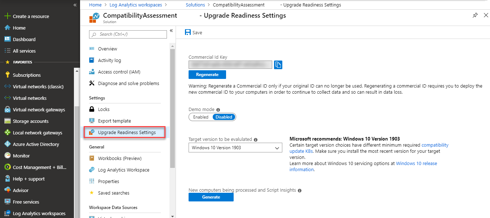

# Enrolling devices in Windows Analytics

If you have not already done so, consult the topics for any of the three Windows Analytics solutions (Update Compliance, Upgrade Readiness, and Device Health) you intend to use and follow the steps there to add the solutions to Azure Portal.

- [Get started with Device Health](device-health-get-started.md)
- [Get started with Update Compliance](update-compliance-get-started.md)
- [Get started with Upgrade Readiness](../upgrade/upgrade-readiness-get-started.md)

If you've already done that, you're ready to enroll your devices in Windows Analytics by following these steps:

## Copy your Commercial ID key

Microsoft uses a unique commercial ID to map information from user computers to your Azure workspace. This should be generated for you automatically. Copy your commercial ID key from any of the Windows Analytics solutions you have added to your Windows Portal, and then deploy it to user computers.

To find your commercial ID, first navigate to the **Solutions** tab for your workspace, and then select the solution. In this example, Upgrade Readiness is being adjusted by selecting **CompatibilityAssessment**:

From there, select the settings page, where you can find and copy your commercial ID:

>**Important**  Regenerate a Commercial ID key only if your original ID key can no longer be used. Regenerating a commercial ID key resets the data in your workspace for all solutions that use the ID. Additionally, you’ll need to deploy the new commercial ID key to user computers again.

## Enable data sharing

To enable data sharing, configure your proxy server to whitelist the following endpoints. You might need to get approval from your security group to do this.

| **Endpoint**  | **Function**  |
|---------------------------------------------------------|-----------|
|`https://ceuswatcab01.blob.core.windows.net` | Windows Error Reporting (WER); required for Device Health reports in Windows 10, version 1809 or later. Not used by Upgrade Readiness or Update Compliance AV reports. |
| `https://ceuswatcab02.blob.core.windows.net` | Windows Error Reporting (WER); required for Device Health reports in Windows 10, version 1809 or later. Not used by Upgrade Readiness or Update Compliance AV reports.  |
| `https://eaus2watcab01.blob.core.windows.net` | Windows Error Reporting (WER); required for Device Health reports in Windows 10, version 1809 or later. Not used by Upgrade Readiness or Update Compliance AV reports.  |
| `https://eaus2watcab02.blob.core.windows.net` | Windows Error Reporting (WER); required for Device Health reports in Windows 10, version 1809 or later. Not used by Upgrade Readiness or Update Compliance AV reports.  |
| `https://weus2watcab01.blob.core.windows.net` | Windows Error Reporting (WER); required for Device Health reports in Windows 10, version 1809 or later. Not used by Upgrade Readiness or Update Compliance AV reports. |
| `https://weus2watcab02.blob.core.windows.net` | Windows Error Reporting (WER); required for Device Health reports in Windows 10, version 1809 or later. Not used by Upgrade Readiness or Update Compliance AV reports.  |
| `https://v10c.events.data.microsoft.com` | Connected User Experience and Diagnostic component endpoint for use with devices running Windows 10, version 1803 or later **that also have the 2018-09 Cumulative Update (KB4458469, KB4457136, KB4457141) or later installed**  |
| `https://v10.events.data.microsoft.com` | Connected User Experience and Diagnostic component endpoint for use with Windows 10, version 1803 *without* the 2018-09 Cumulative Update installed |
| `https://v10.vortex-win.data.microsoft.com` | Connected User Experience and Diagnostic component endpoint for Windows 10, version 1709 or earlier |
| `https://vortex-win.data.microsoft.com` | Connected User Experience and Diagnostic component endpoint for operating systems older than Windows 10 |
| `https://settings-win.data.microsoft.com` | Enables the compatibility update to send data to Microsoft. |
| `http://adl.windows.com` | Allows the compatibility update to receive the latest compatibility data from Microsoft. |
| `https://watson.telemetry.microsoft.com` | Windows Error Reporting (WER); required for Device Health reports. Not used by Upgrade Readiness or Update Compliance AV reports. |
| `https://oca.telemetry.microsoft.com`  | Online Crash Analysis; required for Device Health reports. Not used by Upgrade Readiness or Update Compliance AV reports. |
| `https://login.live.com` | This endpoint is required by Device Health to ensure data integrity and provides a more reliable device identity for all of the Windows Analytics solutions on Windows 10. If you want to disable end-user managed service account (MSA) access, you should apply the appropriate [policy](https://docs.microsoft.com/windows/security/identity-protection/access-control/microsoft-accounts#block-all-consumer-microsoft-account-user-authentication) instead of blocking this endpoint. |

>[!NOTE]
>Proxy authentication and SSL inspections are frequent challenges for enterprises. See the following sections for configuration options.

> [!IMPORTANT]
> For privacy and data integrity, Windows checks for a Microsoft SSL certificate when communicating with the diagnostic data endpoints. SSL interception and inspection aren't possible. To use Desktop Analytics, exclude these endpoints from SSL inspection.<!-- BUG 4647542 --> 

>[!NOTE]
>Microsoft has a strong commitment to providing the tools and resources that put you in control of your privacy. As a result, Microsoft doesn't collect the following data from devices located in European countries (EEA and Switzerland):
>- Windows diagnostic data from Windows 8.1 devices
>- App usage data and [Internet Explorer site discovery](../upgrade/upgrade-readiness-additional-insights#site-discovery) features for Windows 7 devices

### Configuring endpoint access with SSL inspection
To ensure privacy and data integrity Windows checks for a Microsoft SSL certificate when communicating with the diagnostic data endpoints. Accordingly SSL interception and inspection is not possible. To use Windows Analytics services you should exclude the above endpoints from SSL inspection.

### Configuring endpoint access with proxy server authentication
If your organization uses proxy server authentication for outbound traffic, use one or more of the following approaches to ensure that the diagnostic data is not blocked by proxy authentication:

- **Best option: Bypass** Configure your proxy servers to **not** require proxy authentication for  traffic to the diagnostic data endpoints. This is the most comprehensive solution and it works for all versions of Windows 10.
- **User proxy authentication:** Alternatively, you can configure devices to use the logged on user's context for proxy authentication. First, update the devices to Windows 10, version 1703 or later. Then, ensure that users of the devices have proxy permission to reach the diagnostic data endpoints. This requires that the devices have console users with proxy permissions, so you couldn't use this method with headless devices.
- **Device proxy authentication:** Another option--the most complex--is as follows: First, configure a system level proxy server on the devices. Then, configure these devices to use machine-account-based outbound proxy authentication. Finally, configure proxy servers to allow the machine accounts access to the diagnostic data endpoints.

## Deploy the compatibility update and related updates

The compatibility update scans your devices and enables application usage tracking. If you don’t already have these updates installed, you can download the applicable version from the Microsoft Update Catalog or deploy it using Windows Server Update Services (WSUS) or your software distribution solution, such as System Center Configuration Manager.

| **Operating System** | **Updates** |
|----------------------|-----------------------------------------------------------------------------|
| Windows 10        | Windows 10 includes the compatibility update, so you will automatically have the latest compatibility update so long as you continue to keep your Windows 10 devices up to date with cumulative updates.  |
| Windows 8.1          | The compatibility update is included in monthly quality updates for Windows 8.1. We recommend installing the latest [Windows Monthly Rollup](http://www.catalog.update.microsoft.com/Search.aspx?q=security%20monthly%20quality%20rollup%20for%20windows%208) before attempting to enroll devices into Windows Analytics. |
| Windows 7 SP1        | The compatibility update is included in monthly quality updates for Windows 7. We recommend installing the latest [Windows Monthly Rollup](http://www.catalog.update.microsoft.com/Search.aspx?q=security%20monthly%20quality%20rollup%20for%20windows%207) before attempting to enroll devices into Windows Analytics. |

### Connected User Experiences and Telemetry service

With Windows diagnostic data enabled, the Connected User Experience and Telemetry service (DiagTrack) collects system, application, and driver data. Microsoft analyzes this data, and shares it back to you through Windows Analytics. For the best experience, install these updates depending upon the operating system version.

- For Windows 10, install the latest Windows 10 cumulative update.
- For Windows 8.1, nstall the October 2018 monthly rollup, [KB4462926](https://support.microsoft.com/help/4462926)
- For Windows 7, install the October 2018 monthly rollup, [KB4462923](https://support.microsoft.com/help/4462923)

>[!IMPORTANT]
>Restart devices after you install the compatibility updates for the first time.

>[!NOTE]
>We recommend you configure your update management tool to automatically install the latest version of these updates. There is a related optional update, [KB 3150513](https://catalog.update.microsoft.com/v7/site/Search.aspx?q=3150513), which can provide updated configuration and definitions for older compatibiltiy updates. For more information about this optional update, see <https://support.microsoft.com/kb/3150513>.

If you are planning to enable IE Site Discovery in Upgrade Readiness, you will need to install a few additional updates.

| **Site discovery** | **Update** |
|----------------------|-----------------------------------------------------------------------------|
| [Review site discovery](../upgrade/upgrade-readiness-additional-insights.md#site-discovery)         | [KB3080149](https://www.catalog.update.microsoft.com/Search.aspx?q=3080149) Updates the Diagnostic and Telemetry tracking service to existing devices. This update is only necessary on Windows 7 and Windows 8.1 devices.  For more information about this update, see <https://support.microsoft.com/kb/3080149>  Install the latest [Windows Monthly Rollup](https://catalog.update.microsoft.com/v7/site/Search.aspx?q=security%20monthly%20quality%20rollup). This functionality has been included in Internet Explorer 11 starting with the July 2016 Cumulative Update.  |

>[!NOTE]
> IE site discovery is disabled on devices running Windows 7 and Windows 8.1 that are in Switzerland and EU countries.

## Set diagnostic data levels

You can set the diagnostic data level used by monitored devices either with the [Upgrade Readiness deployment script](../upgrade/upgrade-readiness-deployment-script.md) or by policy (by using Group Policy or Mobile Device Management).

The basic functionality of Upgrade Readiness will work at the Basic diagnostic data level, you won't get usage or health data for your updated devices without enabling the Enhanced level. This means you won't get information about health regressions on updated devices. So it is best to enable the Enhanced diagnostic data level, at least on devices running Windows 10, version 1709 (or later) where the Enhanced diagnostic data setting can be paired with "limited enhanced" data level (see [Windows 10 enhanced diagnostic data events and fields used by Windows Analytics](https://docs.microsoft.com/windows/privacy/enhanced-diagnostic-data-windows-analytics-events-and-fields)). For more information, see [Windows Analytics and privacy](https://docs.microsoft.com/windows/deployment/update/windows-analytics-privacy).

## Enroll a few pilot devices

You can use the Upgrade Readiness deployment script to automate and verify your deployment. We always recommend manually running this script on a few representative devices to verify things are properly configured and the device can connect to the diagnostic data endpoints. Make sure to run the pilot version of the script, which will provide extra diagnostics.

See the [Upgrade Readiness deployment script](../upgrade/upgrade-readiness-deployment-script.md) topic for information about obtaining and running the script, and for a description of the error codes that can be displayed. See ["Understanding connectivity scenarios and the deployment script"](https://blogs.technet.microsoft.com/upgradeanalytics/2017/03/10/understanding-connectivity-scenarios-and-the-deployment-script/) on the Windows Analytics blog for a summary of setting the ClientProxy for the script, which will enable the script properly check for diagnostic data endpoint connectivity.

After data is sent from devices to Microsoft, it generally takes 48-56 hours for the data to populate in Windows Analytics. The compatibility update takes several minutes to run. If the update does not get a chance to finish running or if the computers are inaccessible (turned off or sleeping for example), data will take longer to populate in Windows Analytics. For this reason, you can expect most of your devices to be populated in Windows Analytics within 1-2 days after deploying the update and configuration to user computers. As described in the Windows Analytics blog post ["You can now check on the status of your computers within hours of running the deployment script"](https://blogs.technet.microsoft.com/upgradeanalytics/2017/05/12/wheres-my-data/), you can verify that devices have successfully connected to the service within a few hours. Most of those devices should start to show up in the Windows Analytics console within a few days.

## Deploy additional optional settings

Certain Windows Analytics features have additional settings you can use.

- **Update Compliance** is only compatible with Windows 10 desktop devices (workstations and laptops). To use the Windows Defender Antivirus Assessment, devices must be protected by Windows Defender AV (and not a partner antivirus application), and must have enabled cloud-delivered protection, as described in [Utilize Microsoft cloud-delivered protection in Windows Defender Antivirus](https://docs.microsoft.com/windows/security/threat-protection/windows-defender-antivirus/utilize-microsoft-cloud-protection-windows-defender-antivirus). See the [Troubleshoot Windows Defender Antivirus reporting in Update Compliance](https://docs.microsoft.com/windows/security/threat-protection/windows-defender-antivirus/troubleshoot-reporting) topic for help with ensuring that the configuration is correct.

- For devices running Windows 10, version 1607 or earlier, Windows diagnostic data must also be set to Enhanced (see [Configure Windows diagnostic data in your organization](https://docs.microsoft.com/windows/configuration/configure-windows-diagnostic-data-in-your-organization#enhanced-level)) in order to be compatible with Windows Defender Antivirus. See the [Windows Defender Antivirus in Windows 10 and Windows Server 2016](https://docs.microsoft.com/windows/security/threat-protection/windows-defender-antivirus/windows-defender-antivirus-in-windows-10) for more information about enabling, configuring, and validating Windows Defender AV.

- **Device Health** is only compatible with Windows 10 desktop devices (workstations and laptops) and Windows Server 2016. The solution requires that at least the Enhanced level of diagnostic data is enabled on all devices that are intended to be displayed in the solution. In Windows 10, version 1709, a new policy was added to "limit enhanced telemetry to the minimum required by Windows Analytics". To learn more about Windows diagnostic data, see [Configure Windows diagnostic data in your organization](https://docs.microsoft.com/windows/configuration/configure-windows-diagnostic-data-in-your-organization).

- **IE site discovery** is an optional feature of Upgrade Readiness that provides an inventory of websites that are accessed by client devices using Internet Explorer on Windows 7, Windows 8.1, and Windows 10. To enable IE site discovery, make sure the required updates are installed (per previous section) and enable IE site discovery in the deployment script batch file.

## Deploying Windows Analytics at scale

When you have completed a pilot deployment, you are ready to automate data collection and distribute the deployment script to the remaining devices in your organization.

### Automate data collection

To ensure that user computers are receiving the most up-to-date data from Microsoft, we recommend that you establish the following data sharing and analysis processes:

- Enable automatic updates for the compatibility update and related updates. These updates include the latest application and driver issue information as we discover it during testing.
- Schedule the Upgrade Readiness deployment script to automatically run monthly. Scheduling the script ensures that full inventory is sent monthly even if devices were not connected or had low battery power at the time the system normally sends inventory. Make sure to run the production version of the script, which is lighter weight and non-interactive. The script also has a number of built-in error checks, so you can monitor the results. If you can't run the deployment script at scale, another option is to configure things centrally via Group Policy or Mobile Device Management (MDM). Although we recommend using the deployment script, both options are discussed in the sections below.

When you run the deployment script, it initiates a full scan. The daily scheduled task to capture the changes is created when the update package is installed. For Windows 10 devices, this task is already included in the operating system. A full scan averages about 2 MB, but the scans for changes are very small. The scheduled task is named "Windows Compatibility Appraiser" and can be found in the Task Scheduler Library under Microsoft > Windows > Application Experience. Changes are invoked via the nightly scheduled task. It attempts to run around 3:00AM every day. If the system is powered off at that time, the task will run when the system is turned on.

### Distribute the deployment script at scale

Use a software distribution system such as System Center Configuration Manager to distribute the Upgrade Readiness deployment script at scale. For more information, see [Upgrade Readiness deployment script](https://docs.microsoft.com/windows/deployment/upgrade/upgrade-readiness-deployment-script). For information on how to deploy PowerShell scripts by using Windows Intune, see [Manage PowerShell scripts in Intune for Windows 10 devices](https://docs.microsoft.com/intune/intune-management-extension).

### Distributing policies at scale

There are a number of policies that can be centrally managed to control Windows Analytics device configuration. All of these policies have *preference* registry key equivalents that can be set by using the deployment script. Policy settings override preference settings if both are set.
>[!NOTE]
>You can only set the diagnostic data level to Enhanced by using policy. For example, this is necessary to use Device Health.

These policies are defined by values under **Microsoft\Windows\DataCollection**. All are REG_DWORD policies (except CommercialId which is REG_SZ).

>[!IMPORTANT]
>Configuring these keys independently without using the enrollment script is not recommended. There is additional validation that occurs when you use the enrollment script.

| Policy   | Value  | 
|-----------------------|------------------|
| CommercialId | In order for your devices to show up in Windows Analytics, they must be configured with your organization’s Commercial ID. | 
| AllowTelemetry  |	**In Windows 10**: 1 (Basic), 2 (Enhanced) or 3 (Full) diagnostic data. Windows Analytics will work with basic diagnostic data, but more features are available when you use the Enhanced level (for example, Device Health requires Enhanced diagnostic data and Upgrade Readiness only collects app usage and site discovery data on Windows 10 devices with Enhanced diagnostic data). For more information, see [Configure Windows diagnostic data in your organization](https://docs.microsoft.com/windows/configuration/configure-windows-diagnostic-data-in-your-organization). | 
| LimitEnhancedDiagnosticDataWindowsAnalytics | **In Windows 10**: Only applies when AllowTelemetry=2. Limits the Enhanced diagnostic data events sent to Microsoft to just those needed by Windows Analytics. For more information, see [Windows 10, version 1709 enhanced diagnostic data events and fields used by Windows Analytics](https://docs.microsoft.com/windows/configuration/enhanced-diagnostic-data-windows-analytics-events-and-fields).| 
| AllowDeviceNameInTelemetry | **In Windows 10, version 1803**: A separate opt-in is required to enable devices to continue to send the device name.  Allowing device names to be collected can make it easier for you to identify individual devices that report problems. Without the device name, Windows Analytics can only label devices by a GUID that it generates. | 
| CommercialDataOptIn  | **In Windows 7 and Windows 8**: 1 is required for Upgrade Readiness, which is the only solution that runs on Windows 7 or Windows 8. | 

You can set these values by using Group Policy (in Computer Configuration > Administrative Templates > Windows Components > Data Collection and Preview Builds) or by using Mobile Device Management (in Provider/*Provider ID*/CommercialID). (If you are using Microsoft Intune, use `MS DM Server` as the provider ID.) For more information about deployment using MDM, see the [DMClient CSP](https://docs.microsoft.com/windows/client-management/mdm/dmclient-csp) topic in MDM documentation.

The corresponding preference registry values are available in **HKLM\Software\Microsoft\Windows\CurrentVersion\Policies\DataCollection** and can be configured by the deployment script. If a given setting is configured by both preference registry settings and policy, the policy values will override. However, the **IEDataOptIn** setting is different--you can only set this with the preference registry keys:

- IEOptInLevel = 0 Internet Explorer data collection is disabled
- IEOptInLevel = 1 Data collection is enabled for sites in the Local intranet + Trusted sites + Machine local zones
- IEOptInLevel = 2 Data collection is enabled for sites in the Internet + Restricted sites zones
- IEOptInLevel = 3 Data collection is enabled for all sites

For more information about Internet Explorer Security Zones, see [About URL Security Zones](https://docs.microsoft.com/previous-versions/windows/internet-explorer/ie-developer/platform-apis/ms537183(v=vs.85)).

### Distribution at scale without using the deployment script

We recommend using the deployment script to configure devices. However if this is not an option, you can still manage settings by policy as described in the previous section. However, if you don't run the deployment script, you won't benefit from its error checking, and you might have to wait a long time (possibly weeks) before devices send the initial full inventory scan.

Note that it is possible to intiate a full inventory scan on a device by calling these commands:
- CompatTelRunner.exe -m:generaltel.dll -f:DoCensusRun
- CompatTelRunner.exe -m:appraiser.dll -f:DoScheduledTelemetryRun ent

For details on how to run these and how to check results, see the deployment script.

