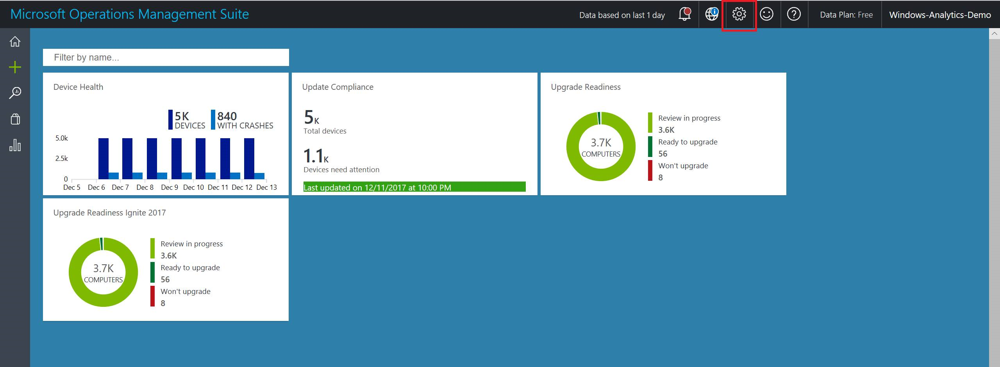

# Get started with Windows Analytics

The three Windows Analytics solutions (Update Compliance, Upgrade Readiness, and Device Health) have common prerequisites and configuration steps.

>[!NOTE] The steps in this topic are common to all of the Windwos Analytics solutions, but each of the individual solutions might require a few further steps to fully configure. Consult the topics for each solution you intend to use in addition to this topic.

## Prerequisites
[DO WE HAVE WA PREREQUISITES TO LIST HERE?]

## Deploy your Commercial ID to your Windows 10 devices and enable data sharing

In order for your devices to show up in Windows Analytics, they must be configured with your organization’s Commercial ID. This is so that Microsoft knows that a given device is a member of your organization and to feed that device’s data back to you. You can use either Group Policy or Mobile Device Management (MDM) to deploy your Commercial ID. 

### Copy your commercial ID key

Microsoft uses a unique commercial ID to map information from user computers to your OMS workspace. This should be generated for you automatically. Copy your commercial ID key in OMS and then deploy it to user computers.


1.  On the **Settings** dashboard, navigate to the **Windows telemetry** panel.

    

2. On the **Connected Sources** tab, navigate to the Windows telemetry panel.

    >**Important**<br> Regenerate a commercial ID key only if your original ID key can no longer be used. Regenerating a commercial ID key resets the data in your workspace for all solutions that use the ID. Additionally, you’ll need to deploy the new commercial ID key to user computers again.


### Enable data sharing

To enable data sharing, configure your proxy sever to whitelist the following endpoints. You might need to get approval from your security group to do this.

| **Endpoint**  | **Function**  |
|---------------------------------------------------------|-----------|
| `https://v10.vortex-win.data.microsoft.com` | Connected User Experience and Telemetry component endpoint for Windows 10 computers. User computers send data to Microsoft through this endpoint.
| `https://vortex-win.data.microsoft.com` | Connected User Experience and Telemetry component endpoint for operating systems older than Windows 10
| `https://settings-win.data.microsoft.com` | Enables the compatibility update to send data to Microsoft. 
| `http://adl.windows.com` | Allows the compatibility update to receive the latest compatibility data from Microsoft. |
| `https://v10.events.data.microsoft.com` | New telemetry endpoint for Windows 10, version 1803|
| `https://watson.telemetry.microsoft.com` | Windows Error Reporting (WER); required for Device Health and Update Compliance AV reports. Not used by Upgrade Readiness. |
| `https://oca.telemetry.microsoft.com`  | Online Crash Analysis; required for Device Health and Update Compliance AV reports. Not used by Upgrade Readiness. |

>[!IMPORTANT]  
> If your deployment includes devices running Windows 10 versions prior to Windows 10, version 1703, you must **exclude** *authentication* for these endpoints. Windows Error Reporting did not support authenticating proxies until Windows 10, version 1703. See the **Excluding endpoints** section for options.

>[!NOTE] The compatibility update runs under the device's system account.

#### Excluding endpoints
[ADD FROM MATT'S MAIL]

### Test data sharing
Devices must be able to reach the endpoints specified in the "Enable data sharing" section of this topic, so it's worth taking some time now to verify that they are reachable.

Prior to Windows 10, version 1703, WER uploads error reports in the machine context. Both user (typically authenticated) and machine (typically anonymous) contexts require access through proxy servers to the diagnostic endpoints. In Windows 10, version 1703, and later WER will attempt to use the context of the user that is logged on for proxy authentication such that only the user account requires proxy access.

Therefore, it's important to ensure that both machine and user accounts have access to the endpoints using authentication (or to whitelist the endpoints so that outbound proxy authentication is not required).

To test access as a given user, you can run this Windows PowerShell cmdlet *while logged on as that user*: 

```powershell

$endPoints = @(
        'v10.vortex-win.data.microsoft.com'
        'vortex-win.data.microsoft.com'
        'settings-win.data.microsoft.com'
        'adl.windows.com'
        'watson.telemetry.microsoft.com'
        'oca.telemetry.microsoft.com'
        'v10.events.data.microsoft.com'
    )

$endPoints | %{ Test-NetConnection -ComputerName $_ -Port 443 -ErrorAction Continue } | Select-Object -Property ComputerName,TcpTestSucceeded

```

If this is successful, `TcpTestSucceeded` should return `True` for each of the endpoints.

To test access in the machine context (requires administrative rights), run the above as SYSTEM using PSexec or Task Scheduler, as in this example:

```powershell

[scriptblock]$accessTest = {
    $endPoints = @(
        'v10.vortex-win.data.microsoft.com'
        'vortex-win.data.microsoft.com'
        'settings-win.data.microsoft.com'
        'adl.windows.com'
        'watson.telemetry.microsoft.com'
        'oca.telemetry.microsoft.com'
        'v10.events.data.microsoft.com'
    )

    $endPoints | %{ Test-NetConnection -ComputerName $_ -Port 443 -ErrorAction Continue } | Select-Object -Property ComputerName,TcpTestSucceeded
}

$scriptFullPath = Join-Path $env:ProgramData "TestAccessToMicrosoftEndpoints.ps1"
$outputFileFullPath = Join-Path $env:ProgramData "TestAccessToMicrosoftEndpoints_Output.txt"
$accessTest.ToString() > $scriptFullPath
$null > $outputFileFullPath
$taskAction = New-ScheduledTaskAction -Execute 'powershell.exe' -Argument "-ExecutionPolicy Bypass -Command `"&{$scriptFullPath > $outputFileFullPath}`"" 
$taskTrigger = New-ScheduledTaskTrigger -Once -At (Get-Date).Addseconds(10)
$task = Register-ScheduledTask -User 'NT AUTHORITY\SYSTEM' -TaskName 'MicrosoftTelemetryAccessTest' -Trigger $taskTrigger -Action $taskAction -Force
Start-Sleep -Seconds 120
Unregister-ScheduledTask -TaskName $task.TaskName -Confirm:$false
Get-Content $outputFileFullPath

```

As in the other example, if this is successful, `TcpTestSucceeded` should return `True` for each of the endpoints.


## Deploy the compatibility update and related updates

The compatibility update scans your devices and enables application usage tracking. If you don’t already have these updates installed, you can download the applicable version from the Microsoft Update Catalog or deploy it using Windows Server Update Services (WSUS) or your software distribution solution, such as System Center Configuration Manager.

| **Operating System** | **Updates** |
|----------------------|-----------------------------------------------------------------------------|
| Windows 10        | The latest cumulative updates must be installed on Windows 10 devices to make sure that the required compatibility updates are installed. You can find the latest cumulative update on the [Microsoft Update Catalog](https://catalog.update.microsoft.com) <P>Note: Windows 10 LTSB is not supported by Upgrade Readiness. See [Upgrade readiness requirements](upgrade-readiness-requirements.md) for more information. |
| Windows 8.1          | [KB 2976978](http://catalog.update.microsoft.com/v7/site/Search.aspx?q=KB2976978)<br>Performs diagnostics on the Windows 8.1 systems that participate in the Windows Customer Experience Improvement Program. These diagnostics help determine whether compatibility issues might be encountered when the latest Windows operating system is installed. <br>For more information about this update, see <https://support.microsoft.com/kb/2976978><br><BR>[KB 3150513](https://catalog.update.microsoft.com/v7/site/Search.aspx?q=3150513)<br>Provides updated configuration and definitions for compatibility diagnostics performed on the system.<br>For more information about this KB, see <https://support.microsoft.com/kb/3150513><br>**NOTE:** KB2976978 must be installed before you can download and install KB3150513.   |
| Windows 7 SP1        | [KB2952664](http://catalog.update.microsoft.com/v7/site/Search.aspx?q=KB2952664) <br>Performs diagnostics on the Windows 7 SP1 systems that participate in the Windows Customer Experience Improvement Program. These diagnostics help determine whether compatibility issues might be encountered when the latest Windows operating system is installed. <br>For more information about this update, see <https://support.microsoft.com/kb/2952664><br><BR>[KB 3150513](https://catalog.update.microsoft.com/v7/site/Search.aspx?q=3150513)<br>Provides updated configuration and definitions for compatibility diagnostics performed on the system.<br>For more information about this update, see <https://support.microsoft.com/kb/3150513><br>**NOTE:** KB2952664 must be installed before you can download and install KB3150513. |

>[!IMPORTANT] Restart computers after you install the compatibility updates for the first time.

If you are planning to enable IE Site Discovery in Upgrade Readiness, you will need to install a few additional updates.

| **Site discovery** | **Update** |
|----------------------|-----------------------------------------------------------------------------|
| [Review site discovery](upgrade-readiness-additional-insights.md#site-discovery)         | [KB3080149](http://www.catalog.update.microsoft.com/Search.aspx?q=3080149)<br>Updates the Diagnostic and Telemetry tracking service to existing devices. This update is only necessary on Windows 7 and Windows 8.1 devices. <br>For more information about this update, see <https://support.microsoft.com/kb/3150513><br><br>Install the latest [Windows Monthly Rollup](http://catalog.update.microsoft.com/v7/site/Search.aspx?q=security%20monthly%20quality%20rollup). This functionality has been included in Internet Explorer 11 starting with the July 2016 Cumulative Update.  |

## Enroll a few pilot devices

You can use the Upgrade Readiness deployment script to automate and verify your deployment. We always recommend manually running this script on a few representative devices to verify things are properly configured and the device can connect to the diagnostic data endpoints. Make sure to run the pilot version of the script, which will provide extra diagnostics.

See the [Upgrade Readiness deployment script](./upgrade/upgrade-readiness-deployment-script.md) topic for information about obtaining and running the script, and for a description of the error codes that can be displayed. See ["Understanding connectivity scenarios and the deployment script"](https://blogs.technet.microsoft.com/upgradeanalytics/2017/03/10/understanding-connectivity-scenarios-and-the-deployment-script/) on the Windows Analytics blog for a summary of setting the ClientProxy for the script to, which will enable the script properly check for telemetry endpoint connectivity.

After data is sent from devices to Microsoft, it generally takes 48-56 hours for the data to populate in the Upgrade Readiness solution. The compatibility update takes several minutes to run. If the update does not get a chance to finish running or if the computers are inaccessible (turned off or sleeping for example), data will take longer to populate in Upgrade Readiness. For this reason, you can expect most of your devices to be populated in Windows Analytics in about 1-2 weeks after deploying the update and configuration to user computers. As described in the Windows Analytics blog post ["You can now check on the status of your computers within hours of running the deployment script"](https://blogs.technet.microsoft.com/upgradeanalytics/2017/05/12/wheres-my-data/), you can verify that devices have successfully connected to the service within a few hours. Most of those devices should start to show up in the Windows Analytics console within a few days.

## Deploy additional optional settings

Certain of the Windows Analytics features have additional settings you can use.

- **Update Compliance** is only compatible with Windows 10 desktop devices (workstations and laptops). To use the Windows Defender Antivirus Assessment, devices must be protected by Windows Defender AV (and not a partner antivirus application), and must have enabled cloud-delivered protection, as described in [Utilize Microsoft cloud-delivered protection in Windows Defender Antivirus](https://docs.microsoft.com/windows/security/threat-protection/windows-defender-antivirus/utilize-microsoft-cloud-protection-windows-defender-antivirus). See the [Troubleshoot Windows Defender Antivirus reporting in Update Compliance](https://docs.microsoft.com/windows/security/threat-protection/windows-defender-antivirus/troubleshoot-reporting) topic for help with ensuring that the configuration is correct.

- For endpoints running Windows 10, version 1607 or earlier, Windows diagnostic data must also be set to Enhanced (see [Configure Windows diagnostic data in your organization](https://docs.microsoft.com/windows/configuration/configure-windows-diagnostic-data-in-your-organization#enhanced-level)) in order to be compatible with Windows Defender Antivirus. See the [Windows Defender Antivirus in Windows 10 and Windows Server 2016](https://docs.microsoft.com/windows/security/threat-protection/windows-defender-antivirus/windows-defender-antivirus-in-windows-10) for more information about enabling, configuring, and validating Windows Defender AV.

- **Device Health** is only compatible with Windows 10 desktop devices (workstations and laptops) and Windows Server 2016. The solution requires that at least the Enhanced level of diagnostic data is enabled on all devices that are intended to be displayed in the solution. In Windows 10, version 1709, a new policy was added to "limit enhanced telemetry to the minimum required by Windows Analytics". To learn more about Windows diagnostic data, see [Configure Windows diagnostic data in your organization](https://docs.microsoft.com/windows/configuration/configure-windows-diagnostic-data-in-your-organization).
 
- **IE site discovery** is an optional feature of Upgrade Readiness that provides an inventory of websites that are accessed by client devices using Internet Explorer on Windows 7, Windows 8.1, and Windows 10. To enable IE site discovery, make sure the required updates are installed (per previous section) and enable IE site discovery in the deployment script batch file.

## Deploying Windows Analytics at scale

When you have completed a pilot deployment, you are ready to automate data collection and distribute the deployment script to the remaining devices in your organization. 

### Automate data collection

To ensure that user computers are receiving the most up-to-date data from Microsoft, we recommend that you establish the following data sharing and analysis processes: 

- Enable automatic updates for the compatibility update and related updates. These updates include the latest application and driver issue information as we discover it during testing.
- Schedule the Upgrade Readiness deployment script to automatically run monthly so that you don’t have to manually initiate an inventory scan each time the compatibility updates are refreshed. Make sure to run the production version of the script, which is lighter weight and non-interactive. The script also has a number of built-in error checks, so you can monitor the results. If you can't run the deployment script at scale, another option is to configure things centrally via Group Policy or Mobile Device Management (MDM). Although we recommend using the deployment script, both options are discussed in the sections below.

When you run the deployment script, it initiates a full scan. The daily scheduled task to capture the changes is created when the update package is installed. For Windows 10 devices, this task is already included in the operating system. A full scan averages about 2 MB, but the scans for changes are very small. The scheduled task is named "Windows Compatibility Appraiser" and can be found in the Task Scheduler Library under Microsoft > Windows > Application Experience. Changes are invoked via the nightly scheduled task. It attempts to run around 3:00AM every day. If the system is powered off at that time, the task will run when the system is turned on. 

### Distribute the deployment script at scale

Use a software distribution system such as System Center Configuration Manager to distribute the Upgrade Readiness deployment script at scale. For more information, see [New version of the Upgrade Analytics Deployment Script available](https://blogs.technet.microsoft.com/upgradeanalytics/2016/09/20/new-version-of-the-upgrade-analytics-deployment-script-available/) on the Upgrade Readiness blog. For information on how to deploy PowerShell scripts by using Windows Intune, see [Manage PowerShell scripts in Intune for Windows 10 devices](https://docs.microsoft.com/intune/intune-management-extension).

### Distributing policies at scale
There are a number of policies that can be centrally managed to control Windows Analytics device configuration. These policies are under Microsoft\Windows\DataCollection:

| Policy   | Value  |
|-----------------------|------------------|
| CommercialId | In order for your devices to show up in Windows Analytics, they must be configured with your organization’s Commercial ID. |
| AllowTelemetry (in Windows 10) |	1 (Basic), 2 (Enhanced) or 3 (Full) diagnostic data. Windows Analytics will work with basic diagnostic data, but more features are available when you use the Enhanced level. For more information, see [Configure Windows diagnostic data in your organization](https://docs.microsoft.com/windows/configuration/configure-windows-diagnostic-data-in-your-organization). |
| LimitEnhancedDiagnosticDataWindowsAnalytics (in Windows 10) |	Only applies when AllowTelemetry=2. Limits the Enhanced diagnostic data events sent to Microsoft to just those needed by Windows Analytics. For more information, see [Windows 10, version 1709 enhanced diagnostic data events and fields used by Windows Analytics](https://docs.microsoft.com/windows/configuration/enhanced-diagnostic-data-windows-analytics-events-and-fields).|
| CommercialDataOptIn (in Windows 7 and Windows 8) |	1 is required for Upgrade Readiness, which is the only solution that runs on Windows 7 or Windows 8 |


You can set these values by using Group Policy (in Computer Configuration > Administrative Templates > Windows Components > Data Collection and Preview Builds) or by using Mobile Device Management (in Provider/ProviderID/CommercialID). For more information about deployment using MDM, see the [DMClient CSP](https://docs.microsoft.com/windows/client-management/mdm/dmclient-csp) topic in MDM documentation.

There are corresponding registry values that available in **HKLM\Software\Microsoft\Windows\CurrentVersion\Policies\DataCollection**; these by the deployment script. If a given setting is configured by both registry settings and policy, the policy values will override. The **IEDataOptIn** setting is an exception--you can only set this in the registry: 

- IEOptInLevel = 0 Internet Explorer data collection is disabled
- IEOptInLevel = 1 Data collection is enabled for sites in the Local intranet + Trusted sites + Machine local zones
- IEOptInLevel = 2 Data collection is enabled for sites in the Internet + Restricted sites zones
- IEOptInLevel = 3 Data collection is enabled for all sites

For more information about Internet Explorer Security Zones, see [About URL Security Zones](https://docs.microsoft.com/previous-versions/windows/internet-explorer/ie-developer/platform-apis/ms537183(v=vs.85)). 

### Distribution at scale without using the deployment script

We recommend using the deployment script to configure devices. However if this is not an option, you can still manage settings by policy as described in the previous section. However, if you don't run the deployment script, you might have to wait a long time (possibly weeks) before devices send the initial full inventory scan. To accelerate this, you can force devices to send the initial data by using the following commands. For more information about how to check for error conditions, refer to the code in the deployment script in this topic. Note: these commands need to be run from a system context (an elevated user context won't work):

- `CompatTelRunner.exe -m:appraiser.dll -f:DoScheduledTelemetryRun ent`
- (On Windows 10 devices) `windir\system32\devicecensus.exe`
- (On devices running systems older then Windows 10) `CompatTelRunner.exe -m:generaltel.dll -f:DoCensusRun`