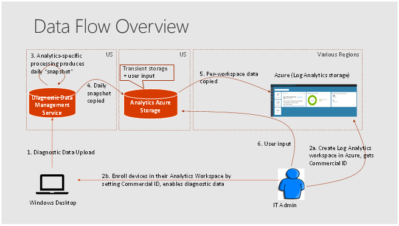

# Windows Analytics and privacy

Windows Analytics is fully committed to privacy, centering on these tenets:

- **Transparency:** We fully document the Windows Analytics diagnostic events (see the links for additional information) so you can review them with your company’s security and compliance teams. The Diagnostic Data Viewer lets you see diagnostic data sent from a given device (see [Diagnostic Data Viewer Overview](https://docs.microsoft.com/windows/configuration/diagnostic-data-viewer-overview) for details).
- **Control:** You ultimately control the level of diagnostic data you wish to share. In Windows 10, version 1709 we added a new policy to Limit enhanced diagnostic data to the minimum required by Windows Analytics
- **Security:** Your data is protected with strong security and encryption
- **Trust:** Windows Analytics supports the Microsoft Online Service Terms

The following illustration shows how diagnostic data flows from individual devices through the Diagnostic Data Service, Azure Log Analytics storage, and to your Log Analytics workspace:

The data flow sequence is as follows:

1. Diagnostic data is sent from devices to the Microsoft Diagnostic Data Management service, which is hosted in the US.
2. An IT administrator creates an Azure Log Analytics workspace. The administrator chooses the location, copies the Commercial ID (which identifies that workspace), and then pushes Commercial ID to devices they want to monitor. This is the mechanism that specifies which devices appear in which workspaces.
3. Each day Microsoft produces a "snapshot" of IT-focused insights for each workspace in the Diagnostic Data Management service.
4. These snapshots are copied to transient storage which is used only by Windows Analytics (also hosted in US data centers) where they are segregated by Commercial ID.
5. The snapshots are then copied to the appropriate Azure Log Analytics workspace.
6. If the IT administrator is using the Upgrade Readiness solution, user input from the IT administrator (specifically, the target operating system release and the importance and upgrade readiness per app) is stored in the Windows Analytics Azure Storage. (Upgrade Readiness is the only Windows Analytics solution that takes such user input.)

See these topics for additional background information about related privacy issues:

- [Windows 10 and the GDPR for IT Decision Makers](https://docs.microsoft.com/windows/privacy/gdpr-it-guidance)
- [Configure Windows diagnostic data in your organization](https://docs.microsoft.com/windows/configuration/configure-windows-diagnostic-data-in-your-organization)
- [Windows 7, Windows 8, and Windows 8.1 Appraiser Telemetry Events, and Fields](https://go.microsoft.com/fwlink/?LinkID=822965)
- [Windows 10, version 1809 basic level Windows diagnostic events and fields](https://docs.microsoft.com/windows/privacy/basic-level-windows-diagnostic-events-and-fields-1809)
- [Windows 10, version 1803 basic level Windows diagnostic events and fields](https://docs.microsoft.com/windows/privacy/basic-level-windows-diagnostic-events-and-fields-1803)
- [Windows 10, version 1709 basic level Windows diagnostic events and fields](https://docs.microsoft.com/windows/privacy/basic-level-windows-diagnostic-events-and-fields-1709)
- [Windows 10, version 1703 basic level Windows diagnostic events and fields](https://docs.microsoft.com/windows/privacy/basic-level-windows-diagnostic-events-and-fields-1703)
- [Windows 10, version 1709 enhanced diagnostic data events and fields used by Windows Analytics](https://docs.microsoft.com/windows/configuration/enhanced-diagnostic-data-windows-analytics-events-and-fields)
- [Diagnostic Data Viewer Overview](https://docs.microsoft.com/windows/configuration/diagnostic-data-viewer-overview)
- [Licensing Terms and Documentation](https://www.microsoftvolumelicensing.com/DocumentSearch.aspx?Mode=3&DocumentTypeId=31)
- [Learn about security and privacy at Microsoft datacenters](https://www.microsoft.com/datacenters)
- [Confidence in the trusted cloud](https://azure.microsoft.com/support/trust-center/)
- [Trust Center](https://www.microsoft.com/trustcenter)

### Can Windows Analytics be used without a direct client connection to the Microsoft Data Management Service?
No, the entire service is powered by Windows diagnostic data, which requires that devices have this direct connectivity.

### Can I choose the data center location?
Yes for Azure Log Analytics, but no for the Microsoft Data Management Service (which is hosted in the US).
