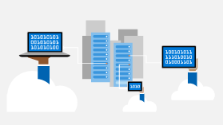

# Windows as a service

Find the tools and resources you need to help deploy and support Windows as a service in your organization.

## Latest news, videos, & podcasts

Find the latest and greatest news on Windows 10 deployment and servicing.

**Discovering the Windows 10 Update history pages**
> [!VIDEO https://www.youtube-nocookie.com/embed/GADIXBf9R58]

Everyone wins when transparency is a top priority. We want you to know when updates are available, as well as alert you to any potential issues you may encounter during or after you install an update. The Windows update history page is for anyone looking to gain an immediate, precise understanding of particular Windows update issues. 

The latest news:
<ul compact style="list-style: none"> 
<li><a href="https://blogs.windows.com/windowsexperience/2019/04/04/improving-the-windows-10-update-experience-with-control-quality-and-transparency">Improving the Windows 10 update experience with control, quality and transparency</a> - April 4, 2019</li>
<li><a href="https://techcommunity.microsoft.com/t5/Windows-IT-Pro-Blog/Call-to-action-review-your-Windows-Update-for-Business-deferral/ba-p/394244">Call to action: review your Windows Update for Business deferral values</a> - April 3, 2019</li>
<li><a href="https://techcommunity.microsoft.com/t5/Windows-IT-Pro-Blog/Windows-10-version-1809-designated-for-broad-deployment/ba-p/389540">Windows 10, version 1809 designated for broad deployment</a> - March 28, 2019</li>
<li><a href="https://blogs.windows.com/windowsexperience/2019/03/06/data-insights-and-listening-to-improve-the-customer-experience">Data, insights and listening to improve the customer experience</a> - March 6, 2019</li>
<li><a href="https://techcommunity.microsoft.com/t5/Windows-IT-Pro-Blog/Getting-to-know-the-Windows-update-history-pages/ba-p/355079">Getting to know the Windows update history pages</a> - February 21, 2019</li>
<li><a href="https://techcommunity.microsoft.com/t5/Windows-IT-Pro-Blog/Windows-Update-for-Business-and-the-retirement-of-SAC-T/ba-p/339523">Windows Update for Business and the retirement of SAC-T</a> - February 14, 2019</li>
<li><a href="https://blogs.windows.com/windowsexperience/2019/01/15/application-compatibility-in-the-windows-ecosystem/#A8urpp1QEp6DHzmP.97">Application compatibility in the Windows ecosystem</a> - January 15, 2019</li>
<li><a href="https://blogs.windows.com/windowsexperience/2018/12/10/windows-monthly-security-and-quality-updates-overview/#UJJpisSpvyLokbHm.97">Windows monthly security and quality updates overview</a> - January 10, 2019</li>
</ul>

[See more news](waas-morenews.md). You can also check out the [Windows 10 blog](https://techcommunity.microsoft.com/t5/Windows-10-Blog/bg-p/Windows10Blog).

## IT pro champs corner
Written by IT pros for IT pros, sharing real world examples and scenarios for Windows 10 deployment and servicing.

<a href="https://techcommunity.microsoft.com/t5/Windows-IT-Pro-Blog/Classifying-Windows-updates-in-common-deployment-tools/ba-p/331175">**NEW** Classifying Windows updates in common deployment tools</a>

<a href="https://docs.microsoft.com/windows-server/get-started/express-updates"><b>NEW</b> Express updates for Windows Server 2016 re-enabled for November 2018 update
</a>

<a href="https://support.microsoft.com/help/4472027/">2019 SHA-2 Code Signing Support requirement for Windows and WSUS</a>

<a href="https://go.microsoft.com/fwlink/?linkid=2005509">Deploying Windows 10 Feature Updates to 24/7 Mission Critical Devices</a>

## Discover

Learn more about Windows as a service and its value to your organization.

<a href="waas-overview.md">Overview of Windows as a service</a>

<a href="waas-quick-start.md">Quick guide to Windows as a service</a>

<a href="windows-analytics-overview.md">Windows Analytics overview</a>

<a href="../deploy-whats-new.md">What's new in Windows 10 deployment</a>

<a href="https://channel9.msdn.com/events/Ignite/2015/BRK3303">How Microsoft IT deploys Windows 10</a>

## Plan

Prepare to implement Windows as a service effectively using the right tools, products, and strategies.

<a href="https://www.microsoft.com/en-us/windowsforbusiness/simplified-updates">Simplified updates</a>

<a href="https://www.microsoft.com/itpro/windows-10/end-user-readiness">Windows 10 end user readiness</a>

<a href="https://developer.microsoft.com/windows/ready-for-windows#/">Ready for Windows</a>

<a href="../upgrade/manage-windows-upgrades-with-upgrade-readiness.md">Manage Windows upgrades with Upgrade Readiness</a>

<a href="https://www.microsoft.com/itshowcase/windows10deployment">Preparing your organization for a seamless Windows 10 deployment</a>

## Deploy

Secure your organization's deployment investment.

<a href="index.md">Update Windows 10 in the enterprise</a>

<a href="https://www.microsoft.com/itshowcase/Article/Content/668/Deploying-Windows-10-at-Microsoft-as-an-inplace-upgrade">Deploying as an in-place upgrade</a>

<a href="waas-configure-wufb.md">Configure Windows Update for Business</a>

<a href="waas-optimize-windows-10-updates.md#express-update-delivery">Express update delivery</a>

<a href="../planning/windows-10-deployment-considerations.md">Windows 10 deployment considerations</a>

## Microsoft Ignite 2018

Looking to learn more? These informative session replays from Microsoft Ignite 2018 (complete with downloadable slide decks) can provide some great insights on Windows as a service.

[BRK2417: What’s new in Windows Analytics: An Intro to Desktop Analytics](https://myignite.techcommunity.microsoft.com/sessions/64324#ignite-html-anchor)

[BRK3018: Deploying Windows 10 in the enterprise using traditional and modern techniques](https://myignite.techcommunity.microsoft.com/sessions/64509#ignite-html-anchor)

[BRK3019: Delivery Optimization deep dive: How to reduce internet bandwidth impact on your network](https://myignite.techcommunity.microsoft.com/sessions/64510#ignite-html-anchor)

[BRK3020: Using AI to automate Windows and Office update staging with Windows Update for Business](https://myignite.techcommunity.microsoft.com/sessions/64513#ignite-html-anchor)

[BRK3027: Deploying Windows 10: Making the update experience smooth and seamless](https://myignite.techcommunity.microsoft.com/sessions/64612#ignite-html-anchor)

[BRK3039: Windows 10 and Microsoft Office 365 ProPlus lifecycle and servicing update](https://myignite.techcommunity.microsoft.com/sessions/66763#ignite-html-anchor)

[BRK3211: Ask the Experts: Successfully deploying, servicing, managing Windows 10](https://myignite.techcommunity.microsoft.com/sessions/65963#ignite-html-anchor)

[THR2234: Windows servicing and delivery fundamentals](https://myignite.techcommunity.microsoft.com/sessions/66741#ignite-html-anchor)

[THR3006: The pros and cons of LTSC in the enterprise](https://myignite.techcommunity.microsoft.com/sessions/64512#ignite-html-anchor)
