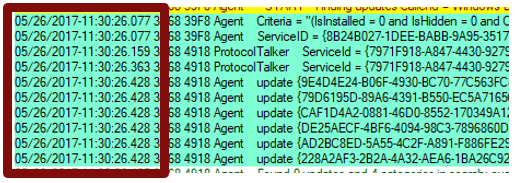
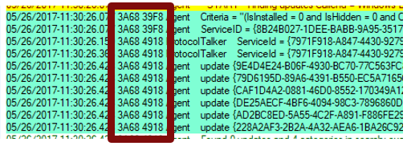
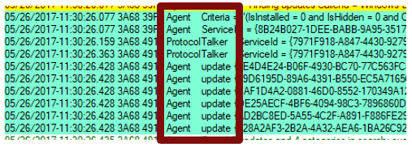
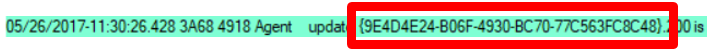
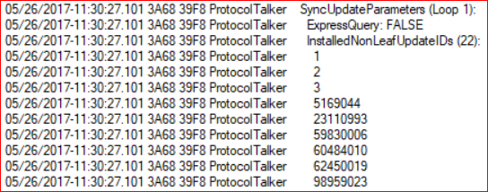

# Windows Update log files

>Applies to: Windows 10

The following table describes the log files created by Windows Update.

|Log file|Location|Description|When to Use |
|-|-|-|-|
|windowsupdate.log|C:\Windows\Logs\WindowsUpdate|Starting in Windows 8.1 and continuing in Windows 10, Windows Update client uses Event Tracing for Windows (ETW) to generate diagnostic logs.|If you receive an error message when you run Windows Update (WU), you can use the information that is included in the Windowsupdate.log log file to troubleshoot the issue.|
|UpdateSessionOrchestration.etl|C:\ProgramData\USOShared\Logs|Starting Windows 10, the Update Orchestrator is responsible for sequence of downloading and installing various update types from Windows Update. And the events are logged to these etl files.|When you see that the updates are available but download is not getting triggered.   When Updates are downloaded but installation is not triggered. When Updates are installed but reboot is not triggered. |
|NotificationUxBroker.etl|C:\ProgramData\USOShared\Logs|Starting Windows 10, the notification toast or the banner is triggered by this NotificationUxBroker.exe . And the logs to check its working is this etl. |When you want to check whether the Notification was triggered or not for reboot or update availability etc. |
|CBS.log|%systemroot%\Logs\CBS|This logs provides insight on the update installation part in the servicing stack.|To troubleshoot the issues related to WU installation.|

## Generating WindowsUpdate.log 
To merge and convert WU trace files (.etl files) into a single readable WindowsUpdate.log file, see [Get-WindowsUpdateLog](https://docs.microsoft.com/powershell/module/windowsupdate/get-windowsupdatelog?view=win10-ps). 

>[!NOTE]
>When you run the **Get-WindowsUpdateLog** cmdlet, an copy of WindowsUpdate.log file is created as a static log file. It does not update as the old WindowsUpate.log unless you run **Get-WindowsUpdateLog** again. 
 
### Windows Update log components 
The WU engine has different component names. The following are some of the most common components that appear in the WindowsUpdate.log file: 

- AGENT- Windows Update agent 
- AU - Automatic Updates is performing this task 
- AUCLNT- Interaction between AU and the logged-on user 
- CDM- Device Manager 
- CMPRESS- Compression agent 
- COMAPI- Windows Update API 
- DRIVER- Device driver information 
- DTASTOR- Handles database transactions 
- EEHNDLER- Expression handler that's used to evaluate update applicability 
- HANDLER- Manages the update installers 
- MISC- General service information 
- OFFLSNC- Detects available updates without network connection 
- PARSER- Parses expression information 
- PT- Synchronizes updates information to the local datastore 
- REPORT- Collects reporting information 
- SERVICE- Startup/shutdown of the Automatic Updates service 
- SETUP- Installs new versions of the Windows Update client when it is available 
- SHUTDWN- Install at shutdown feature 
- WUREDIR- The Windows Update redirector files 
- WUWEB- The Windows Update ActiveX control 
- ProtocolTalker - Client-server sync 
- DownloadManager - Creates and monitors payload downloads 
- Handler, Setup -  Installer handlers (CBS, and so on) 
- EEHandler -  Evaluating update applicability rules 
- DataStore - Caching update data locally 
- IdleTimer - Tracking active calls, stopping a service 
 
>[!NOTE]
>Many component log messages are invaluable if you are looking for problems in that specific area. However, they can be useless if you don't filter to exclude irrelevant components so that you can focus on what’s important. 
 
### Windows Update log structure 
The Windows update log structure is separated into four main identities: 

- Time Stamps 
- Process ID and Thread ID 
- Component Name 
- Update Identifiers    
   - Update ID and Revision Number 
   - Revision ID 
   - Local ID 
   - Inconsistent terminology 

The WindowsUpdate.log structure is discussed in the following sections. 

#### Time stamps  
The time stamp indicates the time at which the logging occurs. 
- Messages are usually in chronological order, but there may be exceptions. 
- A pause during a sync can indicate a network problem, even if the scan succeeds. 
- A long pause near the end of a scan can indicate a supersedence chain issue.   
   

#### Process ID and thread ID  
The Process IDs and Thread IDs are random, and they can vary from log to log and even from service session to service session within the same log. 
- The first four hex digits are the process ID. 
- The next four hex digits are the thread ID. 
- Each component, such as the USO, WU engine, COM API callers, and WU installer handlers, has its own process ID.   
   

#### Component name  
Search for and identify the components that are associated with the IDs. Different parts of the WU engine have different component names. Some of them are as follows: 

- ProtocolTalker - Client-server sync 
- DownloadManager - Creates and monitors payload downloads 
- Handler, Setup - Installer handlers (CBS, etc.) 
- EEHandler - Evaluating update applicability rules 
- DataStore - Caching update data locally 
- IdleTimer - Tracking active calls, stopping service 

#### Update identifiers  

##### Update ID and revision number 
There are different identifiers for the same update in different contexts. It’s important to know the identifier schemes. 
- Update ID: A GUID (indicated in the previous screen shot) that's assigned to a given update at publication time 
- Revision number: A number incremented every time that a given update (that has a given update ID) is modified and republished on a service 
- Revision numbers are reused from one update to another (not a unique identifier). 
- The update ID and revision number are often shown together as "{GUID}.revision." 
   

##### Revision ID 
- A Revision ID (do no confuse this with “revision number”) is a serial number that's issued when an update is initially published or revised on a given service. 
- An existing update that’s revised keeps the same update ID (GUID), has its revision number incremented (for example, from 100 to 101), but gets a completely new revision ID that is not related to the previous ID. 
- Revision IDs are unique on a given update source, but not across multiple sources. 
- The same update revision may have completely different revision IDs on WU and WSUS. 
- The same revision ID may represent different updates on WU and WSUS. 

##### Local ID 
- Local ID is a serial number issued when an update is received from a service by a given WU client 
- Usually seen in debug logs, especially involving the local cache for update info (Datastore) 
- Different client PCs will assign different Local IDs to the same update 
- You can find the local IDs that a client is using by getting the client’s %WINDIR%\SoftwareDistribution\Datastore\Datastore.edb file 

##### Inconsistent terminology 
- Sometimes the logs use terms inconsistently. For example, the InstalledNonLeafUpdateIDs list actually contains revision IDs, not update IDs. 
- Recognize IDs by form and context: 
    
   - GUIDs are update IDs 
   - Small integers that appear alongside an update ID are revision numbers 
   - Large integers are typically revision IDs 
   - Small integers (especially in Datastore) can be local IDs 
      

## Windows Setup log files analysis using SetupDiag tool
SetupDiag is a diagnostic tool that can be used for analysis of logs related to installation of Windows Updates. For detailed information, see [SetupDiag](https://docs.microsoft.com/windows/deployment/upgrade/setupdiag).
