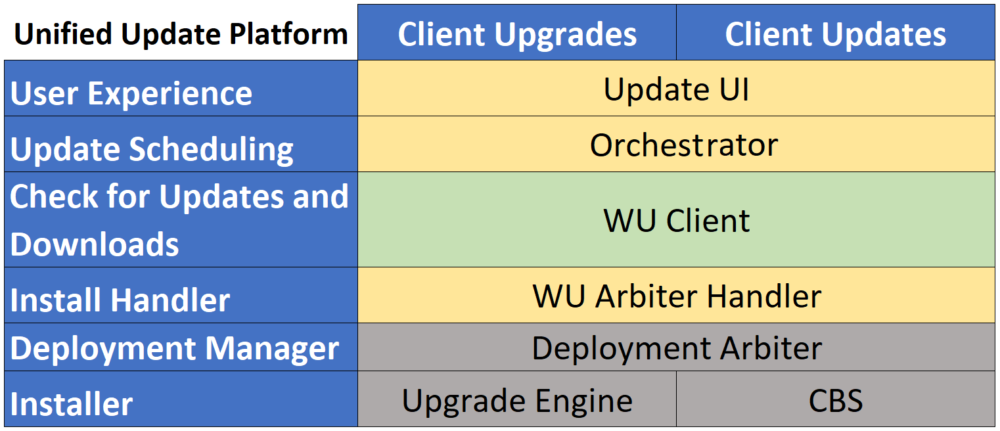

# Get started with Windows Update

>Applies to: Windows 10

With the release of Windows 10, we moved the update model to the Unified Update Platform. Unified Update Platform (UUP) is a single publishing, hosting, scan and download model for all types of OS updates, desktop and mobile for all Windows-based operating systems, for everything from monthly quality updates to new feature updates.  

Ues the following information to get started with Windows Update:

- Understand the UUP architecture
- Understand [how Windows Update works](how-windows-update-works.md)
- Find [Windows Update log files](windows-update-logs.md)
- Learn how to [troubleshoot Windows Update](windows-update-troubleshooting.md)
- Review [common Windows Update errors](windows-update-errors.md) and check out the [error code reference](windows-update-error-reference.md)
- Review [other resources](windows-update-resources.md) to help you use Windows Update

## Unified Update Platform (UUP) architecture 
To understand the changes to the Windows Update architecture that UUP introduces let's start with some new key terms. 

- **Update UI** – The user interface to initiate Windows Update check and history. Available under **Settings --> Update & Security --> Windows Update**. 
- **Update Session Orchestrator (USO)**- A Windows OS component that orchestrates the sequence of downloading and installing various update types from Windows Update.  

   Update types- 
  - OS Feature updates 
  - OS Security updates 
  - Device drivers 
  - Defender definition updates 

    >[!NOTE]
     > Other types of updates, like Office desktop updates, are installed if the user opts into Microsoft Update.
     >
     >Store apps aren't installed by USO, today they are separate. 

- **WU Client/ UpdateAgent** - The component running on your PC. It's essentially a DLL that is downloaded to the device when an update is applicable. It surfaces the APIs needed to perform an update, including those needed to generate a list of payloads to download, as well as starts stage and commit operations. It provides a unified interface that abstracts away the underlying update technologies from the caller.  
- **WU Arbiter handle**- Code that is included in the UpdateAgent binary. The arbiter gathers information about the device, and uses the CompDB(s) to output an action list. It is responsible for determining the final "composition state" of your device, and which payloads (like ESDs or packages) are needed to get your device up to date. 
- **Deployment Arbiter**- A deployment manager that calls different installers. For example, CBS. 
 
Additional components include the following- 

- **CompDB** – A generic term to refer to the XML describing information about target build composition, available diff packages, and conditional rules. 
- **Action List** – The payload and additional information needed to perform an update. The action list is consumed by the UpdateAgent, as well as other installers to determine what payload to download. It's also consumed by the "Install Agent" to determine what actions need to be taken, such as installing or removing packages.  
