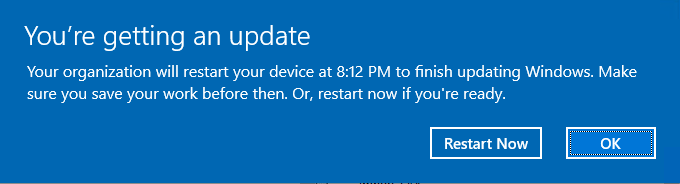
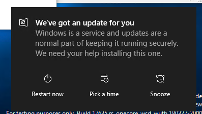
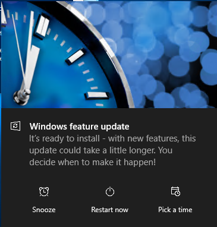

# Enforcing compliance deadlines for updates 

>Applies to: Windows 10

Deploying feature or quality updates for many organizations is only part of the equation for managing their device ecosystem. The ability to enforce patch compliance is the next important part. Windows Update for Business provides controls to manage deadlines for when devices should migrate to newer revisions. We offer two compliance flows that you can choose from: 

- [Deadline only](#deadline-only)
- [Deadline with user engagement](#deadline-with-user-engagement)

## Deadline Only 

This flow only enforces the deadline where the device will attempt to silently restart outside of active hours before the deadline is reached. Once the deadline is reached the user is prompted with either a confirmation button or a restart now option. 

### End User Experience

Once the device is in the pending restart state, it will attempt to restart the device during non-active hours. This is known as the auto-restart period, and by default it does not require user interaction to reboot the device. 

>[!NOTE] 
>Deadlines are enforced from pending restart state (for example, when the device has completed the installation and download from Windows Update).

### Policy overview

|Policy|Description |
|-|-|
|Specify deadline before auto-restart for update installation|Governs the update experience once the device has entered pending reboot state. It specifies a deadline, in days, to enforce compliance (such as imminent install).|
|Configure Auto-restart warning notification schedule for updates|Configures the reminder notification and the warning notification for a scheduled install. The user can dismiss a reminder, but not the warning.|

### Suggested Configuration  

|Policy|Location|3 Day Compliance|5 Day Compliance|7 Day Compliance |
|-|-|-|-|-|
|Specify deadline before auto-restart for update installation| 	GPO: Computer Configuration > Administrative Templates > Windows Components > Windows Update > Specify deadline before auto-restart for update installation |State: Enabled  **Specify the number of days before pending restart will automatically be executed outside of active hours**: 2|State: Enabled  **Specify the number of days before pending restart will automatically be executed outside of active hours**: 3|State: Enabled  **Specify the number of days before pending restart will automatically be executed outside of active hours**: 4

### Controlling notification experience for deadline 

|Policy| Location|Suggested Configuration |
|-|-|-|
|Configure Auto-restart warning notification schedule for updates|GPO: Computer Configuration > Administrative Templates > Windows Components > Windows Update > Configure auto-restart warning notifications schedule for updates	|State: Enabled  **Reminder** (hours): 2 **Warning** (minutes): 60 |

### Notification experience for deadline

Notification users get for a quality update deadline:

Notification users get for a feature update deadline:

## Deadline with user engagement 

This flow provides the end user with prompts to select a time to restart the device before the deadline is reached. If the device is unable to restart at the time specified by the user or the time selected is outside the deadline, the device will restart the next time it is active. 

### End user experience

Before the deadline the device will be in two states: auto-restart period and engaged-restart period. During the auto-restart period the device will silently try to restart outside of active hours. If the device can't find an idle moment to restart, then the device will go into engaged-restart. The end user, at this point, can select a time that they would like the device to try to restart. Both phases happen before the deadline; once that deadline has passed then the device will restart at the next available time. 

### Policy overview

|Policy| Description |
|-|-|
|Specify engaged restart transition and notification schedule for updates|Governs how the user will be impacted by the pending reboot. Transition days, first starts out in Auto-Restart where the device will find an idle moment to reboot the device. After 2 days engaged restart will commence and the user will be able to choose a time|
|Configure Auto-restart required notification for updates|Governs the notifications during the Auto-Restart period. During Active hours, the user will be notified that the device is trying to reboot. They will have the option to confirm or dismiss the notification|

### Suggested configuration 

|Policy| Location|	3 Day Compliance|  	5 Day Compliance|	7 Day Compliance |
|-|-|-|-|-|
|Specify engaged restart transition and notification schedule for updates|GPO: Computer Configuration > Administrative Templates > Windows Components > Windows Update > Specify Engaged restart transition and notification schedule for updates|State: Enabled **Transition** (Days): 2 **Snooze** (Days): 2 **Deadline** (Days): 3|State: Enabled **Transition** (Days): 2 **Snooze** (Days): 2 **Deadline** (Days): 4|State: Enabled **Transition** (Days): 2 **Snooze** (Days): 2 **Deadline** (Days): 5|

### Controlling notification experience for engaged deadline 

|Policy| Location	|Suggested Configuration 
|-|-|-|
|Configure Auto-restart required notification for updates	|GPO: Computer Configuration > Administrative Templates > Windows Components > Windows Update > Configure Auto-restart required notification for updates|State: Enabled  **Method**: 2- User|

### Notification experience for engaged deadlines
Notification users get for quality update engaged deadline:

Notification users get for a quality update deadline:

Notification users get for a feature update engaged deadline:

Notification users get for a feature update deadline:

