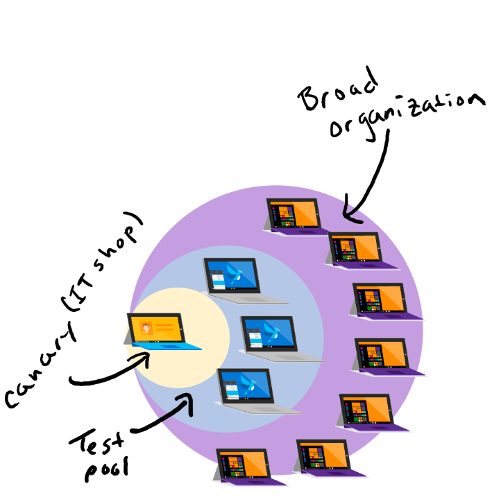

# Manage feature and quality updates with group policies

>Applies to: Windows 10

Windows Update for Business allows users to control when devices should receive a feature or quality update from Windows Update. Depending on the size of your organization you may want to do a wave deployment of updates. The first step in this process is to determine which Branch Readiness Level you want your organization on. For more information on which level is right for your organization review [Overview of Windows as a service](waas-overview.md). 

The following policies let you configure when you want a device to see a feature and or quality update from Windows Update. 

## Policy overview

|Policy name| Description |
|-|-|
|Select when Quality Updates are received|Configures when the device should receive quality update. In this policy you can also select a date to pause receiving Quality Updates until. |
|Select when Preview Builds & feature Updates are received|Configures when the device should receive a feature update. You can also configure your branch readiness level. This policy also provides the ability to "pause" updates until a certain point. |
|Do not allow update deferral policies to cause scans against Windows Update|When enabled will not allow the deferral policies to cause scans against Windows Update.|

## Suggested configuration for a non-wave deployment

If you don't need a wave deployment and have a small set of devices to manage, we recommend the following configuration:  

|Policy| Location|Suggested configuration |
|-|-|-|
|Select when Quality Updates are received | GPO: Computer Configuration > Administrative Templates > Windows Components > Windows Update > Windows Update for Business > Select when Quality Updates are received|State: Enabled  **Defer receiving it for this many days**: 0 **Pause Quality Updates**: Blank  *Note: use this functionality to prevent the device from receiving a quality update until the time passes|
|Select when Preview Builds & feature Updates are received |GPO: Computer Configuration > Administrative Templates > Windows Components > Windows Update > Windows Update for Business > Select when Preview Builds and Feature Updates are received|State: Enabled  **Select Windows Readiness Level**: SAC **Defer receiving for this many days**: 0-365 **Pause Feature Updates**: Blank  *Note: use this functionality to prevent the device from receiving a feature update until the time passes|
|Do not allow update deferral policies to cause scans against Windows Update|GPO: Computer Configuration > Administrative Templates > Windows Components > Windows Update > Do not allow update deferral policies to cause scans against Windows Update|State: Disabled|

## Suggested configuration for a wave deployment

## Early validation and testing
Depending on your organizational size and requirements you might be able to test feature updates earlier to identify if there are impacts to Line of Business applications. Our recommendation is to enroll a set of devices that are a good representation of your device ecosystem (for example, devices with accounting software or engineering software). Learn more about [different deployment rings](https://insider.windows.com/how-to-pc/#working-with-rings).

|Policy|Location|Suggested configuration |
|-|-|-|
|Select when Preview Builds & feature Updates are received |GPO: Computer Configuration > Administrative Templates > Windows Components > Windows Update > Windows Update for Business > Select when Preview Builds and Feature Updates are received|State: Enabled  **Select Windows Readiness Level**: WIP Fast or WIP slow **Defer receiving for this many days**: 0 **Pause Feature Updates**: Blank *Note: use this functionality to prevent the device from receiving a feature update until the time passes.|
|Select when Quality Updates are received |GPO: Computer Configuration > Administrative Templates > Windows Components > Windows Update > Windows Update for Business > Select when Quality Updates are received|State: Enabled  **Defer receiving it for this many days**: 0  **Pause Quality Updates**: Blank  *Note: use this functionality to prevent the device from receiving a quality update until the time passes|

## Wave deployment for feature updates

If you want to deploy feature updates in waves we suggest using the following configuration. For the deferral days we recommend staging them out in 1-month increments. Manage your risk by placing critical devices later in the wave (deferrals > 30 or 60 days) while placing your low risk devices earlier in the wave (deferrals < 30 days). Using deferrals days is a great method to manage your wave deployment. Using this in combination with our suggested early validation will help you prepare your environment for the latest updates from Windows. 

|Policy|Location|Suggested configuration |
|-|-|-|
|Select when Preview Builds & feature Updates are received |GPO: Computer Configuration > Administrative Templates > Windows Components > Windows Update > Windows Update for Business > Select when Preview Builds and Feature Updates are received|State: Enabled  **Select Windows Readiness Level**: SAC **Defer receiving for this many days**: 0, 30, 60, 90, 120  **Pause Feature Updates**: Blank  *Note: use this functionality to prevent the device from receiving a feature update until the time passes
