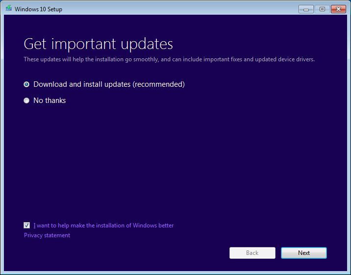

# Quick fixes

**Applies to**
-   Windows 10

>[!NOTE]
>This is a 100 level topic (basic).<br>
>See [Resolve Windows 10 upgrade errors](resolve-windows-10-upgrade-errors.md) for a full list of topics in this article.

The following list of fixes can resolve many Windows upgrade problems. You should try these steps before contacting Microsoft support, or attempting a more advanced analysis of a Windows upgrade failure. Also review information at [Windows 10 help](https://support.microsoft.com/products/windows?os=windows-10).

The Microsoft Virtual Agent provided by [Microsoft Support](https://support.microsoft.com/contactus/) can help you to analyze and correct some Windows upgrade errors. **To talk to a person about your issue**, start the Virtual Agent (click **Get started**) and enter "Talk to a person" two times. 

>You might also wish to try a new tool available from Microsoft that helps to diagnose many Windows upgrade errors. For more information and to download this tool, see [SetupDiag](setupdiag.md). The topic is more advanced (300 level) because several advanced options are available for using the tool. However, you can now just download and then double-click the tool to run it. By default when you click Save, the tool is saved in your **Downloads** folder. Double-click the tool in the folder and wait until it finishes running (it might take a few minutes), then double-click the **SetupDiagResults.log** file and open it using Notepad to see the results of the analysis.

## List of fixes

<ol>
<li>Remove nonessential external hardware, such as docks and USB devices. [More information](#remove-external-hardware).</li>
<li>Check the system drive for errors and attempt repairs. [More information](#repair-the-system-drive).</li>
<li>Run the Windows Update troubleshooter. [More information](#windows-update-troubleshooter).</li>
<li>Attempt to restore and repair system files. [More information](#repair-system-files).</li>
<li>Update Windows so that all available recommended updates are installed, and ensure the computer is rebooted if this is necessary to complete installation of an update. [More information](#update-windows).</li>
<li>Temporarily uninstall non-Microsoft antivirus software.
  [More information](#uninstall-non-microsoft-antivirus-software).</li>

<li>Uninstall all nonessential software. [More information](#uninstall-non-essential-software).</li>
<li>Update firmware and drivers. [More information](#update-firmware-and-drivers)</li>
<li>Ensure that "Download and install updates (recommended)" is accepted at the start of the upgrade process. [More information](#ensure-that-download-and-install-updates-is-selected).</li>
<li>Verify at least 16 GB of free space is available to upgrade a 32-bit OS, or 20 GB for a 64-bit OS. [More information](#verify-disk-space).</li>
</ol>

## Step by step instructions

### Remove external hardware

If the computer is portable and it is currently in a docking station, [undock the computer](https://docs.microsoft.com/previous-versions/windows/it-pro/windows-server-2008-R2-and-2008/cc754084(v=ws.11)).

Unplug nonessential external hardware devices from the computer, such as:
- Headphones
- Joysticks
- Printers
- Plotters
- Projectors
- Scanners
- Speakers
- USB flash drives
- Portable hard drives
- Portable CD/DVD/Blu-ray drives
- Microphones
- Media card readers
- Cameras/Webcams
- Smart phones
- Secondary monitors, keyboards, mice

For more information about disconnecting external devices, see [Safely remove hardware in Windows 10](https://support.microsoft.com/help/4051300/windows-10-safely-remove-hardware)

### Repair the system drive

The system drive is the drive that contains the [system partition](https://docs.microsoft.com/windows-hardware/manufacture/desktop/hard-drives-and-partitions#span-idpartitionsspanspan-idpartitionsspanspan-idpartitionsspanpartitions). This is usually the **C:** drive.

To check and repair errors on the system drive:

1. Click **Start**.
2. Type **command**.
3. Right-click **Command Prompt** and then left-click **Run as administrator**.
4. If you are prompted by UAC, click **Yes**.
5. Type **chkdsk /F** and press ENTER.
6. When you are prompted to schedule a check the next time the system restarts, type **Y**.
7. See the following example

    ```
    C:\WINDOWS\system32>chkdsk /F
    The type of the file system is NTFS.
    Cannot lock current drive.
    
    Chkdsk cannot run because the volume is in use by another
    process.  Would you like to schedule this volume to be
    checked the next time the system restarts? (Y/N) Y

    This volume will be checked the next time the system restarts.
    ```

8. Restart the computer. The computer will pause before loading Windows and perform a repair of your hard drive.

### Windows Update Troubleshooter

The Windows Update troubleshooter tool will automatically analyze and fix problems with Windows Update, such as a corrupted download. It will also tell you if there is a pending reboot that is preventing Windows from updating.

For Windows 7 and 8.1, the tool is [here](https://aka.ms/diag_wu).

For Windows 10, the tool is [here](https://aka.ms/wudiag).

To run the tool, click the appropriate link above. Your web browser will prompt you to save or open the file. Select **open** and the tool will automatically start. The tool will walk you through analyzing and fixing some common problems.

You can also download the Windows Update Troubleshooter by starting the Microsoft [Virtual Agent](https://support.microsoft.com/contact/virtual-agent/), typing **update Windows**, selecting the version of Windows you are running, and then answering **Yes** when asked "Do you need help troubleshooting Windows Update?"

If any errors are displayed in the Windows Update Troubleshooter, use the Microsoft [Virtual Agent](https://support.microsoft.com/contact/virtual-agent/) to ask about these errors. The Virtual Agent will perform a search and provide a list of helpful links.

### Repair system files

This fix is also described in detail at [answers.microsoft.com](https://answers.microsoft.com/en-us/windows/forum/windows_10-update/system-file-check-sfc-scan-and-repair-system-files/bc609315-da1f-4775-812c-695b60477a93).

To check and repair system files:

1. Click **Start**.
2. Type **command**.
3. Right-click **Command Prompt** and then left-click **Run as administrator**.
4. If you are prompted by UAC, click **Yes**.
5. Type **sfc /scannow** and press ENTER. See the following example:

    ```
    C:\>sfc /scannow

    Beginning system scan.  This process will take some time.

    Beginning verification phase of system scan.
    Verification 100% complete.

    Windows Resource Protection did not find any integrity violations.
    ```
6. If you are running Windows 8.1 or later, type **DISM.exe /Online /Cleanup-image /Restorehealth** and press ENTER (the DISM command options are not available for Windows 7). See the following example:

    ```
    C:\>DISM.exe /Online /Cleanup-image /Restorehealth

    Deployment Image Servicing and Management tool
    Version: 10.0.16299.15

    Image Version: 10.0.16299.309

    [==========================100.0%==========================] The restore operation completed successfully.
    The operation completed successfully.

    ```
    >It may take several minutes for the command operations to be completed. For more information, see [Repair a Windows Image](https://msdn.microsoft.com/windows/hardware/commercialize/manufacture/desktop/repair-a-windows-image). 


### Update Windows

You should ensure that all important updates are installed before attempting to upgrade. This includes updates to hardware drivers on your computer.

The Microsoft [Virtual Agent](https://support.microsoft.com/contact/virtual-agent/) can walk you through the process of making sure that Windows is updated. 

Start the [Virtual Agent](https://support.microsoft.com/contact/virtual-agent/) and then type "update windows."

Answer questions that the agent asks, and follow instructions to ensure that Windows is up to date. You can also run the [Windows Update Troubleshooter](#windows-update-troubleshooter) described above.

Click **Start**, click power options, and then restart the computer.

### Uninstall non-Microsoft antivirus software

Use Windows Defender for protection during the upgrade.

Verify compatibility information, and if desired re-install antivirus applications after the upgrade. If you plan to re-install the application after upgrading, be sure that you have the installation media and all required activation information before removing the program.

To remove the application, go to **Control Panel\Programs\Programs and Features** and click the antivirus application, then click Uninstall. Choose **Yes** when you are asked to confirm program removal.

For more information, see [Windows 7 - How to properly uninstall programs](https://support.microsoft.com/help/2601726) or [Repair or remove programs in Windows 10](https://support.microsoft.com/help/4028054/windows-repair-or-remove-programs-in-windows-10).

### Uninstall non-essential software

Outdated applications can cause problems with a Windows upgrade. Removing old or non-essential applications from the computer can therefore help.

If you plan to reinstall the application later, be sure that you have the installation media and all required activation information before removing it.

To remove programs, use the same steps as are provided [above](#uninstall-non-microsoft-antivirus-software) for uninstalling non-Microsoft antivirus software, but instead of removing the antivirus application repeat the steps for all your non-essential, unused, or out-of-date software.

### Update firmware and drivers

Updating firmware (such as the BIOS) and installing hardware drivers is a somewhat advanced task.  Do not attempt to update BIOS if you aren't familiar with BIOS settings or are not sure how to restore the previous BIOS version if there are problems. Most BIOS updates are provided as a "flash" update. Your manufacturer might provide a tool to perform the update, or you might be required to enter the BIOS and update it manually. Be sure to save your working BIOS settings, since some updates can reset your configuration and make the computer fail to boot if (for example) a RAID configuration is changed.

Most BIOS and other hardware updates can be obtained from a website maintained by your computer manufacturer. For example, Microsoft Surface device drivers can be obtained at: [Download the latest firmware and drivers for Surface devices](https://docs.microsoft.com/surface/deploy-the-latest-firmware-and-drivers-for-surface-devices).

To obtain the proper firmware drivers, search for the most updated driver version provided by your computer manufacturer. Install these updates and reboot the computer after installation. Request assistance from the manufacturer if you have any questions.

### Ensure that "Download and install updates" is selected

When you begin a Windows Update, the setup process will ask you to **Get important updates**. Answer **Yes** if the computer you are updating is connected to the Internet. See the following example:



### Verify disk space

You can see a list of requirements for Windows 10 at [Windows 10 Specifications & System Requirements](https://www.microsoft.com/windows/windows-10-specifications). One of the requirements is that enough hard drive space be available for the installation to take place. At least 16 GB of free space must be available on the system drive to upgrade a 32-bit OS, or 20 GB for a 64-bit OS.

To view how much hard drive space is available on your computer, open [File Explorer](https://support.microsoft.com/help/4026617/windows-windows-explorer-has-a-new-name). In Windows 7, this was called Windows Explorer.

In File Explorer, click on **Computer** or **This PC** on the left, then look under **Hard Disk Drives** or under **Devices and drives**. If there are multiple drives listed, the system drive is the drive that includes a Microsoft Windows logo above the drive icon. 

The amount of space available on the system drive will be displayed under the drive. See the following example:


In the previous example, there is 703 GB of available free space on the system drive (C:).

To free up additional space on the system drive, begin by running Disk Cleanup. You can access Disk Cleanup by right-clicking the hard drive icon and then clicking Properties. See the following example:


For instructions to run Disk Cleanup and other suggestions to free up hard drive space, see [Tips to free up drive space on your PC](https://support.microsoft.com/help/17421/windows-free-up-drive-space).

When you run Disk Cleanup and enable the option to Clean up system files, you can remove previous Windows installations which can free a large amount of space. You should only do this if you do not plan to restore the old OS version. 

### Open an elevated command prompt

>It is no longer necessary to open an elevated command prompt to run the [SetupDiag](setupdiag.md) tool. However, this is still the optimal way to run the tool.

To launch an elevated command prompt, press the Windows key on your keyboard, type **cmd**, press Ctrl+Shift+Enter, and then Alt+C to confirm the elevation prompt. Screenshots and other steps to open an administrator (aka elevated) command prompt are [here](https://answers.microsoft.com/en-us/windows/forum/windows_7-security/command-prompt-admin-windows-7/6a188166-5e23-461f-b468-f325688ec8c7). 

Note: When you open an elevated command prompt, you will usually start in the **C:\WINDOWS\system32** directory. To run a program that you recently downloaded, you must change to the directory where the program is located. Alternatively, you can move or copy the program to a location on the computer that is automatically searched. These directories are listed in the [PATH variable](https://answers.microsoft.com/en-us/windows/forum/windows_10-other_settings-winpc/adding-path-variable/97300613-20cb-4d85-8d0e-cc9d3549ba23).

If this is too complicated for you, then use File Explorer to create a new folder under C: with a short name such as "new" then copy or move the programs you want to run (like SetupDiag) to this folder using File Explorer. When you open an elevated command prompt, change to this directory by typing "cd c:\new" and now you can run the programs in that folder.

If you downloaded the SetupDiag.exe program to your computer, then copied it to the folder C:\new, and you opened an elevated command prompt then typed cd c:\new to change to this directory, you can just type setupdiag and press ENTER to run the program. This program will analyze the files on your computer to see why a Windows Upgrade failed and if the reason was a common one, it will report this reason. It will not fix the problem for you but knowing why the upgrade failed enables you to take steps to fix the problem.

## Related topics

[Windows 10 FAQ for IT professionals](https://technet.microsoft.com/windows/dn798755.aspx)
<br>[Windows 10 Enterprise system requirements](https://technet.microsoft.com/windows/dn798752.aspx)
<br>[Windows 10 Specifications](https://www.microsoft.com/en-us/windows/Windows-10-specifications)
<br>[Windows 10 IT pro forums](https://social.technet.microsoft.com/Forums/en-US/home?category=Windows10ITPro)
<br>[Fix Windows Update errors by using the DISM or System Update Readiness tool](https://support.microsoft.com/kb/947821)
