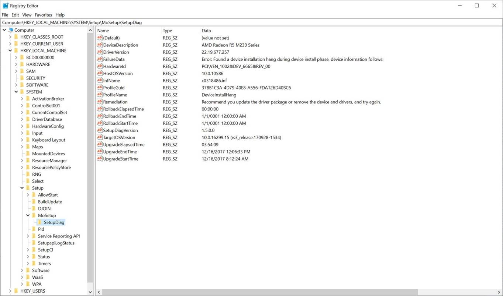

# SetupDiag

**Applies to**
-   Windows 10

>[!NOTE]
>This is a 300 level topic (moderate advanced).<br>
>See [Resolve Windows 10 upgrade errors](resolve-windows-10-upgrade-errors.md) for a full list of topics in this article.<br>

&nbsp;[](https://go.microsoft.com/fwlink/?linkid=870142)

## About SetupDiag

<I>Current version of SetupDiag: 1.5.0.0</I>

SetupDiag is a standalone diagnostic tool that can be used to obtain details about why a Windows 10 upgrade was unsuccessful. 

SetupDiag works by examining Windows Setup log files. It attempts to parse these log files to determine the root cause of a failure to update or upgrade the computer to Windows 10. SetupDiag can be run on the computer that failed to update, or you can export logs from the computer to another location and run SetupDiag in offline mode.

To quickly use SetupDiag on your current computer:
1. Verify that your system meets the [requirements](#requirements) described below. If needed, install the [.NET framework 4.6](https://www.microsoft.com/download/details.aspx?id=48137).
2. [Download SetupDiag](https://go.microsoft.com/fwlink/?linkid=870142).
3. If your web browser asks what to do with the file, choose **Save**. By default, the file will be saved to your **Downloads** folder. You can also save it to a different location if desired by using **Save As**.
4. When SetupDiag has finished downloading, open the folder where you downloaded the file. As mentioned above, by default this is your **Downloads** folder which is displayed in File Explorer under **Quick access** in the left navigation pane.
5. Double-click the **SetupDiag** file to run it. Click **Yes** if you are asked to approve running the program.
    - Double-clicking the file to run it will automatically close the command window when SetupDiag has completed its analysis. If you wish to keep this window open instead, and review the messages that you see, run the program by typing **SetupDiag** at the command prompt instead of double-clicking it. You will need to change directories to the location of SetupDiag to run it this way.
6. A command window will open while SetupDiag diagnoses your computer. Wait for this to finish.
7. When SetupDiag finishes, two files will be created in the same folder where you double-clicked SetupDiag. One is a configuration file, the other is a log file.
8. Use Notepad to open the log file: **SetupDiagResults.log**.
9. Review the information that is displayed. If a rule was matched this can tell you why the computer failed to upgrade, and potentially how to fix the problem. See the [Text log sample](#text-log-sample) below.

For instructions on how to run the tool in offline mode and with more advanced options, see the [Parameters](#parameters) and [Examples](#examples) sections below.

The [Release notes](#release-notes) section at the bottom of this topic has information about recent updates to this tool. 

## Requirements

1. The destination OS must be Windows 10.
2. [.NET Framework 4.6](https://www.microsoft.com/download/details.aspx?id=48137) must be installed. If you are not sure what version of .NET is currently installed, see [How to: Determine Which .NET Framework Versions Are Installed](https://docs.microsoft.com/dotnet/framework/migration-guide/how-to-determine-which-versions-are-installed). You can also use the following command-line query to display the installed v4 versions:

    ```
    reg query "HKLM\SOFTWARE\Microsoft\Net Framework Setup\NDP\v4" /s
    ```

## Parameters

| Parameter | Description |
| --- | --- |
| /? | <ul><li>Displays interactive help</ul> |
| /Output:\<path to results file\> | <ul><li>This optional parameter enables you to specify the output file for results. This is where you will find what SetupDiag was able to determine.  Only text format output is supported.  UNC paths will work, provided the context under which SetupDiag runs has access to the UNC path.  If the path has a space in it, you must enclose the entire path in double quotes (see the example section below). <li>Default: If not specified, SetupDiag will create the file **SetupDiagResults.log** in the same  directory where SetupDiag.exe is run.</ul> |
| /LogsPath:\<Path to logs\> | <ul><li>This optional parameter tells SetupDiag.exe where to find the log files for an offline analysis. These log files can be in a flat folder format, or containing multiple subdirectories.  SetupDiag will recursively search all child directories.</ul> |
| /ZipLogs:\<True \| False\> | <ul><li>This optional parameter tells SetupDiag.exe to create a zip file containing the results and all the log files it parsed.  The zip file is created in the same directory where SetupDiag.exe is run.<li>Default: If not specified, a value of 'true' is used.</ul> |
| /Format:\<xml \| json\> | <ul><li>This optional parameter can be used to output log files in xml or JSON format.  If this parameter is not specified, text format is used by default.</ul> |
| /Scenario:\[Recovery\] | This optional parameter instructs SetupDiag.exe to look for and process reset and recovery logs and ignore setup/upgrade logs.|
| /Verbose | <ul><li>This optional parameter will output much more data to a log file.  By default, SetupDiag will only produce a log file entry for serious errors.  Using **/Verbose** will cause SetupDiag to always produce an additional log file with debugging details. These details can be useful when reporting a problem with SetupDiag.</ul> |
| /NoTel | <ul><li>This optional parameter tells SetupDiag.exe not to send diagnostic telemetry to Microsoft.</ul> |
| /AddReg | This optional parameter instructs SetupDiag.exe to add failure information to the registry in offline mode. By default, SetupDiag will add failure information to the registry in online mode only. Registry data is added to the following location on the system where SetupDiag is run: **HKLM\SYSTEM\Setup\MoSetup\Volatile\SetupDiag**. |

Note: The **/Mode** parameter is deprecated in version 1.4.0.0 of SetupDiag. 
- In previous versions, this command was used with the LogsPath parameter to specify that SetupDiag should run in an offline manner to analyze a set of log files that were captured from a different computer. In version 1.4.0.0 when you specify /LogsPath then SetupDiag will automatically run in offline mode, therefore the /Mode parameter is not needed.

### Examples:

In the following example, SetupDiag is run with default parameters (online mode, results file is SetupDiagResults.log in the same folder where SetupDiag is run).

```
SetupDiag.exe
```

In the following example, SetupDiag is run in online mode (this is the default).  It will know where to look for logs on the current (failing) system, so there is no need to gather logs ahead of time. A custom location for results is specified.

```
SetupDiag.exe /Output:C:\SetupDiag\Results.log
```

The following example uses the /Output parameter to save results to a path name that contains a space:

```
SetupDiag /Output:"C:\Tools\SetupDiag\SetupDiag Results\Results.log"
```

The following example specifies that SetupDiag is to run in offline mode, and to process the log files found in **D:\Temp\Logs\LogSet1**.

```
SetupDiag.exe /Output:C:\SetupDiag\Results.log /LogsPath:D:\Temp\Logs\LogSet1
```

The following example sets recovery scenario in offline mode. In the example, SetupDiag will search for reset/recovery logs in the specified LogsPath location and output the resuts to the directory specified by the /Output parameter.

```
SetupDiag.exe /Output:C:\SetupDiag\RecoveryResults.log /LogsPath:D:\Temp\Cabs\PBR_Log /Scenario:Recovery
```

The following example sets recovery scenario in online mode. In the example, SetupDiag will search for reset/recovery logs on the current system and output results in XML format.

```
SetupDiag.exe /Scenario:Recovery /Format:xml
```


## Log files

[Windows Setup Log Files and Event Logs](https://docs.microsoft.com/windows-hardware/manufacture/desktop/windows-setup-log-files-and-event-logs) has information about where logs are created during Windows Setup. For offline processing, you should run SetupDiag against the contents of the entire folder. For example, depending on when the upgrade failed, copy one of the following folders to your offline location:

\\$Windows.~bt\sources\panther
<br>\\$Windows.~bt\Sources\Rollback
<br>\Windows\Panther
<br>\Windows\Panther\NewOS

If you copy the parent folder and all sub-folders, SetupDiag will automatically search for log files in all subdirectories.

## Setup bug check analysis

When Microsoft Windows encounters a condition that compromises safe system operation, the system halts. This condition is called a bug check. It is also commonly referred to as a system crash, a kernel error, a Stop error, or BSOD. Typically a hardware device, hardware driver, or related software causes this error.

If crash dumps [are enabled](https://docs.microsoft.com/windows-hardware/drivers/debugger/enabling-a-kernel-mode-dump-file) on the system, a crash dump file is created. If the bug check occurs during an upgrade, Windows Setup will extract a minidump (setupmem.dmp) file. SetupDiag can also debug these setup related minidumps.

To debug a setup related bug check, you must:
- Specify the **/LogsPath** parameter. You cannot debug memory dumps in online mode. 
- Gather the setup memory dump file (setupmem.dmp) from the failing system. 
    - Setupmem.dmp will be created in either **%SystemDrive%\$Windows.~bt\Sources\Rollback**, or in **%WinDir%\Panther\NewOS\Rollback** depending on when the bug check occurs.
- Install the [Windows Debugging Tools](https://docs.microsoft.com/windows-hardware/drivers/debugger/debugger-download-tools) on the computer that runs SetupDiag.

In the following example, the **setupmem.dmp** file is copied to the **D:\Dump** directory and the Windows Debugging Tools are installed prior to running SetupDiag:

```
SetupDiag.exe /Output:C:\SetupDiag\Dumpdebug.log /LogsPath:D:\Dump
```

## Known issues

1. Some rules can take a long time to process if the log files involved are large.
2. If the failing computer is opted into the Insider program and getting regular pre-release updates, or an update is already pending on the computer when SetupDiag is run, it can encounter problems trying to open these log files. This will likely cause a failure to determine a root cause.  In this case, try gathering the log files and running SetupDiag in offline mode.


## Sample output

The following is an example where SetupDiag is run in offline mode. In this example, there is an application warning, but since setup is executed in /quiet mode so it becomes a block. Instructions to resolve the problem are provided by SetupDiag in the output.

The output also provides an error code 0xC1900208 - 0x4000C which corresponds to a compatibility issue as documented in the [Upgrade error codes](upgrade-error-codes.md#result-codes) and [Resolution procedures](resolution-procedures.md#modern-setup-errors) topics in this article.

```
C:\SetupDiag>SetupDiag.exe /Output:C:\SetupDiag\Results.log /LogsPath:C:\Temp\BobMacNeill

SetupDiag v1.5.0.0
Copyright (c) Microsoft Corporation. All rights reserved.

Searching for setup logs, this can take a minute or more depending on the number and size of the logs...please wait.
        Found 4 setupact.logs.
        Processing setupact.log at: c:\temp\bobmacneill\$WINDOWS.~BT\Sources\Panther\setupact.log
        Processing setupact.log at: c:\temp\bobmacneill\Panther\setupact.log
        Processing setupact.log at: c:\temp\bobmacneill\Panther\NewOs\Panther\setupact.log
        Processing setupact.log at: c:\temp\bobmacneill\Panther\UnattendGC\setupact.log
Found c:\temp\bobmacneill\$WINDOWS.~BT\Sources\Panther\setupact.log with update date 03/29/2018 23:13:58 and CV: H2X+YsWL/UOkj/8X to be the correct setup log.
Gathering information from setup logs.

SetupDiag: processing rule: CompatScanOnly.
..No match.

SetupDiag: processing rule: BitLockerHardblock.
..No match.

SetupDiag: processing rule: VHDHardblock.
..No match.

SetupDiag: processing rule: PortableWorkspaceHardblock.
..No match.

SetupDiag: processing rule: AuditModeHardblock.
..No match.

SetupDiag: processing rule: SafeModeHardblock.
..No match.

SetupDiag: processing rule: InsufficientSystemPartitionDiskSpaceHardblock.
..No match.

SetupDiag: processing rule: CompatBlockedApplicationAutoUninstall.
....No match.

SetupDiag: processing rule: CompatBlockedApplicationDismissable.
....

Matching Profile found: CompatBlockedApplicationDismissable - EA52620B-E6A0-4BBC-882E-0686605736D9
Warning: Found Application Block for: "Microsoft Endpoint Protection".
This is a dismissible message when not running setup.exe in "/quiet" mode.
Consider specifying "/compat /ignore warning" to ignore these dismissible warnings.
You must manually uninstall "Microsoft Endpoint Protection" before continuing with the installation/update, or change the command line parameters to ignore warnings.
For more information about Setup command line switches, see here:
https://docs.microsoft.com/windows-hardware/manufacture/desktop/windows-setup-command-line-options

SetupDiag: processing rule: CompatBlockedApplicationManualUninstall.
....No match.

SetupDiag: processing rule: HardblockDeviceOrDriver.
....No match.

SetupDiag: processing rule: HardblockMismatchedLanguage.
..No match.

SetupDiag: processing rule: HardblockFlightSigning.
..No match.

SetupDiag: processing rule: DiskSpaceBlockInDownLevel.
..No match.

SetupDiag: processing rule: DiskSpaceFailure.
..No match.

SetupDiag: processing rule: DebugSetupMemoryDump.
.No match.

SetupDiag: processing rule: DebugSetupCrash.
.No match.

SetupDiag: processing rule: DebugMemoryDump.
.No match.

SetupDiag: processing rule: DeviceInstallHang.
..No match.

SetupDiag: processing rule: BootFailureDetected.
.No match.

SetupDiag: processing rule: FindDebugInfoFromRollbackLog.
.No match.

SetupDiag: processing rule: AdvancedInstallerFailed.
..No match.

SetupDiag: processing rule: FindMigApplyUnitFailure.
..No match.

SetupDiag: processing rule: FindMigGatherUnitFailure.
..No match.

SetupDiag: processing rule: OptionalComponentInstallFailure.
..No match.

SetupDiag: processing rule: CriticalSafeOSDUFailure.
..No match.

SetupDiag: processing rule: UserProfileCreationFailureDuringOnlineApply.
..No match.

SetupDiag: processing rule: WimMountFailure.
..No match.

SetupDiag: processing rule: FindSuccessfulUpgrade.
..No match.

SetupDiag: processing rule: FindSetupHostReportedFailure.
..No match.

SetupDiag: processing rule: FindDownlevelFailure.
..No match.

SetupDiag: processing rule: FindAbruptDownlevelFailure.
....Error: SetupDiag reports abrupt down-level failure. Last Operation: Finalize, Error: 0xC1900208 - 0x4000C
Failure Data: Last Operation: Finalize, Error: 0xC1900208 - 0x4000C
Refer to https://docs.microsoft.com/windows/deployment/upgrade/upgrade-error-codes for error information.

SetupDiag: processing rule: FindSetupPlatformFailedOperationInfo.
..No match.

SetupDiag: processing rule: FindRollbackFailure.
..No match.

SetupDiag found 2 matching issues.

Warning: Found Application Block for: "Microsoft Endpoint Protection".
This is a dismissible message when not running setup.exe in "/quiet" mode.
Consider specifying "/compat /ignore warning" to ignore these dismissible warnings.
You must manually uninstall "Microsoft Endpoint Protection" before continuing with the installation/update, or change the command line parameters to ignore warnings.
For more information about Setup command line switches, see here:
https://docs.microsoft.com/windows-hardware/manufacture/desktop/windows-setup-command-line-options
Error: SetupDiag reports abrupt down-level failure. Last Operation: Finalize, Error: 0xC1900208 - 0x4000C
Failure Data: Last Operation: Finalize, Error: 0xC1900208 - 0x4000C
Refer to https://docs.microsoft.com/windows/deployment/upgrade/upgrade-error-codes for error information.

SetupDiag results were logged to: c:\setupdiag\results.log
Logs ZipFile created at: c:\setupdiag\Logs_14.zip

```

## Rules

When searching log files, SetupDiag uses a set of rules to match known issues. These rules are contained in the rules.xml file which is extracted when SetupDiag is run. The rules.xml file might be updated as new versions of SetupDiag are made available. See [Release notes](#release-notes) for more information.

Each rule name and its associated unique rule identifier are listed with a description of the known upgrade-blocking issue. In the rule descriptions, the term "down-level" refers to the first phase of the upgrade process, which runs under the starting OS.

1.	CompatScanOnly - FFDAFD37-DB75-498A-A893-472D49A1311D
    - This rule indicates that setup.exe was called with a specific command line parameter that indicated setup was to do a compat scan only, not an upgrade.
2.	BitLockerHardblock - C30152E2-938E-44B8-915B-D1181BA635AE
    - This is a block when the target OS does not support BitLocker, yet the host OS has BitLocker enabled.
3.	VHDHardblock - D9ED1B82-4ED8-4DFD-8EC0-BE69048978CC
    - This block happens when the host OS is booted to a VHD image.  Upgrade is not supported when the host OS is booted from a VHD image.
4.	PortableWorkspaceHardblock - 5B0D3AB4-212A-4CE4-BDB9-37CA404BB280
    - This indicates that the host OS is booted from a Windows To-Go device (USB key).  Upgrade is not supported in the Windows To-Go environment.
5.	AuditModeHardblock - A03BD71B-487B-4ACA-83A0-735B0F3F1A90
    - This block indicates that the host OS is currently booted into Audit Mode, a special mode for modifying the Windows state.  Upgrade is not supported from this state.
6.	SafeModeHardblock - 404D9523-B7A8-4203-90AF-5FBB05B6579B
    - This block indicates that the host OS is booted to Safe Mode, where upgrade is not supported.
7.	InsufficientSystemPartitionDiskSpaceHardblock - 3789FBF8-E177-437D-B1E3-D38B4C4269D1
    - This block is encountered when setup determines the system partition (where the boot loader files are stored) does not have enough space to be serviced with the newer boot files required during the upgrade process.
8.	CompatBlockedApplicationAutoUninstall – BEBA5BC6-6150-413E-8ACE-5E1EC8D34DD5
    - This rule indicates there is an application that needs to be uninstalled before setup can continue.
9.	CompatBlockedApplicationDismissable - EA52620B-E6A0-4BBC-882E-0686605736D9
    - When running setup in /quiet mode, there are dismissible application messages that turn into blocks unless the command line also specifies “/compat /ignore warning”.  This rule indicates setup was executed in /quiet mode but there is an application dismissible block message that have prevented setup from continuing.
10.	CompatBlockedApplicationManualUninstall - 9E912E5F-25A5-4FC0-BEC1-CA0EA5432FF4
    - This rule indicates that an application without an Add/Remove Programs entry, is present on the system and blocking setup from continuing.  This typically requires manual removal of the files associated with this application to continue.
11.	HardblockDeviceOrDriver - ED3AEFA1-F3E2-4F33-8A21-184ADF215B1B
    - This indicates a device driver that is loaded on the host OS is not compatible with the newer OS version and needs to be removed prior to the upgrade.
12.	HardblockMismatchedLanguage - 60BA8449-CF23-4D92-A108-D6FCEFB95B45
    - This rule indicates the host OS and the target OS language editions do not match.
13.	HardblockFlightSigning - 598F2802-3E7F-4697-BD18-7A6371C8B2F8
    - This rule indicates the target OS is a pre-release, Windows Insider build, and the target machine has Secure Boot enabled.  This will block the pre-release signed build from booting if installed on the machine.
14.	DiskSpaceBlockInDownLevel - 6080AFAC-892E-4903-94EA-7A17E69E549E
    - This failure indicates the system ran out of disk space during the down-level operations of upgrade.
15.	DiskSpaceFailure - 981DCBA5-B8D0-4BA7-A8AB-4030F7A10191
    - This failure indicates the system drive ran out of available disk space at some point after the first reboot into the upgrade.
16.	DeviceInstallHang - 37BB1C3A-4D79-40E8-A556-FDA126D40BC6
    - This failure rule indicates the system hung or bug checked during the device installation phase of upgrade. 
17.	DebugSetupMemoryDump - C7C63D8A-C5F6-4255-8031-74597773C3C6
    - This offline only rule indicates a bug check occurred during setup.  If the debugger tools are available on the system, SetupDiag will debug the memory dump and provide details.
18.	DebugSetupCrash - CEEBA202-6F04-4BC3-84B8-7B99AED924B1
    - This offline only rule indicates that setup itself encountered a failure that resulted in a process memory dump.  If the debugger tools are installed on the system, SetupDiag will debug the memory dump and give further details.
19.	DebugMemoryDump - 505ED489-329A-43F5-B467-FCAAF6A1264C
    - This offline only rule is for any memory.dmp file that resulted during the setup/upgrade operation.  If the debugger tools are installed on the system, SetupDiag will debug the memory dump and give further details.
20.	BootFailureDetected - 4FB446C2-D4EC-40B4-97E2-67EB19D1CFB7
    - This rule indicates a boot failure occurred during a specific phase of the update.  The rule will indicate the failure code and phase for diagnostic purposes.
21.	FindDebugInfoFromRollbackLog - 9600EB68-1120-4A87-9FE9-3A4A70ACFC37
    - This rule will determine and give details when a bug check occurs during the setup/upgrade process that resulted in a memory dump, but without the requirement of the debugger package being on the executing machine.
22.	AdvancedInstallerFailed - 77D36C96-32BE-42A2-BB9C-AAFFE64FCADC
    - Finds fatal advanced installer operations that cause setup failures.
23.	FindMigApplyUnitFailure - A4232E11-4043-4A37-9BF4-5901C46FD781
    - Detects a migration unit failure that caused the update to fail.  This rule will output the name of the migration plug-in as well as the error code it produced for diagnostic purposes.
24.	FindMigGatherUnitFailure - D04C064B-CD77-4E64-96D6-D26F30B4EE29
    - Detects a migration gather unit failure that caused the update to fail.  This rule will output the name of the gather unit/plug-in as well as the error code it produced for diagnostic purposes.
25.	CriticalSafeOSDUFailure - 73566DF2-CA26-4073-B34C-C9BC70DBF043
    - This rule indicates a failure occurred while updating the SafeOS image with a critical dynamic update.  It will indicate the phase and error code that occurred while attempting to update the SafeOS image for diagnostic purposes.
26.	UserProfileCreationFailureDuringOnlineApply - 678117CE-F6A9-40C5-BC9F-A22575C78B14
    - Indicates there was a critical failure while creating or modifying a User Profile during the online apply phase of the update.  It will indicate the operation and error code associated with the failure for diagnostic purposes.
27.	WimMountFailure - BE6DF2F1-19A6-48C6-AEF8-D3B0CE3D4549
    - This rule indicates the update failed to mount a wim file.  It will show the name of the wim file as well as the error message and error code associated with the failure for diagnostic purposes.
28.	FindSuccessfulUpgrade - 8A0824C8-A56D-4C55-95A0-22751AB62F3E
    - Determines if the given setup was a success or not based off the logs.
29.	FindSetupHostReportedFailure - 6253C04F-2E4E-4F7A-B88E-95A69702F7EC
    - Gives information about failures surfaced early in the upgrade process by setuphost.exe
30.	FindDownlevelFailure - 716334B7-F46A-4BAA-94F2-3E31BC9EFA55
    - Gives failure information surfaced by SetupPlatform, later in the down-level phase.
31.	FindAbruptDownlevelFailure - 55882B1A-DA3E-408A-9076-23B22A0472BD
    - Gives last operation failure information when the system fails in the down-level, but the log just ends abruptly.
32.	FindSetupPlatformFailedOperationInfo - 307A0133-F06B-4B75-AEA8-116C3B53C2D1
    - Gives last phase and error information when SetupPlatform indicates a critical failure.  This rule will indicate the operation and error associated with the failure for diagnostic purposes.
33.	FindRollbackFailure - 3A43C9B5-05B3-4F7C-A955-88F991BB5A48
    - Gives last operation, failure phase and error information when a rollback occurs.
34. AdvancedInstallerGenericFailure – 4019550D-4CAA-45B0-A222-349C48E86F71
    - A rule to match AdvancedInstaller read/write failures in a generic sense.  Will output the executable being called as well as the error code and exit code reported.
35. OptionalComponentFailedToGetOCsFromPackage – D012E2A2-99D8-4A8C-BBB2-088B92083D78  (NOTE:  This rule replaces the OptionalComponentInstallFailure rule present in v1.10.
    - This matches a specific Optional Component failure when attempting to enumerate components in a package.  Will output the package name and error code.
36. OptionalComponentOpenPackageFailed – 22952520-EC89-4FBD-94E0-B67DF88347F6
    - Matches a specific Optional Component failure when attempting to open an OC package.  Will output the package name and error code.
37. OptionalComponentInitCBSSessionFailed – 63340812-9252-45F3-A0F2-B2A4CA5E9317
    - Matches a specific failure where the advanced installer service or components aren’t operating or started on the system.  Will output the error code.
38. UserProfileCreationFailureDuringFinalize – C6677BA6-2E53-4A88-B528-336D15ED1A64
    - Matches a specific User Profile creation error during the finalize phase of setup.  Will output the failure code.
39. WimApplyExtractFailure – 746879E9-C9C5-488C-8D4B-0C811FF3A9A8
    - Matches a wim apply failure during wim extraction phases of setup.  Will output the extension, path and error code.
40. UpdateAgentExpanderFailure – 66E496B3-7D19-47FA-B19B-4040B9FD17E2
    - Matches DPX expander failures in the down-level phase of update from WU.  Will output the package name, function, expression and error code.
41. FindFatalPluginFailure – E48E3F1C-26F6-4AFB-859B-BF637DA49636
    - Matches any plug-in failure that setupplatform decides is fatal to setup.  Will output the plugin name, operation and error code.
42. AdvancedInstallerFailed - 77D36C96-32BE-42A2-BB9C-AAFFE64FCADC
    - Indicates critical failure in the AdvancedInstaller while running an installer package, includes the .exe being called, the phase, mode, component and error codes.
43. MigrationAbortedDueToPluginFailure - D07A24F6-5B25-474E-B516-A730085940C9
    - Indicates a critical failure in a migration plugin that causes setup to abort the migration.  Will provide the setup operation, plug-in name, plug-in action and error code.
44. DISMAddPackageFailed - 6196FF5B-E69E-4117-9EC6-9C1EAB20A3B9
    - Indicates a critical failure during a DISM add package operation.  Will specify the Package Name, DISM error and add package error code.
45. PlugInComplianceBlock - D912150B-1302-4860-91B5-527907D08960 
    - Detects all compat blocks from Server compliance plug-ins.  Outputs the block information and remediation.
46. AdvancedInstallerGenericFailure - 4019550D-4CAA-45B0-A222-349C48E86F71 
    - Triggers on advanced installer failures in a generic sense, outputting the application called, phase, mode, component and error code.
47. FindMigGatherApplyFailure - A9964E6C-A2A8-45FF-B6B5-25E0BD71428E 
    - Shows errors when the migration Engine fails out on a gather or apply operation.  Indicates the Migration Object (file or registry path), the Migration
48. OptionalComponentFailedToGetOCsFromPackage - D012E2A2-99D8-4A8C-BBB2-088B92083D78 
    - Indicates the optional component (OC) migration operation failed to enumerate optional components from an OC Package.  Outputs the package name and error code.
49. OptionalComponentOpenPackageFailed - 22952520-EC89-4FBD-94E0-B67DF88347F6 
    - Indicates the optional component migration operation failed to open an optional component Package.  Outputs the package name and error code.
50. OptionalComponentInitCBSSessionFailed - 63340812-9252-45F3-A0F2-B2A4CA5E9317 
    - Indicates corruption in the servicing stack on the down-level system.  Outputs the error code encountered while trying to initialize the servicing component on the existing OS.
51. DISMproviderFailure - D76EF86F-B3F8-433F-9EBF-B4411F8141F4 
    - Triggers when a DISM provider (plug-in) fails in a critical operation.  Outputs the file (plug-in name), function called + error code, and error message from the provider.
52. SysPrepLaunchModuleFailure - 7905655C-F295-45F7-8873-81D6F9149BFD 
    - Indicates a sysPrep plug-in has failed in a critical operation.  Indicates the plug-in name, operation name and error code.
53. UserProvidedDriverInjectionFailure - 2247C48A-7EE3-4037-AFAB-95B92DE1D980 
    - A driver provided to setup (via command line input) has failed in some way.  Outputs the driver install function and error code.
54. New rule description.
55. New rule description.
56. New rule description.

## Release notes

06/13/2019 - SetupDiag v1.5.0.0 is released with 56 rules, as a standalone tool available from the Download Center.
   - All date and time outputs are updatred to localized format per user request.
   - Huge performance improvement in searching out setupact.logs and determine correct log to parse.  What used to take a minute or more, now typically takes seconds. For example, a sample cab with 9 setupact.logs (three over 200mb each) that used to take nearly 2 minutes in version 1.4.1 now takes 12 seconds.
   - Added SetupDiag version number to text report (xml and json always had it).
   - Added "no match" reports for xml and json per user request.
   - Added a rule for failures revolving around WimMount registration (Driver location info in the registry).
   - Added a rule for WinSetupBootFilter driver failures.
   - Added a rule for early down-level failures that occur early in the down-level phase per user request.
   - Overall rules processing performance is improved.
   - Added registry output for info matched to: HKLM\SYSTEM\Setup\MoSetup\Volatile\SetupDiag
       - This enables Configuration Manager, Intune and Enterprise customers to query the registry on targeted systems to get SetupDiag failure information.
       - This registry information will soon be integrated with the GetHelp app to help customer service agents more quickly help with update failures.
       - The **/AddReg** command was added to toggle registry output. This setting is **off** by default for offline mode, and **on** by default for online mode. The command has no effect for online mode and enables registry output for offline mode.
       - This registry key is deleted as soon as SetupDiag is run a second time, and replaced with current data, so it’s always up to date.
       - This registry key also gets deleted when a new update instance is invoked.
       - For an example, see [Sample registry key](#sample-registry-key).

05/17/2019 - SetupDiag v1.4.1.0 is released with 53 rules, as a standalone tool available from the Download Center.
   - This release dds the ability to find and diagnose reset and recovery failures (Push Button Reset).  

12/18/2018 - SetupDiag v1.4.0.0 is released with 53 rules, as a standalone tool available from the Download Center.
   - This release includes major improvements in rule processing performance: ~3x faster rule processing performance!
       - The FindDownlevelFailure rule is up to 10x faster.
   - New rules have been added to analyze failures upgrading to Windows 10 version 1809.
   - A new help link is available for resolving servicing stack failures on the down-level OS when the rule match indicates this type of failure.
   - Removed the need to specify /Mode parameter. Now if you specify /LogsPath, it automatically assumes offline mode.
   - Some functional and output improvements were made for several rules.

07/16/2018 - SetupDiag v1.3.1 is released with 44 rules, as a standalone tool available from the Download Center.
   - This release fixes a problem that can occur when running SetupDiag in online mode on a computer that produces a setupmem.dmp file, but does not have debugger binaries installed.

07/10/2018 - SetupDiag v1.30 is released with 44 rules, as a standalone tool available from the Download Center.
   - Bug fix for an over-matched plug-in rule. The rule will now correctly match only critical (setup failure) plug-in issues.
   - New feature: Ability to output logs in JSON and XML format.
       - Use "/Format:xml" or "/Format:json" command line parameters to specify the new output format. See [sample logs](#sample-logs) at the bottom of this topic.
       - If the “/Format:xml” or “/Format:json” parameter is omitted, the log output format will default to text.
   - New Feature: Where possible, specific instructions are now provided in rule output to repair the identified error. For example, instructions are provided to remediate known blocking issues such as uninstalling an incompatible app or freeing up space on the system drive.
   - 3 new rules added: AdvancedInstallerFailed, MigrationAbortedDueToPluginFailure, DISMAddPackageFailed.

05/30/2018 - SetupDiag v1.20 is released with 41 rules, as a standalone tool available from the Download Center.
   - Fixed a bug in device install failure detection in online mode.
   - Changed SetupDiag to work without an instance of setupact.log. Previously, SetupDiag required at least one setupact.log to operate.  This change enables the tool to analyze update failures that occur prior to calling SetupHost.
   - Telemetry is refactored to only send the rule name and GUID (or “NoRuleMatched” if no rule is matched) and the Setup360 ReportId. This change assures data privacy during rule processing.

05/02/2018 - SetupDiag v1.10 is released with 34 rules, as a standalone tool available from the Download Center.
   - A performance enhancment has been added to result in faster rule processing.
   - Rules output now includes links to support articles, if applicable.
   - SetupDiag now provides the path and name of files that it is processing.
   - You can now run SetupDiag by simply clicking on it and then examining the output log file.
   - An output log file is now always created, whether or not a rule was matched.

03/30/2018 - SetupDiag v1.00 is released with 26 rules, as a standalone tool available from the Download Center.

## Sample logs

### Text log sample

```
Matching Profile found: OptionalComponentOpenPackageFailed - 22952520-EC89-4FBD-94E0-B67DF88347F6
System Information:
	Machine Name = Offline
	Manufacturer = MSI
	Model = MS-7998
	HostOSArchitecture = x64
	FirmwareType = PCAT
	BiosReleaseDate = 20160727000000.000000+000
	BiosVendor = BIOS Date: 07/27/16 10:01:46 Ver: V1.70
	BiosVersion = 1.70
	HostOSVersion = 10.0.15063
	HostOSBuildString = 15063.0.amd64fre.rs2_release.170317-1834
	TargetOSBuildString = 10.0.16299.15 (rs3_release.170928-1534)
	HostOSLanguageId = 2057
	HostOSEdition = Core
	RegisteredAV = Windows Defender,
	FilterDrivers = WdFilter,wcifs,WIMMount,luafv,Wof,FileInfo,
	UpgradeStartTime = 3/21/2018 9:47:16 PM
	UpgradeEndTime = 3/21/2018 10:02:40 PM
	UpgradeElapsedTime = 00:15:24
	ReportId = dd4db176-4e3f-4451-aef6-22cf46de8bde

Error: SetupDiag reports Optional Component installation failed to open OC Package. Package Name: Foundation, Error: 0x8007001F
Recommend you check the "Windows Modules Installer" service (Trusted Installer) is started on the system and set to automatic start, reboot and try the update again.  Optionally, you can check the status of optional components on the system (search for Windows Features), uninstall any unneeded optional components, reboot and try the update again.
Error: SetupDiag reports down-level failure, Operation: Finalize, Error: 0x8007001F - 0x50015
Refer to https://docs.microsoft.com/windows/deployment/upgrade/upgrade-error-codes for error information.
```

### XML log sample

```
<?xml version="1.0" encoding="utf-16"?>
<SetupDiag xmlns:xsi="http://www.w3.org/2001/XMLSchema-instance" xmlns:xsd="http://www.w3.org/2001/XMLSchema" xmlns="https://docs.microsoft.com/windows/deployment/upgrade/setupdiag">
  <Version>1.3.0.0</Version>
  <ProfileName>DiskSpaceBlockInDownLevel</ProfileName>
  <ProfileGuid>6080AFAC-892E-4903-94EA-7A17E69E549E</ProfileGuid>
  <SystemInfo>
    <MachineName>Offline</MachineName>
    <Manufacturer>Microsoft Corporation</Manufacturer>
    <Model>Virtual Machine</Model>
    <HostOSArchitecture>x64</HostOSArchitecture>
    <FirmwareType>UEFI</FirmwareType>
    <BiosReleaseDate>20171012000000.000000+000</BiosReleaseDate>
    <BiosVendor>Hyper-V UEFI Release v2.5</BiosVendor>
    <BiosVersion>Hyper-V UEFI Release v2.5</BiosVersion>
    <HostOSVersion>10.0.14393</HostOSVersion>
    <HostOSBuildString>14393.1794.amd64fre.rs1_release.171008-1615</HostOSBuildString>
    <TargetOSBuildString>10.0.16299.15 (rs3_release.170928-1534)</TargetOSBuildString>
    <HostOSLanguageId>1033</HostOSLanguageId>
    <HostOSEdition>Core</HostOSEdition>
    <RegisteredAV />
    <FilterDrivers />
    <UpgradeStartTime>2017-12-21T12:56:22</UpgradeStartTime>
    <UpgradeElapsedTime />
    <UpgradeEndTime>2017-12-21T13:22:46</UpgradeEndTime>
    <RollbackStartTime>0001-01-01T00:00:00</RollbackStartTime>
    <RollbackEndTime>0001-01-01T00:00:00</RollbackEndTime>
    <RollbackElapsedTime />
    <CommercialId>Offline</CommercialId>
    <SetupReportId>06600fcd-acc0-40e4-b7f8-bb984dc8d05a</SetupReportId>
    <ReportId>06600fcd-acc0-40e4-b7f8-bb984dc8d05a</ReportId>
  </SystemInfo>
  <FailureData>Warning: Found Disk Space Hard Block.</FailureData>
  <Remediation>You must free up at least "6603" MB of space on the System Drive, and try again.</Remediation>
</SetupDiag>
```

### JSON log sample

```
{"Version":"1.3.0.0","ProfileName":"DiskSpaceBlockInDownLevel","ProfileGuid":"6080AFAC-892E-4903-94EA-7A17E69E549E","SystemInfo":{"BiosReleaseDate":"20171012000000.000000+000","BiosVendor":"Hyper-V UEFI Release v2.5","BiosVersion":"Hyper-V UEFI Release v2.5","CV":null,"CommercialId":"Offline","FilterDrivers":"","FirmwareType":"UEFI","HostOSArchitecture":"x64","HostOSBuildString":"14393.1794.amd64fre.rs1_release.171008-1615","HostOSEdition":"Core","HostOSLanguageId":"1033","HostOSVersion":"10.0.14393","MachineName":"Offline","Manufacturer":"Microsoft Corporation","Model":"Virtual Machine","RegisteredAV":"","ReportId":"06600fcd-acc0-40e4-b7f8-bb984dc8d05a","RollbackElapsedTime":"PT0S","RollbackEndTime":"\/Date(-62135568000000-0800)\/","RollbackStartTime":"\/Date(-62135568000000-0800)\/","SDMode":1,"SetupReportId":"06600fcd-acc0-40e4-b7f8-bb984dc8d05a","TargetOSArchitecture":null,"TargetOSBuildString":"10.0.16299.15 (rs3_release.170928-1534)","UpgradeElapsedTime":"PT26M24S","UpgradeEndTime":"\/Date(1513891366000-0800)\/","UpgradeStartTime":"\/Date(1513889782000-0800)\/"},"FailureData":["Warning: Found Disk Space Hard Block."],"DeviceDriverInfo":null,"Remediation":["You must free up at least \"6603\" MB of space on the System Drive, and try again."]}
```

## Sample registry key



## Related topics

[Resolve Windows 10 upgrade errors: Technical information for IT Pros](https://docs.microsoft.com/windows/deployment/upgrade/resolve-windows-10-upgrade-errors)
